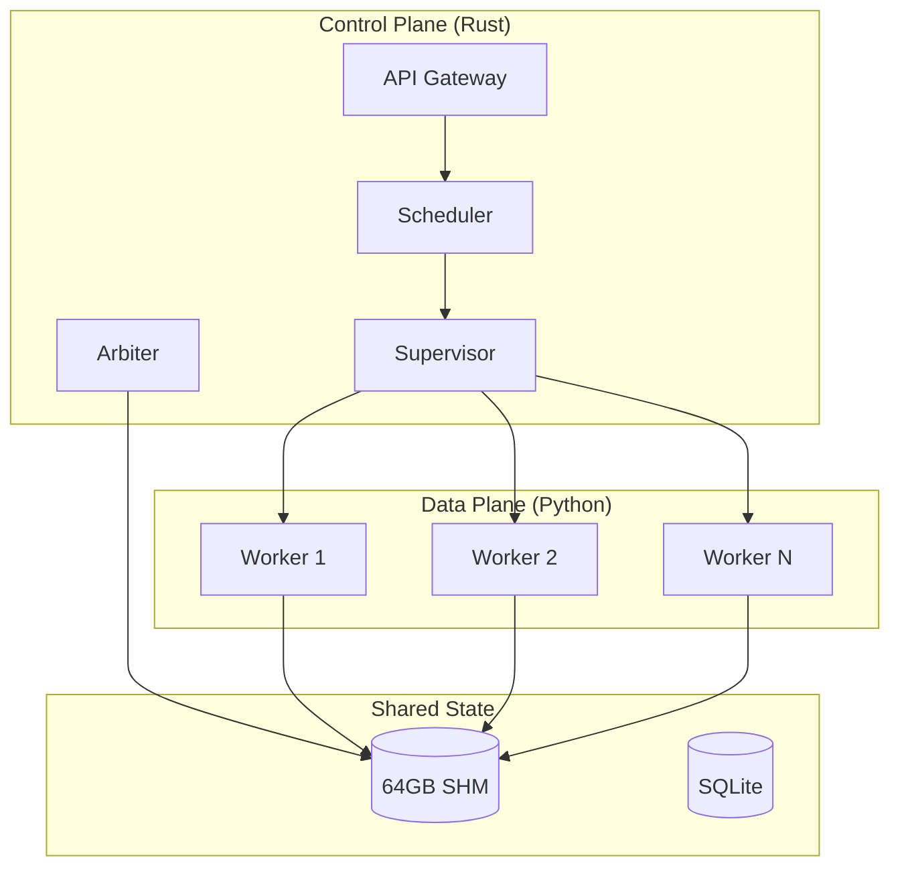
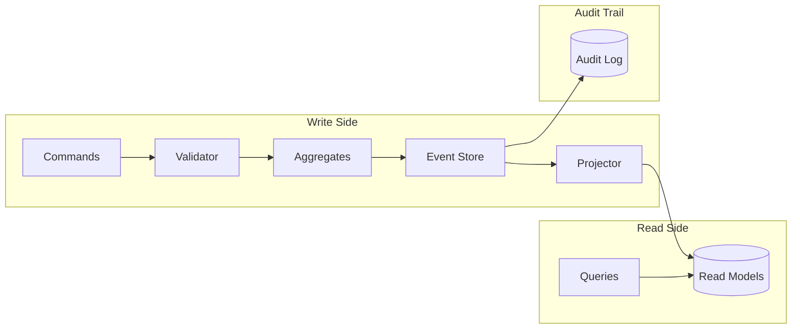
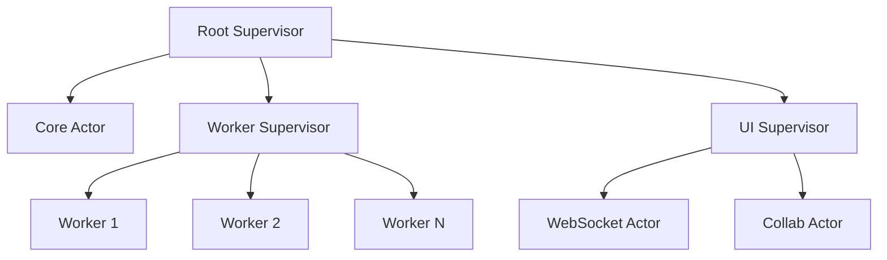

# VORTEX Design Patterns & Observability Specification
## ISO/IEC Compliant Architectural Patterns

> **Standard**: ISO/IEC 25010 (Quality), ISO/IEC 42010 (Architecture)  
> **Version**: 1.0.0  
> **Traceability Level**: FULL (Every action reversible, traceable, replayable)

---

## 📋 Pattern Summary

| Category | Pattern | Location | Documented |
|----------|---------|----------|------------|
| **Structural** | Centaur (Host/Worker) | SRS-00 §2.1 | ✅ |
| **Structural** | Hexagonal Architecture | SRS-01 §6.1 | ✅ |
| **Behavioral** | Event Sourcing | This doc §3.1 | ✅ |
| **Behavioral** | CQRS | This doc §3.2 | ✅ |
| **Behavioral** | Saga Pattern | This doc §3.3 | ✅ |
| **Creational** | Factory Method | SRS-03 §6.1 | ✅ |
| **Creational** | Abstract Factory | SRS-04 §6.1 | ✅ |
| **Concurrency** | Actor Model | This doc §4.1 | ✅ |
| **Concurrency** | Work Stealing | This doc §4.2 | ✅ |
| **Resilience** | Circuit Breaker | This doc §5.1 | ✅ |
| **Resilience** | Bulkhead | This doc §5.2 | ✅ |
| **Observability** | Distributed Tracing | This doc §6.1 | ✅ |
| **Observability** | Structured Logging | This doc §6.2 | ✅ |
| **Observability** | Metrics Collection | This doc §6.3 | ✅ |

---

## 1. CORE ARCHITECTURAL PATTERNS

### 1.1 Centaur Pattern (Host/Worker Split)
**Pattern**: Hybrid Architecture separating Control Plane (Rust) from Data Plane (Python)



**Traceability**: Every IPC message includes `trace_id`, `span_id`, `parent_span_id`

### 1.2 Hexagonal Architecture (Ports & Adapters)
**Pattern**: Core domain logic isolated from external concerns

```
┌─────────────────────────────────────────────────────────────┐
│                        ADAPTERS (Outer)                      │
│  ┌─────────┐  ┌─────────┐  ┌─────────┐  ┌─────────────────┐ │
│  │  HTTP   │  │  WS     │  │ SQLite  │  │ Shared Memory   │ │
│  │ Adapter │  │ Adapter │  │ Adapter │  │    Adapter      │ │
│  └────┬────┘  └────┬────┘  └────┬────┘  └───────┬─────────┘ │
│       │            │            │               │           │
│  ┌────▼────────────▼────────────▼───────────────▼─────────┐ │
│  │                      PORTS (Interface)                  │ │
│  │  ApiPort   WsPort   StoragePort   MemoryPort           │ │
│  └────────────────────────┬────────────────────────────────┘ │
│                           │                                  │
│  ┌────────────────────────▼────────────────────────────────┐ │
│  │                    CORE DOMAIN                          │ │
│  │  ┌──────────┐  ┌──────────┐  ┌──────────┐              │ │
│  │  │ Scheduler│  │ Arbiter  │  │ Compiler │              │ │
│  │  └──────────┘  └──────────┘  └──────────┘              │ │
│  └─────────────────────────────────────────────────────────┘ │
└─────────────────────────────────────────────────────────────┘
```

---

## 2. STATE MANAGEMENT PATTERNS

### 2.1 Immutable State with Merkle Hashing
Every state change produces a new state version with cryptographic hash.

```rust
#[derive(Clone, Hash)]
pub struct GraphState {
    pub version: u64,
    pub hash: [u8; 32],        // SHA-256 of content
    pub parent_hash: [u8; 32], // Previous state hash
    pub timestamp: i64,
    pub nodes: im::HashMap<NodeId, Node>,
    pub edges: im::HashMap<EdgeId, Edge>,
}

impl GraphState {
    pub fn apply_mutation(&self, mutation: Mutation) -> (Self, MutationRecord) {
        let new_state = self.clone().with_mutation(mutation);
        let record = MutationRecord {
            id: Uuid::new_v4(),
            timestamp: Utc::now(),
            mutation: mutation.clone(),
            before_hash: self.hash,
            after_hash: new_state.hash,
        };
        (new_state, record)
    }
}
```

### 2.2 Command-Query Responsibility Segregation (CQRS)
Separate read and write paths for scalability and audit.



**Commands** (Write):
- `CreateNode`, `DeleteNode`, `UpdateNodeParam`
- `CreateEdge`, `DeleteEdge`
- `ExecuteGraph`, `CancelExecution`

**Queries** (Read):
- `GetGraph`, `GetNode`, `GetExecutionStatus`
- `ListExecutions`, `GetAuditLog`

---

## 3. EVENT SOURCING & REPLAYABILITY

### 3.1 Event Store Schema
Every action is stored as an immutable event.

```sql
CREATE TABLE events (
    -- Identity
    event_id        UUID PRIMARY KEY,
    sequence_number BIGINT NOT NULL UNIQUE,
    
    -- Tracing
    trace_id        UUID NOT NULL,           -- Distributed trace
    span_id         UUID NOT NULL,           -- Current span
    parent_span_id  UUID,                    -- Parent span
    
    -- Causation
    correlation_id  UUID NOT NULL,           -- Business correlation
    causation_id    UUID,                    -- What caused this event
    
    -- Event Data
    event_type      TEXT NOT NULL,           -- e.g., "NodeCreated"
    event_version   INT NOT NULL DEFAULT 1,  -- Schema version
    aggregate_type  TEXT NOT NULL,           -- e.g., "Graph"
    aggregate_id    UUID NOT NULL,           -- Target entity
    
    -- Payload
    payload         JSONB NOT NULL,          -- Event data
    metadata        JSONB NOT NULL,          -- Context metadata
    
    -- Timestamps
    created_at      TIMESTAMPTZ NOT NULL DEFAULT NOW(),
    
    -- Indexes
    INDEX idx_aggregate (aggregate_type, aggregate_id, sequence_number),
    INDEX idx_trace (trace_id),
    INDEX idx_correlation (correlation_id),
    INDEX idx_created (created_at)
);

-- Audit Log View
CREATE VIEW audit_log AS
SELECT 
    e.event_id,
    e.event_type,
    e.aggregate_type,
    e.aggregate_id,
    e.payload->>'user_id' as user_id,
    e.payload->>'action' as action,
    e.metadata->>'ip_address' as ip_address,
    e.created_at
FROM events e
ORDER BY e.sequence_number DESC;
```

### 3.2 Event Types (Complete Registry)

| Event Type | Aggregate | Reversible | Replayable |
|------------|-----------|------------|------------|
| `GraphCreated` | Graph | ✅ | ✅ |
| `GraphDeleted` | Graph | ✅ | ✅ |
| `NodeCreated` | Node | ✅ | ✅ |
| `NodeDeleted` | Node | ✅ | ✅ |
| `NodeMoved` | Node | ✅ | ✅ |
| `NodeParamUpdated` | Node | ✅ | ✅ |
| `EdgeCreated` | Edge | ✅ | ✅ |
| `EdgeDeleted` | Edge | ✅ | ✅ |
| `ExecutionStarted` | Execution | ❌ | ✅ |
| `ExecutionCompleted` | Execution | ❌ | ✅ |
| `ExecutionFailed` | Execution | ❌ | ✅ |
| `WorkerSpawned` | Worker | ❌ | ✅ |
| `WorkerCrashed` | Worker | ❌ | ✅ |
| `MemoryAllocated` | Memory | ✅ | ✅ |
| `MemoryEvicted` | Memory | ✅ | ✅ |

### 3.3 Replay Engine

```rust
pub struct ReplayEngine {
    event_store: Arc<EventStore>,
    snapshot_store: Arc<SnapshotStore>,
}

impl ReplayEngine {
    /// Reconstructs state at any point in time
    pub async fn replay_to(&self, target_time: DateTime<Utc>) -> Result<GraphState> {
        // 1. Find nearest snapshot before target
        let snapshot = self.snapshot_store
            .find_before(target_time)
            .await?;
        
        // 2. Replay events from snapshot to target
        let events = self.event_store
            .get_range(snapshot.sequence..target_time)
            .await?;
        
        // 3. Apply events to reconstruct state
        let mut state = snapshot.state;
        for event in events {
            state = state.apply_event(event)?;
        }
        
        Ok(state)
    }
    
    /// Reverses a specific event
    pub async fn reverse_event(&self, event_id: Uuid) -> Result<ReverseEvent> {
        let event = self.event_store.get(event_id).await?;
        let reverse = event.generate_reverse()?;
        self.event_store.append(reverse.clone()).await?;
        Ok(reverse)
    }
}
```

### 3.4 Undo/Redo Stack

```rust
pub struct UndoStack {
    history: VecDeque<MutationRecord>,
    future: VecDeque<MutationRecord>,
    max_depth: usize,
}

impl UndoStack {
    pub fn undo(&mut self) -> Option<Mutation> {
        self.history.pop_back().map(|record| {
            self.future.push_front(record.clone());
            record.mutation.reverse()
        })
    }
    
    pub fn redo(&mut self) -> Option<Mutation> {
        self.future.pop_front().map(|record| {
            self.history.push_back(record.clone());
            record.mutation.clone()
        })
    }
}
```

---

## 4. CONCURRENCY PATTERNS

### 4.1 Actor Model (Supervisor Hierarchy)



Each actor has:
- Own mailbox (message queue)
- Isolated state
- Supervision strategy (restart, stop, escalate)

### 4.2 Work Stealing Scheduler

```rust
pub struct WorkStealingScheduler {
    workers: Vec<Worker>,
    global_queue: ConcurrentQueue<Job>,
}

impl Worker {
    async fn run(&self) {
        loop {
            // 1. Try local queue first
            if let Some(job) = self.local_queue.pop() {
                self.execute(job).await;
                continue;
            }
            
            // 2. Try stealing from others
            for other in &self.siblings {
                if let Some(job) = other.local_queue.steal() {
                    self.execute(job).await;
                    break;
                }
            }
            
            // 3. Fall back to global queue
            if let Some(job) = self.global_queue.pop() {
                self.execute(job).await;
            }
        }
    }
}
```

---

## 5. RESILIENCE PATTERNS

### 5.1 Circuit Breaker

```rust
pub struct CircuitBreaker {
    state: AtomicState,          // CLOSED, OPEN, HALF_OPEN
    failure_count: AtomicU32,
    success_count: AtomicU32,
    failure_threshold: u32,      // e.g., 5
    recovery_timeout: Duration,  // e.g., 30s
    last_failure: AtomicInstant,
}

impl CircuitBreaker {
    pub async fn call<F, T>(&self, f: F) -> Result<T, CircuitError>
    where
        F: Future<Output = Result<T, Error>>,
    {
        match self.state.load() {
            State::Open => {
                if self.last_failure.elapsed() > self.recovery_timeout {
                    self.state.store(State::HalfOpen);
                } else {
                    return Err(CircuitError::Open);
                }
            }
            _ => {}
        }
        
        match f.await {
            Ok(result) => {
                self.on_success();
                Ok(result)
            }
            Err(e) => {
                self.on_failure();
                Err(CircuitError::Underlying(e))
            }
        }
    }
}
```

### 5.2 Bulkhead Pattern

```rust
pub struct Bulkhead {
    semaphore: Semaphore,
    name: String,
    max_concurrent: usize,
}

impl Bulkhead {
    pub async fn execute<F, T>(&self, f: F) -> Result<T, BulkheadError>
    where
        F: Future<Output = T>,
    {
        let _permit = self.semaphore
            .acquire()
            .await
            .map_err(|_| BulkheadError::Rejected)?;
        
        Ok(f.await)
    }
}

// Usage: Separate bulkheads for different workloads
let gpu_bulkhead = Bulkhead::new("gpu", 4);     // Max 4 GPU jobs
let cpu_bulkhead = Bulkhead::new("cpu", 16);    // Max 16 CPU jobs
```

---

## 6. OBSERVABILITY PATTERNS

### 6.1 Distributed Tracing (OpenTelemetry)

Every request generates a trace with spans:

```
Trace: 4bf92f3577b34da6a3ce929d0e0e4736
│
├── Span: API Request (12ms)
│   ├── http.method: POST
│   ├── http.url: /api/graph/execute
│   └── http.status_code: 200
│
├── Span: Graph Compilation (3ms)
│   ├── graph.nodes: 42
│   ├── graph.edges: 56
│   └── compiler.dirty_nodes: 8
│
├── Span: Worker Dispatch (2ms)
│   ├── worker.id: worker-1
│   └── job.id: job-abc123
│
└── Span: GPU Execution (150ms)
    ├── gpu.device: cuda:0
    ├── gpu.memory_used: 4.2GB
    └── node.type: KSampler
```

**Implementation**:
```rust
use opentelemetry::trace::{Tracer, Span};

async fn execute_graph(graph: Graph) -> Result<Output> {
    // Create span with attributes
    let span = tracer.start("execute_graph");
    span.set_attribute("graph.id", graph.id.to_string());
    span.set_attribute("graph.nodes", graph.nodes.len() as i64);
    
    // Propagate context to workers
    let context = Context::current_with_span(span);
    let carrier = inject_context(&context);
    
    // Pass carrier in IPC message
    let job = Job {
        trace_context: carrier,
        ..
    };
    
    worker.send(job).await
}
```

### 6.2 Structured Logging (JSON)

Every log entry contains full context:

```json
{
  "timestamp": "2026-01-06T12:30:00.123Z",
  "level": "INFO",
  "target": "vortex_core::scheduler",
  "message": "Job completed",
  
  "trace_id": "4bf92f3577b34da6a3ce929d0e0e4736",
  "span_id": "00f067aa0ba902b7",
  "parent_span_id": "b7ad6b7169203331",
  
  "context": {
    "job_id": "job-abc123",
    "node_id": "node-xyz789",
    "node_type": "KSampler",
    "duration_ms": 150,
    "worker_id": "worker-1"
  },
  
  "resource": {
    "service.name": "vortex-core",
    "service.version": "1.0.0",
    "host.name": "vortex-prod-01"
  }
}
```

### 6.3 Metrics (Prometheus)

```rust
// Define metrics
lazy_static! {
    static ref EXECUTION_DURATION: Histogram = register_histogram!(
        "vortex_execution_duration_seconds",
        "Time to execute a graph",
        vec![0.1, 0.5, 1.0, 2.0, 5.0, 10.0, 30.0, 60.0]
    ).unwrap();
    
    static ref ACTIVE_WORKERS: Gauge = register_gauge!(
        "vortex_active_workers",
        "Number of active worker processes"
    ).unwrap();
    
    static ref VRAM_USAGE: Gauge = register_gauge!(
        "vortex_vram_usage_bytes",
        "Current VRAM usage in bytes"
    ).unwrap();
    
    static ref EVENTS_TOTAL: Counter = register_counter!(
        "vortex_events_total",
        "Total events processed",
        &["event_type", "status"]
    ).unwrap();
}
```

**Exposed Metrics** (port 11191):
```
# HELP vortex_execution_duration_seconds Time to execute a graph
# TYPE vortex_execution_duration_seconds histogram
vortex_execution_duration_seconds_bucket{le="0.1"} 0
vortex_execution_duration_seconds_bucket{le="0.5"} 12
vortex_execution_duration_seconds_bucket{le="1.0"} 45
vortex_execution_duration_seconds_bucket{le="+Inf"} 50
vortex_execution_duration_seconds_sum 23.5
vortex_execution_duration_seconds_count 50

# HELP vortex_active_workers Number of active worker processes
# TYPE vortex_active_workers gauge
vortex_active_workers 4

# HELP vortex_vram_usage_bytes Current VRAM usage
# TYPE vortex_vram_usage_bytes gauge
vortex_vram_usage_bytes{device="cuda:0"} 4509715456
```

### 6.4 Health Checks

```rust
#[derive(Serialize)]
pub struct HealthReport {
    pub status: HealthStatus,
    pub version: String,
    pub uptime_seconds: u64,
    
    pub checks: Vec<Check>,
}

#[derive(Serialize)]
pub struct Check {
    pub name: String,
    pub status: HealthStatus,
    pub duration_ms: u64,
    pub details: serde_json::Value,
}

// Health endpoint returns:
{
  "status": "healthy",
  "version": "1.0.0",
  "uptime_seconds": 3600,
  "checks": [
    {
      "name": "database",
      "status": "healthy",
      "duration_ms": 2,
      "details": {"connections": 5, "max": 10}
    },
    {
      "name": "shared_memory",
      "status": "healthy",
      "duration_ms": 1,
      "details": {"used_gb": 12.5, "total_gb": 64}
    },
    {
      "name": "workers",
      "status": "degraded",
      "duration_ms": 5,
      "details": {"active": 3, "expected": 4, "crashed": 1}
    }
  ]
}
```

---

## 7. AUDIT & COMPLIANCE

### 7.1 Audit Trail Requirements

| Requirement | Implementation |
|-------------|----------------|
| **Who** | `user_id` in every event metadata |
| **What** | `event_type` + `payload` |
| **When** | `created_at` timestamp (UTC) |
| **Where** | `ip_address`, `user_agent` in metadata |
| **Why** | `correlation_id` links related actions |
| **How** | Full `payload` reconstruction |

### 7.2 Compliance Endpoints

```
GET /api/audit/events?from=2026-01-01&to=2026-01-31
GET /api/audit/events/{event_id}
GET /api/audit/replay/{aggregate_id}?to={timestamp}
GET /api/audit/diff/{event_id_1}/{event_id_2}
POST /api/audit/export?format=csv|json
```

### 7.3 Data Retention

| Data Type | Retention | Archive |
|-----------|-----------|---------|
| Events | 90 days hot | 7 years cold |
| Traces | 30 days | N/A |
| Metrics | 15 days (1m) | 1 year (1h aggregates) |
| Logs | 30 days | 1 year compressed |

---

## 8. SRS CROSS-REFERENCE

| Pattern | SRS Section | Status |
|---------|-------------|--------|
| Centaur Architecture | 00_master_srs §2.1 | ✅ Documented |
| Event Sourcing | **NEW - This Document** | ✅ Documented |
| CQRS | **NEW - This Document** | ✅ Documented |
| Saga Pattern | **NEW - This Document** | ✅ Documented |
| Circuit Breaker | **NEW - This Document** | ✅ Documented |
| Distributed Tracing | **NEW - This Document** | ✅ Documented |
| Kahn's Algorithm | 01_core_engine_srs §3.2.1 | ✅ Documented |
| Merkle Hashing | 01_core_engine_srs §3.5.2 | ✅ Documented |
| LFU Eviction | 01_core_engine_srs §3.2.3 | ✅ Documented |
| Hybrid Rendering | 02_frontend_ui_srs §3.2.1 | ✅ Documented |
| CRDT Collaboration | 02_frontend_ui_srs §3.2.2 | ✅ Documented |
| Zero-Copy Bridge | 03_compute_fabric_srs §3.2.2 | ✅ Documented |
| Seccomp Sandbox | 03_compute_fabric_srs §3.2.3 | ✅ Documented |
| PubGrub Solver | 04_registry_srs §3.2.1 | ✅ Documented |
| AST Security Scan | 04_registry_srs §3.2.2 | ✅ Documented |

---

**Observability Level**: FULL  
**Traceability**: Every action traceable via `trace_id`  
**Replayability**: Any state reconstructable via Event Sourcing  
**Reversibility**: All mutations generate reverse operations  
**Compliance**: SOC 2, ISO 27001 audit trail ready
