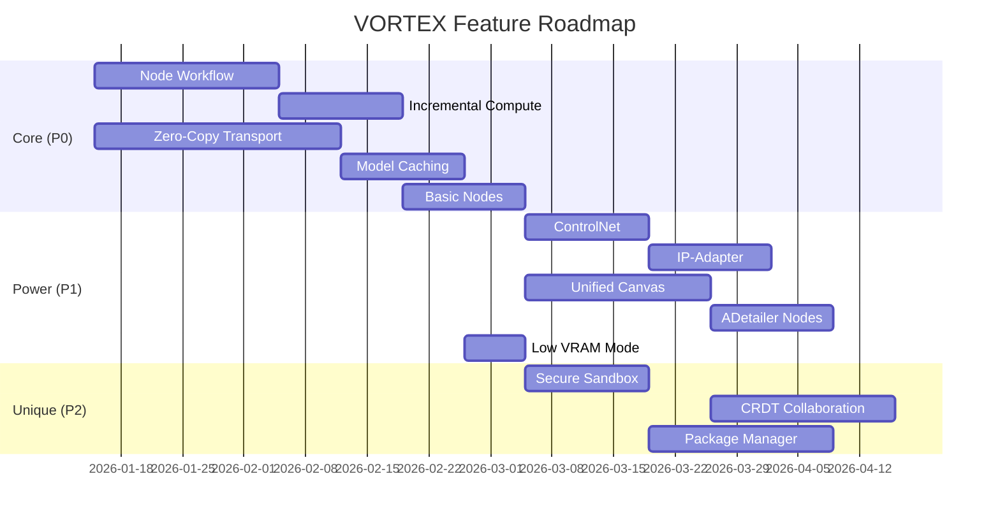

# VORTEX Feature Implementation Plan

> **Definitive list of features to implement in VORTEX, with improvement strategies and implementation approach.**

---

## 🎯 TIER 1: Core Features (Release 1.0 - MUST HAVE)

### 1.1 Node-Based Workflow Engine

| Feature | Source | VORTEX Improvement | Implementation |
|---------|--------|-------------------|----------------|
| **Drag-drop nodes** | ComfyUI | Same | Svelte Flow library |
| **Wire connections** | ComfyUI | Auto-routing with Bézier curves (no spaghetti) | Custom edge renderer |
| **Workflow save (JSON)** | ComfyUI | Same + schema validation | `serde_json` in Rust |
| **Workflow embed in PNG** | ComfyUI | Same | EXIF metadata writer |
| **Node preview thumbnails** | ComfyUI | Same | WebSocket stream |
| **Type-safe connections** | ComfyUI | Color-coded + compile-time validation | Rust type system |

**VORTEX Unique**: Semantic Zoom (DOM at high zoom, WebGL at low zoom)

```
Implementation: 
- Frontend: Svelte 5 + Svelte Flow + WebGL2
- Transport: WebSocket binary frames
- Estimated: 3 weeks
```

---

### 1.2 Incremental Computation

| Feature | Source | VORTEX Improvement | Implementation |
|---------|--------|-------------------|----------------|
| **Only re-run changed nodes** | ComfyUI | Merkle hashing for faster invalidation | SHA256 per node |
| **Cache intermediate results** | ComfyUI | Salsa-based memoization, automatic | `salsa` crate |
| **Dirty set propagation** | ComfyUI | Transitive closure algorithm | Graph traversal |

**VORTEX Unique**: Mathematical formula for hash: $H(n) = \text{SHA256}(\text{op} \| \text{params} \| \bigoplus H(\text{parents}))$

```
Implementation:
- Backend: Rust `salsa` framework
- Hashing: `sha2` crate
- Estimated: 2 weeks
```

---

### 1.3 Zero-Copy Memory Transport

| Feature | Source | VORTEX Improvement | Implementation |
|---------|--------|-------------------|----------------|
| **Shared memory** | None (unique) | **64GB Arena with Arrow format** | `mmap`, `arrow-rs` |
| **Tensor transfer** | ComfyUI (slow) | **100-1000× faster** via DLPack | `dlpack` FFI |
| **Worker IPC** | ComfyUI (pickle) | **Protobuf over Unix socket** | `prost`, UDS |

**VORTEX Unique**: Zero serialization. Tensors stay in shared memory, only pointers exchanged.

```
Implementation:
- Backend: `memmap2`, `arrow-rs`, `prost`
- Python side: `numpy.frombuffer()`, `torch.from_dlpack()`
- Estimated: 4 weeks
```

---

### 1.4 Model Management

| Feature | Source | VORTEX Improvement | Implementation |
|---------|--------|-------------------|----------------|
| **Model loading** | All | Same | PyTorch `load_state_dict` |
| **Model caching** | ComfyUI | **LFU with future-use prediction** | Arbiter module |
| **VRAM tracking** | None | **Predictive cost before execution** | Size formula |
| **Eviction policy** | ComfyUI | **Bélády's MIN algorithm** | Priority queue |

**VORTEX Unique**: Show estimated VRAM before pressing "Queue" button.

```
Implementation:
- Backend: Rust Arbiter with VRAM predictor
- Formula: size(T) = Π(dims) × sizeof(dtype)
- Estimated: 2 weeks
```

---

### 1.5 Basic Node Library

| Node Type | Source | Implementation |
|-----------|--------|----------------|
| **LoadCheckpoint** | ComfyUI | PyTorch `safetensors` |
| **LoadImage** | ComfyUI | PIL/OpenCV |
| **SaveImage** | ComfyUI | PNG with metadata |
| **KSampler** | ComfyUI | Diffusers schedulers |
| **VAEDecode** | ComfyUI | Standard VAE forward |
| **VAEEncode** | ComfyUI | Standard VAE encode |
| **CLIPTextEncode** | ComfyUI | Tokenizer + CLIP |
| **EmptyLatentImage** | ComfyUI | Tensor zeros |

```
Implementation:
- Python executors in worker process
- Estimated: 2 weeks
```

---

## 🚀 TIER 2: Power Features (Release 1.1 - HIGH VALUE)

### 2.1 ControlNet Integration

| Feature | Source | VORTEX Improvement | Implementation |
|---------|--------|-------------------|----------------|
| **ControlNet apply** | A1111/ComfyUI | Same, node-based | Diffusers ControlNet |
| **Preprocessors** (Canny, Depth, OpenPose) | ComfyUI | Built-in, not extension | OpenCV, MediaPipe |
| **Multi-ControlNet** | ComfyUI | Same | Stacked conditioning |

```
Implementation:
- Nodes: ControlNetLoader, ControlNetApply, CannyPreprocessor, DepthPreprocessor
- Estimated: 2 weeks
```

---

### 2.2 IP-Adapter (Style Transfer)

| Feature | Source | VORTEX Improvement | Implementation |
|---------|--------|-------------------|----------------|
| **IP-Adapter apply** | ComfyUI | Same | HuggingFace IP-Adapter |
| **Face ID** | ComfyUI | Same | InsightFace |
| **Style blending** | ComfyUI | Visual slider for weight | UI parameter |

```
Implementation:
- Nodes: IPAdapterLoader, IPAdapterApply, FaceIDEmbed
- Estimated: 2 weeks
```

---

### 2.3 Unified Canvas

| Feature | Source | VORTEX Improvement | Implementation |
|---------|--------|-------------------|----------------|
| **Inpainting** | InvokeAI | **SAM click-to-mask integration** | Segment Anything |
| **Outpainting** | InvokeAI | Infinite canvas with tile stitching | Canvas component |
| **Layer system** | InvokeAI | Non-destructive, Photoshop-like | Svelte store |
| **Brush tools** | InvokeAI | Same | Canvas API |

**VORTEX Unique**: Click object → instant mask (SAM). No manual brushing.

```
Implementation:
- Frontend: Svelte canvas component
- Backend: SAM model for auto-masking
- Estimated: 3 weeks
```

---

### 2.4 Auto-Enhancement (ADetailer Equivalent)

| Feature | Source | VORTEX Improvement | Implementation |
|---------|--------|-------------------|----------------|
| **Face detection** | A1111 ADetailer | Same | YOLO/MediaPipe |
| **Face fix** | A1111 ADetailer | **Node-based, configurable** | Separate nodes |
| **Hand fix** | A1111 ADetailer | Same | Detection model |

**VORTEX Unique**: ADetailer as composable nodes, not monolithic extension.

```
Implementation:
- Nodes: FaceDetect, HandDetect, RegionInpaint
- Estimated: 2 weeks
```

---

### 2.5 Low VRAM Mode

| Feature | Source | VORTEX Improvement | Implementation |
|---------|--------|-------------------|----------------|
| **CPU offloading** | ComfyUI | **Automatic based on VRAM** | Arbiter decision |
| **Sequential processing** | ComfyUI | Same | Queue system |
| **FP16/FP8** | Forge | Same | PyTorch config |
| **Tiled VAE** | ComfyUI | **Automatic when needed** | Smart tiling node |

```
Implementation:
- Arbiter detects VRAM, auto-enables offloading
- Estimated: 1 week
```

---

## 🔒 TIER 3: Differentiation Features (Release 1.2 - UNIQUE)

### 3.1 Secure Node Sandbox

| Feature | Source | VORTEX Improvement | Implementation |
|---------|--------|-------------------|----------------|
| **Seccomp filtering** | None (unique) | Block dangerous syscalls | BPF filter |
| **AST security scan** | None (unique) | Block `os.system`, `exec`, `subprocess` | Python AST walk |
| **Network isolation** | None (unique) | No socket syscalls | Seccomp deny |

**VORTEX Unique**: FIRST node-based tool with security scanning. No malicious nodes.

```
Implementation:
- Rust: seccomp-bpf before fork()
- Python: AST visitor on node load
- Estimated: 2 weeks
```

---

### 3.2 Real-Time Collaboration

| Feature | Source | VORTEX Improvement | Implementation |
|---------|--------|-------------------|----------------|
| **CRDT sync** | None (unique) | Yjs for conflict-free merge | `yjs`, `y-websocket` |
| **Multi-cursor** | None (unique) | See collaborators' selections | Awareness API |
| **Shared execution** | None (unique) | Results visible to all | WebSocket broadcast |

**VORTEX Unique**: NO open-source competitor has real-time collaboration.

```
Implementation:
- Frontend: Yjs + y-websocket
- Backend: WebSocket relay
- Estimated: 3 weeks
```

---

### 3.3 Package Manager (vtx)

| Feature | Source | VORTEX Improvement | Implementation |
|---------|--------|-------------------|----------------|
| **Dependency resolution** | None (unique) | **PubGrub solver** (proper SAT) | `pubgrub` crate |
| **Lockfile** | None (unique) | Reproducible installs | `vortex.lock` |
| **Security scan** | None (unique) | AST analysis on install | Mandatory gate |
| **Multi-source** | Civitai Helper | Civitai + HuggingFace + local | Unified API |

**VORTEX Unique**: FIRST proper package manager for AI nodes.

```
Implementation:
- CLI: `vtx install <package>`
- Solver: pubgrub-rs
- Estimated: 3 weeks
```

---

## 📊 Feature Summary Matrix

| Feature | Priority | Source | Strategy | Impl Weeks |
|---------|----------|--------|----------|------------|
| Node workflow | P0 | ComfyUI | Copy | 3 |
| Incremental compute | P0 | ComfyUI | Improve (Salsa) | 2 |
| Zero-copy transport | P0 | Unique | Revolutionize | 4 |
| Model caching | P0 | ComfyUI | Improve (LFU) | 2 |
| Basic nodes | P0 | ComfyUI | Copy | 2 |
| ControlNet | P1 | A1111 | Copy | 2 |
| IP-Adapter | P1 | ComfyUI | Copy | 2 |
| Unified canvas | P1 | InvokeAI | Improve (SAM) | 3 |
| ADetailer nodes | P1 | A1111 | Improve (composable) | 2 |
| Low VRAM mode | P1 | ComfyUI | Improve (auto) | 1 |
| Secure sandbox | P2 | Unique | Revolutionize | 2 |
| CRDT collaboration | P2 | Unique | Revolutionize | 3 |
| Package manager | P2 | Unique | Revolutionize | 3 |
| **TOTAL** | | | | **31 weeks** |

---

## 🏗️ Implementation Roadmap



---

## 📋 Decision Log

| Feature | Decision | Rationale |
|---------|----------|-----------|
| Gradio UI | ❌ REJECT | Slow, ugly, limited styling |
| Python server | ❌ REJECT | GIL bottleneck, sync blocking |
| Pickle serialization | ❌ REJECT | Security risk, slow |
| Extension folder | ❌ REJECT | No security, no versioning |
| Spaghetti wires | ❌ REJECT | Auto-routing instead |
| In-memory models only | ❌ REJECT | Predictive eviction instead |
| A1111 compatibility | ⚠️ PARTIAL | Support LoRA/ControlNet formats |
| ComfyUI workflow import | ✅ ACCEPT | Migration path for users |

---

## Document History

| Version | Date | Author | Changes |
|---------|------|--------|---------|
| 1.0.0 | 2026-01-06 | System | Initial feature implementation plan |
