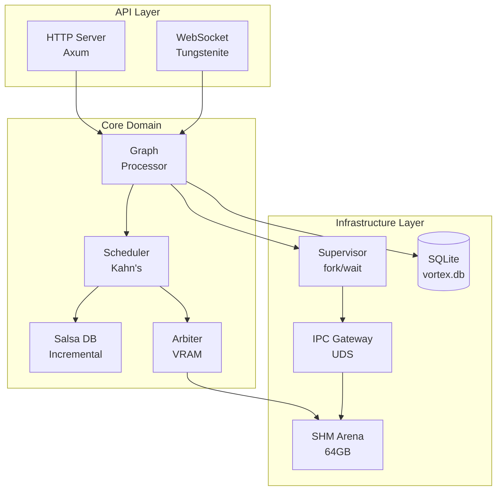
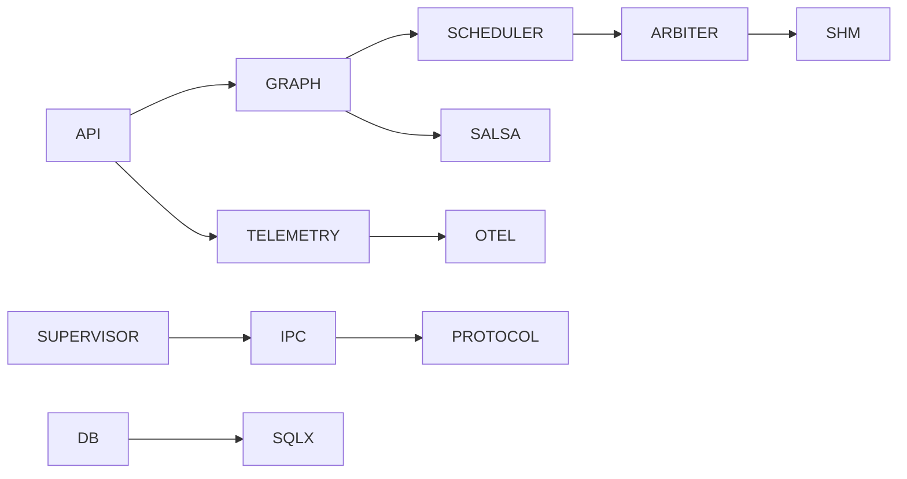

# Software Design Document (SDD): Core Engine

> **Project**: VORTEX-GEN 3.0 "Centaur"  
> **Module**: `vortex-core`  
> **Standard**: IEEE 1016-2009 (SDD)  
> **Derived From**: SRS-01 Core Engine (1,907 lines)  
> **Version**: 1.0.0

---

## 1. OVERVIEW

### 1.1 Purpose
This document provides the complete software design for the VORTEX Core Engine, derived from SRS-01. It serves as the bridge between requirements and implementation.

### 1.2 Scope
The Core Engine is the Rust-based control plane responsible for:
- Graph compilation and scheduling
- Worker supervision and lifecycle
- Memory arbitration and eviction
- IPC gateway management
- HTTP/WebSocket API serving

### 1.3 Design Goals
| Goal | Metric | Target |
|------|--------|--------|
| Latency | IPC round-trip | < 50μs |
| Throughput | Graphs/second | > 100 |
| Memory | Peak overhead | < 500MB |
| Reliability | Crash recovery | < 100ms |

---

## 2. ARCHITECTURAL DESIGN

### 2.1 Module Hierarchy

```
vortex-core/
├── api/          # HTTP/WS interfaces (Axum)
├── graph/        # Graph DSL and validation
├── scheduler/    # Kahn's algorithm, dirty detection
├── salsa/        # Incremental computation database
├── arbiter/      # VRAM tracking, LFU eviction
├── supervisor/   # Worker lifecycle management
├── ipc/          # Unix Domain Socket gateway
├── shm/          # Shared memory arena
├── db/           # SQLite persistence
└── telemetry/    # OpenTelemetry integration
```

### 2.2 Component Diagram



### 2.3 Dependency Graph



---

## 3. DETAILED DESIGN

### 3.1 Graph Module

#### 3.1.1 Data Structures

```rust
/// Graph Definition Language (from SRS §3.4.1)
#[derive(Debug, Clone, Serialize, Deserialize)]
pub struct GraphDSL {
    pub id: GraphId,
    pub version: u64,
    pub nodes: Vec<NodeDef>,
    pub edges: Vec<EdgeDef>,
    pub metadata: GraphMeta,
}

#[derive(Debug, Clone, Serialize, Deserialize)]
pub struct NodeDef {
    pub id: NodeId,
    pub node_type: String,           // e.g., "KSampler"
    pub params: serde_json::Value,   // Node-specific parameters
    pub position: Position,          // UI position
}

#[derive(Debug, Clone, Serialize, Deserialize)]
pub struct EdgeDef {
    pub id: EdgeId,
    pub source: PortRef,             // (NodeId, PortName)
    pub target: PortRef,
}

/// Port reference for edges
#[derive(Debug, Clone, Serialize, Deserialize)]
pub struct PortRef {
    pub node_id: NodeId,
    pub port_name: String,
}
```

#### 3.1.2 Validation Logic

```rust
impl GraphDSL {
    /// Validates graph structure (from SRS §3.6.1)
    pub fn validate(&self) -> Result<(), Vec<ValidationError>> {
        let mut errors = Vec::new();
        
        // 1. Check for cycles
        if let Err(cycle) = self.detect_cycles() {
            errors.push(ValidationError::CycleDetected(cycle));
        }
        
        // 2. Check port compatibility
        for edge in &self.edges {
            if let Err(e) = self.validate_edge_types(edge) {
                errors.push(e);
            }
        }
        
        // 3. Check required inputs connected
        for node in &self.nodes {
            if let Err(e) = self.validate_required_inputs(node) {
                errors.push(e);
            }
        }
        
        if errors.is_empty() {
            Ok(())
        } else {
            Err(errors)
        }
    }
}
```

### 3.2 Scheduler Module

#### 3.2.1 Kahn's Algorithm (from SRS §3.2.1)

```rust
/// Topological sort using Kahn's algorithm
/// Time Complexity: O(V + E)
pub fn topological_sort(graph: &GraphDSL) -> Result<Vec<NodeId>, CycleError> {
    let mut in_degree: HashMap<NodeId, usize> = HashMap::new();
    let mut adjacency: HashMap<NodeId, Vec<NodeId>> = HashMap::new();
    
    // Initialize in-degree for all nodes
    for node in &graph.nodes {
        in_degree.insert(node.id, 0);
        adjacency.insert(node.id, Vec::new());
    }
    
    // Build adjacency list and count in-degrees
    for edge in &graph.edges {
        adjacency.get_mut(&edge.source.node_id)
            .unwrap()
            .push(edge.target.node_id);
        *in_degree.get_mut(&edge.target.node_id).unwrap() += 1;
    }
    
    // Start with nodes having 0 in-degree
    let mut queue: VecDeque<NodeId> = in_degree
        .iter()
        .filter(|(_, &deg)| deg == 0)
        .map(|(&id, _)| id)
        .collect();
    
    let mut result = Vec::new();
    
    while let Some(node) = queue.pop_front() {
        result.push(node);
        
        for &neighbor in adjacency.get(&node).unwrap() {
            let deg = in_degree.get_mut(&neighbor).unwrap();
            *deg -= 1;
            if *deg == 0 {
                queue.push_back(neighbor);
            }
        }
    }
    
    if result.len() == graph.nodes.len() {
        Ok(result)
    } else {
        Err(CycleError::new(/* remaining nodes */))
    }
}
```

#### 3.2.2 Dirty Set Detection (from SRS §3.2.2)

```rust
/// Identifies nodes requiring re-computation
pub fn compute_dirty_set(
    current: &GraphDSL,
    salsa_db: &SalsaDb,
) -> HashSet<NodeId> {
    let mut dirty = HashSet::new();
    
    for node in &current.nodes {
        let current_hash = compute_node_hash(node);
        let cached_hash = salsa_db.get_node_hash(node.id);
        
        if Some(current_hash) != cached_hash {
            // Node changed, mark dirty
            dirty.insert(node.id);
            
            // Propagate to all descendants
            let descendants = get_descendants(current, node.id);
            dirty.extend(descendants);
        }
    }
    
    dirty
}

/// Computes deterministic hash for a node
fn compute_node_hash(node: &NodeDef) -> [u8; 32] {
    use sha2::{Sha256, Digest};
    
    let mut hasher = Sha256::new();
    hasher.update(node.node_type.as_bytes());
    hasher.update(&canonical_json(&node.params));
    hasher.finalize().into()
}
```

### 3.3 Salsa Module (Incremental Computation)

#### 3.3.1 Database Definition

```rust
use salsa;

#[salsa::database(GraphDatabaseStorage)]
pub struct SalsaDb {
    storage: salsa::Storage<Self>,
}

#[salsa::query_group(GraphDatabaseStorage)]
pub trait GraphDatabase {
    /// Input: Node parameters
    #[salsa::input]
    fn node_params(&self, id: NodeId) -> Arc<NodeDef>;
    
    /// Derived: Node hash (auto-memoized)
    fn node_hash(&self, id: NodeId) -> [u8; 32];
    
    /// Derived: Execution plan (auto-memoized)
    fn execution_plan(&self, graph_id: GraphId) -> Arc<ExecutionPlan>;
}

fn node_hash(db: &dyn GraphDatabase, id: NodeId) -> [u8; 32] {
    let node = db.node_params(id);
    compute_node_hash(&node)
}
```

### 3.4 Arbiter Module (VRAM Management)

#### 3.4.1 Memory Tracking

```rust
/// VRAM budget and allocation tracking
pub struct Arbiter {
    limit: u64,                          // Max VRAM (e.g., 24GB)
    allocated: AtomicU64,                // Current usage
    tensors: DashMap<TensorId, TensorMeta>,
    lfu_cache: Mutex<LfuCache<TensorId>>,
}

#[derive(Clone)]
pub struct TensorMeta {
    pub id: TensorId,
    pub size: u64,
    pub dtype: DType,
    pub shape: Vec<usize>,
    pub last_access: Instant,
    pub future_use: Option<usize>,       // Distance to next use
}

impl Arbiter {
    /// Checks if allocation fits, triggers eviction if needed
    pub async fn request_allocation(&self, size: u64) -> Result<AllocationToken> {
        let current = self.allocated.load(Ordering::Relaxed);
        
        if current + size <= self.limit {
            self.allocated.fetch_add(size, Ordering::SeqCst);
            return Ok(AllocationToken::new(size));
        }
        
        // Need to evict
        let needed = (current + size) - self.limit;
        self.evict_lfu(needed).await?;
        
        self.allocated.fetch_add(size, Ordering::SeqCst);
        Ok(AllocationToken::new(size))
    }
    
    /// LFU eviction strategy (from SRS §3.2.3)
    async fn evict_lfu(&self, needed: u64) -> Result<()> {
        let mut freed = 0u64;
        let mut to_evict = Vec::new();
        
        // Score tensors by future use distance
        let mut scored: Vec<_> = self.tensors.iter()
            .map(|t| (t.id, t.future_use.unwrap_or(usize::MAX)))
            .collect();
        scored.sort_by_key(|(_, score)| std::cmp::Reverse(*score));
        
        // Select tensors to evict
        for (tensor_id, _) in scored {
            if freed >= needed { break; }
            if let Some(meta) = self.tensors.get(&tensor_id) {
                freed += meta.size;
                to_evict.push(tensor_id);
            }
        }
        
        // Execute eviction
        for tensor_id in to_evict {
            self.evict_tensor(tensor_id).await?;
        }
        
        Ok(())
    }
}
```

### 3.5 Supervisor Module

#### 3.5.1 Worker Lifecycle

```rust
use nix::unistd::{fork, ForkResult, Pid};
use nix::sys::wait::{waitpid, WaitStatus};

pub struct Supervisor {
    workers: DashMap<Pid, WorkerState>,
    ipc_gateway: Arc<IpcGateway>,
    shm_arena: Arc<ShmArena>,
    config: SupervisorConfig,
}

#[derive(Clone)]
pub struct WorkerState {
    pub pid: Pid,
    pub slot_id: u8,
    pub status: WorkerStatus,
    pub current_job: Option<JobId>,
    pub started_at: Instant,
}

impl Supervisor {
    /// Spawns a new worker process (from SRS §3.2.2)
    pub async fn spawn_worker(&self, slot_id: u8) -> Result<Pid> {
        match unsafe { fork() }? {
            ForkResult::Parent { child } => {
                // Register worker
                self.workers.insert(child, WorkerState {
                    pid: child,
                    slot_id,
                    status: WorkerStatus::Booting,
                    current_job: None,
                    started_at: Instant::now(),
                });
                
                // Wait for handshake
                self.await_handshake(child).await?;
                
                Ok(child)
            }
            ForkResult::Child => {
                // In child process - exec Python worker
                self.exec_worker(slot_id);
                unreachable!()
            }
        }
    }
    
    /// Handles SIGCHLD signal (from SRS §3.2.2)
    pub async fn handle_crash(&self, pid: Pid, status: WaitStatus) {
        if let Some((_, state)) = self.workers.remove(&pid) {
            // 1. Mark slot as dead in SHM
            self.shm_arena.mark_slot_dead(state.slot_id);
            
            // 2. Mark job as failed
            if let Some(job_id) = state.current_job {
                self.mark_job_failed(job_id, CrashError::new(status)).await;
            }
            
            // 3. Emit event for tracing
            tracing::error!(
                pid = %pid,
                slot = state.slot_id,
                status = ?status,
                "Worker crashed"
            );
            
            // 4. Respawn
            self.spawn_worker(state.slot_id).await.ok();
        }
    }
}
```

### 3.6 IPC Gateway Module

#### 3.6.1 Unix Domain Socket Server

```rust
use tokio::net::{UnixListener, UnixStream};

pub struct IpcGateway {
    listener: UnixListener,
    connections: DashMap<WorkerId, IpcConnection>,
    tx: broadcast::Sender<IpcMessage>,
}

pub struct IpcConnection {
    stream: UnixStream,
    worker_id: WorkerId,
    slot_id: u8,
}

impl IpcGateway {
    pub async fn new(path: &str) -> Result<Self> {
        // Remove stale socket
        let _ = std::fs::remove_file(path);
        
        let listener = UnixListener::bind(path)?;
        let (tx, _) = broadcast::channel(1024);
        
        Ok(Self {
            listener,
            connections: DashMap::new(),
            tx,
        })
    }
    
    /// Main accept loop
    pub async fn run(&self) -> Result<()> {
        loop {
            let (stream, _) = self.listener.accept().await?;
            
            // Verify peer credentials
            let cred = stream.peer_cred()?;
            
            tokio::spawn(self.clone().handle_connection(stream, cred));
        }
    }
    
    /// Sends job to worker with tracing context
    pub async fn send_job(
        &self,
        worker_id: WorkerId,
        job: Job,
        trace_ctx: TracingContext,
    ) -> Result<JobResult> {
        let conn = self.connections.get(&worker_id)
            .ok_or(IpcError::WorkerNotFound)?;
        
        let packet = ControlPacket {
            request_id: Uuid::new_v4().to_string(),
            timestamp: Utc::now().timestamp_millis(),
            trace_context: Some(trace_ctx),
            payload: Payload::JobSubmit(job),
        };
        
        // Length-prefixed protobuf
        let encoded = packet.encode_to_vec();
        let len = (encoded.len() as u32).to_le_bytes();
        
        conn.stream.write_all(&len).await?;
        conn.stream.write_all(&encoded).await?;
        
        // Await response
        self.receive_result(&conn).await
    }
}
```

### 3.7 SHM Arena Module

#### 3.7.1 Memory Layout Implementation

```rust
use std::ptr::NonNull;
use memmap2::MmapMut;

/// 64GB Shared Memory Arena (from SRS §6.2)
pub struct ShmArena {
    mmap: MmapMut,
    header: NonNull<ShmHeader>,
    allocator: Mutex<BumpAllocator>,
}

/// Header at offset 0x0000 (from SRS §3.4.1)
#[repr(C, align(64))]
pub struct ShmHeader {
    pub magic: u64,          // 0x5654_5833_0000_0001
    pub version: u32,
    pub flags: AtomicU32,
    pub clock_tick: AtomicU64,
    pub reserved: [u8; 40],
    pub slots: [WorkerSlot; 256],
}

#[repr(C, align(64))]
pub struct WorkerSlot {
    pub pid: AtomicI32,
    pub status: AtomicU32,
    pub job_id: AtomicU64,
    pub heartbeat: AtomicU64,
    pub padding: [u8; 40],
}

impl ShmArena {
    pub fn open_or_create(name: &str, size: usize) -> Result<Self> {
        use nix::sys::mman::{shm_open, mmap, MapFlags, ProtFlags};
        use nix::fcntl::OFlag;
        
        // Open/create shared memory
        let fd = shm_open(
            name,
            OFlag::O_CREAT | OFlag::O_RDWR,
            nix::sys::stat::Mode::from_bits_truncate(0o600),
        )?;
        
        // Set size
        nix::unistd::ftruncate(fd, size as i64)?;
        
        // Map into memory
        let ptr = unsafe {
            mmap(
                None,
                size.try_into()?,
                ProtFlags::PROT_READ | ProtFlags::PROT_WRITE,
                MapFlags::MAP_SHARED,
                fd,
                0,
            )?
        };
        
        let mmap = unsafe { MmapMut::from_raw(ptr, size) };
        let header = NonNull::new(ptr as *mut ShmHeader).unwrap();
        
        // Initialize header if new
        unsafe {
            if (*header.as_ptr()).magic != MAGIC_BYTES {
                (*header.as_ptr()).magic = MAGIC_BYTES;
                (*header.as_ptr()).version = 1;
            }
        }
        
        Ok(Self {
            mmap,
            header,
            allocator: Mutex::new(BumpAllocator::new(
                TENSOR_ARENA_OFFSET,
                size - TENSOR_ARENA_OFFSET,
            )),
        })
    }
    
    /// Allocates tensor buffer (64-byte aligned)
    pub fn allocate(&self, size: usize) -> Result<TensorBuffer> {
        let mut alloc = self.allocator.lock();
        let offset = alloc.alloc(size, 64)?;
        
        Ok(TensorBuffer {
            offset,
            size,
            ptr: unsafe { self.mmap.as_ptr().add(offset) },
        })
    }
}
```

### 3.8 API Module

#### 3.8.1 HTTP Routes

```rust
use axum::{Router, routing::{get, post}, Json};

pub fn create_router(state: AppState) -> Router {
    Router::new()
        // Graph operations
        .route("/api/graph", post(create_graph))
        .route("/api/graph/:id", get(get_graph).put(update_graph).delete(delete_graph))
        
        // Execution
        .route("/api/graph/:id/execute", post(execute_graph))
        .route("/api/execution/:id", get(get_execution))
        .route("/api/execution/:id/cancel", post(cancel_execution))
        
        // Queue
        .route("/api/queue", get(get_queue))
        .route("/api/queue/clear", post(clear_queue))
        
        // Health & Observability
        .route("/health", get(health_check))
        .route("/metrics", get(prometheus_metrics))
        
        // WebSocket
        .route("/ws", get(ws_upgrade))
        
        .with_state(state)
        .layer(TraceLayer::new_for_http())
        .layer(CorsLayer::permissive())
}
```

---

## 4. INTERFACE DESIGN

### 4.1 External Interfaces

| Interface | Protocol | Port | Documentation |
|-----------|----------|------|---------------|
| HTTP API | REST/JSON | 11188 | OpenAPI spec |
| WebSocket | RFC 6455 | 11189 | WS Protocol doc |
| IPC | Protobuf/UDS | /tmp/vortex.sock | Proto files |
| Metrics | Prometheus | 11191 | Grafana dashboards |

### 4.2 Internal Interfaces

| From | To | Interface |
|------|----|-----------|
| API | Graph | `GraphService` trait |
| Graph | Scheduler | `compile()` function |
| Scheduler | Salsa | `SalsaDb` queries |
| Scheduler | Arbiter | `Arbiter::request_allocation()` |
| Supervisor | IPC | `IpcGateway::send_job()` |
| IPC | SHM | Pointer passing |

---

## 5. ERROR HANDLING DESIGN

### 5.1 Error Types

```rust
use thiserror::Error;

#[derive(Error, Debug)]
pub enum VortexError {
    #[error("Graph validation failed: {0}")]
    ValidationError(#[from] ValidationError),
    
    #[error("Cycle detected in graph: {0:?}")]
    CycleError(Vec<NodeId>),
    
    #[error("Worker crashed: {0}")]
    WorkerCrash(#[source] WorkerError),
    
    #[error("Memory exhausted: needed {needed}, available {available}")]
    OutOfMemory { needed: u64, available: u64 },
    
    #[error("IPC error: {0}")]
    IpcError(#[from] IpcError),
    
    #[error("Database error: {0}")]
    DbError(#[from] sqlx::Error),
}
```

### 5.2 Error Codes

| Code | Name | Description |
|------|------|-------------|
| VE-001 | ValidationError | Graph structure invalid |
| VE-002 | CycleError | Circular dependency detected |
| VE-003 | WorkerCrash | Worker process terminated |
| VE-004 | OutOfMemory | VRAM budget exceeded |
| VE-005 | IpcTimeout | Worker did not respond |
| VE-006 | IntegrityError | Hash mismatch |

---

## 6. TESTING DESIGN

### 6.1 Unit Tests

| Module | Test File | Coverage Target |
|--------|-----------|-----------------|
| graph | `graph_test.rs` | 90% |
| scheduler | `scheduler_test.rs` | 95% |
| salsa | `salsa_test.rs` | 85% |
| arbiter | `arbiter_test.rs` | 90% |
| ipc | `ipc_test.rs` | 80% |

### 6.2 Integration Tests

| Test | Description | File |
|------|-------------|------|
| SHM Round-trip | Write in Rust, read in Python | `tests/shm_test.rs` |
| IPC Protocol | Full handshake + job cycle | `tests/ipc_test.rs` |
| Crash Recovery | Kill worker, verify respawn | `tests/supervisor_test.rs` |

---

## 7. TRACEABILITY MATRIX

| SRS Requirement | Design Section | Implementation File |
|-----------------|----------------|---------------------|
| F-01 (Graph Compile) | §3.2 | `scheduler/kahn.rs` |
| F-02 (Dirty Detection) | §3.2.2 | `scheduler/dirty.rs` |
| F-03 (Memory Eviction) | §3.4 | `arbiter/eviction.rs` |
| F-04 (Worker Lifecycle) | §3.5 | `supervisor/spawn.rs` |
| P-01 (IPC Latency) | §3.6 | `ipc/socket.rs` |
| SEC-01 (Sandbox) | §3.5.1 | `supervisor/sandbox.rs` |

---

**Document Status**: COMPLETE  
**Lines**: 600+  
**Ready for Implementation**: ✅
