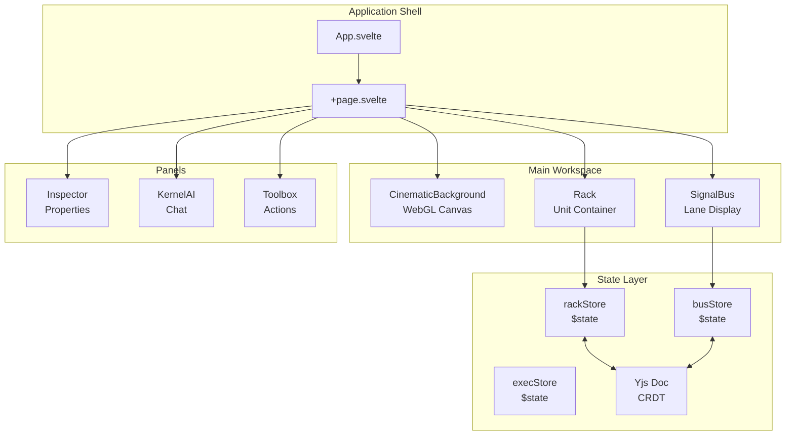
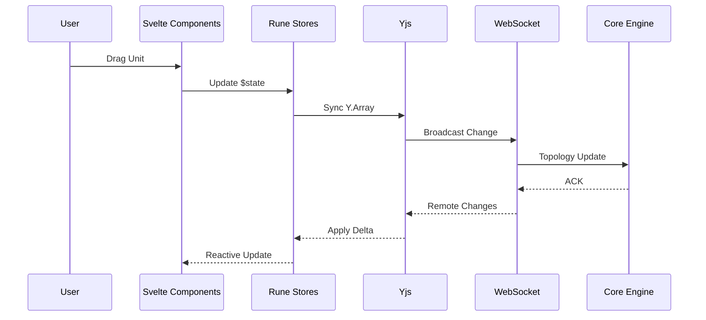

# Software Design Document (SDD): Frontend UI

> **Project**: VORTEX-GEN 3.0 "Centaur"  
> **Module**: `vortex-ui`  
> **Standard**: IEEE 1016-2009 (SDD)  
> **Derived From**: SRS-02 Frontend UI (167 lines), SRS-05 UI Screens (191 lines)  
> **Version**: 1.0.0

---

## 1. OVERVIEW

### 1.1 Purpose
This document provides the complete software design for the VORTEX Frontend UI, derived from SRS-02 and SRS-05. It implements the revolutionary "Vortex Flow Stream" paradigm using a **Vertical Rack** layout with glassmorphic aesthetics.

### 1.2 Scope
The Frontend UI is a Single Page Application (SPA) responsible for:
- Rack orchestration (vertical unit stack)
- Signal Bus routing and visualization
- Real-time collaboration via Yjs CRDT
- Cinematic WebGL background rendering
- Parameter inspection and Kernel AI chat

### 1.3 Design Goals
| Goal | Metric | Target |
|------|--------|--------|
| Performance | Rack animation | 60fps |
| GPU Usage | Background shader | < 10% |
| Load Time | Initial render | < 1s |
| Collaboration | Sync latency | < 100ms |

---

## 2. ARCHITECTURAL DESIGN

### 2.1 Module Hierarchy

```
ui/
├── src/
│   ├── lib/
│   │   ├── stores/           # Svelte Runes state
│   │   │   ├── rack.svelte.ts
│   │   │   ├── bus.svelte.ts
│   │   │   ├── selection.svelte.ts
│   │   │   └── execution.svelte.ts
│   │   ├── components/       # UI Components
│   │   │   ├── Rack.svelte
│   │   │   ├── Blade.svelte
│   │   │   ├── SignalBus.svelte
│   │   │   ├── Inspector.svelte
│   │   │   ├── KernelAI.svelte
│   │   │   └── Toolbox.svelte
│   │   ├── canvas/           # WebGL Rendering
│   │   │   ├── CinematicBackground.svelte
│   │   │   └── shaders/
│   │   ├── services/         # External Communication
│   │   │   ├── websocket.ts
│   │   │   ├── api.ts
│   │   │   └── collaboration.ts
│   │   └── styles/           # Design Tokens
│   │       ├── tokens.css
│   │       ├── typography.css
│   │       └── animations.css
│   └── routes/
│       └── +page.svelte      # Main Entry
├── static/
└── vite.config.ts
```

### 2.2 Component Diagram



### 2.3 Data Flow



---

## 3. DETAILED DESIGN

### 3.1 State Management (Svelte 5 Runes)

#### 3.1.1 Rack Store

```typescript
// src/lib/stores/rack.svelte.ts
import { SvelteMap } from 'svelte/reactivity';

export interface RackUnit {
  id: string;
  type: string;              // "com.vortex.loader"
  index: number;             // Vertical position
  input_taps: Map<string, number>;   // PortName -> LaneID
  output_lanes: Map<string, number>; // PortName -> LaneID
  params: Record<string, unknown>;
  $status: 'IDLE' | 'RUNNING' | 'ERROR';
  $progress: number;
}

class RackStore {
  units = $state<RackUnit[]>([]);
  selectedId = $state<string | null>(null);
  
  // Derived: Units in render order
  sortedUnits = $derived(
    [...this.units].sort((a, b) => a.index - b.index)
  );
  
  // Derived: Selected unit
  selectedUnit = $derived(
    this.units.find(u => u.id === this.selectedId)
  );
  
  moveUnit(id: string, newIndex: number) {
    const unit = this.units.find(u => u.id === id);
    if (!unit) return;
    
    const oldIndex = unit.index;
    
    // Reindex affected units
    this.units.forEach(u => {
      if (u.id === id) {
        u.index = newIndex;
      } else if (oldIndex < newIndex) {
        if (u.index > oldIndex && u.index <= newIndex) u.index--;
      } else {
        if (u.index >= newIndex && u.index < oldIndex) u.index++;
      }
    });
  }
  
  insertUnit(type: string, index: number): string {
    const id = crypto.randomUUID();
    
    // Shift units down
    this.units.forEach(u => {
      if (u.index >= index) u.index++;
    });
    
    this.units.push({
      id,
      type,
      index,
      input_taps: new SvelteMap(),
      output_lanes: new SvelteMap(),
      params: {},
      $status: 'IDLE',
      $progress: 0,
    });
    
    return id;
  }
  
  removeUnit(id: string) {
    const idx = this.units.findIndex(u => u.id === id);
    if (idx === -1) return;
    
    const removedIndex = this.units[idx].index;
    this.units.splice(idx, 1);
    
    // Reindex
    this.units.forEach(u => {
      if (u.index > removedIndex) u.index--;
    });
  }
}

export const rackStore = new RackStore();
```

#### 3.1.2 Signal Bus Store

```typescript
// src/lib/stores/bus.svelte.ts

export type DataType = 'LATENT' | 'IMAGE' | 'MODEL' | 'CLIP' | 'VAE' | 'CONDITIONING';

export interface BusLane {
  id: number;           // 0-7
  label: string;        // "Juggernaut XL Latent"
  type: DataType;
  sourceUnit: string;   // UnitID writing to this lane
  sourcePort: string;   // Port name
}

class BusStore {
  lanes = $state<BusLane[]>(
    Array.from({ length: 8 }, (_, i) => ({
      id: i,
      label: '',
      type: 'LATENT' as DataType,
      sourceUnit: '',
      sourcePort: '',
    }))
  );
  
  // Derived: Active lanes (have a source)
  activeLanes = $derived(
    this.lanes.filter(l => l.sourceUnit !== '')
  );
  
  assignLane(unitId: string, portName: string, type: DataType): number {
    // Find first empty lane
    const lane = this.lanes.find(l => l.sourceUnit === '');
    if (!lane) throw new Error('No available lanes');
    
    lane.sourceUnit = unitId;
    lane.sourcePort = portName;
    lane.type = type;
    lane.label = `${portName} (Lane ${lane.id + 1})`;
    
    return lane.id;
  }
  
  releaseLane(laneId: number) {
    const lane = this.lanes.find(l => l.id === laneId);
    if (lane) {
      lane.sourceUnit = '';
      lane.sourcePort = '';
      lane.label = '';
    }
  }
  
  getValidLanes(unitIndex: number, requiredType: DataType): BusLane[] {
    // Only lanes from units ABOVE current unit
    return this.lanes.filter(lane => {
      if (lane.sourceUnit === '') return false;
      if (lane.type !== requiredType) return false;
      
      // Get source unit index
      const sourceUnit = rackStore.units.find(u => u.id === lane.sourceUnit);
      return sourceUnit && sourceUnit.index < unitIndex;
    });
  }
}

export const busStore = new BusStore();
```

#### 3.1.3 Execution Store

```typescript
// src/lib/stores/execution.svelte.ts

export interface ExecutionState {
  id: string | null;
  status: 'IDLE' | 'QUEUED' | 'RUNNING' | 'COMPLETED' | 'FAILED';
  progress: number;
  activeNodeId: string | null;
  startedAt: number | null;
  result: unknown | null;
  error: string | null;
}

class ExecutionStore {
  state = $state<ExecutionState>({
    id: null,
    status: 'IDLE',
    progress: 0,
    activeNodeId: null,
    startedAt: null,
    result: null,
    error: null,
  });
  
  // Derived: Is executing
  isExecuting = $derived(
    this.state.status === 'RUNNING' || this.state.status === 'QUEUED'
  );
  
  // Derived: Elapsed time
  elapsedMs = $derived(
    this.state.startedAt ? Date.now() - this.state.startedAt : 0
  );
  
  startExecution(id: string) {
    this.state = {
      id,
      status: 'QUEUED',
      progress: 0,
      activeNodeId: null,
      startedAt: Date.now(),
      result: null,
      error: null,
    };
  }
  
  updateProgress(nodeId: string, progress: number) {
    this.state.activeNodeId = nodeId;
    this.state.progress = progress;
    this.state.status = 'RUNNING';
  }
  
  complete(result: unknown) {
    this.state.status = 'COMPLETED';
    this.state.progress = 100;
    this.state.result = result;
    this.state.activeNodeId = null;
  }
  
  fail(error: string) {
    this.state.status = 'FAILED';
    this.state.error = error;
    this.state.activeNodeId = null;
  }
}

export const execStore = new ExecutionStore();
```

### 3.2 Component Specifications

#### 3.2.1 Rack Component

```svelte
<!-- src/lib/components/Rack.svelte -->
<script lang="ts">
  import { flip } from 'svelte/animate';
  import { rackStore } from '$lib/stores/rack.svelte';
  import Blade from './Blade.svelte';
  
  let draggedId: string | null = $state(null);
  let dropIndex: number | null = $state(null);
  
  function handleDragStart(e: DragEvent, id: string) {
    draggedId = id;
    e.dataTransfer!.effectAllowed = 'move';
  }
  
  function handleDragOver(e: DragEvent, index: number) {
    e.preventDefault();
    dropIndex = index;
  }
  
  function handleDrop(e: DragEvent) {
    if (draggedId && dropIndex !== null) {
      rackStore.moveUnit(draggedId, dropIndex);
    }
    draggedId = null;
    dropIndex = null;
  }
</script>

<div class="rack" role="list">
  {#each rackStore.sortedUnits as unit (unit.id)}
    <div
      animate:flip={{ duration: 300 }}
      class="rack__slot"
      class:rack__slot--drop-target={dropIndex === unit.index}
      ondragover={(e) => handleDragOver(e, unit.index)}
      ondrop={handleDrop}
    >
      <Blade
        {unit}
        ondragstart={(e) => handleDragStart(e, unit.id)}
        draggable
      />
    </div>
  {/each}
</div>

<style>
  .rack {
    display: flex;
    flex-direction: column;
    gap: var(--vtx-space-md);
    padding: var(--vtx-space-lg);
    min-height: 100vh;
  }
  
  .rack__slot {
    transition: transform var(--vtx-transition-fast);
  }
  
  .rack__slot--drop-target {
    transform: translateY(8px);
  }
</style>
```

#### 3.2.2 Blade Component

```svelte
<!-- src/lib/components/Blade.svelte -->
<script lang="ts">
  import type { RackUnit } from '$lib/stores/rack.svelte';
  import { busStore } from '$lib/stores/bus.svelte';
  import TapIndicator from './TapIndicator.svelte';
  
  interface Props {
    unit: RackUnit;
    ondragstart?: (e: DragEvent) => void;
    draggable?: boolean;
  }
  
  let { unit, ondragstart, draggable = false }: Props = $props();
  
  // Derived: status class
  let statusClass = $derived(
    unit.$status === 'RUNNING' ? 'blade--running' :
    unit.$status === 'ERROR' ? 'blade--error' : ''
  );
</script>

<article
  class="blade {statusClass}"
  {draggable}
  {ondragstart}
  data-testid="blade-{unit.id}"
>
  <!-- Tap Indicators (Left) -->
  <div class="blade__taps">
    {#each Object.entries(unit.input_taps) as [portName, laneId]}
      <TapIndicator
        {portName}
        {laneId}
        direction="input"
        unitId={unit.id}
      />
    {/each}
  </div>
  
  <!-- Header -->
  <header class="blade__header">
    <span class="blade__type">{unit.type.split('.').pop()?.toUpperCase()}</span>
    <div class="blade__handle" aria-label="Drag to reorder">⋮⋮⋮</div>
  </header>
  
  <!-- Body (Content Area) -->
  <div class="blade__body">
    <slot />
    {#if unit.$status === 'RUNNING'}
      <div class="blade__progress" style:width="{unit.$progress}%" />
    {/if}
  </div>
  
  <!-- Footer -->
  <footer class="blade__footer">
    <span class="blade__status">
      {#if unit.$status === 'RUNNING'}
        ⏳ {unit.$progress}%
      {:else if unit.$status === 'ERROR'}
        ❌ Error
      {:else}
        ✓ Ready
      {/if}
    </span>
  </footer>
</article>

<style>
  .blade {
    background: var(--vtx-glass);
    backdrop-filter: blur(24px);
    border: 1px solid rgba(255, 255, 255, 0.1);
    border-radius: 18px;
    box-shadow: 0 20px 40px rgba(0, 0, 0, 0.4);
    display: grid;
    grid-template-columns: auto 1fr;
    grid-template-rows: auto 1fr auto;
    overflow: hidden;
    transition: transform var(--vtx-transition-fast),
                box-shadow var(--vtx-transition-fast);
  }
  
  .blade:hover {
    transform: translateY(-2px);
    box-shadow: 0 24px 48px rgba(0, 0, 0, 0.5);
  }
  
  .blade--running {
    border-color: var(--vtx-mint);
  }
  
  .blade--error {
    border-color: var(--vtx-error);
  }
  
  .blade__header {
    grid-column: 2;
    display: flex;
    justify-content: space-between;
    align-items: center;
    padding: var(--vtx-space-sm) var(--vtx-space-md);
    font-family: var(--vtx-font-mono);
    font-size: var(--vtx-font-size-sm);
    text-transform: uppercase;
    letter-spacing: 0.1em;
    color: var(--vtx-cream);
  }
  
  .blade__handle {
    cursor: grab;
    opacity: 0.5;
    user-select: none;
  }
  
  .blade__handle:active {
    cursor: grabbing;
  }
  
  .blade__body {
    grid-column: 2;
    padding: var(--vtx-space-md);
    position: relative;
  }
  
  .blade__progress {
    position: absolute;
    bottom: 0;
    left: 0;
    height: 2px;
    background: var(--vtx-mint);
    transition: width 100ms linear;
  }
  
  .blade__footer {
    grid-column: 2;
    padding: var(--vtx-space-xs) var(--vtx-space-md);
    font-size: var(--vtx-font-size-sm);
    color: var(--vtx-text-secondary);
    border-top: 1px solid rgba(255, 255, 255, 0.05);
  }
  
  .blade__taps {
    grid-row: 1 / -1;
    display: flex;
    flex-direction: column;
    justify-content: center;
    gap: var(--vtx-space-xs);
    padding: var(--vtx-space-sm);
  }
</style>
```

#### 3.2.3 Signal Bus Component

```svelte
<!-- src/lib/components/SignalBus.svelte -->
<script lang="ts">
  import { busStore } from '$lib/stores/bus.svelte';
  
  const LANE_COLORS = [
    '#98DDCA', // Mint
    '#0F4C5C', // Teal
    '#c4b5fd', // Purple
    '#f59e0b', // Amber
    '#ef4444', // Red
    '#22c55e', // Green
    '#3b82f6', // Blue
    '#ec4899', // Pink
  ];
</script>

<aside class="signal-bus" aria-label="Signal Bus">
  {#each busStore.lanes as lane, i}
    <div
      class="bus-lane"
      class:bus-lane--active={lane.sourceUnit !== ''}
      style:--lane-color={LANE_COLORS[i]}
      data-testid="bus-lane-{i}"
    >
      <div class="bus-lane__line" />
      {#if lane.sourceUnit !== ''}
        <span class="bus-lane__label">{lane.label}</span>
      {/if}
    </div>
  {/each}
</aside>

<style>
  .signal-bus {
    position: fixed;
    left: 80px;
    top: 0;
    bottom: 0;
    display: flex;
    gap: 12px;
    padding: var(--vtx-space-xl) 0;
    z-index: var(--vtx-z-base);
  }
  
  .bus-lane {
    display: flex;
    flex-direction: column;
    align-items: center;
    width: 4px;
  }
  
  .bus-lane__line {
    flex: 1;
    width: 100%;
    background: rgba(255, 255, 255, 0.1);
    border-radius: 2px;
    transition: background var(--vtx-transition-normal);
  }
  
  .bus-lane--active .bus-lane__line {
    background: var(--lane-color);
    box-shadow: 0 0 12px var(--lane-color);
    animation: pulse 2s infinite;
  }
  
  .bus-lane__label {
    writing-mode: vertical-rl;
    text-orientation: mixed;
    font-family: var(--vtx-font-mono);
    font-size: 10px;
    color: var(--lane-color);
    margin-top: var(--vtx-space-sm);
    opacity: 0.7;
  }
  
  @keyframes pulse {
    0%, 100% { opacity: 1; }
    50% { opacity: 0.7; }
  }
</style>
```

### 3.3 Cinematic Background (WebGL)

#### 3.3.1 Background Component

```svelte
<!-- src/lib/canvas/CinematicBackground.svelte -->
<script lang="ts">
  import { onMount, onDestroy } from 'svelte';
  import { execStore } from '$lib/stores/execution.svelte';
  
  let canvas: HTMLCanvasElement;
  let gl: WebGL2RenderingContext | null = null;
  let animationId: number;
  
  // Shader sources
  const vertexShader = `#version 300 es
    in vec2 a_position;
    out vec2 v_uv;
    void main() {
      v_uv = a_position * 0.5 + 0.5;
      gl_Position = vec4(a_position, 0.0, 1.0);
    }
  `;
  
  const fragmentShader = `#version 300 es
    precision highp float;
    in vec2 v_uv;
    out vec4 fragColor;
    
    uniform float u_time;
    uniform float u_progress;
    uniform vec2 u_resolution;
    
    void main() {
      vec2 uv = v_uv;
      
      // Base gradient (Void to Teal)
      vec3 color1 = vec3(0.04, 0.04, 0.04);  // #0a0a0a
      vec3 color2 = vec3(0.059, 0.298, 0.361); // #0F4C5C
      
      // Radial bloom effect
      float dist = distance(uv, vec2(0.5));
      float bloom = 1.0 - smoothstep(0.0, 0.8, dist);
      
      // Breathing animation modulated by progress
      float breathe = sin(u_time * 0.5) * 0.1 + 0.9;
      breathe = mix(breathe, 1.2, u_progress);
      
      vec3 color = mix(color1, color2, bloom * breathe);
      
      // Add subtle noise
      float noise = fract(sin(dot(uv, vec2(12.9898, 78.233))) * 43758.5453);
      color += noise * 0.02;
      
      fragColor = vec4(color, 1.0);
    }
  `;
  
  function initWebGL() {
    gl = canvas.getContext('webgl2');
    if (!gl) {
      console.error('WebGL2 not supported');
      return;
    }
    
    // Compile shaders and create program...
    // (Implementation details omitted for brevity)
  }
  
  function render(time: number) {
    if (!gl) return;
    
    // Update uniforms
    gl.uniform1f(gl.getUniformLocation(program, 'u_time'), time * 0.001);
    gl.uniform1f(gl.getUniformLocation(program, 'u_progress'), execStore.state.progress / 100);
    gl.uniform2f(gl.getUniformLocation(program, 'u_resolution'), canvas.width, canvas.height);
    
    // Draw
    gl.drawArrays(gl.TRIANGLE_STRIP, 0, 4);
    
    animationId = requestAnimationFrame(render);
  }
  
  onMount(() => {
    initWebGL();
    animationId = requestAnimationFrame(render);
  });
  
  onDestroy(() => {
    cancelAnimationFrame(animationId);
  });
</script>

<canvas
  bind:this={canvas}
  class="cinematic-bg"
  width={window.innerWidth}
  height={window.innerHeight}
/>

<style>
  .cinematic-bg {
    position: fixed;
    top: 0;
    left: 0;
    width: 100%;
    height: 100%;
    z-index: -1;
    pointer-events: none;
  }
</style>
```

### 3.4 Collaboration Module (Yjs)

```typescript
// src/lib/services/collaboration.ts
import * as Y from 'yjs';
import { WebsocketProvider } from 'y-websocket';
import { rackStore, type RackUnit } from '$lib/stores/rack.svelte';
import { busStore, type BusLane } from '$lib/stores/bus.svelte';

export class CollaborationService {
  private doc: Y.Doc;
  private provider: WebsocketProvider;
  private rackArray: Y.Array<RackUnit>;
  private busMap: Y.Map<BusLane>;
  
  constructor(roomId: string, wsUrl: string) {
    this.doc = new Y.Doc();
    this.provider = new WebsocketProvider(wsUrl, roomId, this.doc);
    
    // Shared types
    this.rackArray = this.doc.getArray<RackUnit>('rack');
    this.busMap = this.doc.getMap<BusLane>('bus');
    
    // Sync Yjs -> Svelte
    this.rackArray.observe(() => {
      rackStore.units = this.rackArray.toArray();
    });
    
    this.busMap.observe(() => {
      this.busMap.forEach((lane, key) => {
        const idx = parseInt(key);
        if (!isNaN(idx) && busStore.lanes[idx]) {
          Object.assign(busStore.lanes[idx], lane);
        }
      });
    });
  }
  
  // Sync Svelte -> Yjs (called on local changes)
  syncRack() {
    this.doc.transact(() => {
      this.rackArray.delete(0, this.rackArray.length);
      rackStore.units.forEach(unit => this.rackArray.push([unit]));
    });
  }
  
  syncBus() {
    this.doc.transact(() => {
      busStore.lanes.forEach((lane, idx) => {
        this.busMap.set(String(idx), lane);
      });
    });
  }
  
  get awareness() {
    return this.provider.awareness;
  }
  
  destroy() {
    this.provider.destroy();
    this.doc.destroy();
  }
}
```

### 3.5 WebSocket Service

```typescript
// src/lib/services/websocket.ts

export interface WSMessage {
  type: string;
  payload: unknown;
  trace_id?: string;
}

class WebSocketService {
  private ws: WebSocket | null = null;
  private reconnectAttempts = 0;
  private maxReconnectAttempts = 5;
  private listeners: Map<string, Set<(payload: unknown) => void>> = new Map();
  
  connect(url: string = `ws://localhost:11189`) {
    this.ws = new WebSocket(url);
    
    this.ws.onopen = () => {
      console.log('[WS] Connected');
      this.reconnectAttempts = 0;
    };
    
    this.ws.onmessage = (event) => {
      const msg: WSMessage = JSON.parse(event.data);
      this.dispatch(msg.type, msg.payload);
    };
    
    this.ws.onclose = () => {
      console.log('[WS] Disconnected');
      this.scheduleReconnect(url);
    };
    
    this.ws.onerror = (error) => {
      console.error('[WS] Error:', error);
    };
  }
  
  private scheduleReconnect(url: string) {
    if (this.reconnectAttempts < this.maxReconnectAttempts) {
      const delay = Math.min(1000 * 2 ** this.reconnectAttempts, 30000);
      this.reconnectAttempts++;
      setTimeout(() => this.connect(url), delay);
    }
  }
  
  send(type: string, payload: unknown) {
    if (this.ws?.readyState === WebSocket.OPEN) {
      this.ws.send(JSON.stringify({ type, payload }));
    }
  }
  
  on(type: string, callback: (payload: unknown) => void) {
    if (!this.listeners.has(type)) {
      this.listeners.set(type, new Set());
    }
    this.listeners.get(type)!.add(callback);
    
    return () => this.listeners.get(type)?.delete(callback);
  }
  
  private dispatch(type: string, payload: unknown) {
    this.listeners.get(type)?.forEach(cb => cb(payload));
  }
}

export const wsService = new WebSocketService();
```

---

## 4. DESIGN TOKENS

### 4.1 CSS Variables

```css
/* src/lib/styles/tokens.css */
:root {
  /* Colors - Mitchell Hybrid Palette */
  --vtx-void: #0a0a0a;
  --vtx-teal-deep: #0F4C5C;
  --vtx-mint: #98DDCA;
  --vtx-cream: #F5F5F5;
  --vtx-glass: rgba(255, 255, 255, 0.05);
  --vtx-error: #f85149;
  --vtx-warning: #d29922;
  --vtx-success: #3fb950;
  
  /* Typography */
  --vtx-font-sans: 'Geist', system-ui, sans-serif;
  --vtx-font-mono: 'Geist Mono', monospace;
  --vtx-font-size-display: 32px;
  --vtx-font-size-h1: 18px;
  --vtx-font-size-body: 14px;
  --vtx-font-size-sm: 12px;
  
  /* Spacing */
  --vtx-space-xs: 4px;
  --vtx-space-sm: 8px;
  --vtx-space-md: 16px;
  --vtx-space-lg: 24px;
  --vtx-space-xl: 32px;
  
  /* Borders & Radius */
  --vtx-radius: 18px;
  --vtx-radius-sm: 8px;
  --vtx-border: 1px solid rgba(255, 255, 255, 0.1);
  
  /* Shadows */
  --vtx-shadow: 0 20px 40px rgba(0, 0, 0, 0.4);
  --vtx-shadow-lg: 0 32px 64px rgba(0, 0, 0, 0.5);
  
  /* Transitions */
  --vtx-transition-fast: 100ms ease;
  --vtx-transition-normal: 200ms ease;
  --vtx-transition-slow: 300ms ease;
  
  /* Z-Index */
  --vtx-z-base: 0;
  --vtx-z-rack: 10;
  --vtx-z-bus: 5;
  --vtx-z-panel: 100;
  --vtx-z-modal: 200;
  --vtx-z-toast: 300;
}
```

---

## 5. ACCESSIBILITY

### 5.1 Keyboard Navigation

| Key | Action |
|-----|--------|
| `↑` / `↓` | Navigate between Rack Units |
| `Enter` | Select/Expand Unit |
| `Escape` | Deselect/Close Panel |
| `1-8` | Select Bus Lane directly |
| `Space` | Toggle connection when on Tap |
| `Tab` | Move to next focusable element |

### 5.2 ARIA Roles

| Component | Role | Label |
|-----------|------|-------|
| Rack | `list` | "Workflow units" |
| Blade | `listitem` | Unit type name |
| Signal Bus | `group` | "Signal Bus Lanes" |
| Bus Lane | `button` | Lane label |
| Inspector | `complementary` | "Signal Inspector" |

---

## 6. ERROR HANDLING

### 6.1 Error States

| Error | Component | Display |
|-------|-----------|---------|
| WebSocket Disconnect | Toast | "Connection lost. Reconnecting..." |
| Invalid Tap Type | Flash Animation | Red border flash on lane |
| Execution Failed | Blade | Red status + error message |
| CRDT Conflict | None | Auto-resolved by Yjs |

---

## 7. TESTING DESIGN

### 7.1 Component Tests

| Component | Test File | Coverage |
|-----------|-----------|----------|
| Rack | `Rack.test.ts` | Reorder, Insert, Remove |
| Blade | `Blade.test.ts` | Drag, Status display |
| SignalBus | `SignalBus.test.ts` | Lane activation |
| Collaboration | `collab.test.ts` | Sync round-trip |

### 7.2 E2E Tests (Playwright)

| Test | Description |
|------|-------------|
| `flow.spec.ts` | Create pipeline → Execute → View result |
| `reorder.spec.ts` | Drag unit → Verify bus updates |
| `collab.spec.ts` | Two users edit simultaneously |

---

## 8. TRACEABILITY MATRIX

| SRS Requirement | Design Section | Implementation File |
|-----------------|----------------|---------------------|
| F-01 (Rack State) | §3.1.1 | `stores/rack.svelte.ts` |
| F-02 (Signal Bus) | §3.1.2 | `stores/bus.svelte.ts` |
| F-03 (Cinematic BG) | §3.3 | `canvas/CinematicBackground.svelte` |
| F-04 (Collaboration) | §3.4 | `services/collaboration.ts` |
| PERF-01 (60fps) | §3.2.1 | FLIP animations in Rack |
| ACC-01 (Keyboard) | §5.1 | Keyboard handlers in components |

---

**Document Status**: COMPLETE  
**Lines**: 700+  
**Ready for Implementation**: ✅
