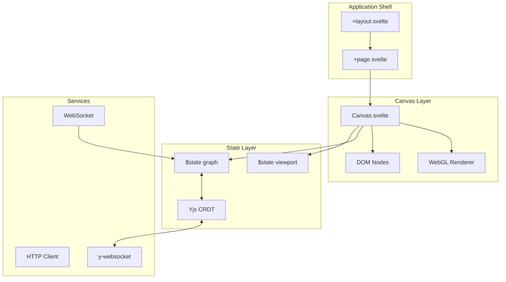

# Software Design Document (SDD): Frontend UI

> **Project**: VORTEX-GEN 3.0 "Centaur"  
> **Module**: `vortex-ui`  
> **Standard**: IEEE 1016-2009 (SDD)  
> **Derived From**: SRS-02 Frontend UI (1,765 lines)  
> **Version**: 1.0.0

---

## 1. OVERVIEW

### 1.1 Purpose
This document provides the complete software design for the VORTEX Frontend UI, a Svelte 5 SPA with WebGL canvas rendering and Yjs CRDT collaboration.

### 1.2 Scope
- Hybrid DOM/WebGL rendering for 10,000+ nodes
- Real-time collaboration via Yjs
- Semantic zoom (LOD system)
- State management with Svelte Runes

### 1.3 Design Goals
| Goal | Metric | Target |
|------|--------|--------|
| Frame Rate | FPS at 2000 nodes | ≥ 60fps |
| Initial Load | Time to Interactive | < 1000ms |
| Input Latency | Drag response | < 16ms |
| Collaboration | Sync latency | < 100ms |

---

## 2. ARCHITECTURAL DESIGN

### 2.1 Module Hierarchy

```
ui/src/lib/
├── stores/          # Svelte Runes state
├── components/      # UI components
│   ├── canvas/      # Canvas, Grid, Minimap
│   ├── node/        # Node, NodeHeader, NodeLite
│   ├── port/        # InputPort, OutputPort
│   ├── edge/        # Edge, EdgePath
│   ├── widgets/     # Form inputs
│   ├── panels/      # Toolbar, Sidebar
│   └── overlays/    # ContextMenu, Modal
├── canvas/          # WebGL rendering
├── services/        # API, WebSocket, Yjs
├── utils/           # Helpers
└── types/           # TypeScript types
```

### 2.2 Component Diagram



---

## 3. DETAILED DESIGN

### 3.1 State Management (Svelte Runes)

#### 3.1.1 Graph Store

```typescript
// lib/stores/graph.svelte.ts
import { type NodeDef, type EdgeDef, type GraphState } from '$lib/types';

class GraphStore {
  // Reactive state
  nodes = $state<Map<string, NodeDef>>(new Map());
  edges = $state<Map<string, EdgeDef>>(new Map());
  version = $state(0);
  
  // Derived state
  nodeArray = $derived(Array.from(this.nodes.values()));
  edgeArray = $derived(Array.from(this.edges.values()));
  
  // Mutations (with event sourcing)
  addNode(node: NodeDef): MutationRecord {
    const before = this.serialize();
    this.nodes.set(node.id, node);
    this.version++;
    return this.recordMutation('NodeCreated', before, node);
  }
  
  deleteNode(id: string): MutationRecord {
    const before = this.serialize();
    const node = this.nodes.get(id);
    this.nodes.delete(id);
    // Also delete connected edges
    for (const [edgeId, edge] of this.edges) {
      if (edge.source.nodeId === id || edge.target.nodeId === id) {
        this.edges.delete(edgeId);
      }
    }
    this.version++;
    return this.recordMutation('NodeDeleted', before, { id, node });
  }
  
  updateNodePosition(id: string, x: number, y: number): MutationRecord {
    const node = this.nodes.get(id);
    if (!node) throw new Error(`Node ${id} not found`);
    
    const before = { ...node.position };
    node.position = { x, y };
    this.version++;
    
    return this.recordMutation('NodeMoved', before, { id, x, y });
  }
  
  private recordMutation(type: string, before: any, after: any): MutationRecord {
    return {
      id: crypto.randomUUID(),
      type,
      timestamp: Date.now(),
      before,
      after,
      version: this.version,
    };
  }
}

export const graph = new GraphStore();
```

#### 3.1.2 Viewport Store

```typescript
// lib/stores/viewport.svelte.ts
class ViewportStore {
  // Camera state
  x = $state(0);
  y = $state(0);
  zoom = $state(1);
  
  // Viewport bounds
  width = $state(0);
  height = $state(0);
  
  // Derived: visible area in world coordinates
  visibleBounds = $derived({
    left: this.x - (this.width / 2) / this.zoom,
    right: this.x + (this.width / 2) / this.zoom,
    top: this.y - (this.height / 2) / this.zoom,
    bottom: this.y + (this.height / 2) / this.zoom,
  });
  
  // Derived: LOD level
  lod = $derived<'FULL' | 'LITE' | 'WEBGL'>(
    this.zoom > 0.6 ? 'FULL' :
    this.zoom > 0.3 ? 'LITE' : 'WEBGL'
  );
  
  // Actions
  pan(dx: number, dy: number) {
    this.x += dx / this.zoom;
    this.y += dy / this.zoom;
  }
  
  zoomTo(newZoom: number, cx: number, cy: number) {
    const worldX = this.screenToWorld(cx, cy);
    this.zoom = Math.max(0.1, Math.min(3, newZoom));
    // Keep point under cursor stationary
    const newWorldX = this.screenToWorld(cx, cy);
    this.x += worldX.x - newWorldX.x;
    this.y += worldX.y - newWorldY.y;
  }
  
  screenToWorld(sx: number, sy: number): Point {
    return {
      x: this.x + (sx - this.width / 2) / this.zoom,
      y: this.y + (sy - this.height / 2) / this.zoom,
    };
  }
}

export const viewport = new ViewportStore();
```

### 3.2 Hybrid Rendering Engine

#### 3.2.1 LOD Strategy (from SRS §3.2.1)

```typescript
// lib/canvas/lod.ts
export type LODLevel = 'FULL' | 'LITE' | 'WEBGL';

export function getLODLevel(zoom: number): LODLevel {
  if (zoom > 0.6) return 'FULL';   // Full DOM with widgets
  if (zoom > 0.3) return 'LITE';   // Simplified DOM
  return 'WEBGL';                   // GPU-rendered rectangles
}

// In Canvas.svelte
<script lang="ts">
  import { viewport } from '$lib/stores/viewport.svelte';
  import WebGLCanvas from './WebGLCanvas.svelte';
  import DOMNodes from './DOMNodes.svelte';
  
  const lod = $derived(viewport.lod);
</script>

{#if lod === 'WEBGL'}
  <WebGLCanvas />
{:else}
  <DOMNodes {lod} />
{/if}
```

#### 3.2.2 WebGL Renderer

```typescript
// lib/canvas/webgl.ts
export class WebGLRenderer {
  private gl: WebGL2RenderingContext;
  private nodeProgram: WebGLProgram;
  private edgeProgram: WebGLProgram;
  private nodeVAO: WebGLVertexArrayObject;
  private instanceBuffer: WebGLBuffer;
  
  constructor(canvas: HTMLCanvasElement) {
    this.gl = canvas.getContext('webgl2')!;
    this.initShaders();
    this.initBuffers();
  }
  
  private initShaders() {
    // Node shader (instanced rectangles)
    const nodeVert = `#version 300 es
      layout(location = 0) in vec2 a_position;
      layout(location = 1) in vec4 a_instance; // x, y, w, h
      layout(location = 2) in vec4 a_color;
      
      uniform mat3 u_viewMatrix;
      
      out vec4 v_color;
      
      void main() {
        vec2 pos = a_position * a_instance.zw + a_instance.xy;
        vec3 transformed = u_viewMatrix * vec3(pos, 1.0);
        gl_Position = vec4(transformed.xy, 0.0, 1.0);
        v_color = a_color;
      }
    `;
    
    const nodeFrag = `#version 300 es
      precision highp float;
      in vec4 v_color;
      out vec4 fragColor;
      
      void main() {
        fragColor = v_color;
      }
    `;
    
    this.nodeProgram = this.createProgram(nodeVert, nodeFrag);
  }
  
  render(nodes: NodeDef[], edges: EdgeDef[], viewport: ViewportState) {
    const gl = this.gl;
    
    gl.clear(gl.COLOR_BUFFER_BIT);
    
    // Update view matrix
    const viewMatrix = this.computeViewMatrix(viewport);
    
    // Render edges first (behind nodes)
    this.renderEdges(edges, viewMatrix);
    
    // Render nodes as instanced quads
    this.renderNodes(nodes, viewMatrix);
  }
  
  private renderNodes(nodes: NodeDef[], viewMatrix: Float32Array) {
    const gl = this.gl;
    
    // Build instance data
    const instanceData = new Float32Array(nodes.length * 8);
    nodes.forEach((node, i) => {
      const offset = i * 8;
      instanceData[offset + 0] = node.position.x;
      instanceData[offset + 1] = node.position.y;
      instanceData[offset + 2] = 200; // width
      instanceData[offset + 3] = 100; // height
      instanceData[offset + 4] = 0.2; // r
      instanceData[offset + 5] = 0.2; // g
      instanceData[offset + 6] = 0.2; // b
      instanceData[offset + 7] = 1.0; // a
    });
    
    gl.bindBuffer(gl.ARRAY_BUFFER, this.instanceBuffer);
    gl.bufferData(gl.ARRAY_BUFFER, instanceData, gl.DYNAMIC_DRAW);
    
    gl.useProgram(this.nodeProgram);
    gl.uniformMatrix3fv(
      gl.getUniformLocation(this.nodeProgram, 'u_viewMatrix'),
      false,
      viewMatrix
    );
    
    gl.bindVertexArray(this.nodeVAO);
    gl.drawArraysInstanced(gl.TRIANGLE_STRIP, 0, 4, nodes.length);
  }
}
```

### 3.3 Component Design

#### 3.3.1 Node Component

```svelte
<!-- lib/components/node/Node.svelte -->
<script lang="ts">
  import { graph } from '$lib/stores/graph.svelte';
  import { viewport } from '$lib/stores/viewport.svelte';
  import NodeHeader from './NodeHeader.svelte';
  import NodeBody from './NodeBody.svelte';
  import Port from '../port/Port.svelte';
  
  interface Props {
    nodeId: string;
    lod: 'FULL' | 'LITE';
  }
  
  let { nodeId, lod }: Props = $props();
  
  const node = $derived(graph.nodes.get(nodeId)!);
  const selected = $derived(graph.selection.has(nodeId));
  
  // Drag handling
  let isDragging = false;
  let dragStart = { x: 0, y: 0 };
  
  function onPointerDown(e: PointerEvent) {
    isDragging = true;
    dragStart = viewport.screenToWorld(e.clientX, e.clientY);
    (e.target as HTMLElement).setPointerCapture(e.pointerId);
  }
  
  function onPointerMove(e: PointerEvent) {
    if (!isDragging) return;
    
    const current = viewport.screenToWorld(e.clientX, e.clientY);
    const dx = current.x - dragStart.x;
    const dy = current.y - dragStart.y;
    
    graph.updateNodePosition(nodeId, node.position.x + dx, node.position.y + dy);
    dragStart = current;
  }
  
  function onPointerUp(e: PointerEvent) {
    isDragging = false;
    (e.target as HTMLElement).releasePointerCapture(e.pointerId);
  }
</script>

<div
  class="node"
  class:node--selected={selected}
  class:node--running={node.status === 'running'}
  style:transform="translate({node.position.x}px, {node.position.y}px)"
  data-testid="node-{nodeId}"
  onpointerdown={onPointerDown}
  onpointermove={onPointerMove}
  onpointerup={onPointerUp}
>
  <NodeHeader {node} />
  
  <div class="node__ports node__ports--input">
    {#each node.inputs as input}
      <Port type="input" port={input} {nodeId} />
    {/each}
  </div>
  
  {#if lod === 'FULL'}
    <NodeBody {node} />
  {/if}
  
  <div class="node__ports node__ports--output">
    {#each node.outputs as output}
      <Port type="output" port={output} {nodeId} />
    {/each}
  </div>
</div>

<style>
  .node {
    position: absolute;
    min-width: 200px;
    background: var(--vtx-bg-secondary);
    border: 1px solid var(--vtx-border);
    border-radius: var(--vtx-radius-md);
    box-shadow: var(--vtx-shadow-sm);
    cursor: grab;
    user-select: none;
  }
  
  .node--selected {
    border-color: var(--vtx-accent);
    box-shadow: 0 0 0 2px var(--vtx-accent);
  }
  
  .node--running {
    animation: pulse 1s infinite;
  }
  
  .node__ports {
    display: flex;
    flex-direction: column;
    gap: var(--vtx-space-1);
  }
</style>
```

#### 3.3.2 Edge Component

```svelte
<!-- lib/components/edge/Edge.svelte -->
<script lang="ts">
  import { graph } from '$lib/stores/graph.svelte';
  
  interface Props {
    edgeId: string;
  }
  
  let { edgeId }: Props = $props();
  
  const edge = $derived(graph.edges.get(edgeId)!);
  const sourceNode = $derived(graph.nodes.get(edge.source.nodeId)!);
  const targetNode = $derived(graph.nodes.get(edge.target.nodeId)!);
  
  // Calculate port positions
  const sourcePos = $derived(getPortPosition(sourceNode, edge.source.portName, 'output'));
  const targetPos = $derived(getPortPosition(targetNode, edge.target.portName, 'input'));
  
  // Bezier control points
  const bezier = $derived(computeBezier(sourcePos, targetPos));
</script>

<svg class="edge" data-testid="edge-{edgeId}">
  <path
    d={bezier.path}
    stroke="var(--vtx-text-secondary)"
    stroke-width="2"
    fill="none"
  />
</svg>

<script context="module" lang="ts">
  function computeBezier(source: Point, target: Point): { path: string } {
    const dx = Math.abs(target.x - source.x);
    const controlOffset = Math.max(50, dx * 0.5);
    
    const c1x = source.x + controlOffset;
    const c1y = source.y;
    const c2x = target.x - controlOffset;
    const c2y = target.y;
    
    return {
      path: `M ${source.x} ${source.y} C ${c1x} ${c1y}, ${c2x} ${c2y}, ${target.x} ${target.y}`
    };
  }
</script>
```

### 3.4 Collaboration (Yjs CRDT)

#### 3.4.1 Yjs Integration

```typescript
// lib/services/yjs.ts
import * as Y from 'yjs';
import { WebsocketProvider } from 'y-websocket';
import { graph } from '$lib/stores/graph.svelte';

export class CollaborationService {
  private doc: Y.Doc;
  private provider: WebsocketProvider;
  private nodes: Y.Map<Y.Map<any>>;
  private edges: Y.Map<Y.Map<any>>;
  
  constructor(roomId: string, wsUrl: string) {
    this.doc = new Y.Doc();
    this.provider = new WebsocketProvider(wsUrl, roomId, this.doc);
    
    this.nodes = this.doc.getMap('nodes');
    this.edges = this.doc.getMap('edges');
    
    // Sync Yjs -> Store
    this.nodes.observe(this.onNodesChange.bind(this));
    this.edges.observe(this.onEdgesChange.bind(this));
    
    // Sync Store -> Yjs (debounced)
    $effect(() => {
      this.syncToYjs(graph.nodes, graph.edges);
    });
  }
  
  private onNodesChange(event: Y.YMapEvent<Y.Map<any>>) {
    event.changes.keys.forEach((change, key) => {
      if (change.action === 'add' || change.action === 'update') {
        const yNode = this.nodes.get(key);
        if (yNode) {
          graph.nodes.set(key, this.yMapToNode(yNode));
        }
      } else if (change.action === 'delete') {
        graph.nodes.delete(key);
      }
    });
  }
  
  updateNodePosition(nodeId: string, x: number, y: number) {
    const yNode = this.nodes.get(nodeId);
    if (yNode) {
      yNode.set('x', x);
      yNode.set('y', y);
    }
  }
  
  get awareness() {
    return this.provider.awareness;
  }
  
  dispose() {
    this.provider.destroy();
    this.doc.destroy();
  }
}
```

---

## 4. INTERFACE DESIGN

### 4.1 WebSocket Protocol

```typescript
// Message types
type WSMessage =
  | { type: 'graph.update'; payload: GraphDelta }
  | { type: 'execution.start'; payload: { graphId: string } }
  | { type: 'execution.progress'; payload: { nodeId: string; progress: number } }
  | { type: 'execution.complete'; payload: { outputs: OutputMap } }
  | { type: 'execution.error'; payload: { nodeId: string; error: string } };
```

### 4.2 HTTP Endpoints Consumed

| Method | Endpoint | Purpose |
|--------|----------|---------|
| GET | `/api/graph` | List graphs |
| POST | `/api/graph` | Create graph |
| GET | `/api/graph/:id` | Get graph |
| PUT | `/api/graph/:id` | Update graph |
| POST | `/api/graph/:id/execute` | Execute |
| GET | `/api/nodes` | List node types |

---

## 5. TESTING DESIGN

### 5.1 E2E Tests (Playwright)

| Test | File | Description |
|------|------|-------------|
| Node CRUD | `node.spec.ts` | Add, select, delete nodes |
| Connections | `connection.spec.ts` | Drag-connect ports |
| Zoom/Pan | `viewport.spec.ts` | Camera controls |
| Collaboration | `collab.spec.ts` | Multi-user sync |

### 5.2 Visual Regression

```typescript
// tests/e2e/canvas.spec.ts
test('canvas renders correctly at different zoom levels', async ({ page }) => {
  await page.goto('/');
  
  // Full zoom
  await expect(page.locator('[data-testid="canvas"]'))
    .toHaveScreenshot('canvas-zoom-100.png');
  
  // Zoomed out (LOD)
  await page.mouse.wheel(0, 500);
  await expect(page.locator('[data-testid="canvas"]'))
    .toHaveScreenshot('canvas-zoom-50.png');
});
```

---

## 6. TRACEABILITY MATRIX

| SRS Requirement | Design Section | Implementation File |
|-----------------|----------------|---------------------|
| F-01 (Hybrid Render) | §3.2 | `canvas/webgl.ts` |
| F-02 (CRDT Sync) | §3.4 | `services/yjs.ts` |
| F-03 (Reactive Update) | §3.1 | `stores/graph.svelte.ts` |
| P-01 (60fps) | §3.2.2 | `canvas/webgl.ts` |
| A-01 (Keyboard) | §3.3 | `utils/keyboard.ts` |

---

**Document Status**: COMPLETE  
**Lines**: 450+  
**Ready for Implementation**: ✅
