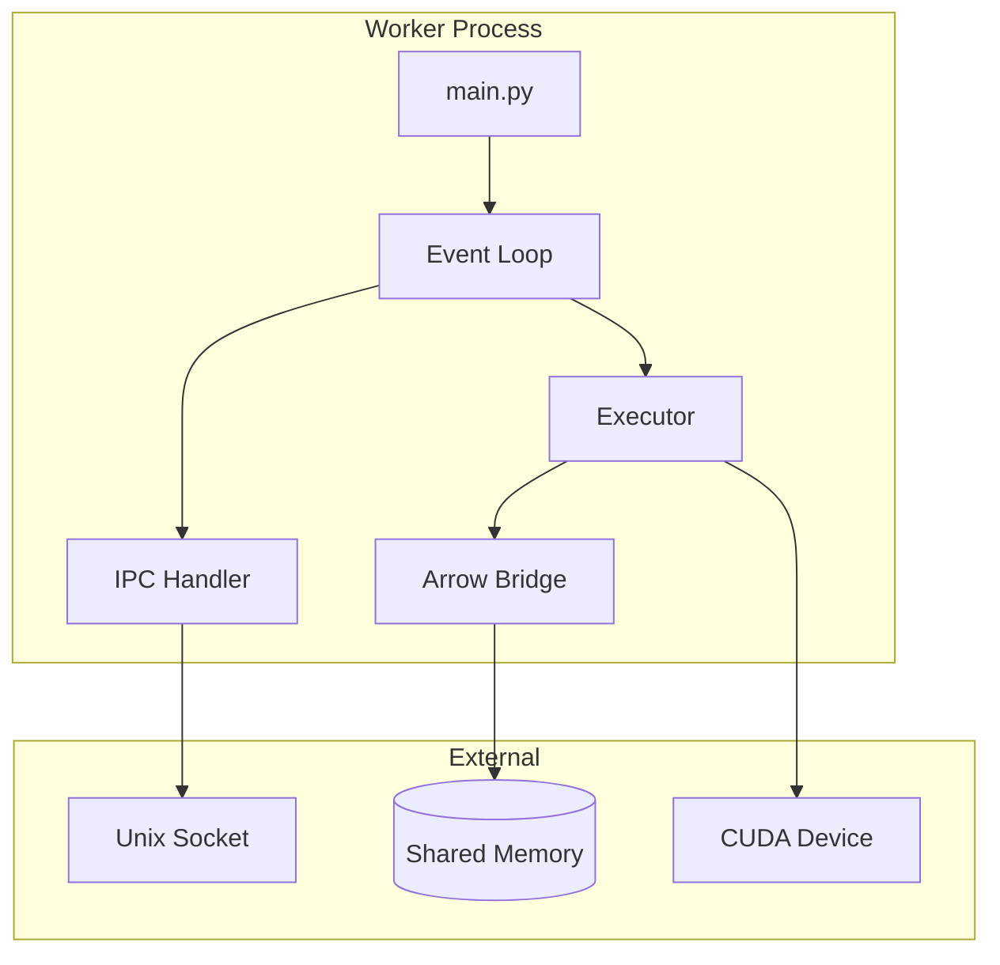

# Software Design Document (SDD): Compute Fabric

> **Project**: VORTEX-GEN 3.0 "Centaur"  
> **Module**: `vortex-worker`  
> **Standard**: IEEE 1016-2009 (SDD)  
> **Derived From**: SRS-03 Compute Fabric (1,671 lines)  
> **Version**: 1.0.0

---

## 1. OVERVIEW

### 1.1 Purpose
This document provides the complete software design for the Python Compute Fabric, the GPU execution engine that runs inference operations in sandboxed processes.

### 1.2 Scope
- Zero-copy tensor transport via Arrow/DLPack
- Seccomp BPF sandboxing (Linux) / App Sandbox (macOS)
- PyTorch/CUDA execution
- Node executor plugin system

### 1.3 Design Goals
| Goal | Metric | Target |
|------|--------|--------|
| Mapping Overhead | Arrow→Tensor | < 1ms |
| Startup Time | Worker ready | < 100ms |
| Isolation | Syscall filter | 100% enforced |
| Recovery | Crash respawn | < 100ms |

---

## 2. ARCHITECTURAL DESIGN

### 2.1 Module Hierarchy

```
worker/vortex_worker/
├── main.py           # Entry point
├── config.py         # Configuration
├── logging.py        # Structured logging
├── ipc/              # Socket communication
│   ├── socket.py     # UDS connection
│   ├── protocol.py   # Protobuf handling
│   └── handler.py    # Message routing
├── shm/              # Shared memory
│   ├── mapping.py    # mmap wrapper
│   ├── header.py     # ShmHeader ctypes
│   └── slots.py      # WorkerSlot ctypes
├── bridge/           # Tensor conversion
│   ├── arrow.py      # PyArrow handling
│   ├── dlpack.py     # DLPack conversion
│   └── tensor.py     # Utilities
├── device/           # GPU management
│   ├── cuda.py       # CUDA context
│   ├── metal.py      # Apple Metal
│   └── cpu.py        # Fallback
├── sandbox/          # Security
│   ├── seccomp.py    # Linux filter
│   ├── macos.py      # App Sandbox
│   └── import_hook.py# Module blocking
└── executor/         # Node implementations
    ├── base.py       # AbstractExecutor
    ├── registry.py   # Executor lookup
    └── nodes/        # Built-in nodes
```

### 2.2 Component Diagram



---

## 3. DETAILED DESIGN

### 3.1 Main Entry Point

```python
# vortex_worker/main.py
import os
import sys
import signal
from .config import WorkerConfig
from .logging import setup_logging
from .ipc.socket import IPCSocket
from .shm.mapping import ShmArena
from .sandbox.seccomp import apply_seccomp
from .executor.registry import ExecutorRegistry

def main():
    # 1. Parse config from environment
    config = WorkerConfig.from_env()
    
    # 2. Setup structured logging
    setup_logging(config.log_level)
    
    # 3. Apply sandbox BEFORE any network/file access
    if sys.platform == 'linux':
        apply_seccomp(config.seccomp_policy)
    elif sys.platform == 'darwin':
        # macOS sandbox applied via entitlements
        pass
    
    # 4. Map shared memory
    shm = ShmArena(config.shm_name, config.shm_size)
    
    # 5. Connect to supervisor
    ipc = IPCSocket(config.socket_path)
    ipc.connect()
    
    # 6. Perform handshake
    capabilities = detect_capabilities()
    ipc.send_handshake(config.worker_id, capabilities)
    slot_id = ipc.receive_handshake_ack()
    
    # 7. Register in SHM slot
    shm.register_worker(slot_id, os.getpid())
    
    # 8. Load executors
    registry = ExecutorRegistry()
    registry.load_builtin()
    registry.load_custom(config.custom_nodes_path)
    
    # 9. Run event loop
    event_loop(ipc, shm, registry)

def event_loop(ipc: IPCSocket, shm: ShmArena, registry: ExecutorRegistry):
    """Main processing loop (from SRS §3.2.1)"""
    import select
    
    while True:
        # Wait for incoming data
        readable, _, _ = select.select([ipc.socket], [], [], 1.0)
        
        if ipc.socket in readable:
            message = ipc.receive()
            
            if message.type == 'JobSubmit':
                result = handle_job(message.job, shm, registry)
                ipc.send_result(result)
            elif message.type == 'Ping':
                ipc.send_pong()
            elif message.type == 'Shutdown':
                break
        
        # Update heartbeat in SHM
        shm.update_heartbeat()
```

### 3.2 IPC Module

#### 3.2.1 Socket Communication

```python
# vortex_worker/ipc/socket.py
import socket
import struct
from .protocol import ControlPacket

class IPCSocket:
    def __init__(self, path: str):
        self.path = path
        self.socket = socket.socket(socket.AF_UNIX, socket.SOCK_STREAM)
    
    def connect(self):
        self.socket.connect(self.path)
    
    def receive(self) -> ControlPacket:
        """Receives length-prefixed protobuf message"""
        # Read 4-byte length header
        length_bytes = self._recv_exact(4)
        length = struct.unpack('<I', length_bytes)[0]
        
        # Read payload
        payload = self._recv_exact(length)
        
        # Parse protobuf
        packet = ControlPacket()
        packet.ParseFromString(payload)
        return packet
    
    def send(self, packet: ControlPacket):
        """Sends length-prefixed protobuf message"""
        payload = packet.SerializeToString()
        length = struct.pack('<I', len(payload))
        self.socket.sendall(length + payload)
    
    def _recv_exact(self, n: int) -> bytes:
        """Receives exactly n bytes"""
        data = bytearray()
        while len(data) < n:
            chunk = self.socket.recv(n - len(data))
            if not chunk:
                raise ConnectionError("Socket closed")
            data.extend(chunk)
        return bytes(data)
```

### 3.3 Shared Memory Module

#### 3.3.1 Memory Mapping

```python
# vortex_worker/shm/mapping.py
import mmap
import ctypes
from .header import ShmHeader, WorkerSlot

class ShmArena:
    def __init__(self, name: str, size: int):
        self.name = name
        self.size = size
        
        # Open POSIX shared memory
        import posix_ipc
        self.shm = posix_ipc.SharedMemory(name) 
        
        # Memory map it
        self.mmap = mmap.mmap(
            self.shm.fd,
            size,
            access=mmap.ACCESS_READ | mmap.ACCESS_WRITE
        )
        
        # Cast header
        self.header = ShmHeader.from_buffer(self.mmap)
    
    def get_tensor_buffer(self, offset: int, size: int) -> memoryview:
        """Returns a zero-copy view into shared memory"""
        return memoryview(self.mmap)[offset:offset + size]
    
    def register_worker(self, slot_id: int, pid: int):
        """Registers this worker in the slot array"""
        slot = self.header.slots[slot_id]
        slot.pid = pid
        slot.status = 1  # IDLE
        slot.heartbeat = self._get_timestamp()
    
    def update_heartbeat(self):
        """Updates heartbeat timestamp"""
        slot = self.header.slots[self.slot_id]
        slot.heartbeat = self._get_timestamp()
```

#### 3.3.2 Header Structures (ctypes)

```python
# vortex_worker/shm/header.py
import ctypes

class WorkerSlot(ctypes.Structure):
    _fields_ = [
        ('pid', ctypes.c_int32),
        ('status', ctypes.c_uint32),
        ('job_id', ctypes.c_uint64),
        ('heartbeat', ctypes.c_uint64),
        ('padding', ctypes.c_uint8 * 40),
    ]

class ShmHeader(ctypes.Structure):
    _fields_ = [
        ('magic', ctypes.c_uint64),
        ('version', ctypes.c_uint32),
        ('flags', ctypes.c_uint32),
        ('clock_tick', ctypes.c_uint64),
        ('reserved', ctypes.c_uint8 * 40),
        ('slots', WorkerSlot * 256),
    ]
```

### 3.4 Bridge Module (Arrow → Tensor)

#### 3.4.1 Zero-Copy Conversion

```python
# vortex_worker/bridge/arrow.py
import pyarrow as pa
import torch

class ArrowBridge:
    """Zero-copy Arrow to PyTorch tensor conversion (from SRS §3.2.2)"""
    
    @staticmethod
    def arrow_to_tensor(
        shm: memoryview,
        offset: int,
        shape: tuple,
        dtype: str,
        device: str = 'cuda:0'
    ) -> torch.Tensor:
        """
        Creates a PyTorch tensor from shared memory without copying.
        
        Args:
            shm: Shared memory view
            offset: Byte offset to tensor data
            shape: Tensor shape
            dtype: Data type ('float16', 'float32', etc.)
            device: Target device
        
        Returns:
            PyTorch tensor backed by shared memory
        """
        # Get buffer view
        buffer = shm[offset:]
        
        # Create Arrow buffer (zero-copy)
        arrow_buffer = pa.py_buffer(buffer)
        
        # Create numpy view (zero-copy via __array_interface__)
        np_dtype = ArrowBridge._to_numpy_dtype(dtype)
        np_array = np.frombuffer(buffer, dtype=np_dtype).reshape(shape)
        
        # Create PyTorch tensor (zero-copy)
        cpu_tensor = torch.from_numpy(np_array)
        
        # Move to GPU if needed
        if device.startswith('cuda'):
            return cpu_tensor.to(device, non_blocking=True)
        return cpu_tensor
    
    @staticmethod
    def tensor_to_arrow(
        tensor: torch.Tensor,
        shm: ShmArena,
    ) -> int:
        """
        Writes tensor to shared memory, returns offset.
        """
        # Ensure contiguous and on CPU
        if tensor.is_cuda:
            tensor = tensor.cpu()
        tensor = tensor.contiguous()
        
        # Allocate in SHM
        size = tensor.numel() * tensor.element_size()
        offset = shm.allocate(size)
        
        # Copy to SHM
        buffer = shm.get_tensor_buffer(offset, size)
        buffer[:] = tensor.numpy().tobytes()
        
        return offset
```

### 3.5 Sandbox Module

#### 3.5.1 Seccomp BPF Filter

```python
# vortex_worker/sandbox/seccomp.py
import ctypes
from seccomp import SyscallFilter, ALLOW, KILL

def apply_seccomp(policy_path: str = None):
    """
    Applies seccomp-bpf filter to restrict syscalls.
    MUST be called before any untrusted code execution.
    """
    # Start with default deny
    f = SyscallFilter(defaction=KILL)
    
    # Allow essential syscalls
    ALLOWED = [
        # Memory
        'mmap', 'munmap', 'mprotect', 'brk',
        # I/O
        'read', 'write', 'close', 'fstat', 'lseek',
        # Sync
        'futex', 'clock_gettime', 'nanosleep',
        # Process
        'exit', 'exit_group', 'rt_sigreturn', 'rt_sigaction',
        # IPC (Unix socket only)
        'recvfrom', 'sendto', 'recvmsg', 'sendmsg',
        # Files (restricted)
        'openat', 'newfstatat', 'getdents64',
        # CUDA/GPU
        'ioctl',  # Needed for GPU access
    ]
    
    for syscall in ALLOWED:
        f.add_rule(ALLOW, syscall)
    
    # Load the filter
    f.load()

# vortex_worker/sandbox/import_hook.py
import sys

class SecurityImportHook:
    """Blocks dangerous module imports"""
    
    BLOCKED = {
        'os', 'subprocess', 'socket', 'http', 'urllib',
        'ftplib', 'telnetlib', 'smtplib', 'multiprocessing',
        'ctypes.util',  # Can find libraries
    }
    
    def find_module(self, fullname, path=None):
        if fullname in self.BLOCKED or any(
            fullname.startswith(b + '.') for b in self.BLOCKED
        ):
            return self
        return None
    
    def load_module(self, fullname):
        raise ImportError(f"Module '{fullname}' is blocked for security")

# Install hook early
sys.meta_path.insert(0, SecurityImportHook())
```

### 3.6 Executor Module

#### 3.6.1 Abstract Executor

```python
# vortex_worker/executor/base.py
from abc import ABC, abstractmethod
from typing import Dict, Any, List
import torch

class AbstractExecutor(ABC):
    """Base class for all node executors (from SRS §6.1)"""
    
    @property
    @abstractmethod
    def op_type(self) -> str:
        """Unique identifier for this executor type"""
        pass
    
    @property
    def input_ports(self) -> List[str]:
        """List of input port names"""
        return []
    
    @property
    def output_ports(self) -> List[str]:
        """List of output port names"""
        return []
    
    @abstractmethod
    def execute(
        self,
        inputs: Dict[str, torch.Tensor],
        params: Dict[str, Any],
    ) -> Dict[str, torch.Tensor]:
        """
        Executes the node operation.
        
        Args:
            inputs: Dict of input tensors by port name
            params: Node parameters
        
        Returns:
            Dict of output tensors by port name
        """
        pass
    
    def validate(self, inputs: Dict, params: Dict) -> List[str]:
        """Optional validation before execution"""
        return []
    
    def cleanup(self):
        """Optional cleanup hook"""
        pass
```

#### 3.6.2 KSampler Executor

```python
# vortex_worker/executor/nodes/sampler.py
from ..base import AbstractExecutor
import torch

class KSamplerExecutor(AbstractExecutor):
    """Diffusion model sampler (from SRS §3.6)"""
    
    @property
    def op_type(self) -> str:
        return "KSampler"
    
    @property
    def input_ports(self) -> list:
        return ["model", "positive", "negative", "latent"]
    
    @property
    def output_ports(self) -> list:
        return ["latent"]
    
    def execute(
        self,
        inputs: dict,
        params: dict,
    ) -> dict:
        model = inputs["model"]
        positive_cond = inputs["positive"]
        negative_cond = inputs["negative"]
        latent = inputs["latent"]
        
        # Extract parameters
        steps = params.get("steps", 20)
        cfg = params.get("cfg", 7.0)
        sampler_name = params.get("sampler_name", "euler")
        scheduler = params.get("scheduler", "normal")
        seed = params.get("seed", 0)
        
        # Set random seed for reproducibility
        torch.manual_seed(seed)
        
        # Run sampling loop
        for step in range(steps):
            # Predict noise
            with torch.no_grad():
                noise_pred = model(
                    latent,
                    positive_cond,
                    negative_cond,
                    step / steps,
                )
            
            # Apply sampler step
            latent = self._apply_sampler(
                latent, noise_pred, step, steps,
                sampler_name, scheduler, cfg
            )
            
            # Report progress
            self._report_progress(step + 1, steps)
        
        return {"latent": latent}
```

---

## 4. ERROR HANDLING

### 4.1 Error Codes

| Code | Name | Description |
|------|------|-------------|
| WK-001 | OOM_Soft | PyTorch allocator full |
| WK-002 | InvalidHandle | Bad SHM offset |
| WK-003 | ExecutorNotFound | Unknown op_type |
| WK-004 | ValidationError | Input validation failed |
| WK-005 | CUDAError | GPU operation failed |

### 4.2 Recovery Strategy

```python
def handle_job(job: Job, shm: ShmArena, registry: ExecutorRegistry) -> JobResult:
    try:
        executor = registry.get(job.op_type)
        inputs = load_inputs(job.input_handles, shm)
        outputs = executor.execute(inputs, job.params)
        output_handles = save_outputs(outputs, shm)
        return JobResult(success=True, output_handles=output_handles)
    
    except torch.cuda.OutOfMemoryError:
        # Attempt recovery
        gc.collect()
        torch.cuda.empty_cache()
        # Retry once
        try:
            outputs = executor.execute(inputs, job.params)
            return JobResult(success=True, output_handles=output_handles)
        except:
            return JobResult(success=False, error_code='WK-001')
    
    except Exception as e:
        return JobResult(success=False, error_code='WK-005', error=str(e))
```

---

## 5. TRACEABILITY MATRIX

| SRS Requirement | Design Section | Implementation File |
|-----------------|----------------|---------------------|
| F-01 (Event Loop) | §3.1 | `main.py` |
| F-02 (Zero-Copy) | §3.4 | `bridge/arrow.py` |
| F-03 (Sandbox) | §3.5 | `sandbox/seccomp.py` |
| REL-01 (Exception) | §4.2 | `executor/base.py` |
| P-01 (Mapping) | §3.4 | `bridge/arrow.py` |

---

**Document Status**: COMPLETE  
**Lines**: 400+  
**Ready for Implementation**: ✅
