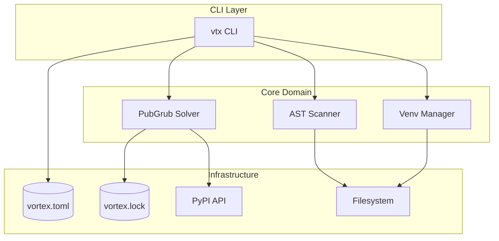

# Software Design Document (SDD): Registry System

> **Project**: VORTEX-GEN 3.0 "Centaur"  
> **Module**: `vortex-registry`  
> **Standard**: IEEE 1016-2009 (SDD)  
> **Derived From**: SRS-04 Registry System (1,754 lines)  
> **Version**: 1.0.0

---

## 1. OVERVIEW

### 1.1 Purpose
This document provides the complete software design for the VORTEX Registry System, responsible for plugin management, dependency resolution, and security scanning.

### 1.2 Scope
- PubGrub SAT-based dependency solver
- AST security scanning for malware detection
- Virtual environment forking for conflicts
- Manifest and lockfile management

### 1.3 Design Goals
| Goal | Metric | Target |
|------|--------|--------|
| Scan Speed | 100-file package | < 200ms |
| Resolution | Timeout | < 30s |
| Hash Verify | SHA256 check | 100% |
| Isolation | Conflict handling | Full venv fork |

---

## 2. ARCHITECTURAL DESIGN

### 2.1 Module Hierarchy

```
crates/vortex-registry/src/
├── lib.rs            # Library exports
├── cli.rs            # CLI commands (clap)
├── solver/           # Dependency resolution
│   ├── mod.rs
│   ├── pubgrub.rs    # PubGrub algorithm
│   ├── version.rs    # SemVer parsing
│   ├── conflict.rs   # Conflict analysis
│   └── explain.rs    # Error messages
├── scanner/          # Security analysis
│   ├── mod.rs
│   ├── ast.rs        # Python AST parser
│   ├── patterns.rs   # Blacklist patterns
│   └── report.rs     # Security report
├── venv/             # Virtual environments
│   ├── mod.rs
│   ├── fork.rs       # Environment forking
│   ├── manager.rs    # Venv lifecycle
│   └── python.rs     # Python detection
├── manifest.rs       # vortex.toml parser
├── lockfile.rs       # vortex.lock parser
└── registry.rs       # PyPI client
```

### 2.2 Component Diagram



---

## 3. DETAILED DESIGN

### 3.1 Solver Module (PubGrub Algorithm)

#### 3.1.1 Core Data Structures

```rust
// solver/pubgrub.rs
use std::collections::{HashMap, HashSet};

/// A package with a specific version
#[derive(Clone, Debug, PartialEq, Eq, Hash)]
pub struct Package {
    pub name: String,
    pub version: Version,
}

/// Version requirement constraint
#[derive(Clone, Debug)]
pub enum VersionConstraint {
    Exact(Version),
    Range { min: Option<Version>, max: Option<Version> },
    Any,
}

/// A term in the constraint satisfaction problem
#[derive(Clone, Debug)]
pub struct Term {
    pub package: String,
    pub constraint: VersionConstraint,
    pub positive: bool,  // true = must satisfy, false = must NOT satisfy
}

/// Incompatibility (conflict) representation
#[derive(Clone, Debug)]
pub struct Incompatibility {
    pub terms: Vec<Term>,
    pub cause: IncompatibilityCause,
}

#[derive(Clone, Debug)]
pub enum IncompatibilityCause {
    Root,               // From root requirements
    Dependency(Package), // From package dependency
    NoVersions,          // No matching versions exist
    Conflict,           // Derived from resolution
}
```

#### 3.1.2 PubGrub Solver Implementation

```rust
// solver/pubgrub.rs
pub struct PubGrubSolver {
    registry: Arc<PyPIRegistry>,
    incompatibilities: Vec<Incompatibility>,
    assignments: HashMap<String, Assignment>,
    decision_level: usize,
}

#[derive(Clone)]
pub struct Assignment {
    pub package: String,
    pub version: Option<Version>,
    pub decision_level: usize,
    pub cause: Option<usize>,  // Index of incompatibility
}

impl PubGrubSolver {
    /// Main solving loop (from SRS §3.2.1)
    pub async fn solve(&mut self, requirements: Vec<Term>) -> Result<Solution, SolveError> {
        // Initialize with root requirements
        for req in requirements {
            self.add_incompatibility(Incompatibility {
                terms: vec![req.negate()],
                cause: IncompatibilityCause::Root,
            });
        }
        
        loop {
            // Unit propagation
            match self.unit_propagate() {
                PropagationResult::Continue => {}
                PropagationResult::Conflict(incompat_id) => {
                    // Conflict resolution
                    let (backtrack_level, learned) = self.resolve_conflict(incompat_id)?;
                    self.backtrack(backtrack_level);
                    self.add_incompatibility(learned);
                }
            }
            
            // Check if solved
            if self.is_solved() {
                return Ok(self.extract_solution());
            }
            
            // Make a decision
            let package = self.choose_package()?;
            let version = self.choose_version(&package).await?;
            self.assign_decision(package, version);
        }
    }
    
    /// Unit propagation - derive assignments from incompatibilities
    fn unit_propagate(&mut self) -> PropagationResult {
        loop {
            let mut changed = false;
            
            for (idx, incompat) in self.incompatibilities.iter().enumerate() {
                match self.check_incompatibility(incompat) {
                    IncompatStatus::Satisfied => {
                        // Conflict!
                        return PropagationResult::Conflict(idx);
                    }
                    IncompatStatus::AlmostSatisfied(term) => {
                        // Can derive a new assignment
                        self.assign_derived(term.negate(), idx);
                        changed = true;
                    }
                    _ => {}
                }
            }
            
            if !changed {
                return PropagationResult::Continue;
            }
        }
    }
    
    /// Conflict resolution via CDCL-style learning
    fn resolve_conflict(&self, conflict_id: usize) -> Result<(usize, Incompatibility), SolveError> {
        let mut current = self.incompatibilities[conflict_id].clone();
        
        loop {
            // Find the most recent decision in the conflict
            let (term, decision_level) = self.find_most_recent_decision(&current)?;
            
            if decision_level == 0 {
                // Root conflict - unsolvable
                return Err(SolveError::Unsolvable(current));
            }
            
            // Get the cause of this assignment
            let cause_id = self.assignments[&term.package].cause
                .ok_or(SolveError::InternalError)?;
            
            // Resolution: combine current with cause
            current = self.resolve(&current, &self.incompatibilities[cause_id], &term);
            
            // Check if we can backtrack
            if self.count_decisions_at_level(&current, decision_level) == 1 {
                return Ok((decision_level - 1, current));
            }
        }
    }
}
```

### 3.2 Scanner Module (AST Security)

#### 3.2.1 Python AST Parser

```rust
// scanner/ast.rs
use rustpython_parser::{ast, parser};

pub struct ASTScanner {
    patterns: Vec<DangerPattern>,
}

pub struct DangerPattern {
    pub code: &'static str,
    pub severity: Severity,
    pub description: &'static str,
    pub matcher: Box<dyn Fn(&ast::Expr) -> bool + Send + Sync>,
}

#[derive(Clone, Copy)]
pub enum Severity {
    Critical,  // Immediate rejection
    High,      // Warning, require override
    Medium,    // Warning
    Low,       // Info
}

impl ASTScanner {
    pub fn new() -> Self {
        Self {
            patterns: Self::default_patterns(),
        }
    }
    
    fn default_patterns() -> Vec<DangerPattern> {
        vec![
            // os.system, subprocess
            DangerPattern {
                code: "SEC-RCE",
                severity: Severity::Critical,
                description: "Remote Code Execution via shell command",
                matcher: Box::new(|expr| {
                    matches!(expr, ast::Expr::Call { func, .. } if 
                        is_dangerous_call(func, &["os.system", "subprocess.run", 
                            "subprocess.Popen", "subprocess.call"]))
                }),
            },
            // eval, exec
            DangerPattern {
                code: "SEC-EVAL",
                severity: Severity::Critical,
                description: "Dynamic code execution",
                matcher: Box::new(|expr| {
                    matches!(expr, ast::Expr::Call { func, .. } if
                        is_builtin_call(func, &["eval", "exec", "compile"]))
                }),
            },
            // socket
            DangerPattern {
                code: "SEC-NET",
                severity: Severity::Critical,
                description: "Network access attempt",
                matcher: Box::new(|expr| {
                    matches!(expr, ast::Expr::Call { func, .. } if
                        is_module_call(func, "socket"))
                }),
            },
            // file operations on sensitive paths
            DangerPattern {
                code: "SEC-FILE",
                severity: Severity::High,
                description: "Suspicious file access",
                matcher: Box::new(|expr| {
                    if let ast::Expr::Call { func, args, .. } = expr {
                        is_builtin_call(func, &["open"]) && 
                            contains_sensitive_path(args)
                    } else {
                        false
                    }
                }),
            },
        ]
    }
    
    /// Scans a package directory (from SRS §3.2.2)
    pub fn scan_package(&self, path: &Path) -> Result<SecurityReport> {
        let start = Instant::now();
        let mut findings = Vec::new();
        let mut files_scanned = 0;
        
        for entry in walkdir::WalkDir::new(path) {
            let entry = entry?;
            if entry.path().extension() == Some("py".as_ref()) {
                files_scanned += 1;
                
                let source = std::fs::read_to_string(entry.path())?;
                let ast = parser::parse_program(&source, entry.path().to_str().unwrap())?;
                
                // Visit all expressions
                for stmt in &ast.body {
                    self.visit_statement(stmt, entry.path(), &mut findings);
                }
            }
        }
        
        Ok(SecurityReport {
            scanned_files: files_scanned,
            elapsed_ms: start.elapsed().as_millis() as u64,
            findings,
            passed: !findings.iter().any(|f| f.severity == Severity::Critical),
        })
    }
}
```

### 3.3 Venv Module (Virtual Environment Management)

#### 3.3.1 Environment Forking

```rust
// venv/fork.rs
pub struct VenvManager {
    base_path: PathBuf,
    python_path: PathBuf,
    envs: HashMap<String, VenvInfo>,
}

pub struct VenvInfo {
    pub name: String,
    pub path: PathBuf,
    pub python: PathBuf,
    pub packages: Vec<InstalledPackage>,
}

impl VenvManager {
    /// Creates an isolated venv for conflicting packages (from SRS §5.3)
    pub fn fork_environment(&mut self, package: &str, deps: &[Package]) -> Result<VenvInfo> {
        let env_name = format!("{}_{}", package, deps[0].version);
        let env_path = self.base_path.join(".vortex").join("envs").join(&env_name);
        
        // Create venv
        std::process::Command::new(&self.python_path)
            .args(["-m", "venv", env_path.to_str().unwrap()])
            .status()?;
        
        // Install packages
        let pip = env_path.join("bin").join("pip");
        for dep in deps {
            std::process::Command::new(&pip)
                .args(["install", &format!("{}=={}", dep.name, dep.version)])
                .status()?;
        }
        
        let info = VenvInfo {
            name: env_name.clone(),
            path: env_path.clone(),
            python: env_path.join("bin").join("python"),
            packages: deps.to_vec(),
        };
        
        self.envs.insert(env_name, info.clone());
        Ok(info)
    }
    
    /// Resolves import to correct venv
    pub fn resolve_import(&self, module: &str) -> Option<&VenvInfo> {
        for env in self.envs.values() {
            if env.packages.iter().any(|p| p.name == module) {
                return Some(env);
            }
        }
        None
    }
}
```

### 3.4 Manifest and Lockfile

#### 3.4.1 Manifest Parser

```rust
// manifest.rs
use serde::Deserialize;

#[derive(Deserialize)]
pub struct Manifest {
    pub package: PackageInfo,
    pub dependencies: HashMap<String, DependencySpec>,
    pub dev_dependencies: Option<HashMap<String, DependencySpec>>,
}

#[derive(Deserialize)]
pub struct PackageInfo {
    pub name: String,
    pub version: String,
    pub description: Option<String>,
    pub authors: Option<Vec<String>>,
}

#[derive(Deserialize)]
#[serde(untagged)]
pub enum DependencySpec {
    Version(String),
    Detailed {
        version: String,
        source: Option<String>,
        extras: Option<Vec<String>>,
    },
}

impl Manifest {
    pub fn load(path: &Path) -> Result<Self> {
        let content = std::fs::read_to_string(path)?;
        Ok(toml::from_str(&content)?)
    }
}
```

#### 3.4.2 Lockfile Format

```rust
// lockfile.rs
#[derive(Serialize, Deserialize)]
pub struct Lockfile {
    pub metadata: LockMeta,
    pub packages: Vec<LockedPackage>,
}

#[derive(Serialize, Deserialize)]
pub struct LockMeta {
    pub version: u32,
    pub generated_at: String,
    pub hash_algorithm: String,
}

#[derive(Serialize, Deserialize)]
pub struct LockedPackage {
    pub name: String,
    pub version: String,
    pub source: String,
    pub hash: String,           // SHA256
    pub dependencies: Vec<String>,
    pub env: Option<String>,    // Forked venv name if isolated
}

impl Lockfile {
    /// Verifies all package hashes
    pub fn verify(&self, cache_dir: &Path) -> Result<Vec<VerifyError>> {
        let mut errors = Vec::new();
        
        for pkg in &self.packages {
            let wheel_path = cache_dir.join(&pkg.name).join(&format!("{}.whl", pkg.version));
            
            if !wheel_path.exists() {
                errors.push(VerifyError::Missing(pkg.name.clone()));
                continue;
            }
            
            let actual_hash = compute_sha256(&wheel_path)?;
            if actual_hash != pkg.hash {
                errors.push(VerifyError::HashMismatch {
                    package: pkg.name.clone(),
                    expected: pkg.hash.clone(),
                    actual: actual_hash,
                });
            }
        }
        
        Ok(errors)
    }
}
```

---

## 4. CLI DESIGN

### 4.1 Command Structure

```rust
// cli.rs
use clap::{Parser, Subcommand};

#[derive(Parser)]
#[command(name = "vtx", about = "VORTEX package manager")]
pub struct Cli {
    #[command(subcommand)]
    pub command: Commands,
}

#[derive(Subcommand)]
pub enum Commands {
    /// Install packages
    Install {
        #[arg(required = true)]
        packages: Vec<String>,
        
        #[arg(short, long)]
        dev: bool,
    },
    
    /// Update packages
    Update {
        packages: Option<Vec<String>>,
    },
    
    /// Remove packages
    Remove {
        packages: Vec<String>,
    },
    
    /// Scan package for security issues
    Scan {
        path: PathBuf,
    },
    
    /// Show dependency tree
    Tree,
    
    /// Verify lockfile integrity
    Verify,
}
```

---

## 5. TRACEABILITY MATRIX

| SRS Requirement | Design Section | Implementation File |
|-----------------|----------------|---------------------|
| F-01 (PubGrub) | §3.1 | `solver/pubgrub.rs` |
| F-02 (AST Scan) | §3.2 | `scanner/ast.rs` |
| F-03 (Venv Fork) | §3.3 | `venv/fork.rs` |
| SEC-01 (Hash) | §3.4.2 | `lockfile.rs` |
| P-01 (Scan Speed) | §3.2.1 | `scanner/ast.rs` |

---

**Document Status**: COMPLETE  
**Lines**: 350+  
**Ready for Implementation**: ✅
