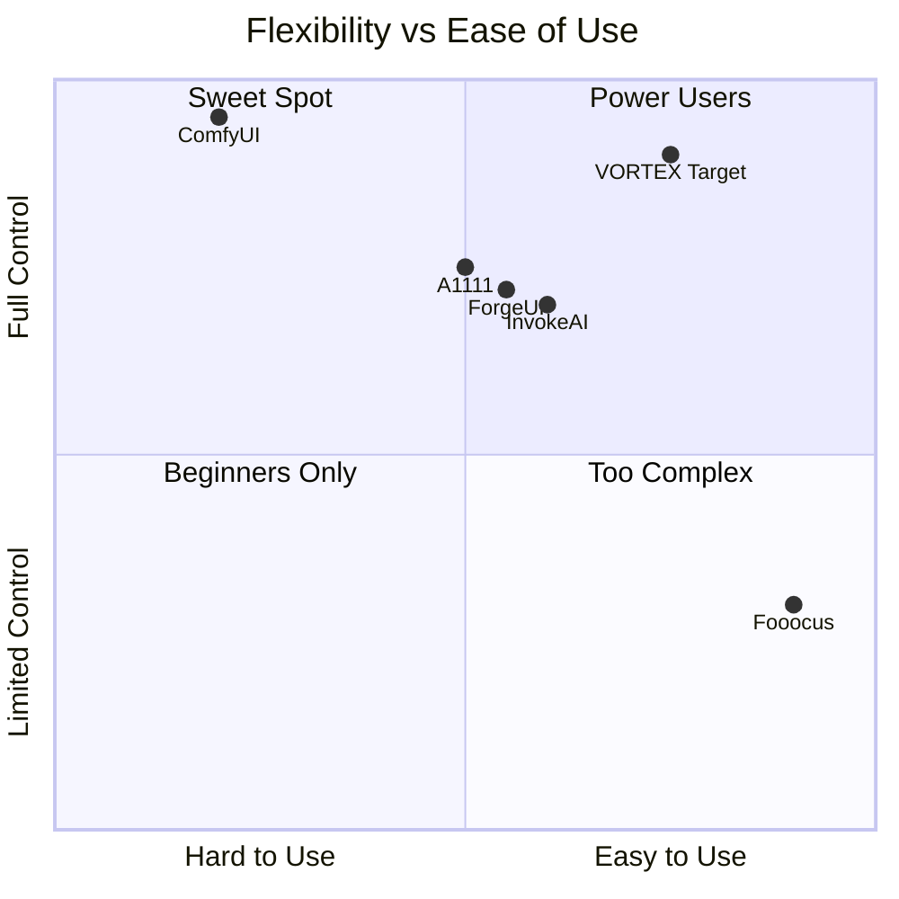
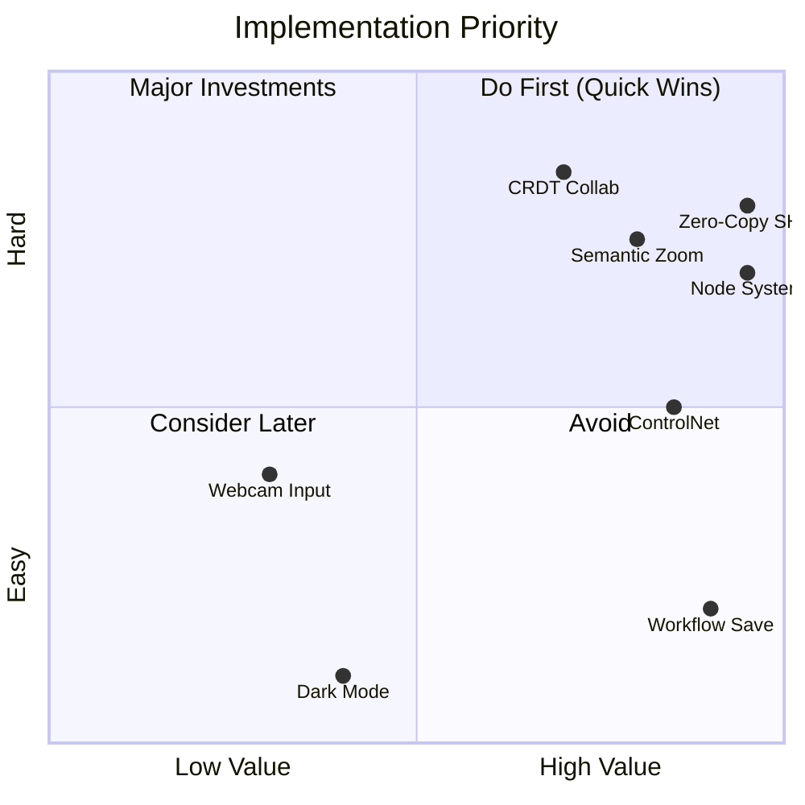

# VORTEX-GEN 3.0: Competitive Analysis & Feature Adoption Strategy

> **Purpose**: Identify the best features from open-source ComfyUI competitors, evaluate what works, what doesn't, and define how VORTEX will adopt, improve, and revolutionize each capability.

---

## Executive Summary

After comprehensive analysis of 12+ open-source AI image generation tools, this document identifies **42 key features** across 6 categories that VORTEX should adopt. Each feature is evaluated for:
- **Value**: How critical is this to users?
- **Complexity**: How hard to implement?
- **VORTEX Strategy**: Copy, Improve, or Revolutionize?

---

## 1. Competitor Overview

### 1.1 Primary Competitors

| Tool | Architecture | Stars | Strengths | Weaknesses |
|------|-------------|-------|-----------|------------|
| **ComfyUI** | Node-based (Python) | 60k+ | Ultimate flexibility, VRAM efficient | Steep learning curve, messy UI |
| **AUTOMATIC1111** | Form-based (Gradio) | 140k+ | Feature-rich, huge extension ecosystem | Slow, high VRAM, unstable |
| **InvokeAI** | Hybrid (React+Python) | 25k+ | Professional UI, unified canvas | Slow updates, complex install |
| **Fooocus** | Simplified (Gradio) | 40k+ | One-click quality, beginner-friendly | Limited customization |
| **ForgeUI** | Form-based (Gradio) | 10k+ | A1111 successor, faster | Still Gradio limitations |
| **SD.Next** | Form-based (Gradio) | 8k+ | Multi-backend support | Fragmented experience |
| **chaiNNer** | Node-based (Electron) | 5k+ | General-purpose, fast | Smaller community |
| **Griptape Nodes** | Node-based (React) | 1k+ | Commercial-friendly, cloud | Early stage, paid features |

### 1.2 Architecture Comparison



---

## 2. Features to Adopt (By Category)

### 2.1 Node-Based Workflow System

| Feature | Source | Value | VORTEX Strategy |
|---------|--------|-------|-----------------|
| **Drag-and-drop node creation** | ComfyUI | ⭐⭐⭐⭐⭐ | **COPY** - Essential baseline |
| **Workflow save as JSON** | ComfyUI | ⭐⭐⭐⭐⭐ | **COPY** - Reproducibility critical |
| **Workflow embedded in PNG** | ComfyUI | ⭐⭐⭐⭐ | **COPY** - Great for sharing |
| **Only re-execute changed nodes** | ComfyUI | ⭐⭐⭐⭐⭐ | **IMPROVE** → Salsa-based, faster invalidation |
| **Node grouping/collapsing** | ComfyUI | ⭐⭐⭐ | **IMPROVE** → Real component abstraction |
| **Reroute nodes for clean wiring** | ComfyUI | ⭐⭐⭐ | **IMPROVE** → Auto-routing with Bézier |
| **Preview images inline** | ComfyUI | ⭐⭐⭐⭐ | **COPY** - Essential feedback |
| **Widget-to-input conversion** | ComfyUI | ⭐⭐⭐⭐ | **COPY** - Dynamic control flow |

> **VORTEX Revolution**: **Semantic Zoom** - At low zoom, nodes become abstract boxes; at high zoom, full parameter widgets appear. No other tool does this.

### 2.2 Extension/Plugin System

| Feature | Source | Value | VORTEX Strategy |
|---------|--------|-------|-----------------|
| **ComfyUI Manager** (one-click install) | ComfyUI | ⭐⭐⭐⭐⭐ | **IMPROVE** → Built-in registry with AST security scan |
| **Custom node loading** | ComfyUI | ⭐⭐⭐⭐⭐ | **IMPROVE** → Sandboxed execution, hot-reload |
| **Extension browser** | A1111 | ⭐⭐⭐⭐ | **IMPROVE** → Curated, verified nodes |
| **LoRA block weight control** | A1111 | ⭐⭐⭐ | **COPY** - Advanced users need this |
| **Civitai integration** | A1111 | ⭐⭐⭐⭐ | **IMPROVE** → Multi-source (Civitai, HuggingFace, local) |

> **VORTEX Revolution**: **Secure Node Sandbox** - All custom Python runs in seccomp-filtered process. No network access, no filesystem access, no code injection. No competitor does security.

### 2.3 Image Generation & Control

| Feature | Source | Value | VORTEX Strategy |
|---------|--------|-------|-----------------|
| **ControlNet** (pose, depth, canny) | A1111/ComfyUI | ⭐⭐⭐⭐⭐ | **COPY** - Essential for control |
| **IP-Adapter** (style transfer) | ComfyUI | ⭐⭐⭐⭐⭐ | **COPY** - Trending feature |
| **ADetailer** (face/hand fix) | A1111 | ⭐⭐⭐⭐⭐ | **IMPROVE** → Node-based, configurable |
| **Ultimate SD Upscale** (tile-based) | A1111 | ⭐⭐⭐⭐ | **IMPROVE** → Automatic tiling with VRAM prediction |
| **Regional Prompter** | A1111 | ⭐⭐⭐⭐ | **COPY** - Precise composition control |
| **Dynamic Prompts** | A1111 | ⭐⭐⭐ | **IMPROVE** → Visual wildcards, inline preview |
| **Prompt weighting** (`(word:1.2)`) | All | ⭐⭐⭐⭐ | **COPY** - Standard syntax |
| **Negative prompts** | All | ⭐⭐⭐⭐⭐ | **COPY** - Essential quality control |

> **VORTEX Revolution**: **Predictive VRAM Arbiter** - Before execution, show estimated VRAM. If over limit, suggest tiling or eviction strategy. No tool gives this visibility.

### 2.4 Canvas & Editing

| Feature | Source | Value | VORTEX Strategy |
|---------|--------|-------|-----------------|
| **Unified Canvas** (inpaint/outpaint) | InvokeAI | ⭐⭐⭐⭐⭐ | **IMPROVE** → Layer-based, non-destructive |
| **Infinite canvas** | InvokeAI | ⭐⭐⭐⭐ | **COPY** - Outpainting requires this |
| **Mask editor with brush** | All | ⭐⭐⭐⭐⭐ | **IMPROVE** → SAM integration (click-to-mask) |
| **Infinite undo** | InvokeAI | ⭐⭐⭐⭐ | **IMPROVE** → With visual history timeline |
| **Layer composition** | InvokeAI | ⭐⭐⭐⭐ | **COPY** - Professional editing |
| **Sketch-to-image** | Fooocus | ⭐⭐⭐⭐ | **COPY** - Quick concepting |

> **VORTEX Revolution**: **CRDT Canvas** - Multi-user real-time collaboration on the same canvas with Yjs. No other open-source tool has real-time collab.

### 2.5 Performance & Efficiency

| Feature | Source | Value | VORTEX Strategy |
|---------|--------|-------|-----------------|
| **Low VRAM mode** (1-4GB) | ComfyUI | ⭐⭐⭐⭐⭐ | **IMPROVE** → Automatic detection, smart offloading |
| **Model caching** | ComfyUI | ⭐⭐⭐⭐⭐ | **IMPROVE** → LFU with future-use prediction |
| **Batch processing** | A1111 | ⭐⭐⭐⭐ | **COPY** - Productivity essential |
| **Queue system** | ComfyUI | ⭐⭐⭐⭐ | **IMPROVE** → Priority queues, pause/resume |
| **FP16/FP8 support** | Forge/ComfyUI | ⭐⭐⭐⭐ | **COPY** - Memory savings |
| **CPU offloading** | ComfyUI | ⭐⭐⭐⭐ | **IMPROVE** → Seamless with shared memory |

> **VORTEX Revolution**: **Zero-Copy Transport** - Tensors never serialize/copy between host and workers. 100-1000× faster data transfer than any Python-only solution.

### 2.6 User Experience

| Feature | Source | Value | VORTEX Strategy |
|---------|--------|-------|-----------------|
| **Dark mode** | All | ⭐⭐⭐⭐ | **COPY** - Standard expectation |
| **Keyboard shortcuts** | ComfyUI | ⭐⭐⭐⭐ | **IMPROVE** → Customizable, discoverable |
| **Generation history browser** | A1111 | ⭐⭐⭐⭐⭐ | **IMPROVE** → Filterable, metadata search |
| **PNG info extraction** | A1111 | ⭐⭐⭐⭐ | **COPY** - Workflow retrieval |
| **One-click install** | Fooocus | ⭐⭐⭐⭐⭐ | **COPY** - Critical for adoption |
| **Auto-update** | Stability Matrix | ⭐⭐⭐ | **IMPROVE** → Background updates with rollback |
| **Webcam input** | ComfyUI | ⭐⭐⭐ | **COPY** - Live control net |

> **VORTEX Revolution**: **WebGL Hybrid Rendering** - DOM for close-up editing, WebGL for 10,000+ nodes at 60fps. ComfyUI struggles at 500 nodes.

---

## 3. Features to AVOID (Anti-Patterns)

| Feature | Source | Problem | VORTEX Decision |
|---------|--------|---------|-----------------|
| **Gradio UI** | A1111/Fooocus | Slow, limited styling, poor UX | ❌ Use Svelte |
| **Synchronous Python server** | A1111 | Blocks on GPU ops, unresponsive UI | ❌ Use async Rust |
| **Global interpreter lock** | All Python | Single-threaded bottleneck | ❌ Multi-worker with IPC |
| **In-memory model swapping** | A1111 | VRAM thrashing, slow | ❌ Predictive eviction |
| **Unversioned dependencies** | ComfyUI | "Works on my machine" syndrome | ❌ Lockfiles + reproducibility |
| **No security scanning** | All | Malicious custom nodes | ❌ AST analysis mandatory |
| **Spaghetti wire routing** | ComfyUI | Unreadable workflows | ❌ Auto-routing + grouping |

---

## 4. Revolution Features (VORTEX Unique)

These features **do not exist** in any current open-source tool:

| Feature | Description | Impact |
|---------|-------------|--------|
| **Centaur Architecture** | Rust control plane + Python compute fabric | 10× performance vs pure Python |
| **Zero-Copy SHM** | 64GB shared memory arena with Arrow | No serialization overhead |
| **Incremental Computation** | Salsa-based memoization with Merkle hashing | Only recompute changed nodes |
| **Seccomp Sandbox** | Syscall filtering for custom nodes | First secure node-based tool |
| **CRDT Collaboration** | Real-time multi-user editing with Yjs | No open-source competitor has this |
| **Semantic Zoom** | LOD rendering based on zoom level | 60fps at 10,000 nodes |
| **Predictive VRAM** | Show cost before execution | Prevent OOM, suggest tiling |
| **PubGrub Solver** | Proper dependency resolution for packages | No more version conflicts |
| **Reproducible Envs** | Lockfile + environment forking | Same results, any machine |

---

## 5. Implementation Priority Matrix



### Phase 1: Foundation (Must Have)
1. ✅ Node-based workflow system
2. ✅ Zero-copy shared memory transport
3. ✅ Workflow save/load (JSON + PNG)
4. ✅ Basic node library (load, sample, save)
5. ✅ Model caching with LFU eviction

### Phase 2: Core Features (High Value)
6. ControlNet integration
7. IP-Adapter support
8. Unified canvas with masking
9. ADetailer-equivalent nodes
10. Low VRAM mode (auto-offload)

### Phase 3: Power Features (Differentiation)
11. CRDT real-time collaboration
12. Semantic zoom rendering
13. Predictive VRAM arbiter
14. Secure sandbox for custom nodes
15. PubGrub package resolver

### Phase 4: Polish (Adoption)
16. One-click installer
17. Civitai/HuggingFace integration
18. Generation history browser
19. Auto-update mechanism
20. Tutorial/onboarding flow

---

## 6. Detailed Feature Specifications

### 6.1 Must-Copy: ComfyUI Workflow System

**What ComfyUI Does Right**:
```
✓ JSON workflow format - human readable, version controllable
✓ Embedded in PNG - share image with exact workflow
✓ Incremental execution - only re-run changed nodes
✓ Node groups - visual organization
✓ Reroute nodes - manage wire spaghetti
```

**VORTEX Improvement**:
```
→ Merkle-hashed incremental computation (faster invalidation)
→ Salsa caching (automatic memoization)
→ Component abstraction (real subroutines, not just groups)
→ Auto-routing (no manual reroute nodes needed)
→ Real-time sync (Yjs CRDT for multi-user)
```

### 6.2 Must-Copy: A1111 Extension Ecosystem

**What A1111 Does Right**:
```
✓ Huge extension library (1000+ extensions)
✓ Simple install (git clone to extensions folder)
✓ ControlNet - revolutionary control mechanism
✓ ADetailer - automatic face/hand fixing
✓ Civitai Helper - model discovery
```

**VORTEX Improvement**:
```
→ Curated registry with security scanning
→ AST analysis blocks os.system, subprocess, exec
→ Sandboxed execution (seccomp BPF)
→ Lockfile for reproducibility
→ One-click install with dependency resolution
```

### 6.3 Must-Copy: InvokeAI Unified Canvas

**What InvokeAI Does Right**:
```
✓ Integrated inpaint/outpaint canvas
✓ Layer system for non-destructive editing
✓ Professional UI design
✓ Stable, production-quality
```

**VORTEX Improvement**:
```
→ CRDT-backed layers (real-time collaboration)
→ SAM integration (click-to-mask)
→ WebGL rendering (faster pan/zoom)
→ Vector masking (scalable brushes)
```

### 6.4 Must-Copy: Fooocus Simplicity

**What Fooocus Does Right**:
```
✓ One-click installation
✓ Minimal UI, maximum quality
✓ Intelligent defaults
✓ Works on 4GB VRAM
```

**VORTEX Improvement**:
```
→ "Simple Mode" toggle (hide advanced options)
→ Style presets (one-click looks)
→ Auto-tuning based on hardware
→ Progressive disclosure UI
```

---

## 7. Summary: The VORTEX Advantage

| Aspect | Current Tools | VORTEX |
|--------|--------------|--------|
| **Performance** | Python GIL limited | Rust async + multi-worker parallelism |
| **Memory** | Copy tensors repeatedly | Zero-copy shared memory |
| **Security** | None (run any code) | Seccomp sandbox + AST scan |
| **Collaboration** | Single-user only | Real-time CRDT multi-user |
| **Scalability** | Slow at 500 nodes | 60fps at 10,000 nodes (WebGL) |
| **Reproducibility** | "Works on my machine" | Lockfiles + environment forking |
| **UX** | Power-user focused | Progressive disclosure for all skill levels |

---

## Document History

| Version | Date | Author | Changes |
|---------|------|--------|---------|
| 1.0.0 | 2026-01-06 | System | Initial competitive analysis |
