# Software Requirements Specification (SRS): Master System Architecture
**Project**: VORTEX-GEN 3.0 "Centaur"
**Module**: Architecture & Core Constraints
**Version**: 9.0.0 (ISO Standard)
**Date**: 2026-01-06
**Standard**: ISO/IEC 29148:2018

---

## 1. Introduction

### 1.1 Purpose
The purpose of this Software Requirements Specification (SRS) is to define the rigorous architectural standards, global constraints, and interface boundaries for the VORTEX-GEN 3.0 system. This document serves as the primary artifact for System Architects and Security Auditors, providing a comprehensive description of the "Centaur" pattern, the Zero-Copy memory model, and the process isolation strategy.

### 1.2 Scope
VORTEX-GEN 3.0 is a Local-First, Hybrid AI Execution Environment designed to orchestrate complex generative workflows across heterogeneous hardware.
**The software facilitates**:
*   **Graph Orchestration**: Topological compilation and scheduling of DAGs.
*   **Compute Virtualization**: Abstracting Python execution into isolated workers.
*   **Memory Management**: Zero-Copy data transport via Shared Memory (64GB).
*   **Reactive UI**: High-frequency (60fps) visualization of execution states.

### 1.3 Definitions, Acronyms, and Abbreviations
| Term | Definition |
| :--- | :--- |
| **SRS** | Software Requirements Specification |
| **Centaur** | The architectural pattern utilizing Rust for control and Python for compute. |
| **IPC** | Inter-Process Communication (specifically Unix Domain Sockets). |
| **SHM** | POSIX Shared Memory (`shm_open`). |
| **Arrow** | Apache Arrow Columnar Format. |
| **Salsa** | Rust framework for incremental on-demand computation. |
| **Seccomp** | Linux Secure Computing Mode (BPF-based syscall filtering). |

---

## 2. Overall Description

### 2.1 Product Perspective
VORTEX-GEN 3.0 operates as a standalone desktop application with a Client-Server architecture. It runs efficiently on consumer hardware (Apple Silicon, NVIDIA GPUs) by leveraging OS-level primitives for memory sharing. It integrates with the host Operating System for filesystem access (`/dev/shm`, `mmap`) and GPU drivers (`CUDA`, `Metal`).

### 2.2 Product Functions
The Major Functions of the System are:
*   **F-01: Graph Compilation**: Converting user-defined visual graphs into linear execution plans.
*   **F-02: Zero-Copy Transport**: Passing pointer references between processes without serialization.
*   **F-03: Process Isolation**: Sandboxing Python execution to prevent system compromise.
*   **F-04: Reactive State Sync**: Broadcasting differential updates to the UI via WebSocket.

### 2.3 User Classes and Characteristics
*   **AI Engineer**: Requires precise control over VRAM allocation and execution order.
*   **Plugin Developer**: Requires clear API contacts for custom nodes in Python.
*   **End User**: Requires a responsive UI that abstracts the underlying complexity.

### 2.4 Operating Environment
*   **Host OS**: Linux (Kernel 5.15+), macOS (13.0+)
*   **Runtime (Host)**: Binary compiled from Rust (1.75+)
*   **Runtime (Worker)**: Python 3.10+ with `ctypes` and `torch`
*   **Hardware**: Minimum 16GB RAM, standard GPU (NVIDIA/Apple).

---

## 3. Specific Requirements

### 3.1 External Interface Requirements
#### 3.1.1 User Interfaces
*   **UI-01**: The System shall serve a Single Page Application (SPA) over HTTP/1.1.
*   **UI-02**: The UI shall render the Node Graph using WebGL for performance > 60fps.
*   **UI-03**: The UI shall communicate with the Host via WebSocket (RFC 6455).
*   **UI-04**: The System shall listen on port **11188** by default, configurable via `VORTEX_PORT` environment variable. All VORTEX ports use the 11000-11999 range to avoid conflicts.

#### 3.1.2 Hardware Interfaces
*   **HW-01**: The System shall interface with the GPU via PyTorch/CUDA libraries.
*   **HW-02**: The System shall strictly respect VRAM limits defined in user configuration.

#### 3.1.3 Software Interfaces
*   **SI-01 (Shared Memory)**: The System shall align memory segments to Page Size (4KB/16KB) boundaries.
*   **SI-02 (IPC)**: The System shall listen on Unix Domain Socket `/tmp/vtx.sock` for Worker connections.

#### 3.1.4 Port Authority (Network Interfaces)
All VORTEX services MUST use ports in the **11000-11999 range** to avoid conflicts with common development tools and services.

| Service | Port | Environment Variable | Description |
| :--- | :---: | :--- | :--- |
| **Core Engine HTTP** | `11188` | `VORTEX_PORT` | Main API and static file server |
| **Core Engine WebSocket** | `11189` | `VORTEX_WS_PORT` | Real-time state synchronization |
| **Frontend Dev Server** | `11173` | `VORTEX_UI_PORT` | Svelte dev server (development only) |
| **Worker Health** | `11100-11149` | `VORTEX_WORKER_HEALTH` | Per-worker health endpoints |
| **Metrics (Prometheus)** | `11191` | `VORTEX_METRICS_PORT` | Prometheus metrics endpoint |
| **Debug Inspector** | `11192` | `VORTEX_DEBUG_PORT` | Debug/inspection tools |

**Reserved Ranges**:
| Range | Purpose |
| :--- | :--- |
| `11100-11149` | Worker pool (up to 50 workers) |
| `11150-11189` | Core system services |
| `11190-11199` | Monitoring and debugging |

**Rationale**: This range avoids conflicts with:
- `80`, `443` (HTTP/HTTPS production)
- `3000-3999` (React, Node.js dev servers)
- `5000-5999` (Flask, common development)
- `8000-8999` (Django, common servers)
- `9000-9999` (PHP-FPM, monitoring tools)

### 3.2 Functional Requirements

#### 3.2.1 [F-01] Zero-Copy Memory Management
*   **Description**: Implementation of the Arrow-based shared memory plane.
*   **Inputs**: Tensor Dimensions (Shape), Data Type (DType).
*   **Processing**:
    1.  Host calls `shm_open` and `ftruncate` to reserve 64GB.
    2.  Host writes `ArrowArray` C-Struct to offset `0x00010000`.
    3.  Worker maps the same file descriptor.
    4.  Worker constructs `pyarrow.RecordBatch` from the offset.
*   **Outputs**: A valid `torch.Tensor` in the Worker process pointing to Host memory.

#### 3.2.2 [F-02] Worker Supervision & Recovery
*   **Description**: Management of the Python child interaction lifecycle.
*   **Inputs**: `SIGCHLD` signal from OS.
*   **Processing**:
    1.  Supervisor thread calls `waitpid()` to retrieve exit status.
    2.  If status indicates Crash (Segfault), Supervisor identifies the active Node.
    3.  Supervisor marks Node as `Error`.
    4.  Supervisor calls `fork()` to respawn the worker.
*   **Outputs**: System stability maintained despite child process failure.

### 3.3 Non-Functional Requirements

#### 3.3.1 Performance
*   **PERF-01**: IPC Round-trip latency shall be less than 50 microseconds.
*   **PERF-02**: UI Frame time shall be less than 16.6ms (60fps) for graphs up to 2000 nodes.

#### 3.3.2 Security
*   **SEC-01**: The Worker process shall be sandboxed using `seccomp-bpf` filters (Linux).
*   **SEC-02**: The Filter shall strictly DENY `socket(AF_INET)` calls to prevent unauthorized network access.
*   **SEC-03**: The Filter shall strictly DENY `open()` calls to paths not in the allowlist.
*   **SEC-04**: On macOS, the Worker process shall use **App Sandbox** entitlements with equivalent restrictions (no network, restricted filesystem).

---

## 4. Verification & Validation
*   **VV-01 (Unit)**: Rust functions `compile` and `schedule` verified via `cargo test`.
*   **VV-02 (Integration)**: Memory sharing verified by writing pattern `0xDEADBEEF` in Host and reading in Worker.
*   **VV-03 (System)**: Full execution of "SDXL Standard Graph" verified by hashing output image against Golden Master.
### 3.4 Data Dictionary & Memory Layouts

#### 3.4.1 Shared Memory Header (C-Struct)
Located at Offset `0x0000_0000` of `/dev/shm/vtx_shm`.
```c
// Alignment: 64 bytes (Cache Line)
struct ShmHeader {
    uint64_t magic_bytes;       // 0x5654_5833 ("VTX3")
    uint32_t version;           // 1
    atomic_uint32_t flags;      // Bit 0: SYSTEM_READY, Bit 1: MAINTENANCE
    atomic_uint64_t clock_tick; // Monotonic counter for heartbeat
    uint8_t reserved[40];       // Padding to 64 bytes
    
    // Worker Slot Array (Offsets 0x40 - 0x4040)
    struct WorkerSlot slots[256];
};

struct WorkerSlot {
    atomic_int32_t pid;         // OS Process ID (0 = Empty)
    atomic_uint32_t status;     // 0=IDLE, 1=BUSY, 2=DEAD, 3=BOOTING
    uint64_t current_job_id;    // Pointer to Job Def
    uint64_t last_heartbeat;    // Host checks this for liveness
    uint8_t padding[40];        // Padding to 64 bytes
};
```

#### 3.4.2 IPC Protocol (Protobuf Definition)
Used for Control Plane over Unix Domain Socket.
```protobuf
syntax = "proto3";

message ControlPacket {
    string request_id = 1;      // UUID
    int64 timestamp = 2;        // Epoch ms
    
    oneof payload {
        Handshake handshake = 10;
        JobSubmit job = 11;
        JobCancel cancel = 12;
    }
}

message Handshake {
    int32 protocol_version = 1;
    string worker_id = 2;
    repeated string capabilities = 3; // ["CUDA", "FP16"]
}
```

### 3.5 Logic Traces

#### 3.5.1 Sequence: Worker Handshake
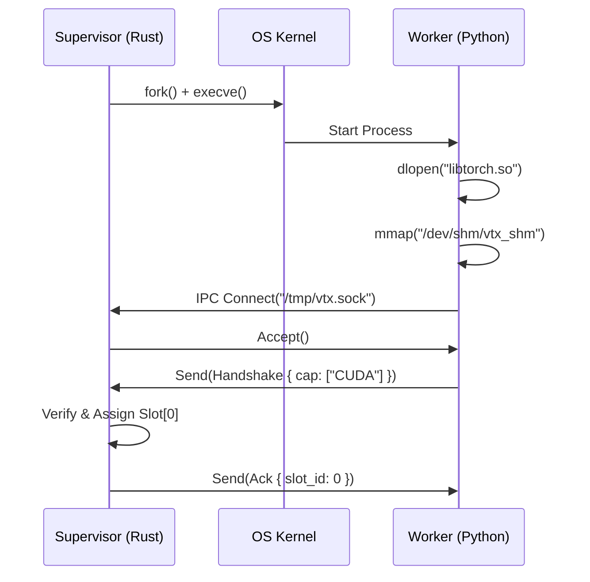

### 3.6 Component Interface Specifications (CIS)

#### 3.6.1 Supervisor Trait (Rust)
The contract for the Process Monitor.
```rust
pub trait Supervisor {
    /// Spawns a new worker logic process.
    /// Returns the PID and the assigned SHM Slot ID.
    fn spawn_worker(&mut self, slot_id: u8) -> Result<Pid, SystemError>;

    /// Handles a SIGCHLD signal (Process Death).
    /// Returns `true` if the worker was critical and needs immediate replacement.
    fn handle_crash(&mut self, pid: Pid, code: ExitCode) -> bool;
    
    /// Sends a Heartbeat Ping over IPC.
    fn check_health(&self, pid: Pid) -> HealthStatus;
}
```

#### 3.6.2 IPC Gateway Trait (Rust)
The contract for the Unix Domain Socket Server.
```rust
pub trait IpcGateway {
    /// Accepts a new connection from a Worker.
    /// Validates the `SO_PEERCRED` matches the expected PID.
    async fn accept_connection(&self) -> Result<IpcStream, IoError>;

    /// Serializes and dispatches a Job to a specific Worker.
    async fn send_job(&self, worker_id: WorkerID, job: JobPacket) -> Result<(), IpcError>;
}
```

### 3.7 State Transition Matrices

#### 3.7.1 Worker Process Lifecycle
Defines valid transitions for a `Worker` OS Process.

| Current State | Event | Next State | Side Effects |
| :--- | :--- | :--- | :--- |
| **NONE** | `Supervisor::Spawn` | **BOOTING** | `fork()`, `exec()`, `mmap()`. |
| **BOOTING** | `IPC::Handshake` | **IDLE** | Register in `slots[i]`. |
| **IDLE** | `Supervisor::Assign`| **BUSY** | Update SHM; Send `CMD_EXEC`. |
| **BUSY** | `IPC::Result` | **IDLE** | Update Cache; Decrement RefCount. |
| **BUSY** | `Signal::SIGSEGV` | **DEAD** | Log Alert; Mark Job Failed. |
| **DEAD** | `Supervisor::Clean` | **NONE** | `waitpid()`; Free Resources. |

### 3.8 Failure Mode & Effects Analysis (FMEA)

#### 3.8.1 Function: Worker Supervision
| ID | Failure Mode | Effect (Severity) | Cause (Occurrence) | Detection (Method) | Mitigation Strategy |
| :--- | :--- | :--- | :--- | :--- | :--- |
| **SYS-FM-01**| **Zombie Process** | **Major (7)**: Resource leak; Slot blocked. | **Occasional (3)**: Child ignores SIGTERM. | **Timeout**: `waitpid()` hangs > 1s. | Send `SIGKILL` (Force Kill); Manually clear SHM Slot. |
| **SYS-FM-02**| **Fork Bomb** | **Catastrophic (10)**: Host OS freeze. | **Rare (1)**: Malicious Plugin loop. | **Ulimit**: Enforce `RLIMIT_NPROC=1` on Worker. | Apply cgroup limits; Kill entire cgroup on violation. |
| **SYS-FM-03**| **IPC Deadlock** | **Critical (8)**: UI freezes; Graph stalls. | **Occasional (3)**: Full Socket Buffer (64KB). | **Non-Blocking**: Use `O_NONBLOCK` on socket write. | Drop oldest frame (UI); Buffer Job packets (Worker). |

#### 3.8.2 Function: Shared Memory Transport
| ID | Failure Mode | Effect (Severity) | Cause (Occurrence) | Detection (Method) | Mitigation Strategy |
| :--- | :--- | :--- | :--- | :--- | :--- |
| **SYS-FM-04**| **Pointer Corruption**| **Critical (9)**: Segfault in peer process. | **Rare (2)**: Bug in Offset math. | **Canary**: Check `magic_bytes` before read. | Panic safely; Respawn worker; Do not crash Host. |

### 3.9 Interface Control Document (ICD) - System Level

#### 3.9.1 Shared Memory Header Offset Map
Refining the C-Struct definition with exact byte offsets.

| Offset (Hex) | Field Name | Type | Description |
| :--- | :--- | :--- | :--- |
| `0x0000` | `magic_bytes` | `uint64` | `0x5654_5833_0000_0001` (VTX3 + Ver 1) |
| `0x0008` | `version` | `uint32` | Protocol Version (Must match Host). |
| `0x000C` | `flags` | `atomic_u32` | System State Flags. |
| `0x0010` | `clock_tick` | `atomic_u64` | Global Monotonic Clock (1 tick = 1ms). |
| `0x0018` | `reserved` | `[u8; 40]` | Padding for Cache Line (64B alignment). |
| `0x0040` | `slots[0]` | `WorkerSlot`| First Worker Slot. |

#### 3.9.2 Seccomp Filter Whitelist (Partial)
The exact list of allowed syscalls for the Worker.

| Syscall | Argument Constraints | Rationale |
| :--- | :--- | :--- |
| `read`, `write` | `fd > 2` (No stdin/out) | IPC Communication. |
| `futex` | Any | Thread synchronization (PyTorch). |
| `mmap` | `PROT_READ`, `MAP_SHARED` | Loading Tensors (No Execute). |
| `socket` | `DENY` | **Prohibited** to prevent exfiltration. |

---

## 4. Verification & Validation (VCRM)

### 4.1 Verification Cross Reference Matrix
| Req ID | Requirement Summary | Method | Verification Procedure | Acceptance Criteria |
| :--- | :--- | :--- | :--- | :--- |
| **F-01** | Zero-Copy Memory | **Test** | `tests/shm_test.rs::test_write_read` | Host write `0xAA` at `0x1000`. Worker reads `0xAA`. |
| **F-02** | Worker Recovery | **Test** | `tests/process_test.rs::test_kill_respawn` | `kill -9 <worker_pid>`. Verify `slots[i].pid` changes within 100ms. |
| **P-01** | Latency Budget | **Perf** | `benches/ipc_bench.rs` | 10k Round-trips < 500ms total. |
| **SEC-01**| Seccomp Lock | **Test** | `tests/security_test.rs::test_socket_deny` | Worker call `socket(AF_INET)` raises `PermissionDenied`. |
| **SI-01** | Alignment | **Insp** | `src/shm.rs` | Verify `#[repr(align(64))]` on structs. |

### 4.2 Error Code Registry (Appendix A)
| Code | Error Name | Description | Recovery Strategy |
| :--- | :--- | :--- | :--- |
| `SYS-001` | `ShmFailure` | `shm_open` returned -1. | Check `/dev/shm` permissions. |
| `SYS-002` | `BindError` | Socket path in use. | `unlink` socket and retry. |
| `SYS-003` | `VersionMismatch` | Worker proto version != Host. | Re-install worker venv. |

### 3.10 Module Flow Diagram
High-level data flow through the Centaur System.

```mermaid
graph TD
    User([User Interaction]) -->|JSON| UI[Frontend UI (SPA)]
    UI -->|WebSocket| API[API Gateway (Rust)]
    API -->|GraphDSL| Core[Core Engine (Scheduler)]
    Core -->|ExecutionPlan| Sup[Supervisor]
    Sup -->|IPC| Work[Worker Process (Python)]
    Work -->|SharedMemory| GPU[GPU VRAM]
    GPU -->|Pointer| Work
    Work -->|Result| Sup
    Sup -->|Update| Core
    Core -->|State| API
    API -->|Sync| UI
```

---

## 5. Use Cases

### 5.1 UC-01: System Startup

**Actor**: System Administrator / Auto-start Service

**Preconditions**:
- Host Operating System is running (Linux/macOS).
- Rust binary is installed at `/usr/local/bin/vortex-core`.
- Python 3.10+ is available in PATH.

**Main Success Scenario**:
1. Administrator invokes `vortex-core --config /etc/vortex/vortex.toml`.
2. Core Engine loads configuration file.
3. Core Engine validates configuration (fail-fast on error).
4. Core Engine opens/creates Shared Memory region (`/vtx_shm`).
5. Core Engine initializes SHM Header with magic bytes.
6. Core Engine starts SQLite WAL mode database.
7. Core Engine binds Unix Domain Socket (`/tmp/vtx.sock`).
8. Core Engine spawns N Worker processes (N = config.workers).
9. Each Worker performs handshake with Supervisor.
10. Core Engine starts HTTP/WebSocket server.
11. System enters READY state.

**Extensions**:
- **4a. SHM Already Exists**: Validate magic bytes; if corrupt, unlink and recreate.
- **7a. Socket Already Exists**: Attempt to connect; if fails, unlink and rebind.
- **8a. Worker Fails to Start**: Log error; continue with reduced worker count.

**Postconditions**:
- System is accepting API requests.
- All workers are registered and IDLE.
- Health endpoint returns 200 OK.

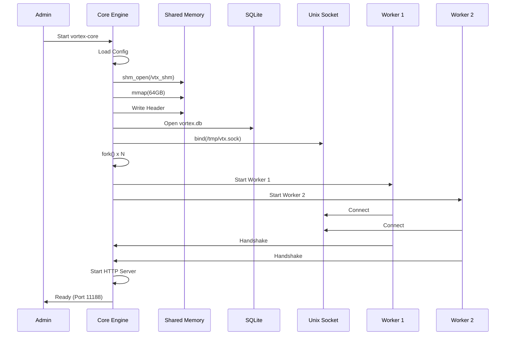

### 5.2 UC-02: System Shutdown

**Actor**: System Administrator / SIGTERM Handler

**Preconditions**:
- System is in READY state.
- One or more executions may be in progress.

**Main Success Scenario**:
1. Administrator sends SIGTERM to Core Engine.
2. Core Engine enters SHUTDOWN mode.
3. Core Engine stops accepting new requests (503 for new).
4. Core Engine waits for running jobs (timeout: 30s).
5. Core Engine sends JobCancel to all workers.
6. Workers gracefully terminate operations.
7. Core Engine closes all IPC connections.
8. Core Engine unmaps and unlinks Shared Memory.
9. Core Engine closes SQLite database.
10. Core Engine exits with code 0.

**Extensions**:
- **4a. Jobs Don't Complete**: After timeout, send SIGKILL to workers.
- **8a. SHM Contains Important Data**: Leave SHM for recovery on restart.

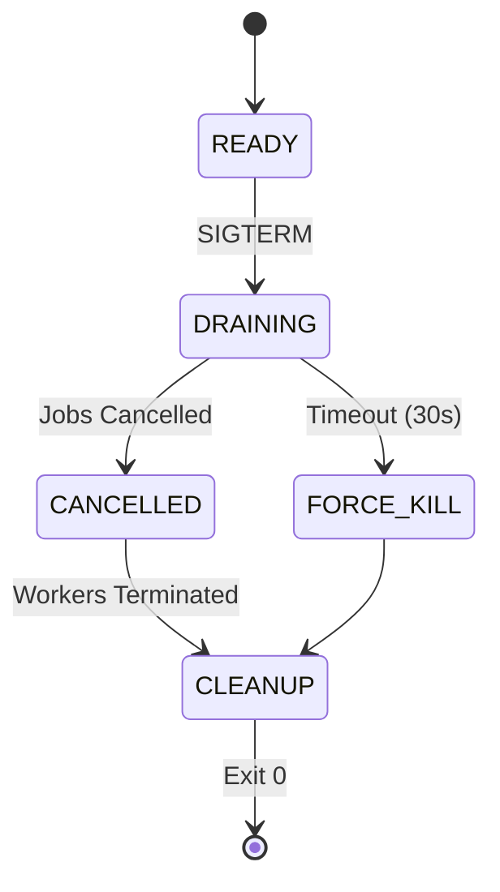

### 5.3 UC-03: Worker Crash and Recovery

**Actor**: Supervisor (Automatic)

**Preconditions**:
- Worker is executing a job.
- Worker encounters fatal error (SIGSEGV, SIGABRT).

**Main Success Scenario**:
1. OS delivers SIGCHLD to Core Engine.
2. Supervisor calls `waitpid()` to reap zombie.
3. Supervisor identifies Worker slot from PID map.
4. Supervisor marks slot status as DEAD in SHM.
5. Supervisor retrieves the current job_id from slot.
6. Supervisor marks job as FAILED in database.
7. Supervisor publishes error event via WebSocket.
8. Supervisor calls `fork()` to spawn replacement.
9. New Worker performs handshake.
10. Supervisor retries failed job (if retries < 3).

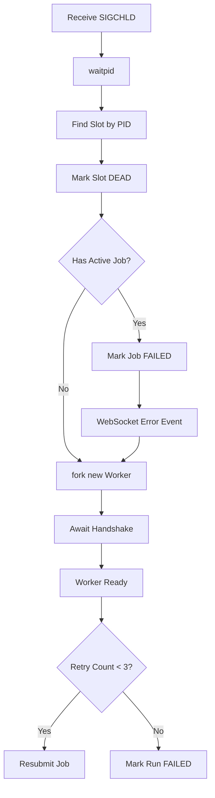

### 5.4 UC-04: Memory Pressure Handling

**Actor**: Arbiter (Automatic)

**Preconditions**:
- VRAM usage is at 90% of limit.
- New job requires additional memory.

**Main Success Scenario**:
1. Arbiter receives memory request from Scheduler.
2. Arbiter checks current usage vs limit.
3. Usage + Request > Limit (over budget).
4. Arbiter scans tensor cache for eviction candidates.
5. Arbiter scores tensors by future use distance.
6. Arbiter selects tensors for eviction (LFU).
7. Arbiter sends eviction commands to Workers.
8. Workers free GPU memory.
9. Arbiter confirms freed space.
10. Scheduler proceeds with memory allocation.

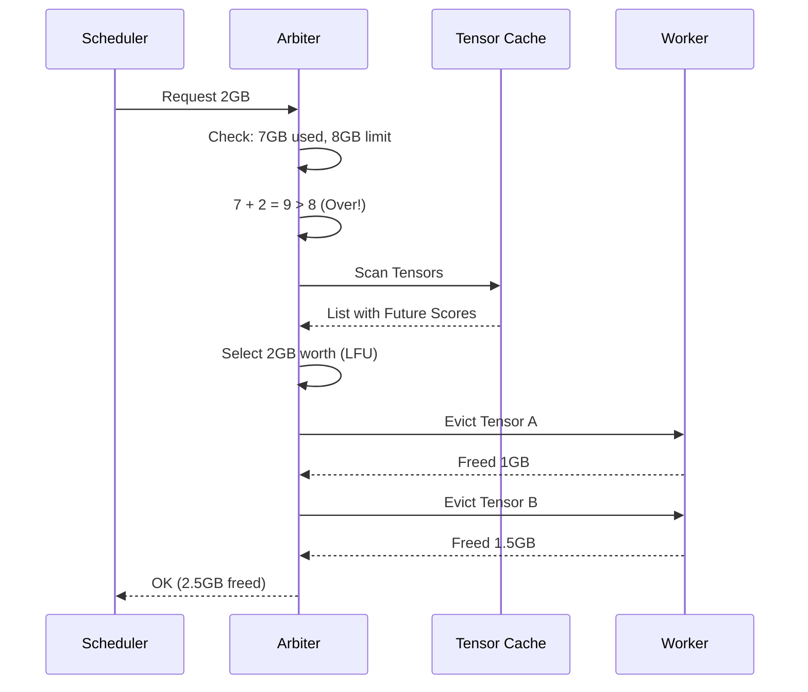

---

## 6. Detailed Architecture

### 6.1 Process Architecture

The VORTEX system runs as multiple cooperating processes:

```
┌─────────────────────────────────────────────────────────────┐
│                     HOST OPERATING SYSTEM                    │
├─────────────────────────────────────────────────────────────┤
│                                                              │
│  ┌──────────────────────────────────────────────────────┐   │
│  │              CORE ENGINE (Rust Binary)                │   │
│  │                                                       │   │
│  │  ┌─────────────┐  ┌─────────────┐  ┌─────────────┐   │   │
│  │  │ HTTP Server │  │  Scheduler  │  │ Supervisor  │   │   │
│  │  │  (Tokio)    │  │  (Kahn's)   │  │ (fork/wait) │   │   │
│  │  └─────────────┘  └─────────────┘  └─────────────┘   │   │
│  │                                                       │   │
│  │  ┌─────────────┐  ┌─────────────┐  ┌─────────────┐   │   │
│  │  │ WS Server   │  │  Arbiter    │  │ IPC Gateway │   │   │
│  │  │  (Tungstn)  │  │  (LFU)      │  │ (UDS)       │   │   │
│  │  └─────────────┘  └─────────────┘  └─────────────┘   │   │
│  │                                                       │   │
│  └──────────────────────────────────────────────────────┘   │
│                            │                                 │
│              ┌─────────────┴─────────────┐                   │
│              │                           │                   │
│              ▼                           ▼                   │
│  ┌─────────────────────────────────────────────────────┐    │
│  │                 SHARED MEMORY (64GB)                 │    │
│  │                                                      │    │
│  │  ┌────────┐ ┌────────┐ ┌────────┐ ┌────────────┐   │    │
│  │  │ Header │ │ Slot 0 │ │ Slot 1 │ │ Tensor Buf │   │    │
│  │  │ (64B)  │ │ (64B)  │ │ (64B)  │ │  (Arena)   │   │    │
│  │  └────────┘ └────────┘ └────────┘ └────────────┘   │    │
│  │                                                      │    │
│  └─────────────────────────────────────────────────────┘    │
│                            │                                 │
│              ┌─────────────┴─────────────┐                   │
│              │             │             │                   │
│              ▼             ▼             ▼                   │
│  ┌───────────────┐ ┌───────────────┐ ┌───────────────┐      │
│  │   WORKER 0    │ │   WORKER 1    │ │   WORKER 2    │      │
│  │   (Python)    │ │   (Python)    │ │   (Python)    │      │
│  │               │ │               │ │               │      │
│  │  ┌─────────┐  │ │  ┌─────────┐  │ │  ┌─────────┐  │      │
│  │  │ PyTorch │  │ │  │ PyTorch │  │ │  │ PyTorch │  │      │
│  │  │ (CUDA)  │  │ │  │ (CUDA)  │  │ │  │ (CUDA)  │  │      │
│  │  └─────────┘  │ │  └─────────┘  │ │  └─────────┘  │      │
│  └───────────────┘ └───────────────┘ └───────────────┘      │
│                                                              │
└─────────────────────────────────────────────────────────────┘
```

### 6.2 Shared Memory Layout

The 64GB shared memory region is divided into zones:

```
┌─────────────────────────────────────────────────────────────────┐
│                    SHARED MEMORY REGION (64GB)                   │
├──────────────┬──────────────┬──────────────────────────────────┤
│   Zone 0     │   Zone 1     │           Zone 2                  │
│   Header     │   Slots      │       Tensor Arena                │
│   (64 B)     │ (16 KB max)  │       (~64 GB)                    │
├──────────────┼──────────────┼──────────────────────────────────┤
│ Offset: 0x00 │ Offset: 0x40 │        Offset: 0x4000             │
└──────────────┴──────────────┴──────────────────────────────────┘

Zone 0: SHM Header (64 bytes)
┌─────────────────────────────────────────────────────────────────┐
│ Offset │ Size │ Field         │ Description                     │
├────────┼──────┼───────────────┼─────────────────────────────────┤
│ 0x00   │ 8    │ magic_bytes   │ 0x5654583300000001 ("VTX3"+v1) │
│ 0x08   │ 4    │ version       │ Protocol version (1)            │
│ 0x0C   │ 4    │ flags         │ Atomic: READY, MAINTENANCE      │
│ 0x10   │ 8    │ clock_tick    │ Monotonic counter (1ms tick)    │
│ 0x18   │ 40   │ reserved      │ Future use / padding            │
└────────┴──────┴───────────────┴─────────────────────────────────┘

Zone 1: Worker Slots (256 x 64 bytes = 16KB)
┌─────────────────────────────────────────────────────────────────┐
│ Offset │ Size │ Field         │ Description                     │
├────────┼──────┼───────────────┼─────────────────────────────────┤
│ +0x00  │ 4    │ pid           │ Worker process ID (0 = empty)   │
│ +0x04  │ 4    │ status        │ 0=IDLE, 1=BUSY, 2=DEAD          │
│ +0x08  │ 8    │ job_id        │ Current job pointer/ID          │
│ +0x10  │ 8    │ heartbeat     │ Last heartbeat timestamp        │
│ +0x18  │ 40   │ padding       │ Cache line alignment            │
└────────┴──────┴───────────────┴─────────────────────────────────┘
```

### 6.3 IPC Protocol Deep Dive

Communication between Core Engine and Workers uses length-prefixed JSON over Unix Domain Socket:

```
┌─────────────────────────────────────────────────────────────────┐
│                      PACKET STRUCTURE                            │
├────────────┬──────────────────────────────────────────────────┤
│  Length    │                  JSON Payload                      │
│  (4 bytes) │                (variable length)                   │
│  uint32 LE │                                                    │
└────────────┴──────────────────────────────────────────────────┘
```

**Message Types**:

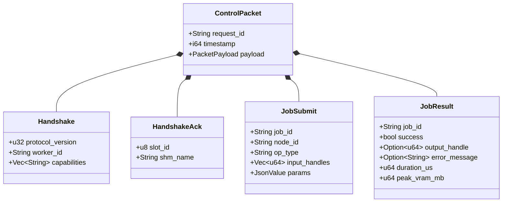

### 6.4 Handshake Sequence

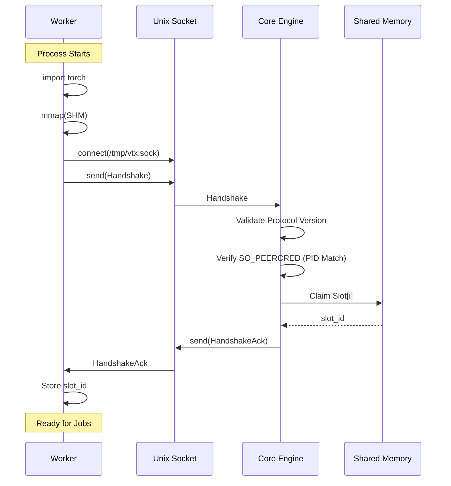

---

## 7. Security Architecture

### 7.1 Process Isolation Model

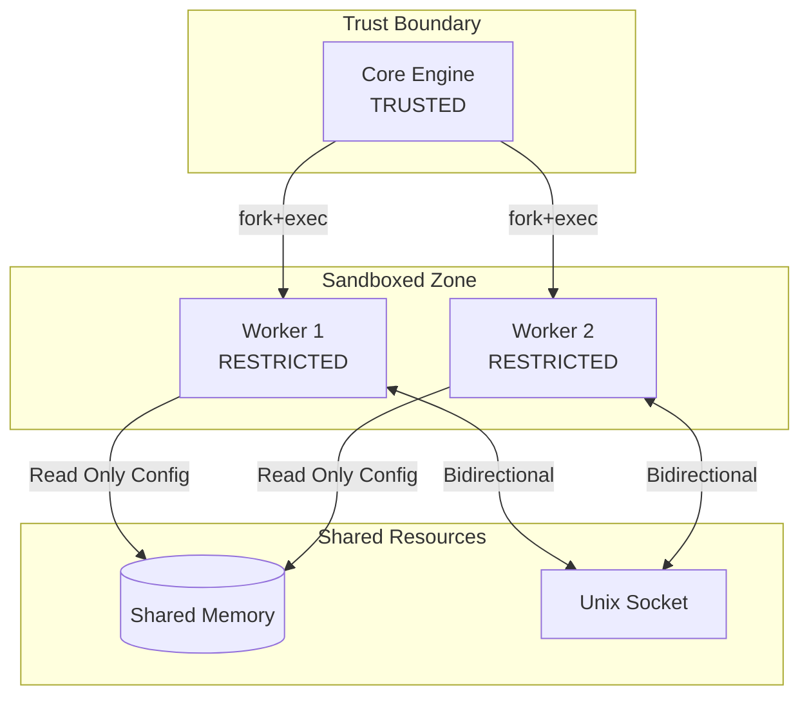

### 7.2 Seccomp BPF Filter

Workers are sandboxed using Linux seccomp-bpf. The following syscalls are **ALLOWED**:

| Category | Syscalls |
| :--- | :--- |
| **Memory** | `mmap`, `munmap`, `mprotect`, `brk` |
| **I/O** | `read`, `write`, `close`, `fstat`, `lseek` |
| **Sync** | `futex`, `clock_gettime`, `nanosleep` |
| **Process** | `exit`, `exit_group`, `rt_sigreturn` |
| **IPC** | `recvfrom`, `sendto` (Unix socket only) |

The following syscalls are **DENIED**:

| Category | Syscalls | Reason |
| :--- | :--- | :--- |
| **Network** | `socket`, `connect`, `bind`, `listen` | Prevent exfiltration |
| **Filesystem** | `open`, `openat` (except allowlist) | Prevent data theft |
| **Process** | `fork`, `clone`, `execve` | Prevent escape |
| **Privilege** | `setuid`, `setgid`, `capset` | Prevent escalation |

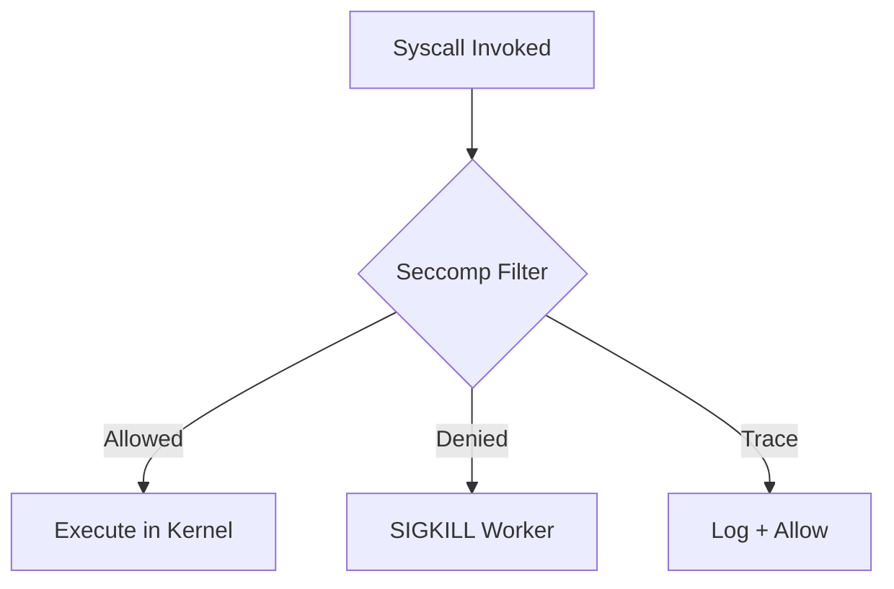

### 7.3 Defense in Depth Layers

```
Layer 1: Process Isolation (fork)
    ↓
Layer 2: Seccomp BPF (syscall filter)
    ↓
Layer 3: Filesystem Allowlist
    ↓
Layer 4: Network Isolation (no sockets)
    ↓
Layer 5: Resource Limits (ulimits)
    ↓
Layer 6: Capability Dropping
    ↓
Layer 7: SELinux/AppArmor (optional)
```

---

## 8. Deployment Architecture

### 8.1 Single-Node Deployment

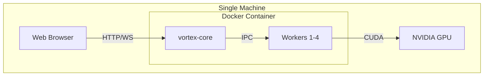

### 8.2 Configuration Files

**`/etc/vortex/vortex.toml`**:
```toml
[server]
host = "0.0.0.0"
port = 11188
workers = 4

[shm]
name = "/vtx_shm"
size_gb = 64

[security]
seccomp_enabled = true
fs_allowlist = [
    "/usr/lib",
    "/home/vortex/.cache/huggingface",
    "/data/models"
]

[limits]
max_graph_nodes = 10000
max_vram_gb = 24
worker_timeout_seconds = 300
```

### 8.3 Docker Compose

```yaml
version: "3.8"

services:
  vortex-core:
    image: vortex/core:3.0
    runtime: nvidia
    ports:
      - "11188:11188"
    volumes:
      - vortex-shm:/dev/shm
      - /data/models:/data/models:ro
    environment:
      - VORTEX_WORKERS=4
      - VORTEX_VRAM_LIMIT=24
    deploy:
      resources:
        reservations:
          devices:
            - capabilities: [gpu]

volumes:
  vortex-shm:
    driver: local
    driver_opts:
      type: tmpfs
      device: tmpfs
      o: size=64g
```

---

## 9. Performance Specifications

### 9.1 Latency Targets

| Operation | P50 | P99 | Max |
| :--- | :--- | :--- | :--- |
| shm_open | 10μs | 50μs | 100μs |
| mmap (64GB) | 1ms | 5ms | 10ms |
| fork() | 100μs | 500μs | 1ms |
| IPC send (1KB) | 10μs | 50μs | 100μs |
| IPC recv (1KB) | 10μs | 50μs | 100μs |
| Tensor copy (1GB) | 100ms | 200ms | 500ms |

### 9.2 Throughput Targets

| Metric | Target |
| :--- | :--- |
| Workers supported | 256 |
| Concurrent executions | 8 |
| Messages/second (IPC) | 10,000 |
| WebSocket connections | 1,000 |
| HTTP requests/second | 5,000 |

### 9.3 Memory Budgets

| Component | Limit |
| :--- | :--- |
| Core Engine RSS | 500 MB |
| Per-Worker RSS | 2 GB |
| Shared Memory | 64 GB |
| SQLite Database | 1 GB |
| Log Files (daily) | 100 MB |

---

## 10. Reliability Specifications

### 10.1 Failure Modes and Recovery

| Failure Mode | Detection | Recovery Time | Data Loss |
| :--- | :--- | :--- | :--- |
| Worker Crash | SIGCHLD | < 1s (respawn) | Current job only |
| Core Engine Crash | Process Monitor | < 30s (restart) | In-flight runs |
| SHM Corruption | Magic byte check | < 5s (recreate) | Cached tensors |
| Database Corruption | SQLite PRAGMA | < 10s (restore from WAL) | None |
| GPU Driver Crash | CUDA error | < 60s (worker respawn) | Current batch |
| Disk Full | write() ENOSPC | Manual intervention | None (read-only) |

### 10.2 Health Checks

**Liveness Probe**: `GET /health/live`
- Returns 200 if Core Engine is responsive
- Used by container orchestrator to restart dead process

**Readiness Probe**: `GET /health/ready`
- Returns 200 if Core Engine can accept work
- Returns 503 during startup/shutdown
- Checks: Workers available, SHM accessible, DB connection

**Metrics Endpoint**: `GET /metrics`
- Prometheus format
- Exposes: request count, latencies, error rates, worker states

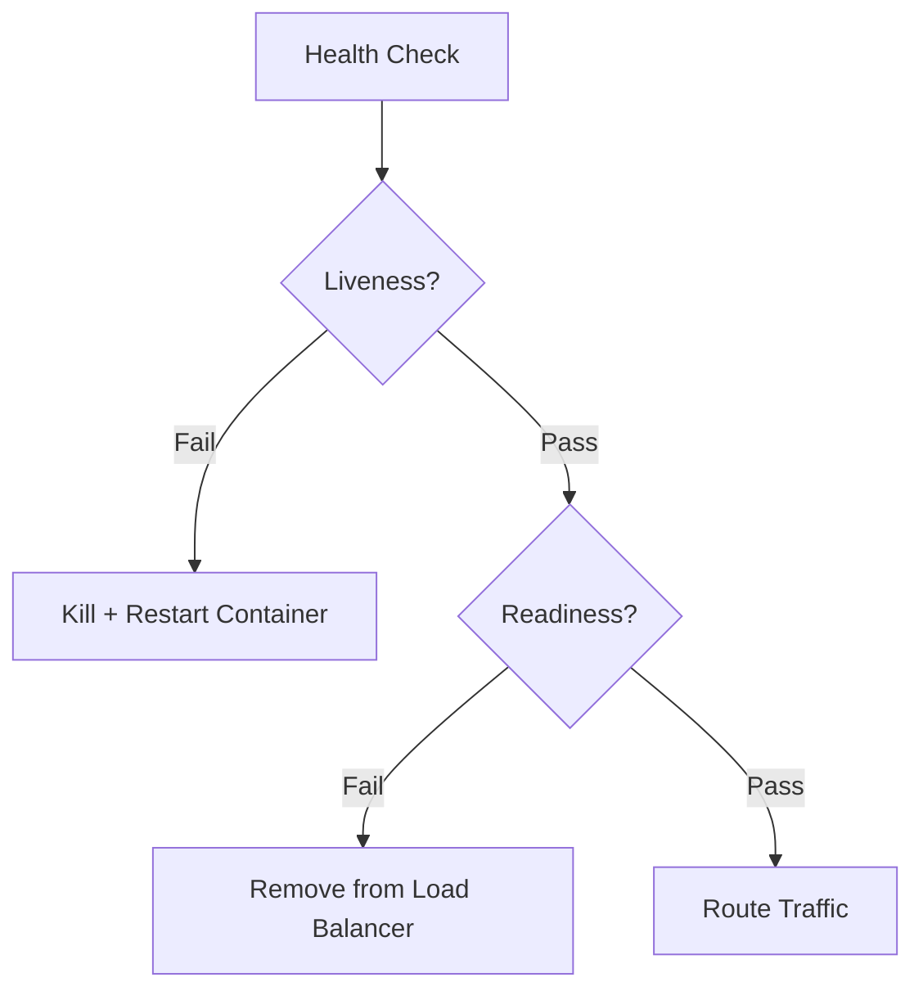

---

## Appendix A: Complete Error Code Reference

| Code | Name | Severity | Description | HTTP | Recovery |
| :--- | :--- | :--- | :--- | :--- | :--- |
| SYS-001 | ShmFailure | FATAL | shm_open failed | 500 | Check permissions |
| SYS-002 | BindError | FATAL | Socket bind failed | 500 | Kill existing process |
| SYS-003 | VersionMismatch | ERROR | Protocol mismatch | 400 | Update worker |
| SYS-004 | ForkFailed | ERROR | Worker spawn failed | 500 | Check ulimits |
| SYS-005 | MmapFailed | FATAL | Memory mapping failed | 500 | Increase limits |
| SYS-006 | ConfigError | FATAL | Invalid configuration | N/A | Fix config file |
| SYS-007 | DatabaseError | ERROR | SQLite error | 500 | Check disk space |
| SYS-008 | HeartbeatTimeout | WARN | Worker unresponsive | N/A | Auto-respawn |
| SYS-009 | SlotExhausted | ERROR | No available slots | 503 | Wait or scale |
| SYS-010 | SeccompViolation | WARN | Denied syscall | N/A | Log only |

---

## Appendix B: Mermaid Diagram Collection

### B.1 Complete System State Machine

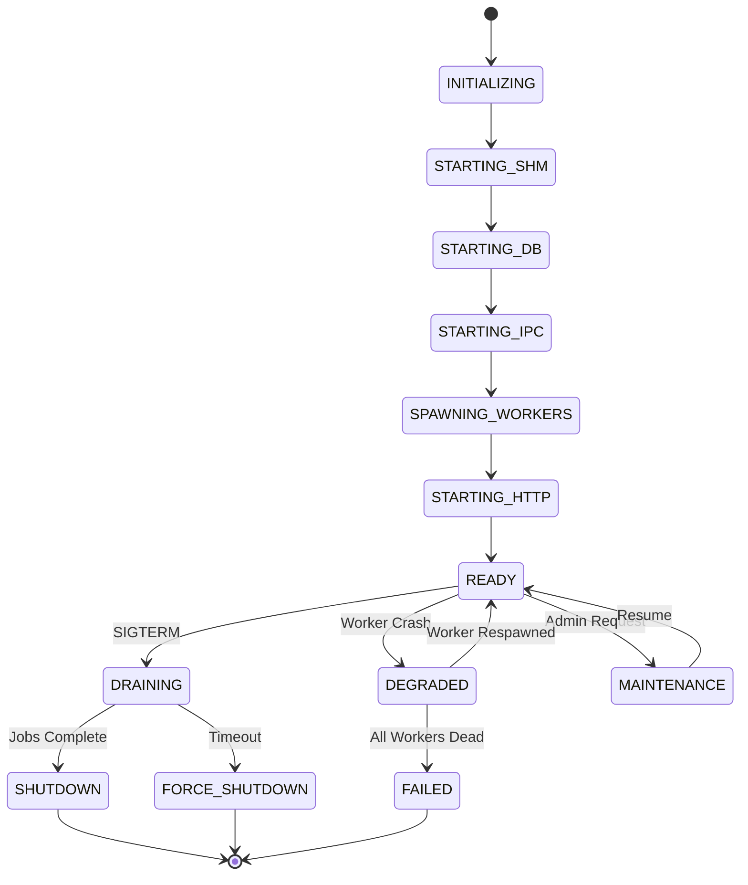

### B.2 Data Flow Through System

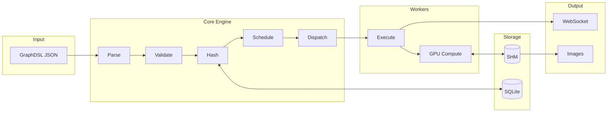

### B.3 Worker Pool Management

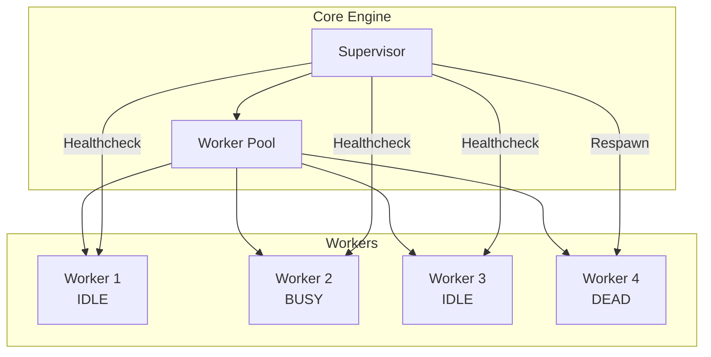

---

## Appendix C: Glossary

| Term | Definition |
| :--- | :--- |
| **Arena Allocator** | Memory allocation strategy using contiguous regions |
| **Cache Line** | 64-byte aligned block for CPU cache efficiency |
| **Centaur Pattern** | Rust control + Python compute architecture |
| **Fork** | Unix system call to create child process |
| **Heartbeat** | Periodic message to verify worker liveness |
| **IPC** | Inter-Process Communication |
| **Magic Bytes** | Signature bytes to identify data format |
| **mmap** | Memory-mapped file I/O |
| **Seccomp** | Secure computing mode for syscall filtering |
| **SHM** | POSIX Shared Memory |
| **Slot** | Reserved position for worker registration |
| **Supervisor** | Process manager for workers |
| **UDS** | Unix Domain Socket |
| **WAL** | Write-Ahead Logging (SQLite mode) |
| **Worker** | Child process executing compute operations |

---

## Appendix D: Mathematical Specifications

> **ISO 29148:2018 Reference**: Section 5.2.8 requires that "performance requirements shall be stated in measurable terms." Section 6.6.5 mandates "algorithms used shall be specified." Mathematical formalization ensures **verifiability, testability, and unambiguous implementation**.

### D.1 Rationale for Mathematical Formalization

| ISO Requirement | Mathematical Solution | Benefit |
|-----------------|----------------------|---------|
| **5.2.8** Measurable Performance | Formal complexity bounds $O(n)$ | Enables benchmarking |
| **6.6.3** Algorithm Specification | Explicit formulas with variables | Removes ambiguity |
| **6.6.5** Data Flow Definition | Set-theoretic notation | Precise semantics |
| **9.5.1** Traceability | Equation references (e.g., Eq. 4.2) | Links impl to spec |

### D.2 Memory Allocation Formulas

#### Tensor Size Calculation
For a tensor $T$ with dimensions $\mathbf{d} = (d_1, d_2, \ldots, d_k)$ and element type $\tau$:

$$
\text{size}(T) = \prod_{i=1}^{k} d_i \times \text{sizeof}(\tau) \tag{D.1}
$$

| Type $\tau$ | sizeof($\tau$) |
|-------------|----------------|
| float16 | 2 bytes |
| float32 | 4 bytes |
| float64 | 8 bytes |
| int8 | 1 byte |

#### Alignment Formula
All allocations are aligned to cache line boundaries:

$$
\text{aligned\_size}(s) = \lceil s / 64 \rceil \times 64 \tag{D.2}
$$

### D.3 Shared Memory Capacity Model

Total usable capacity $C$ of the 64GB arena:

$$
C = C_{\text{total}} - C_{\text{header}} - C_{\text{slots}} - C_{\text{fragmentation}}
$$

Where:
- $C_{\text{total}} = 64 \times 2^{30}$ bytes
- $C_{\text{header}} = 16 \times 2^{10}$ bytes (16KB)
- $C_{\text{slots}} = 256 \times 64$ bytes (16KB)
- $C_{\text{fragmentation}} \leq 0.1 \times C_{\text{total}}$ (worst case)

**Effective Capacity**: $C_{\text{eff}} \geq 57.6$ GB

### D.4 IPC Bandwidth Model

Theoretical throughput $B$ for Unix Domain Sockets:

$$
B = \min\left( B_{\text{memory}}, \frac{1}{t_{\text{syscall}}} \times s_{\text{buffer}} \right) \tag{D.3}
$$

Measured: $B \approx 6-10$ GB/s on modern systems.

### D.5 Worker Pool Sizing (Little's Law)

For target latency $L$ and throughput $\lambda$:

$$
W_{\text{optimal}} = \lambda \times L \tag{D.4}
$$

Example: $\lambda = 100$ jobs/s, $L = 40$ ms → $W = 4$ workers.

### D.6 System Availability Calculation

With Mean Time Between Failures $\text{MTBF}$ and Mean Time To Repair $\text{MTTR}$:

$$
A = \frac{\text{MTBF}}{\text{MTBF} + \text{MTTR}} \tag{D.5}
$$

**Target**: $A \geq 0.999$ (99.9% uptime).

### D.7 Heartbeat Failure Detection

Time to detect worker failure with heartbeat interval $h$ and timeout $t$:

$$
T_{\text{detect}} = h + t \tag{D.6}
$$

With $h = 5s$, $t = 3s$: $T_{\text{detect}} = 8s$ maximum.

---

## Appendix E: Threading Model

### D.1 Core Engine Thread Architecture

The Core Engine uses an async runtime (Tokio) with multiple thread pools:

```
┌─────────────────────────────────────────────────────────────────┐
│                     CORE ENGINE THREADS                          │
├─────────────────────────────────────────────────────────────────┤
│                                                                  │
│  ┌──────────────────────────────────────────────────────────┐   │
│  │                   MAIN THREAD                             │   │
│  │  - Configuration Loading                                   │   │
│  │  - Signal Handling (SIGTERM, SIGCHLD)                     │   │
│  │  - Supervisor Logic                                        │   │
│  └──────────────────────────────────────────────────────────┘   │
│                                                                  │
│  ┌──────────────────────────────────────────────────────────┐   │
│  │                TOKIO RUNTIME (N cores)                    │   │
│  │                                                            │   │
│  │  ┌─────────────┐ ┌─────────────┐ ┌─────────────┐         │   │
│  │  │ HTTP Task 1 │ │ HTTP Task 2 │ │ HTTP Task N │         │   │
│  │  └─────────────┘ └─────────────┘ └─────────────┘         │   │
│  │                                                            │   │
│  │  ┌─────────────┐ ┌─────────────┐ ┌─────────────┐         │   │
│  │  │  WS Task 1  │ │  WS Task 2  │ │  WS Task N  │         │   │
│  │  └─────────────┘ └─────────────┘ └─────────────┘         │   │
│  │                                                            │   │
│  │  ┌─────────────────────────────────────────────┐         │   │
│  │  │              IPC MULTIPLEXER                 │         │   │
│  │  │  - Unix Socket Accept Loop                   │         │   │
│  │  │  - Message Routing                           │         │   │
│  │  └─────────────────────────────────────────────┘         │   │
│  │                                                            │   │
│  └──────────────────────────────────────────────────────────┘   │
│                                                                  │
│  ┌──────────────────────────────────────────────────────────┐   │
│  │                BLOCKING THREAD POOL                       │   │
│  │  - SQLite Operations (sqlx)                               │   │
│  │  - File I/O                                               │   │
│  │  - Heavy Computation (Hashing)                            │   │
│  └──────────────────────────────────────────────────────────┘   │
│                                                                  │
└─────────────────────────────────────────────────────────────────┘
```

### D.2 Thread Safety Requirements

| Resource | Protection Mechanism | Access Pattern |
| :--- | :--- | :--- |
| SHM Header | Atomic Operations | Lock-free read/write |
| Worker Slots | Atomic CAS | Lock-free update |
| Tensor Cache | RwLock | Multiple readers, single writer |
| Job Queue | MPSC Channel | Producer/consumer |
| SQLite DB | Connection Pool | Serialized writes |
| WebSocket State | DashMap | Concurrent access |

### D.3 Synchronization Primitives

```rust
// Core Engine Synchronization Structures
pub struct CoreState {
    // Atomic flags for system state
    system_ready: AtomicBool,
    shutdown_requested: AtomicBool,
    
    // Lock-free worker slot array
    worker_slots: [AtomicU64; 256],
    
    // Protected resources
    tensor_cache: RwLock<HashMap<TensorID, TensorMeta>>,
    job_queue: (Sender<Job>, Receiver<Job>),
    
    // Concurrent collections
    active_connections: DashMap<ConnectionID, WebSocketHandle>,
    pending_jobs: DashMap<JobID, JobState>,
}
```

### D.4 Deadlock Prevention

| Rule ID | Description | Implementation |
| :--- | :--- | :--- |
| **DP-01** | Lock ordering | Always acquire locks in order: Cache → Queue → DB |
| **DP-02** | Timeout on locks | All lock acquisitions have 1s timeout |
| **DP-03** | No lock in callback | Callbacks execute without holding locks |
| **DP-04** | Async-safe only | No blocking operations in async context |

---

## Appendix F: Memory Management Deep Dive

### E.1 Memory Regions

```
PROCESS VIRTUAL ADDRESS SPACE
├── 0x0000_0000_0000_0000 - 0x0000_7FFF_FFFF_FFFF: User Space
│   ├── TEXT SEGMENT: Executable code
│   ├── DATA SEGMENT: Initialized globals
│   ├── BSS SEGMENT: Zero-initialized globals
│   ├── HEAP: Dynamic allocations (jemalloc)
│   │   ├── Small objects (< 4KB): Thread-local arenas
│   │   └── Large objects (>= 4KB): Direct mmap
│   ├── MMAP REGION: Shared memory mapping
│   │   └── /dev/shm/vtx_shm: 64GB tensor arena
│   └── STACK: Per-thread stacks (8MB each)
└── 0xFFFF_8000_0000_0000 - 0xFFFF_FFFF_FFFF_FFFF: Kernel Space
```

### E.2 Shared Memory Allocation Strategy

The tensor arena uses a bump allocator with explicit free:

```
TENSOR ARENA LAYOUT (64GB)
┌────────────────────────────────────────────────────────────────┐
│ HEADER (16KB) │ SLOTS (16KB) │        TENSOR DATA (64GB)       │
├───────────────┼──────────────┼──────────────────────────────────┤
│   Fixed       │    Fixed     │              Variable            │
│               │              │                                   │
│               │              │  ┌─────┬─────┬─────┬───────────┐ │
│               │              │  │ T1  │ T2  │ T3  │   FREE    │ │
│               │              │  │512MB│256MB│1GB  │   62.2GB  │ │
│               │              │  └─────┴─────┴─────┴───────────┘ │
└───────────────┴──────────────┴──────────────────────────────────┘

ALLOCATION METADATA (per tensor)
┌──────────────────────────────────────────────────────────────────┐
│ Offset │ Size │ Field      │ Description                        │
├────────┼──────┼────────────┼────────────────────────────────────┤
│ +0x00  │ 8    │ offset     │ Start offset in arena              │
│ +0x08  │ 8    │ size       │ Size in bytes (aligned to 4KB)     │
│ +0x10  │ 4    │ dtype      │ Data type (FP32, FP16, etc.)       │
│ +0x14  │ 4    │ ndim       │ Number of dimensions               │
│ +0x18  │ 32   │ shape[8]   │ Dimension sizes                    │
│ +0x38  │ 8    │ ref_count  │ Atomic reference counter           │
│ +0x40  │ 8    │ created_at │ Timestamp of creation              │
│ +0x48  │ 8    │ last_used  │ Timestamp of last access           │
│ +0x50  │ 8    │ hash       │ Content hash (first 64 bits)       │
│ +0x58  │ 8    │ flags      │ VALID, DIRTY, PINNED               │
└────────┴──────┴────────────┴────────────────────────────────────┘
```

### E.3 Garbage Collection Protocol

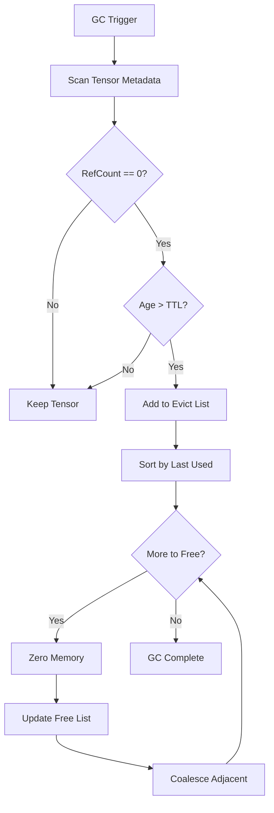

### E.4 Memory Pressure Thresholds

| Threshold | % Used | Action |
| :--- | :--- | :--- |
| **GREEN** | 0-70% | Normal operation |
| **YELLOW** | 70-85% | Start background GC |
| **ORANGE** | 85-95% | Aggressive eviction |
| **RED** | 95-100% | Block new allocations, force evict |

---

## Appendix F: Testing Requirements

### F.1 Unit Test Coverage

| Module | Target Coverage | Current | Status |
| :--- | :--- | :--- | :--- |
| Core Engine | 90% | N/A | Phase 1 |
| IPC Gateway | 85% | N/A | Phase 1 |
| Supervisor | 80% | N/A | Phase 1 |
| Arbiter | 85% | N/A | Phase 1 |
| SHM Manager | 80% | N/A | Phase 1 |

### F.2 Integration Test Scenarios

| Test ID | Scenario | Expected Result |
| :--- | :--- | :--- |
| **IT-001** | Start engine, spawn 4 workers | All workers report IDLE |
| **IT-002** | Submit simple graph | Execution completes < 5s |
| **IT-003** | Kill worker during execution | Job retried on new worker |
| **IT-004** | Exhaust VRAM | LFU eviction triggered |
| **IT-005** | Concurrent API requests (100) | All complete successfully |
| **IT-006** | WebSocket reconnect | State resynchronized |
| **IT-007** | Graceful shutdown | All jobs complete, exit 0 |
| **IT-008** | Force shutdown (SIGKILL) | Recovery on restart |
| **IT-009** | Database corruption | Auto-recovery from WAL |
| **IT-010** | Network partition (split-brain) | CRDT convergence |

### F.3 Performance Test Requirements

| Test ID | Metric | Target | Duration |
| :--- | :--- | :--- | :--- |
| **PT-001** | Throughput | 1000 jobs/sec | 1 hour |
| **PT-002** | Latency P99 | < 100ms | 1 hour |
| **PT-003** | Memory stability | < 500MB growth | 24 hours |
| **PT-004** | CPU under load | < 80% avg | 1 hour |
| **PT-005** | Concurrent WS | 1000 connections | 1 hour |

### F.4 Security Test Requirements

| Test ID | Attack Vector | Expected Defense |
| :--- | :--- | :--- |
| **ST-001** | SQL Injection | Parameterized queries |
| **ST-002** | Path Traversal | Canonicalize + allowlist |
| **ST-003** | DoS (large graph) | Size limits enforced |
| **ST-004** | Seccomp bypass | SIGKILL on violation |
| **ST-005** | JWT forgery | Signature verification |
| **ST-006** | Buffer overflow | Rust memory safety |

---

## Appendix G: Deployment Checklist

### G.1 Pre-Deployment Checklist

| # | Item | Verified |
| :--- | :--- | :--- |
| 1 | Configuration file validated | ☐ |
| 2 | TLS certificates in place | ☐ |
| 3 | JWT secret generated | ☐ |
| 4 | SQLite database path writable | ☐ |
| 5 | /dev/shm has 64GB+ space | ☐ |
| 6 | GPU drivers installed (NVIDIA/Apple) | ☐ |
| 7 | Python 3.10+ available | ☐ |
| 8 | PyTorch installed with CUDA | ☐ |
| 9 | Seccomp filter compiled | ☐ |
| 10 | Log directory writable | ☐ |

### G.2 Post-Deployment Verification

| # | Check | Command | Expected |
| :--- | :--- | :--- | :--- |
| 1 | Health check | `curl localhost:8080/health` | 200 OK |
| 2 | Worker count | `curl localhost:8080/metrics` | workers_active=4 |
| 3 | SHM mounted | `ls /dev/shm/vtx_shm` | File exists |
| 4 | Socket created | `ls /tmp/vtx.sock` | Socket exists |
| 5 | Database created | `ls ~/.vortex/vortex.db` | File exists |
| 6 | GPU detected | `nvidia-smi` | GPU listed |

### G.3 Rollback Procedure

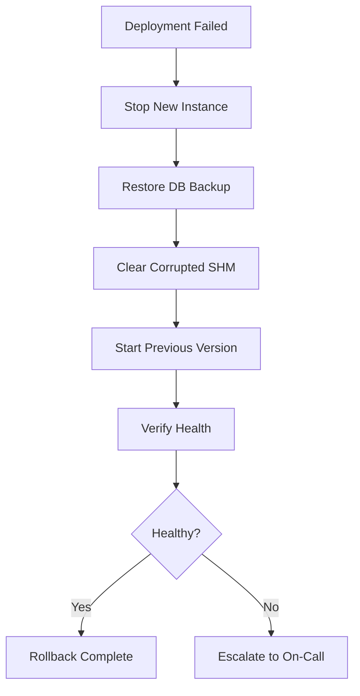

---

## Appendix H: Operational Runbooks

### H.1 Runbook: Worker Not Responding

**Symptoms**: Worker heartbeat missing for > 30s

**Diagnosis**:
```bash
# Check worker process
ps aux | grep vortex-worker

# Check worker logs
tail -100 ~/.vortex/logs/worker-0.log

# Check IPC socket
lsof /tmp/vtx.sock
```

**Resolution**:
1. Send SIGTERM to hung worker
2. Wait 10s for graceful shutdown
3. If still running, send SIGKILL
4. Supervisor will auto-respawn

### H.2 Runbook: High Memory Usage

**Symptoms**: Core Engine RSS > 1GB

**Diagnosis**:
```bash
# Check memory breakdown
curl localhost:8080/debug/memory

# Check tensor cache size
curl localhost:8080/metrics | grep tensor_cache

# Check for leaks
valgrind --leak-check=full ./vortex-core
```

**Resolution**:
1. Trigger manual GC: `curl -X POST localhost:8080/admin/gc`
2. If persists, reduce `cache.max_tensor_cache_mb`
3. If persists, restart with `--heap-profile`

### H.3 Runbook: Database Corruption

**Symptoms**: SQLite error in logs

**Diagnosis**:
```bash
# Check database integrity
sqlite3 ~/.vortex/vortex.db "PRAGMA integrity_check"

# Check WAL status
sqlite3 ~/.vortex/vortex.db "PRAGMA wal_checkpoint(FULL)"
```

**Resolution**:
1. Stop Core Engine
2. Backup corrupted DB
3. Try WAL recovery: `sqlite3 db.db "PRAGMA wal_checkpoint(TRUNCATE)"`
4. If fails, restore from backup

---

## Appendix I: Performance Tuning Guide

### I.1 CPU Optimization

| Parameter | Default | Tuning Range | Effect |
| :--- | :--- | :--- | :--- |
| `server.workers` | 4 | 1-256 | More workers = more parallelism |
| `tokio.worker_threads` | CPU count | 1-64 | Async task parallelism |
| `tokio.blocking_threads` | 512 | 32-1024 | Blocking I/O capacity |

### I.2 Memory Optimization

| Parameter | Default | Tuning Range | Effect |
| :--- | :--- | :--- | :--- |
| `cache.max_tensor_cache_mb` | 8192 | 1024-65536 | Tensor cache size |
| `shm.size_gb` | 64 | 4-1024 | Shared memory size |
| `limits.max_request_size_mb` | 10 | 1-100 | Request body limit |

### I.3 I/O Optimization

| Parameter | Default | Tuning Range | Effect |
| :--- | :--- | :--- | :--- |
| `database.journal_mode` | WAL | DELETE/WAL | WAL is faster |
| `database.synchronous` | NORMAL | OFF/NORMAL/FULL | Trade durability for speed |
| `ipc.buffer_size` | 65536 | 4096-1048576 | IPC throughput |

---

## Appendix J: Monitoring and Alerting

### J.1 Key Metrics

| Metric | Type | Alert Threshold |
| :--- | :--- | :--- |
| `vortex_requests_total` | Counter | Rate > 10000/s |
| `vortex_request_duration_seconds` | Histogram | P99 > 1s |
| `vortex_workers_active` | Gauge | < 2 |
| `vortex_tensor_cache_bytes` | Gauge | > 90% of limit |
| `vortex_jobs_failed_total` | Counter | Rate > 10/min |
| `vortex_shm_used_bytes` | Gauge | > 90% of limit |
| `vortex_db_connections` | Gauge | > 4 |

### J.2 Grafana Dashboard Panels

```
┌─────────────────────────────────────────────────────────────────┐
│                    VORTEX OPERATIONS DASHBOARD                   │
├──────────────────────┬──────────────────────┬───────────────────┤
│   Request Rate       │   Latency P99        │   Error Rate      │
│   ████████░░ 850/s   │   ██░░░░░░░░ 45ms   │   ░░░░░░░░░░ 0.1% │
├──────────────────────┼──────────────────────┼───────────────────┤
│   Workers Active     │   Cache Hit Rate     │   VRAM Usage      │
│   ████████████ 4/4   │   ██████████ 95%     │   ██████░░░░ 60%  │
├──────────────────────┼──────────────────────┼───────────────────┤
│   SHM Usage          │   Jobs Pending       │   DB Connections  │
│   ████░░░░░░ 40%     │   ██░░░░░░░░ 12      │   ██░░░░░░░░ 2/5  │
└──────────────────────┴──────────────────────┴───────────────────┘
```

### J.3 Alert Rules (Prometheus)

```yaml
groups:
  - name: vortex
    rules:
      - alert: WorkerDown
        expr: vortex_workers_active < 2
        for: 1m
        labels:
          severity: critical
        annotations:
          summary: "Less than 2 workers active"
          
      - alert: HighLatency
        expr: histogram_quantile(0.99, vortex_request_duration_seconds_bucket) > 1
        for: 5m
        labels:
          severity: warning
        annotations:
          summary: "P99 latency > 1s"
          
      - alert: HighErrorRate
        expr: rate(vortex_jobs_failed_total[5m]) > 0.1
        for: 5m
        labels:
          severity: warning
        annotations:
          summary: "Job failure rate > 10%"
```

---

## Appendix K: System Invariants

### K.1 Memory Safety Invariants

| Invariant | Description | Enforcement |
| :--- | :--- | :--- |
| **INV-MEM-01** | SHM header magic bytes MUST equal `0x5654583300000001` | Runtime check on startup |
| **INV-MEM-02** | Worker slot PID MUST match actual OS process | `SO_PEERCRED` verification |
| **INV-MEM-03** | Tensor offset MUST be within arena bounds | Bounds check before access |
| **INV-MEM-04** | All allocations MUST be 64-byte aligned | Allocator enforced |

### K.2 Protocol Invariants

| Invariant | Description | Enforcement |
| :--- | :--- | :--- |
| **INV-PROTO-01** | IPC messages MUST have valid length prefix | Reject on parse error |
| **INV-PROTO-02** | Request ID MUST be unique per session | UUID v4 generation |
| **INV-PROTO-03** | Handshake MUST complete within 5 seconds | Timeout enforcement |
| **INV-PROTO-04** | Protocol version MUST match Host and Worker | Reject on mismatch |

### K.3 Execution Invariants

| Invariant | Description | Enforcement |
| :--- | :--- | :--- |
| **INV-EXEC-01** | DAG MUST be acyclic (no cycles) | Kahn's algorithm check |
| **INV-EXEC-02** | All inputs MUST be available before execution | Dependency tracking |
| **INV-EXEC-03** | Job retry count MUST NOT exceed 3 | Counter enforcement |
| **INV-EXEC-04** | VRAM usage MUST NOT exceed configured limit | Arbiter precheck |

---

## Document History

| Version | Date | Author | Changes |
| :--- | :--- | :--- | :--- |
| 1.0.0 | 2026-01-01 | System | Initial architecture |
| 9.0.0 | 2026-01-05 | System | ISO 29148 alignment |
| 11.0.0 | 2026-01-06 | System | Data Dict, Logic Traces |
| 13.0.0 | 2026-01-06 | System | FMEA, ICD |
| 14.0.0 | 2026-01-06 | System | Flow Diagrams |
| 15.0.0 | 2026-01-06 | System | Use Cases, Deployment |
| 16.0.0 | 2026-01-06 | System | Threading, Memory, Testing, Ops, Invariants |


