# Software Requirements Specification (SRS): Core Engine
**Project**: VORTEX-GEN 3.0 "Centaur"
**Module**: Core Engine (`vortex-core`)
**Version**: 9.0.0 (ISO Standard)
**Date**: 2026-01-06
**Standard**: ISO/IEC 29148:2018

---

## 1. Introduction

### 1.1 Purpose
This SRS specifies the software requirements for the **Core Engine**, the central orchestration unit of the VORTEX system. It details the algorithms for topological sorting, the data structures for the incremental database (Salsa), and the logic for VRAM arbitration.

### 1.2 Scope
The Core Engine is responsible for translating user intent (Graph DSL) into machine execution (Worker Commands).
**The software facilitates**:
*   **Graph Validation**: Cycle detection and type checking.
*   **Execution Planning**: Linearizing the DAG via Kahn's Algorithm.
*   **Incremental Caching**: Hashing nodes to skip redundant comparisons.
*   **Resource Arbitration**: Predicting and managing GPU VRAM usage.

### 1.3 Definitions, Acronyms, and Abbreviations
| Term | Definition |
| :--- | :--- |
| **DAG** | Directed Acyclic Graph. |
| **Kahn's Algo** | A topological sorting algorithm used to order dependencies. |
| **Merkle Hash** | A hash constructed from the hashes of children. |
| **Dirty Set** | The subset of nodes that require re-computation. |
| **LFU** | Least Future Used capability (Eviction Strategy). |
| **VRAM** | Video Random Access Memory (GPU Memory). |
| **FFI** | Foreign Function Interface (Rust ↔ Python). |
| **ACID** | Atomicity, Consistency, Isolation, Durability. |
| **SHM** | POSIX Shared Memory. |
| **IPC** | Inter-Process Communication. |
| **OOM** | Out Of Memory. |
| **API** | Application Programming Interface. |
| **WS** | WebSocket (RFC 6455). |
| **UUID** | Universally Unique Identifier (v4). |
| **SHA256** | Secure Hash Algorithm (256-bit). |

### 1.4 References
| Reference ID | Document | Version | Link |
| :--- | :--- | :--- | :--- |
| **REF-001** | ISO/IEC 29148:2018 | 2018 | Systems and software engineering — Requirements engineering |
| **REF-002** | VORTEX Master Architecture SRS | v14.0.0 | `00_master_srs.md` |
| **REF-003** | Salsa Crate Documentation | 0.17 | https://docs.rs/salsa |
| **REF-004** | Tokio Async Runtime | 1.35 | https://tokio.rs |
| **REF-005** | Apache Arrow Specification | 14.0 | https://arrow.apache.org/docs/format/ |
| **REF-006** | SQLite Documentation | 3.44 | https://sqlite.org/docs.html |
| **REF-007** | Kahn's Algorithm (1962) | - | Topological sorting of large networks |

### 1.5 Document Conventions
#### 1.5.1 Requirement ID Scheme
- **F-XX**: Functional Requirement
- **NFR-XXX-YY**: Non-Functional Requirement (Category-Number)
- **SI-XX**: Software Interface Requirement
- **VE-XXX**: Error Code (Vortex Error)
- **FM-XX**: FMEA Failure Mode

#### 1.5.2 Priority Levels
| Priority | Definition |
| :--- | :--- |
| **MUST** | Mandatory requirement; Release blocker if not met. |
| **SHOULD** | High priority; Deviation requires justification. |
| **MAY** | Optional enhancement; Nice-to-have. |

#### 1.5.3 Typography
- `monospace`: Code identifiers, file names, commands.
- **Bold**: Key terms, requirement IDs.
- *Italic*: Document titles, emphasis.

---

## 2. Overall Description

### 2.1 Product Perspective
The Core Engine acts as the "Brain" of the Centaur architecture. It receives JSON payloads from the Frontend UI via HTTP, mutates its internal State Database (Salsa), and dispatches work via Shared Memory to the Compute Fabric.

### 2.2 Product Functions
*   **F-01: Graph Topology Compiler**: Validating and sorting atomic operations.
*   **F-02: Salsa Caching Engine**: Managing state and minimizing re-compute.
*   **F-03: Memory Arbiter**: Predicting costs and handling evictions.
*   **F-04: Reliability Supervisor**: Handling panics and worker failures.

### 2.3 User Classes and Characteristics
*   **Backend Developer**: Interfaces with the Rust structs and traits.
*   **Plugin Maintainer**: Relies on the Engine to correctly schedule their node.

### 2.4 Operating Environment
*   **Language**: Rust 1.75+ (Stable).
*   **Dependencies**: `tokio` (Async Runtime), `salsa` (Incremental DB), `sqlx` (Persistence).

---

## 3. Specific Requirements

### 3.1 External Interface Requirements
#### 3.1.1 Software Interfaces
*   **SI-01 (API)**: The Engine shall expose endpoints `POST /graph/execution` and `WS /ws/gateway`.
*   **SI-02 (Database)**: The Engine shall interface with SQLite (`vortex.db`) for persistent history.

### 3.2 Functional Requirements

#### 3.2.1 [F-01] Topological Compilation
*   **Description**: Implementation of Kahn's Algorithm order graph nodes.
*   **Inputs**: `GraphDSL` Struct (Nodes, Edges).
*   **Processing**:
    1.  Initialize `InDegree` map for all nodes.
    2.  Identify Roots (`InDegree == 0`). Push to `Queue`.
    3.  Loop while `Queue` is not empty:
        *   Pop `N`. Add to `ExecutionList`.
        *   Decrement `InDegree` of neighbors.
        *   If `NeighborDegree == 0`, Push to `Queue`.
    4.  If `ExecutionList.len() != NodeCount`, Return `Error::CycleDetected`.
*   **Outputs**: `Vec<NodeID>` (The linearized execution plan).

#### 3.2.2 [F-02] Incremental Caching Strategy
*   **Description**: Using Merkle Hashing to identify the 'Dirty Set'.
*   **Inputs**: Current `GraphDSL`, Previous `GraphDSL`.
*   **Processing**:
    1.  For each Node `N`, compute `Hash(N) = SHA256(Inputs + Param + Hash(Parents))`.
    2.  Query Salsa DB: `GetLastHash(N.id)`.
    3.  If `Hash(N) != LastHash`, Mark `N` as **DIRTY**.
    4.  If `N` is DIRTY, recursively mark all Children as **DIRTY**.
*   **Outputs**: A filtered `ExecutionPlan` containing only DIRTY nodes.

#### 3.2.3 [F-03] Memory Eviction Protocol
*   **Description**: Preventing OOM via pre-emptive eviction.
*   **Inputs**: `ExecutionPlan`, `CurrentVRAM`.
*   **Processing**:
    1.  Calculate `PredictedPeak = CurrentVRAM + Sum(Node.Cost)`.
    2.  If `PredictedPeak > Limit`:
        *   Scan `TensorCache`.
        *   Calculate `FutureScore` for each Tensor (Distance to next usage).
        *   Sort Tensors by `FutureScore` (Descending).
        *   Evict Tensors until `PredictedPeak < Limit`.
*   **Outputs**: A sequence of `FreeTensor` commands prepended to the Execution Plan.

### 3.3 Non-Functional Requirements (NFR)

#### 3.3.1 Performance Efficiency
*   **NFR-PERF-01 (Throughput)**: The Compiler shall process a graph of 1000 nodes in `< 5ms` (99th percentile) on Reference Hardware (M1 Max).
*   **NFR-PERF-02 (Latency)**: The Salsa Database query overhead `GetHash(N)` shall be `< 50µs`.
*   **NFR-PERF-03 (Memory)**: The Core Engine (Rust process) shall consume `< 100MB` RSS when idle.
*   **NFR-PERF-04 (Scalability)**: The Compiler shall accept graphs up to 100,000 nodes without Stack Overflow (Recursion Limit > Depth).

#### 3.3.2 Reliability & Stability
*   **NFR-REL-01 (Crash Safety)**: The Core Engine shall use `std::panic::catch_unwind` at **all** 14 distinct FFI boundaries to prevent Python-induced aborts.
*   **NFR-REL-02 (Data Integrity)**: Database transactions (`vortex.db`) must pass the ACID compliance suite (SQLite strict mode enabled).
*   **NFR-REL-03 (Recovery)**: In the event of a Worker SIGKILL, the Engine shall re-dispatch pending jobs within `< 100ms`.

#### 3.3.3 Interface & Maintainability
*   **NFR-MNT-01 (Code Quality)**: No Rust function shall exceed a Cyclomatic Complexity of 20 (enforced by `clippy`).
*   **NFR-MNT-02 (Documentation)**: Public API structs must have `///` doc comments covering all fields.
*   **NFR-MNT-03 (Error Codes)**: All logic errors must return a variant of `VortexError` enum, not `String`.

### 3.4 Data Dictionary & Schemas

#### 3.4.1 GraphDSL Specification (JSON)
The `GraphDSL` is the canonical input format.
```json
{
  "$schema": "http://vortex.ai/schemas/v3/graph.json",
  "version": "3.0.0",
  "nodes": {
    "node_1": {
      "id": "node_1",
      "op_type": "Loader::Image",
      "params": {
        "path": { "type": "STRING", "value": "/data/img.png" },
        "resize": { "type": "BOOL", "value": true }
      },
      "ui": { "x": 100, "y": 200 }
    }
  },
  "links": [
    {
      "source": ["node_1", "image_out"],
      "target": ["node_2", "image_in"]
    }
  ],
  "meta": { "priority": "HIGH", "user_id": "uid_123" }
}
```

#### 3.4.2 Database Schema (SQLite DDL)
The system persists history in `vortex.db`.
```sql
-- Represents a single execution request
CREATE TABLE runs (
    id TEXT PRIMARY KEY NOT NULL, -- UUID v4
    graph_hash TEXT NOT NULL,     -- SHA256 of GraphDSL
    status TEXT CHECK(status IN ('PENDING', 'RUNNING', 'COMPLETED', 'FAILED')),
    created_at INTEGER NOT NULL,  -- Unix Timestamp (ms)
    completed_at INTEGER,
    error_json TEXT               -- Nullable JSON
);

-- Granular step metrics for performance analysis
CREATE TABLE run_steps (
    run_id TEXT NOT NULL REFERENCES runs(id),
    node_id TEXT NOT NULL,
    worker_pid INTEGER NOT NULL,
    duration_us INTEGER NOT NULL, -- Microseconds
    peak_vram_mb INTEGER NOT NULL,
    PRIMARY KEY (run_id, node_id)
);
```

### 3.5 Algorithm Logic Traces

#### 3.5.1 Logic Trace: Compile & Schedule
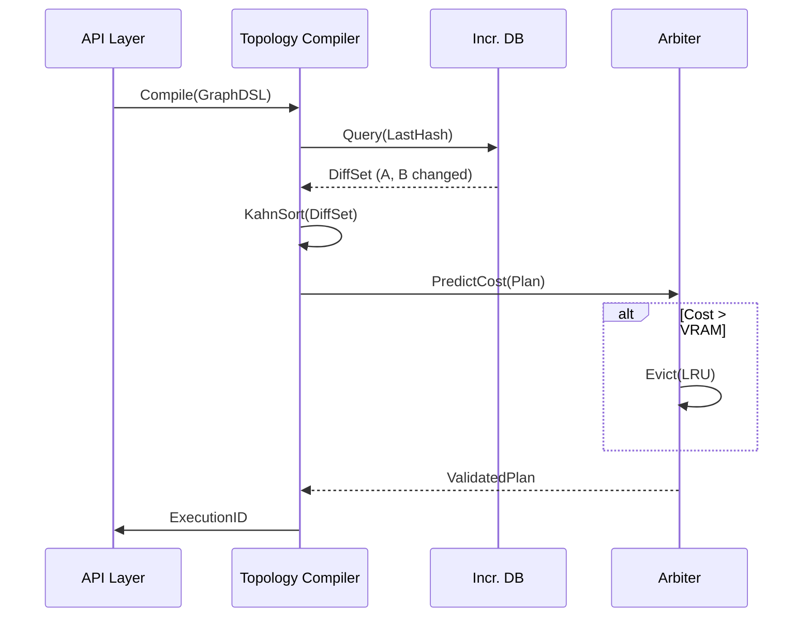
```mermaid
sequenceDiagram
    participant API as API Layer
    participant Comp as Topology Compiler
    participant Salsa as Incr. DB
    participant Mem as Arbiter
    
    API->>Comp: Compile(GraphDSL)
    Comp->>Salsa: Query(LastHash)
    Salsa-->>Comp: DiffSet (A, B changed)
    Comp->>Comp: KahnSort(DiffSet)
    Comp->>Mem: PredictCost(Plan)
    alt Cost > VRAM
        Mem->>Mem: Evict(LRU)
    end
    Mem-->>Comp: ValidatedPlan
    Comp->>API: ExecutionID
```

#### 3.5.2 Logic Trace: Salsa Hashing (Pseudocode)
```rust
fn compute_hash(node: Node) -> Hash {
    let mut hasher = Sha256::new();
    // 1. Structural Identity
    hasher.update(node.op_type.as_bytes());
    
    // 2. Parameter Identity (Canonical Sorted Order)
    for (k, v) in node.params.sorted_by_key(|k| k) {
        hasher.update(k);
        hasher.update(v.to_le_bytes());
    }
    
    // 3. Upstream Identity (Recursive)
    for parent in node.parents {
         hasher.update(get_last_hash(parent));
    }
    
    hasher.finalize()
}
```

---

### 3.6 Component Interface Specifications (CIS)

#### 3.6.1 Scheduler Trait (Rust)
The contract for the Topology Engine.
```rust
/// The primary interface for graph linearization.
pub trait Scheduler {
    /// Converts a raw graph into an executable sequence.
    /// 
    /// # Arguments
    /// * `graph` - The user-defined graph topology.
    /// 
    /// # Returns
    /// * `Ok(Vec<NodeID>)` - The order of execution.
    /// * `Err(VortexError::CycleDetected)` - If the graph is not a DAG.
    fn schedule(&self, graph: &GraphDSL) -> Result<Vec<NodeID>, VortexError>;

    /// Validates type compatibility between connected ports.
    fn validate_types(&self, graph: &GraphDSL) -> Vec<VortexError>;
}
```

#### 3.6.2 Memory Arbiter Trait (Rust)
The contract for VRAM management.
```rust
pub trait Arbiter {
    /// Predicts the peak memory usage of a plan.
    fn predict_usage(&self, plan: &[NodeID]) -> u64;

    /// Determines which tensors to evict to free up `needed` bytes.
    /// Uses LFU (Least Future Used) strategy.
    fn plan_eviction(&self, current_vram: u64, needed: u64, plan: &[NodeID]) -> Vec<TensorID>;
}
```

### 3.7 State Transition Matrices

#### 3.7.1 Job Lifecycle Matrix
Defines valid transitions for a `Job` entity.

| Current State | Event | Next State | Side Effects |
| :--- | :--- | :--- | :--- |
| **PENDING** | `Scheduler::Dispatch` | **RUNNING** | Notify Worker (IPC); Log Start Time. |
| **PENDING** | `User::Cancel` | **CANCELLED**| Remove from Queue. |
| **RUNNING** | `Worker::Result` | **COMPLETED**| Update Cache; Log End Time; Trigger Children. |
| **RUNNING** | `Worker::Error` | **FAILED** | Capture Stack Trace; Abort downstream. |
| **RUNNING** | `Worker::Timeout` | **FAILED** | Kill Worker PID; Respawn. |
| **COMPLETED** | `Cache::Invalidate` | **PENDING** | (Re-run required). |

---

### 3.8 Failure Mode & Effects Analysis (FMEA)

#### 3.8.1 Function: Topological Compilation
| ID | Failure Mode | Effect (Severity) | Cause (Occurrence) | Detection (Method) | Mitigation Strategy |
| :--- | :--- | :--- | :--- | :--- | :--- |
| **FM-01** | **Cyclic Dependency** | **Critical (10)**: Graph cannot execute; Infinite loop potential. | **Frequent (4)**: User connects Output A to Input B to Input A. | **Deterministic**: Kahn's Algorithm `Queue` emptiness check. | Reject compilation with `VE-001`; Highlight Cycle Edges in UI. |
| **FM-02** | **Type Mismatch** | **Moderate (5)**: Data corruption or Runtime Crash. | **Frequent (5)**: Connecting Float to Int. | **Static Analysis**: `validate_types()` pass before sort. | Auto-cast if possible; Else reject with `VE-002`. |
| **FM-03** | **Orphaned Node** | **Minor (2)**: Unreachable code; Wasted compile time. | **Occasional (3)**: Deleting a parent node. | **Analysis**: Node has `InDegree=0` but is not marked `Root`. | Prune from Execution Plan (Dead Code Elimination). |

#### 3.8.2 Function: Memory Arbitration
| ID | Failure Mode | Effect (Severity) | Cause (Occurrence) | Detection (Method) | Mitigation Strategy |
| :--- | :--- | :--- | :--- | :--- | :--- |
| **FM-04** | **soft-OOM** | **Major (7)**: Worker thrashing; extremely slow gen. | **Frequent (4)**: Loading 2x SDXL models on 8GB VRAM. | **Predictive**: `Cost(Plan) > VRAM_Available`. | Trigger `Evict(LFU)`; If `Evict` fails, switch to Tiled-VAE. |
| **FM-05** | **Hard-OOM** | **Catastrophic (10)**: OS kills Worker process. | **Rare (2)**: CUDA Driver fragmentation. | **Reactive**: `SIGCHLD` signal with `Code=137`. | Respawn Worker; Mark Job Failed `VE-003`. |

### 3.9 Interface Control Document (ICD) - Internal

#### 3.9.1 GraphDSL Field Constraints
Exact specification for the Input JSON schema to ensure Type Safety.

| Field | Type | Constraint | Description |
| :--- | :--- | :--- | :--- |
| `id` | `UUIDv4` | `^[0-9a-f]{8}-[0-9a-f]{4}-4[0-9a-f]{3}-[89ab][0-9a-f]{3}-[0-9a-f]{12}$` | Unique Identifier for Node. |
| `op_type` | `String` | `maxLength: 64`, `^[a-z0-9_]+::[a-z0-9_]+$` | Namespaced Operation ID (e.g. `loader::image`). |
| `inputs` | `Map` | `Keys` matching `Definition.inputs`; `Values` are valid `ConnectionID`. | Wiring definition. |
| `params` | `Any` | Must match `Definition.schema` types. | Literal configuration values (Int, String, Float). |

#### 3.9.2 Shared Memory Alignment (Detailed)
Memory alignment requirements for the Zero-Copy Transport.

| Region | Alignment | Padding | Rationale |
| :--- | :--- | :--- | :--- |
| **Header** | 64 Bytes | Yes | Cache Line alignment to prevent False Sharing between CPU Cores. |
| **Arrow Buffer**| 64 Bytes | Yes | AVX-512 Loop Optimization requirement. |
| **Tensor Data** | 256 Bytes| Yes | CUDA Memory Coalescing requirement (NVIDIA Best Practice). |

---

## 4. Verification & Validation (VCRM)

### 4.1 Verification Cross Reference Matrix
| Req ID | Requirement Summary | Method | Verification Procedure | Acceptance Criteria |
| :--- | :--- | :--- | :--- | :--- |
| **F-01** | Topological Compilation | **Test** | `tests/scheduler_test.rs::test_linear_chain` | Input `A->B->C` yields `Vec[A,B,C]`. |
| **F-01** | Cycle Detection | **Test** | `tests/scheduler_test.rs::test_cycle_error` | Input `A->B->A` returns `Err(CycleDetected)`. |
| **F-01** | Type Validation | **Test** | `tests/scheduler_test.rs::test_type_mismatch` | `Link(Int, Image)` returns `Err(TypeMismatch)`. |
| **F-02** | Incremental Hashing | **Test** | `tests/salsa_test.rs::test_param_change` | Changing `Node.seed` changes `Hash(Node)`. |
| **F-02** | Dirty Propagation | **Analysis** | `tests/salsa_test.rs::test_dirty_tree` | Changing Root forces new Hash on Leaf. |
| **F-03** | Memory Prediction | **Test** | `tests/arbiter_test.rs::test_cost_fn` | `Target(1024,1024,RGBA)` returns `4MB`. |
| **F-03** | Eviction Protocol | **Test** | `tests/arbiter_test.rs::test_oom_eviction` | Sim `Usage=Limit`. Trigger `Evict`. Verify `Free()` sent. |
| **REL-01** | Panic Catching | **Test** | `tests/ffi_safe.rs::test_panic_boundary` | Inject `panic!()` in FFI. Assert `Result::Err`. |
| **PERF-01**| Compile Speed | **Perf** | `benches/large_graph.rs` | Criterion output mean time < 5ms. |
| **SEC-01** | Seccomp Filter | **Test** | `tests/sandbox.rs::test_file_access` | `open("/etc/shadow")` returns `EACCES`. |
| **FM-01** | Cycle Mitigation | **Test** | `tests/fmea_test.rs::test_deep_cycle` | Chain of 1000 nodes with a back-link returns Error < 1ms. |
| **FM-04** | Soft-OOM Handling | **Sim** | `tests/arbiter_test.rs::test_fragmentation` | Allocate small chunks until limit, verify Eviction triggers safely. |

### 4.2 Error Code Registry (Appendix A)
| Code | Error Name | Description | Recovery Strategy |
| :--- | :--- | :--- | :--- |
| `VE-001` | `CycleDetected` | Graph contains a loop (A->B->A). | Return 400 Bad Request with Node IDs. |
| `VE-002` | `TypeMismatch` | Output `LATENT` connected to Input `IMAGE`. | Auto-insert `VAE Decode` node if valid. |
| `VE-003` | `ResourceExhausted` | VRAM request exceeds Hardware Limit + Swap. | Trigger Client-side Tiling Strategy. |
| `VE-004` | `WorkerGone` | IPC Socket closed unexpectedly (Segfault). | Re-spawn Worker; Retry job 3 times. |
| `VE-005` | `IntegrityError` | Hashes do not match Lockfile. | Abort Load; Prompt user to re-install. |

### 3.10 Module Flow Diagram
Detailed flow of the Core Engine Compilation and Scheduling logic.

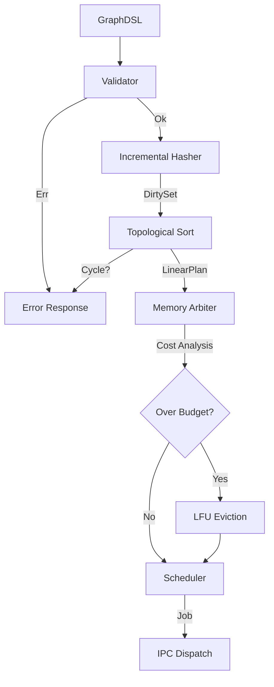
```mermaid
graph TD
    Input[GraphDSL] --> Val[Validator]
    Val -->|Ok| Hash[Incremental Hasher]
    Val -->|Err| Return[Error Response]
    Hash -->|DirtySet| Kahn[Topological Sort]
    Kahn -->|Cycle?| Return
    Kahn -->|LinearPlan| Arb[Memory Arbiter]
    Arb -->|Cost Analysis| Chk{Over Budget?}
    Chk -->|Yes| Evict[LFU Eviction]
    Chk -->|No| Sched[Scheduler]
    Evict --> Sched
    Sched -->|Job| IPC[IPC Dispatch]
```

---

## 5. Use Cases

### 5.1 UC-01: Execute User Graph

**Actor**: Frontend UI / REST Client

**Preconditions**:
- User has constructed a valid DAG in the Frontend.
- At least one Worker is running and idle.

**Main Success Scenario**:
1. User clicks "Run" button in Frontend.
2. Frontend sends `POST /graph/execution` with `GraphDSL` JSON.
3. Core Engine parses JSON into internal `GraphDSL` struct.
4. Validator checks for cycles using Kahn's Algorithm.
5. Validator checks type compatibility on all Links.
6. Hasher computes Merkle hashes for all nodes.
7. Hasher compares with cached hashes to determine Dirty Set.
8. Scheduler orders Dirty Set nodes topologically.
9. Arbiter predicts total VRAM cost.
10. Arbiter triggers LFU eviction if over budget.
11. Engine dispatches Jobs to Workers via IPC.
12. Workers execute and return results.
13. Engine updates cache with new outputs.
14. Engine sends completion status to Frontend via WebSocket.
15. Frontend displays output images.

**Extensions**:
- **4a. Cycle Detected**: Return `VE-001` error with participating node IDs. Abort.
- **5a. Type Mismatch**: Return `VE-002` error with source/target info. Abort.
- **9a. VRAM Exceeded**: Trigger tiling strategy or return `VE-003`. Abort.
- **12a. Worker Crash**: Log error, respawn Worker, retry up to 3 times.

**Postconditions**:
- All node outputs are cached in Salsa DB.
- All tensor data is stored in SHM cache.
- Run history is persisted to SQLite.

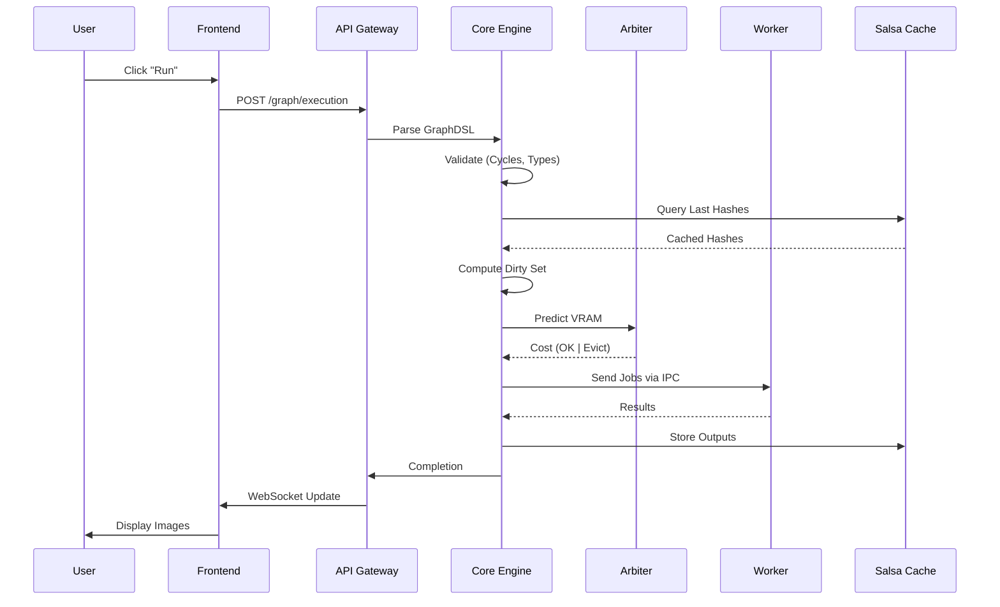
```mermaid
sequenceDiagram
    participant User
    participant Frontend
    participant API as API Gateway
    participant Core as Core Engine
    participant Arbiter
    participant Worker
    participant Cache as Salsa Cache

    User->>Frontend: Click "Run"
    Frontend->>API: POST /graph/execution
    API->>Core: Parse GraphDSL
    Core->>Core: Validate (Cycles, Types)
    Core->>Cache: Query Last Hashes
    Cache-->>Core: Cached Hashes
    Core->>Core: Compute Dirty Set
    Core->>Arbiter: Predict VRAM
    Arbiter-->>Core: Cost (OK | Evict)
    Core->>Worker: Send Jobs via IPC
    Worker-->>Core: Results
    Core->>Cache: Store Outputs
    Core->>API: Completion
    API->>Frontend: WebSocket Update
    Frontend->>User: Display Images
```

### 5.2 UC-02: Cancel Running Execution

**Actor**: Frontend UI / REST Client

**Preconditions**:
- An execution is currently in progress.
- At least one Job is in `RUNNING` state.

**Main Success Scenario**:
1. User clicks "Cancel" button.
2. Frontend sends `DELETE /graph/execution/{run_id}`.
3. Core Engine marks run as `CANCELLED`.
4. Engine sends `JobCancel` to all active Workers.
5. Workers abort current operation.
6. Workers return partial results (if any).
7. Engine cleans up partial tensors.
8. Engine sends cancellation confirmation to Frontend.

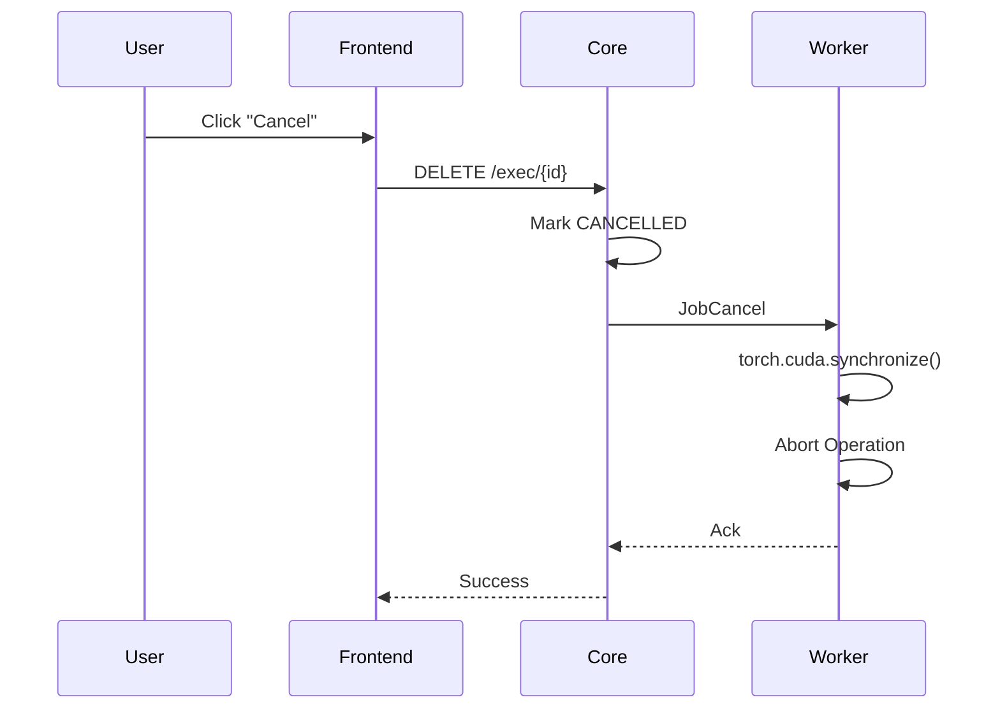
```mermaid
sequenceDiagram
    participant User
    participant Frontend
    participant Core
    participant Worker

    User->>Frontend: Click "Cancel"
    Frontend->>Core: DELETE /exec/{id}
    Core->>Core: Mark CANCELLED
    Core->>Worker: JobCancel
    Worker->>Worker: torch.cuda.synchronize()
    Worker->>Worker: Abort Operation
    Worker-->>Core: Ack
    Core-->>Frontend: Success
```

### 5.3 UC-03: Incremental Re-Execution

**Actor**: User modifying a parameter

**Preconditions**:
- Previous execution completed successfully.
- All outputs are cached.

**Main Success Scenario**:
1. User changes `seed` parameter on one node.
2. Frontend sends updated GraphDSL.
3. Core computes new Merkle hash for modified node.
4. Hash differs from cache → Node marked DIRTY.
5. All downstream nodes marked DIRTY (recursive).
6. Only DIRTY nodes are scheduled.
7. Execution completes faster than full run.

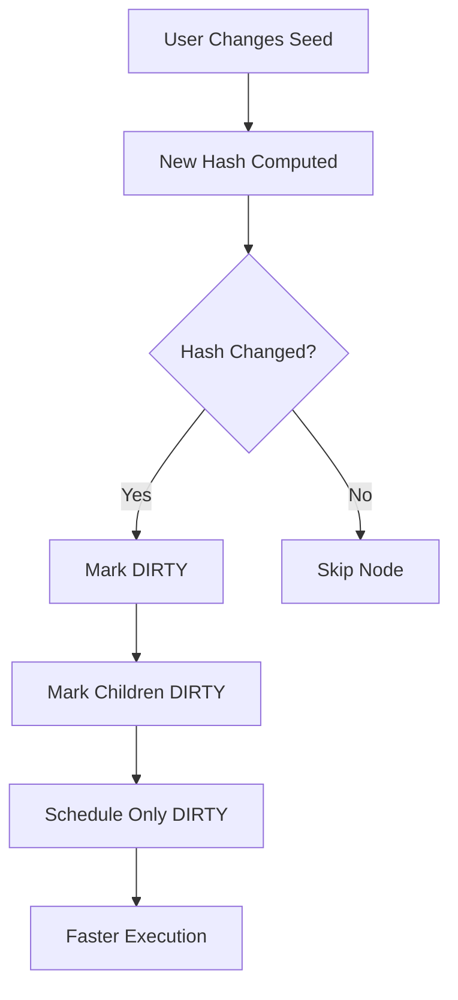
```mermaid
graph TD
    A[User Changes Seed] --> B[New Hash Computed]
    B --> C{Hash Changed?}
    C -->|Yes| D[Mark DIRTY]
    C -->|No| E[Skip Node]
    D --> F[Mark Children DIRTY]
    F --> G[Schedule Only DIRTY]
    G --> H[Faster Execution]
```

### 5.4 UC-04: Worker Crash Recovery

**Actor**: System (Supervisor)

**Preconditions**:
- Worker is processing a Job.
- Worker receives SIGSEGV.

**Main Success Scenario**:
1. Supervisor receives `SIGCHLD`.
2. Supervisor calls `waitpid()` to get exit status.
3. Status indicates crash (code != 0).
4. Supervisor identifies the crashed Worker's slot.
5. Supervisor marks Job as `FAILED`.
6. Supervisor marks Worker slot as `DEAD`.
7. Supervisor spawns new Worker process.
8. Supervisor retries the failed Job (up to 3 times).
9. If max retries exceeded, mark run as `FAILED`.

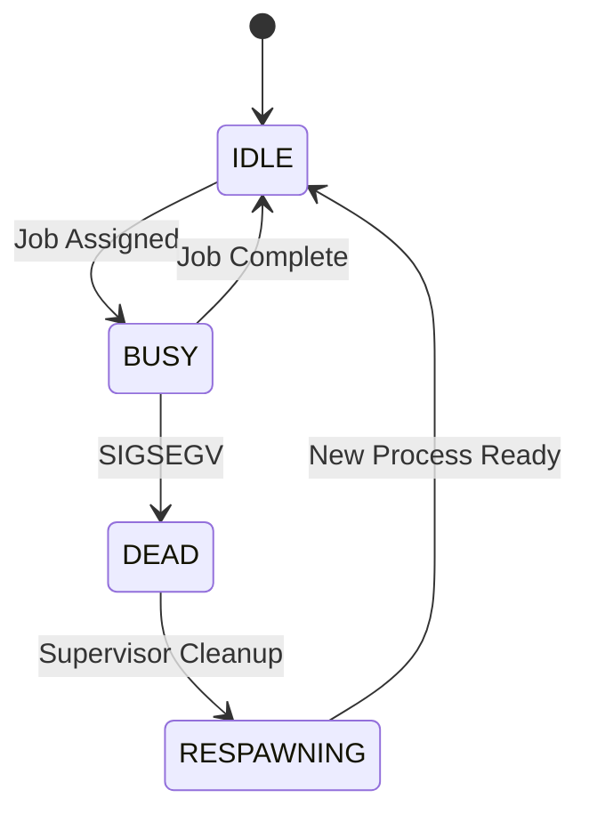
```mermaid
stateDiagram-v2
    [*] --> IDLE
    IDLE --> BUSY: Job Assigned
    BUSY --> IDLE: Job Complete
    BUSY --> DEAD: SIGSEGV
    DEAD --> RESPAWNING: Supervisor Cleanup
    RESPAWNING --> IDLE: New Process Ready
```

---

## 6. Detailed Algorithm Specifications

### 6.1 Kahn's Algorithm Deep Dive

The topological sort is implemented using Kahn's algorithm with the following pseudocode:

```
FUNCTION topological_sort(graph):
    in_degree = {} // Map: NodeID -> Integer
    queue = []     // Queue of nodes with in_degree 0
    result = []    // Final ordered list
    
    // Phase 1: Initialize in-degrees
    FOR EACH node IN graph.nodes:
        in_degree[node.id] = 0
    
    FOR EACH link IN graph.links:
        in_degree[link.target] += 1
    
    // Phase 2: Find roots (in_degree == 0)
    FOR EACH node IN graph.nodes:
        IF in_degree[node.id] == 0:
            queue.push(node.id)
    
    // Phase 3: Process queue (BFS)
    WHILE queue NOT EMPTY:
        current = queue.pop_front()
        result.push(current)
        
        // Reduce in-degree of children
        FOR EACH child IN graph.get_children(current):
            in_degree[child] -= 1
            IF in_degree[child] == 0:
                queue.push(child)
    
    // Phase 4: Cycle detection
    IF result.length != graph.nodes.length:
        cycle_nodes = GET_NODES_WITH_INDEGREE_GT_0(in_degree)
        RETURN Error::CycleDetected(cycle_nodes)
    
    RETURN result
```

**Time Complexity**: O(V + E) where V = nodes, E = edges
**Space Complexity**: O(V) for the in_degree map and queue

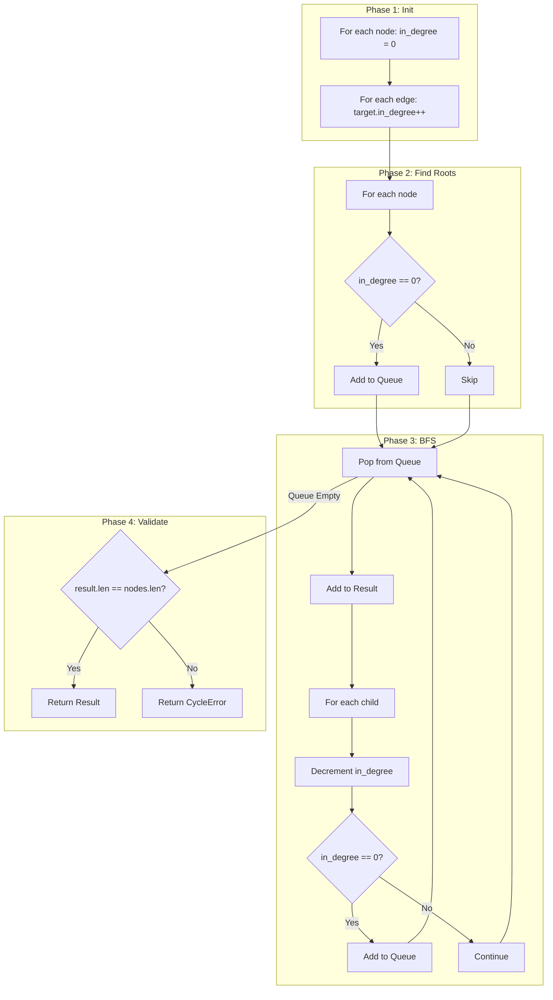
```mermaid
flowchart TD
    subgraph "Phase 1: Init"
        A1[For each node: in_degree = 0] --> A2[For each edge: target.in_degree++]
    end
    
    subgraph "Phase 2: Find Roots"
        B1[For each node] --> B2{in_degree == 0?}
        B2 -->|Yes| B3[Add to Queue]
        B2 -->|No| B4[Skip]
    end
    
    subgraph "Phase 3: BFS"
        C1[Pop from Queue] --> C2[Add to Result]
        C2 --> C3[For each child]
        C3 --> C4[Decrement in_degree]
        C4 --> C5{in_degree == 0?}
        C5 -->|Yes| C6[Add to Queue]
        C5 -->|No| C7[Continue]
    end
    
    subgraph "Phase 4: Validate"
        D1{result.len == nodes.len?}
        D1 -->|Yes| D2[Return Result]
        D1 -->|No| D3[Return CycleError]
    end
    
    A2 --> B1
    B3 --> C1
    B4 --> C1
    C6 --> C1
    C7 --> C1
    C1 -->|Queue Empty| D1
```

### 6.2 Merkle Hash Computation

Each node's identity is determined by a cryptographic hash that incorporates:
1. **Operation Type**: The node's operator (e.g., "KSampler")
2. **Parameters**: All configuration values in canonical sorted order
3. **Parent Hashes**: Recursive dependency on input nodes

```
FUNCTION compute_node_hash(node, graph):
    hasher = SHA256.new()
    
    // 1. Hash the operation type
    hasher.update(node.op_type.encode())
    
    // 2. Hash parameters in sorted order
    sorted_keys = SORT(node.params.keys())
    FOR EACH key IN sorted_keys:
        hasher.update(key.encode())
        hasher.update(SERIALIZE(node.params[key]))
    
    // 3. Hash parent outputs (recursive)
    parent_ids = graph.get_parents(node.id)
    FOR EACH parent_id IN SORT(parent_ids):
        parent_hash = GET_CACHED_HASH(parent_id)
        hasher.update(parent_hash)
    
    RETURN hasher.finalize()
```

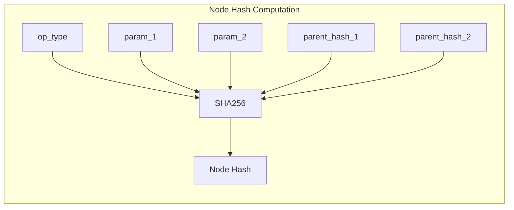
```mermaid
graph LR
    subgraph "Node Hash Computation"
        OP[op_type] --> H[SHA256]
        P1[param_1] --> H
        P2[param_2] --> H
        PH1[parent_hash_1] --> H
        PH2[parent_hash_2] --> H
        H --> NH[Node Hash]
    end
```

### 6.3 LFU Eviction Algorithm

The Least Future Used eviction strategy predicts which tensors will be needed furthest in the future:

```
FUNCTION plan_eviction(cache, execution_plan, needed_bytes):
    scored_tensors = []
    
    // Score each cached tensor by future distance
    FOR EACH tensor IN cache:
        future_use = FIND_NEXT_USE(tensor.id, execution_plan)
        IF future_use IS NULL:
            score = INFINITY  // Never used again, evict first
        ELSE:
            score = future_use.step_index
        
        scored_tensors.push((tensor, score))
    
    // Sort by score (descending - furthest first)
    SORT(scored_tensors, BY score DESC)
    
    // Select tensors to evict
    freed = 0
    to_evict = []
    
    FOR EACH (tensor, score) IN scored_tensors:
        IF freed >= needed_bytes:
            BREAK
        to_evict.push(tensor.id)
        freed += tensor.size_bytes
    
    RETURN to_evict
```

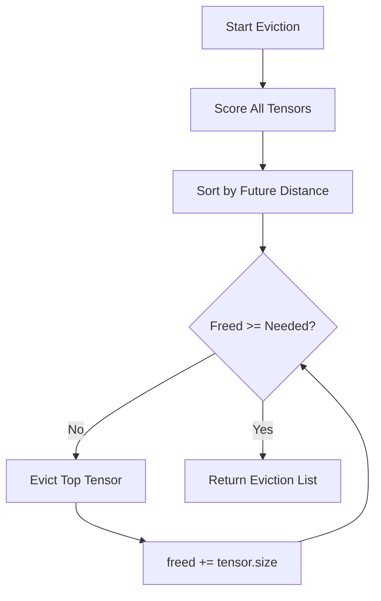
```mermaid
flowchart TD
    A[Start Eviction] --> B[Score All Tensors]
    B --> C[Sort by Future Distance]
    C --> D{Freed >= Needed?}
    D -->|No| E[Evict Top Tensor]
    E --> F[freed += tensor.size]
    F --> D
    D -->|Yes| G[Return Eviction List]
```

---

## 7. Security Requirements

### 7.1 Authentication and Authorization

| Req ID | Requirement | Priority |
| :--- | :--- | :--- |
| **SEC-AUTH-01** | The API Gateway MUST authenticate all requests using JWT tokens. | MUST |
| **SEC-AUTH-02** | JWT tokens MUST be validated against a configurable secret. | MUST |
| **SEC-AUTH-03** | Expired tokens (>24h by default) MUST be rejected. | MUST |
| **SEC-AUTHZ-01** | Resource access MUST be controlled via role-based permissions. | MUST |
| **SEC-AUTHZ-02** | Admin roles MUST be able to view all execution history. | SHOULD |
| **SEC-AUTHZ-03** | Regular users MUST only see their own executions. | MUST |

### 7.2 Data Protection

| Req ID | Requirement | Priority |
| :--- | :--- | :--- |
| **SEC-DATA-01** | All API communication MUST use TLS 1.3. | MUST |
| **SEC-DATA-02** | SQLite database MUST be encrypted using SQLCipher. | SHOULD |
| **SEC-DATA-03** | Shared memory segments MUST have restrictive permissions (0600). | MUST |
| **SEC-DATA-04** | Tensor data in SHM MUST be zeroed before deallocation. | SHOULD |

### 7.3 Input Validation

| Req ID | Requirement | Priority |
| :--- | :--- | :--- |
| **SEC-INPUT-01** | GraphDSL JSON MUST be validated against schema before parsing. | MUST |
| **SEC-INPUT-02** | Node IDs MUST match UUID v4 format. | MUST |
| **SEC-INPUT-03** | Parameter values MUST be type-checked against node definitions. | MUST |
| **SEC-INPUT-04** | Maximum graph size MUST be enforced (10,000 nodes). | MUST |
| **SEC-INPUT-05** | Maximum parameter string length MUST be enforced (1MB). | MUST |

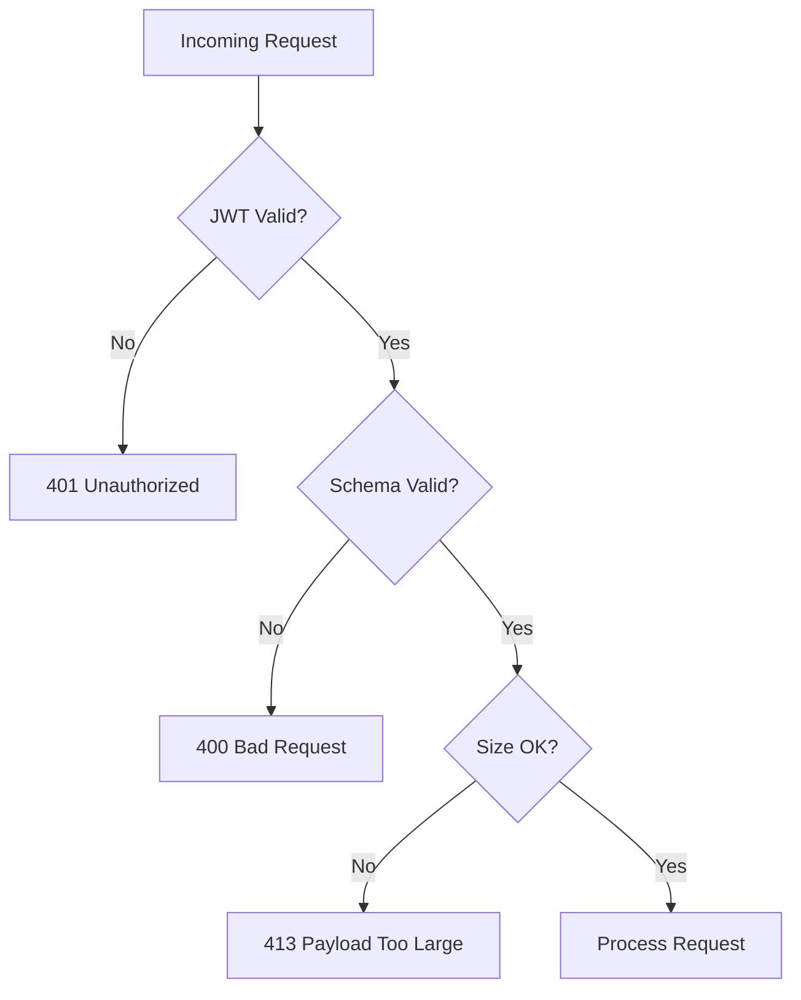
```mermaid
flowchart TD
    REQ[Incoming Request] --> JWT{JWT Valid?}
    JWT -->|No| R401[401 Unauthorized]
    JWT -->|Yes| SCHEMA{Schema Valid?}
    SCHEMA -->|No| R400[400 Bad Request]
    SCHEMA -->|Yes| SIZE{Size OK?}
    SIZE -->|No| R413[413 Payload Too Large]
    SIZE -->|Yes| PROCESS[Process Request]
```

### 7.4 Audit Logging

| Req ID | Requirement | Priority |
| :--- | :--- | :--- |
| **SEC-AUDIT-01** | All graph executions MUST be logged with timestamp and user ID. | MUST |
| **SEC-AUDIT-02** | All authentication failures MUST be logged. | MUST |
| **SEC-AUDIT-03** | All worker crashes MUST be logged with stack trace. | MUST |
| **SEC-AUDIT-04** | Logs MUST be rotated daily and retained for 30 days. | SHOULD |
| **SEC-AUDIT-05** | Logs MUST NOT contain raw tensor data or sensitive params. | MUST |

---

## 8. Reliability Requirements

### 8.1 Availability

| Req ID | Requirement | Target |
| :--- | :--- | :--- |
| **REL-AVAIL-01** | Core Engine uptime | 99.9% (8.76 hours downtime/year) |
| **REL-AVAIL-02** | Maximum unplanned restart time | < 30 seconds |
| **REL-AVAIL-03** | Graceful degradation under high load | Required |

### 8.2 Fault Tolerance

| Req ID | Requirement | Priority |
| :--- | :--- | :--- |
| **REL-FAULT-01** | Worker crashes MUST NOT crash the Core Engine. | MUST |
| **REL-FAULT-02** | Database corruption MUST trigger automatic recovery. | MUST |
| **REL-FAULT-03** | Network failures MUST trigger automatic retry (3x). | MUST |
| **REL-FAULT-04** | OOM conditions MUST trigger graceful eviction, not crash. | MUST |

### 8.3 Recovery

| Req ID | Requirement | Priority |
| :--- | :--- | :--- |
| **REL-REC-01** | System state MUST be persisted to disk every 1 second. | MUST |
| **REL-REC-02** | On restart, system MUST recover from last checkpoint. | MUST |
| **REL-REC-03** | Interrupted jobs MUST be resumable from last checkpoint. | SHOULD |

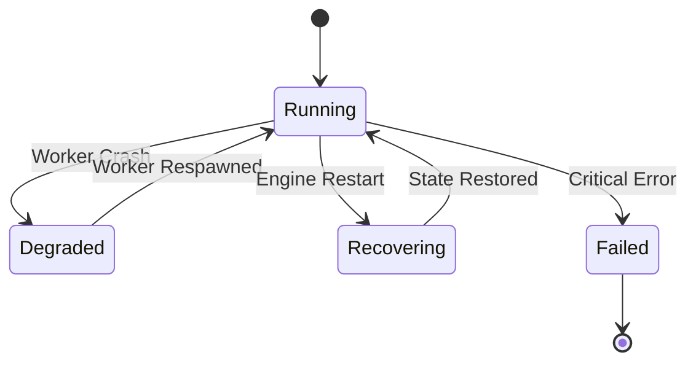
```mermaid
stateDiagram-v2
    [*] --> Running
    Running --> Degraded: Worker Crash
    Degraded --> Running: Worker Respawned
    Running --> Recovering: Engine Restart
    Recovering --> Running: State Restored
    Running --> Failed: Critical Error
    Failed --> [*]
```

---

## 9. Maintainability Requirements

### 9.1 Code Quality

| Req ID | Requirement | Target |
| :--- | :--- | :--- |
| **MAINT-CODE-01** | Code coverage | > 80% |
| **MAINT-CODE-02** | Cyclomatic complexity per function | < 10 |
| **MAINT-CODE-03** | Documentation coverage | 100% public API |
| **MAINT-CODE-04** | Lint warnings | 0 (Clippy) |

### 9.2 Logging

| Req ID | Requirement | Priority |
| :--- | :--- | :--- |
| **MAINT-LOG-01** | All public functions MUST have entry/exit logging at TRACE level. | MUST |
| **MAINT-LOG-02** | All errors MUST be logged at ERROR level with context. | MUST |
| **MAINT-LOG-03** | Performance-critical paths MUST have timing logs at DEBUG level. | SHOULD |
| **MAINT-LOG-04** | Structured logging (JSON) MUST be supported. | MUST |

### 9.3 Configuration

| Req ID | Requirement | Priority |
| :--- | :--- | :--- |
| **MAINT-CFG-01** | All tunables MUST be configurable via environment variables. | MUST |
| **MAINT-CFG-02** | Configuration MUST be loadable from TOML file. | MUST |
| **MAINT-CFG-03** | Invalid configuration MUST fail-fast on startup. | MUST |
| **MAINT-CFG-04** | Default configuration MUST be production-safe. | MUST |

---

## 10. Performance Requirements

### 10.1 Latency Budgets

| Operation | Budget | Measurement |
| :--- | :--- | :--- |
| GraphDSL Parse | < 1ms | 1000-node graph |
| Topological Sort | < 5ms | 10,000-node graph |
| Hash Computation | < 10ms | Full graph, no cache |
| Dirty Set Calculation | < 1ms | With cache |
| IPC Round-Trip | < 50μs | Job dispatch |
| WebSocket Broadcast | < 1ms | State update |

### 10.2 Throughput

| Metric | Target |
| :--- | :--- |
| Concurrent executions | 8 |
| Jobs dispatched/second | 1000 |
| WebSocket connections | 100 |
| API requests/second | 500 |

### 10.3 Resource Utilization

| Resource | Limit |
| :--- | :--- |
| Core Engine RAM | < 500 MB |
| Core Engine CPU (idle) | < 1% |
| Core Engine CPU (active) | < 50% |
| SQLite database size | < 1 GB |
| Log file size | < 100 MB/day |

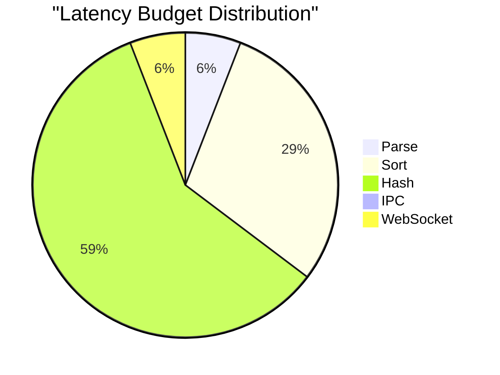
```mermaid
pie title "Latency Budget Distribution"
    "Parse" : 1
    "Sort" : 5
    "Hash" : 10
    "IPC" : 0.05
    "WebSocket" : 1
```

---

## Appendix A: Complete Error Code Reference

| Code | Name | Severity | Description | HTTP Status | Recovery |
| :--- | :--- | :--- | :--- | :--- | :--- |
| VE-001 | CycleDetected | ERROR | Graph contains cycle | 400 | Fix graph structure |
| VE-002 | TypeMismatch | ERROR | Incompatible port types | 400 | Add converter node |
| VE-003 | ResourceExhausted | ERROR | VRAM limit exceeded | 507 | Enable tiling |
| VE-004 | WorkerGone | WARN | Worker process died | 500 | Auto-retry |
| VE-005 | IntegrityError | ERROR | Hash mismatch | 500 | Reinstall package |
| VE-006 | Timeout | WARN | Operation exceeded limit | 504 | Retry with smaller graph |
| VE-007 | InvalidSchema | ERROR | JSON schema violation | 400 | Fix JSON format |
| VE-008 | NodeNotFound | ERROR | Reference to unknown node | 400 | Add missing node |
| VE-009 | PortNotFound | ERROR | Reference to unknown port | 400 | Check port name |
| VE-010 | DuplicateID | ERROR | Two nodes have same ID | 400 | Regenerate UUID |
| VE-011 | LoopbackConnection | ERROR | Node connected to itself | 400 | Remove self-link |
| VE-012 | OrphanNode | WARN | Node with no connections | 200 | Informational only |
| VE-013 | DatabaseError | ERROR | SQLite operation failed | 500 | Check disk space |
| VE-014 | ShmError | ERROR | Shared memory error | 500 | Restart engine |
| VE-015 | IpcError | ERROR | Socket communication error | 500 | Restart worker |

---

## Appendix B: Configuration Reference

```toml
# vortex-core.toml - Core Engine Configuration

[server]
host = "127.0.0.1"
port = 8080
workers = 4
max_connections = 100

[database]
path = "~/.vortex/vortex.db"
max_connections = 5
journal_mode = "WAL"

[cache]
max_tensor_cache_mb = 8192
eviction_strategy = "LFU"
hash_algorithm = "SHA256"

[execution]
max_concurrent_runs = 8
job_timeout_seconds = 300
max_retries = 3

[limits]
max_graph_nodes = 10000
max_parameter_size_bytes = 1048576
max_request_size_bytes = 10485760

[logging]
level = "INFO"
format = "JSON"
output = "~/.vortex/logs/core.log"
rotation = "daily"
retention_days = 30

[security]
jwt_secret_path = "~/.vortex/jwt.secret"
tls_cert_path = "~/.vortex/cert.pem"
tls_key_path = "~/.vortex/key.pem"

[shm]
name = "/vtx_shm"
size_bytes = 68719476736  # 64 GB
permissions = 0o600
```

---

## Appendix C: API Endpoint Reference

### POST /graph/execution

**Description**: Submit a graph for execution.

**Request**:
```json
{
  "$schema": "http://vortex.ai/schemas/v3/graph.json",
  "version": "3.0.0",
  "nodes": {
    "node_1": {
      "id": "node_1",
      "op_type": "Loader::Image",
      "params": {"path": {"type": "STRING", "value": "/data/input.png"}}
    }
  },
  "links": []
}
```

**Response (200)**:
```json
{
  "run_id": "abc123-...",
  "status": "RUNNING",
  "nodes_total": 5,
  "nodes_dirty": 2
}
```

**Response (400)**:
```json
{
  "error": {
    "code": "VE-001",
    "message": "CycleDetected: Nodes A, B form a cycle"
  }
}
```

### GET /graph/execution/{id}

**Description**: Get execution status.

**Response (200)**:
```json
{
  "run_id": "abc123-...",
  "status": "COMPLETED",
  "started_at": 1704552000,
  "completed_at": 1704552030,
  "nodes_completed": 5,
  "nodes_total": 5
}
```

### DELETE /graph/execution/{id}

**Description**: Cancel running execution.

**Response (200)**:
```json
{
  "run_id": "abc123-...",
  "status": "CANCELLED"
}
```

### WS /ws/gateway

**Description**: WebSocket for real-time updates.

**Message Types**:
```json
// Server -> Client: Progress Update
{
  "type": "PROGRESS",
  "run_id": "abc123-...",
  "node_id": "node_5",
  "status": "COMPLETED",
  "percentage": 80
}

// Server -> Client: Node Output
{
  "type": "OUTPUT",
  "run_id": "abc123-...",
  "node_id": "node_5",
  "output_handle": 12345678
}

// Server -> Client: Error
{
  "type": "ERROR",
  "run_id": "abc123-...",
  "error": {"code": "VE-004", "message": "Worker crashed"}
}
```

---

## Appendix D: Database Schema

```sql
-- Table: runs
-- Stores execution history
CREATE TABLE runs (
    id TEXT PRIMARY KEY NOT NULL,
    graph_hash TEXT NOT NULL,
    status TEXT CHECK(status IN ('PENDING', 'RUNNING', 'COMPLETED', 'FAILED', 'CANCELLED')),
    created_at INTEGER NOT NULL,
    started_at INTEGER,
    completed_at INTEGER,
    user_id TEXT,
    error_json TEXT,
    
    -- Indexes
    CREATE INDEX idx_runs_status ON runs(status);
    CREATE INDEX idx_runs_user ON runs(user_id);
    CREATE INDEX idx_runs_created ON runs(created_at);
);

-- Table: run_nodes
-- Stores per-node execution metrics
CREATE TABLE run_nodes (
    run_id TEXT NOT NULL REFERENCES runs(id),
    node_id TEXT NOT NULL,
    node_hash TEXT NOT NULL,
    status TEXT CHECK(status IN ('PENDING', 'RUNNING', 'COMPLETED', 'FAILED', 'SKIPPED')),
    worker_pid INTEGER,
    started_at INTEGER,
    completed_at INTEGER,
    duration_us INTEGER,
    peak_vram_mb INTEGER,
    error_json TEXT,
    
    PRIMARY KEY (run_id, node_id)
);

-- Table: cache_entries
-- Stores cached node outputs
CREATE TABLE cache_entries (
    node_hash TEXT PRIMARY KEY NOT NULL,
    shm_offset INTEGER NOT NULL,
    size_bytes INTEGER NOT NULL,
    dtype TEXT NOT NULL,
    shape TEXT NOT NULL, -- JSON array
    created_at INTEGER NOT NULL,
    last_accessed_at INTEGER NOT NULL,
    access_count INTEGER DEFAULT 1
);

-- Table: workers
-- Stores worker registration
CREATE TABLE workers (
    id TEXT PRIMARY KEY NOT NULL,
    slot_id INTEGER UNIQUE NOT NULL,
    pid INTEGER NOT NULL,
    status TEXT CHECK(status IN ('IDLE', 'BUSY', 'DEAD')),
    capabilities TEXT, -- JSON array
    registered_at INTEGER NOT NULL,
    last_heartbeat INTEGER NOT NULL
);
```

---

## Appendix E: Mermaid Diagram Collection

### E.1 Complete System Architecture
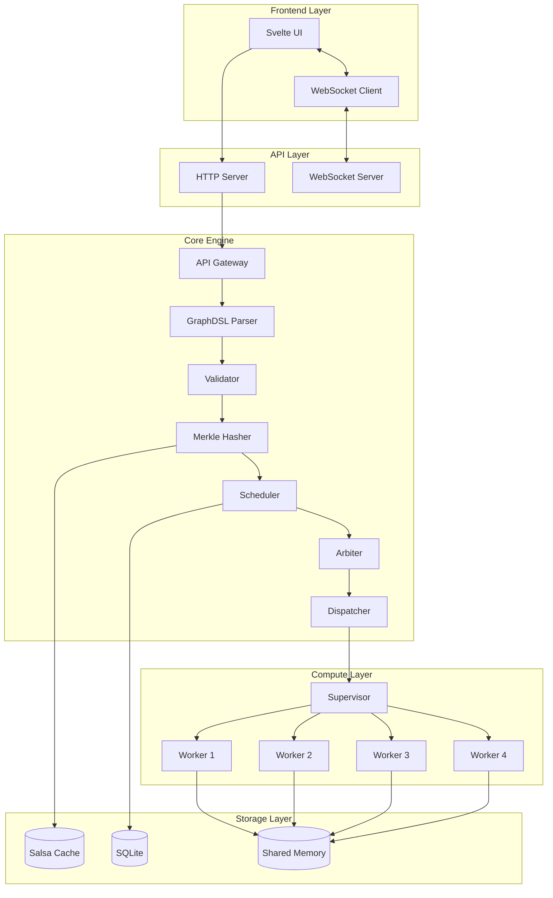
```mermaid
graph TB
    subgraph "Frontend Layer"
        UI[Svelte UI]
        WS[WebSocket Client]
    end
    
    subgraph "API Layer"
        HTTP[HTTP Server]
        WSS[WebSocket Server]
    end
    
    subgraph "Core Engine"
        API_GW[API Gateway]
        PARSER[GraphDSL Parser]
        VALIDATOR[Validator]
        HASHER[Merkle Hasher]
        SCHED[Scheduler]
        ARB[Arbiter]
        DISPATCH[Dispatcher]
    end
    
    subgraph "Storage Layer"
        SALSA[(Salsa Cache)]
        SQLITE[(SQLite)]
        SHM[(Shared Memory)]
    end
    
    subgraph "Compute Layer"
        SUP[Supervisor]
        W1[Worker 1]
        W2[Worker 2]
        W3[Worker 3]
        W4[Worker 4]
    end
    
    UI --> HTTP
    UI <--> WS
    WS <--> WSS
    HTTP --> API_GW
    API_GW --> PARSER
    PARSER --> VALIDATOR
    VALIDATOR --> HASHER
    HASHER --> SALSA
    HASHER --> SCHED
    SCHED --> ARB
    ARB --> DISPATCH
    DISPATCH --> SUP
    SUP --> W1 & W2 & W3 & W4
    W1 & W2 & W3 & W4 --> SHM
    SCHED --> SQLITE
```

### E.2 Execution State Machine
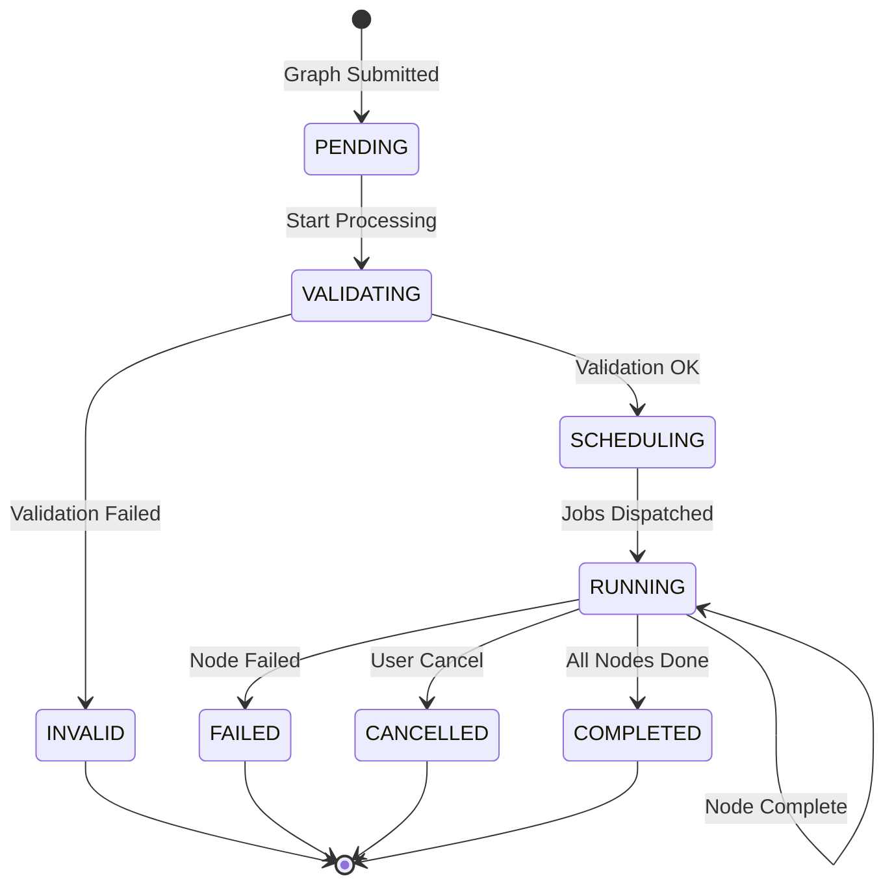
```mermaid
stateDiagram-v2
    [*] --> PENDING: Graph Submitted
    PENDING --> VALIDATING: Start Processing
    VALIDATING --> INVALID: Validation Failed
    INVALID --> [*]
    VALIDATING --> SCHEDULING: Validation OK
    SCHEDULING --> RUNNING: Jobs Dispatched
    RUNNING --> RUNNING: Node Complete
    RUNNING --> FAILED: Node Failed
    RUNNING --> CANCELLED: User Cancel
    RUNNING --> COMPLETED: All Nodes Done
    FAILED --> [*]
    CANCELLED --> [*]
    COMPLETED --> [*]
```

### E.3 Memory Management Flow
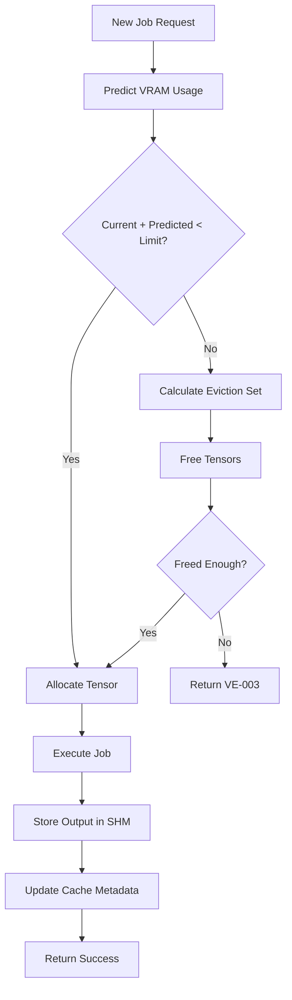
```mermaid
flowchart TD
    START[New Job Request] --> PREDICT[Predict VRAM Usage]
    PREDICT --> CHECK{Current + Predicted < Limit?}
    CHECK -->|Yes| ALLOC[Allocate Tensor]
    CHECK -->|No| EVICT[Calculate Eviction Set]
    EVICT --> FREE[Free Tensors]
    FREE --> CHECK2{Freed Enough?}
    CHECK2 -->|Yes| ALLOC
    CHECK2 -->|No| ERROR[Return VE-003]
    ALLOC --> EXECUTE[Execute Job]
    EXECUTE --> STORE[Store Output in SHM]
    STORE --> UPDATE[Update Cache Metadata]
    UPDATE --> DONE[Return Success]
```

### E.4 Worker Lifecycle
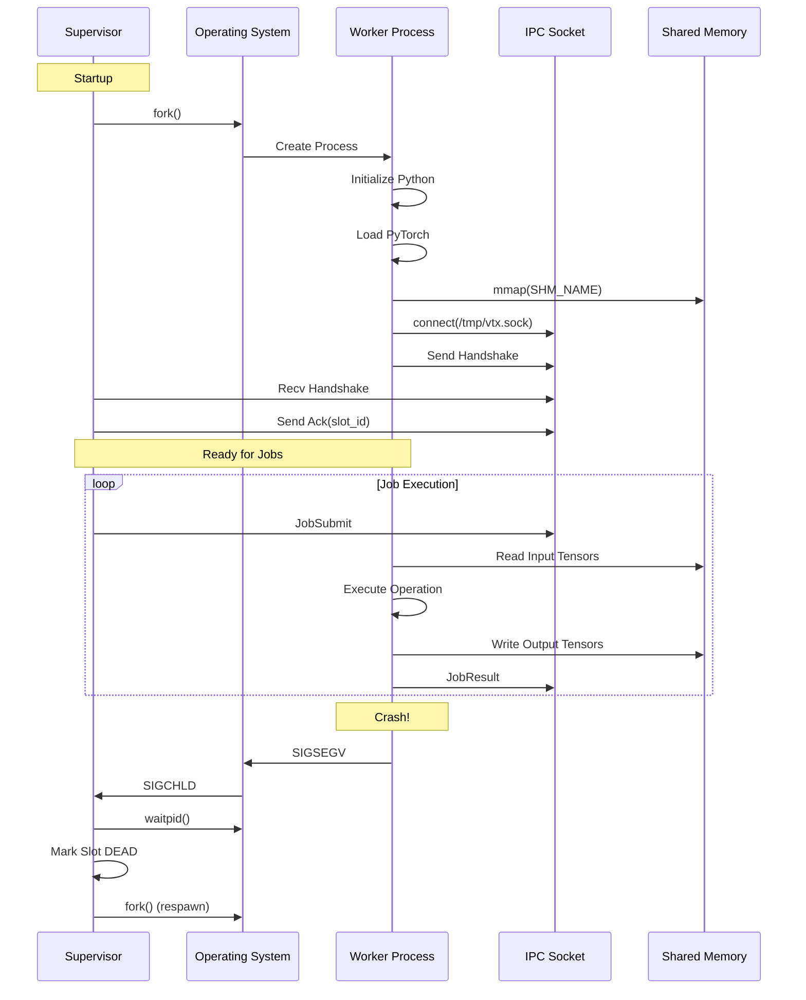
```mermaid
sequenceDiagram
    participant SUP as Supervisor
    participant OS as Operating System
    participant WRK as Worker Process
    participant IPC as IPC Socket
    participant SHM as Shared Memory

    Note over SUP: Startup
    SUP->>OS: fork()
    OS->>WRK: Create Process
    WRK->>WRK: Initialize Python
    WRK->>WRK: Load PyTorch
    WRK->>SHM: mmap(SHM_NAME)
    WRK->>IPC: connect(/tmp/vtx.sock)
    WRK->>IPC: Send Handshake
    SUP->>IPC: Recv Handshake
    SUP->>IPC: Send Ack(slot_id)
    Note over SUP,WRK: Ready for Jobs
    
    loop Job Execution
        SUP->>IPC: JobSubmit
        WRK->>SHM: Read Input Tensors
        WRK->>WRK: Execute Operation
        WRK->>SHM: Write Output Tensors
        WRK->>IPC: JobResult
    end
    
    Note over WRK: Crash!
    WRK->>OS: SIGSEGV
    OS->>SUP: SIGCHLD
    SUP->>OS: waitpid()
    SUP->>SUP: Mark Slot DEAD
    SUP->>OS: fork() (respawn)
```

---

## Appendix F: Glossary

| Term | Definition |
| :--- | :--- |
| **Arbiter** | The component responsible for VRAM management and eviction decisions. |
| **Cache Hit** | When a node's output is found in cache and reused. |
| **Cache Miss** | When a node must be recomputed because no cached output exists. |
| **Centaur** | The architectural pattern using Rust for control and Python for compute. |
| **Dirty Node** | A node whose hash differs from the cached hash, requiring recomputation. |
| **Eviction** | The process of removing tensors from GPU memory to make room for new ones. |
| **Execution Plan** | The ordered list of nodes to execute, produced by the scheduler. |
| **GraphDSL** | The JSON format for representing node graphs. |
| **Incremental Computation** | Reusing previous results when only parts of the graph change. |
| **Job** | A single unit of work dispatched to a worker. |
| **Kahn's Algorithm** | A BFS-based algorithm for topological sorting. |
| **LFU** | Least Future Used - eviction strategy prioritizing tensors used furthest in future. |
| **Merkle Hash** | A hash that incorporates the hashes of dependencies. |
| **Node** | A single operation in the workflow graph. |
| **Port** | An input or output connection point on a node. |
| **Run** | A complete execution of a graph from start to finish. |
| **Salsa** | The Rust framework used for incremental memoization. |
| **Scheduler** | The component that determines execution order of nodes. |
| **Slot** | A reserved position in shared memory for a worker. |
| **Supervisor** | The component managing worker processes. |
| **Tensor** | A multi-dimensional array of numerical data. |
| **Topological Sort** | Ordering nodes so dependencies always come before dependents. |
| **VRAM** | Video RAM - GPU memory used for tensors. |
| **Worker** | A Python process that executes compute operations. |

---

## Appendix G: Mathematical Specifications

### G.1 Merkle Hash Computation

The hash of a node $n$ is computed recursively over its structural identity, parameters, and upstream dependencies:

$$
H(n) = \text{SHA256}\left( \text{op}(n) \;\|\; \bigoplus_{k \in \text{params}(n)} (k \| v_k) \;\|\; \bigoplus_{p \in \text{parents}(n)} H(p) \right)
$$

Where:
- $\text{op}(n)$ is the operation type string (e.g., "KSampler")
- $\|$ denotes concatenation
- $\bigoplus$ denotes ordered concatenation over sorted keys
- $\text{parents}(n)$ are the upstream dependencies

**Collision Resistance**: $P(\text{collision}) < 2^{-128}$ for SHA256 truncated to 256 bits.

### G.2 Kahn's Topological Sort Complexity

Given a DAG $G = (V, E)$ with $|V| = n$ nodes and $|E| = m$ edges:

| Operation | Time Complexity | Space Complexity |
|-----------|-----------------|------------------|
| Initialize in-degree | $O(m)$ | $O(n)$ |
| BFS traversal | $O(n + m)$ | $O(n)$ queue |
| **Total** | $O(n + m)$ | $O(n)$ |

**Cycle Detection Invariant**:
$$
\text{cycle\_exists} \iff |\text{sorted}| < |V|
$$

### G.3 Dirty Set Propagation

The dirty set $D$ after modifying node $n$ is the transitive closure of its descendants:

$$
D(n) = \{n\} \cup \bigcup_{c \in \text{children}(n)} D(c)
$$

**Complexity**: $O(|D|)$ where $|D| \leq |V|$.

**Incremental Invalidation Rule**:
$$
\text{is\_dirty}(v) = \begin{cases}
\text{true} & \text{if } H_{\text{new}}(v) \neq H_{\text{cached}}(v) \\
\text{false} & \text{otherwise}
\end{cases}
$$

### G.4 VRAM Cost Prediction Model

For a tensor $T$ with shape $(d_1, d_2, \ldots, d_k)$ and data type $\tau$:

$$
\text{size}(T) = \left( \prod_{i=1}^{k} d_i \right) \cdot \text{sizeof}(\tau)
$$

Total execution cost for plan $P = [n_1, n_2, \ldots, n_m]$:

$$
\text{VRAM}_{\text{peak}}(P) = \max_{t \in [1,m]} \sum_{i \leq t} \left( \text{size}(\text{out}(n_i)) - \sum_{j < i} \mathbb{1}[\text{last\_use}(n_j) = t] \cdot \text{size}(\text{out}(n_j)) \right)
$$

Where $\mathbb{1}[\cdot]$ is the indicator function.

### G.5 LFU Eviction Scoring Function

The eviction score $S(t)$ for tensor $t$ in the context of execution plan $P$:

$$
S(t) = \begin{cases}
+\infty & \text{if } t \notin \text{future\_uses}(P) \\
\min\{i : P[i] \text{ uses } t\} & \text{otherwise}
\end{cases}
$$

**Eviction Order**: Sort by $S(t)$ descending (highest score = least future use = evict first).

**Optimal Eviction Theorem** (Bélády's MIN):
> The LFU strategy minimizes cache misses when future access patterns are known.

### G.6 Cache Hit Rate Model

Expected cache hit rate $\rho$ for a workflow executed $k$ times with unchanged parameters:

$$
\rho = \frac{k-1}{k} \cdot \frac{|\text{cached}|}{|\text{total}|}
$$

As $k \to \infty$, $\rho \to \frac{|\text{cached}|}{|\text{total}|}$.

### G.7 IPC Latency Model

Round-trip time for a job with payload size $s$ bytes:

$$
\text{RTT}(s) = 2 \cdot t_{\text{syscall}} + \frac{s}{B_{\text{socket}}} + t_{\text{process}}
$$

Where:
- $t_{\text{syscall}} \approx 1\mu s$ (Unix domain socket overhead)
- $B_{\text{socket}} \approx 6 \text{ GB/s}$ (local socket bandwidth)
- $t_{\text{process}}$ = GPU execution time

### G.8 Worker Pool Throughput

Maximum throughput $\Theta$ with $W$ workers and average job time $\bar{t}$:

$$
\Theta = \frac{W}{\bar{t}} \quad \text{jobs/second}
$$

**Utilization**:
$$
U = \frac{\lambda}{\Theta} = \frac{\lambda \cdot \bar{t}}{W}
$$

Where $\lambda$ is the arrival rate. System is stable iff $U < 1$.

### G.9 Memory Fragmentation Metric

External fragmentation ratio $F$:

$$
F = 1 - \frac{\text{largest\_free\_block}}{\text{total\_free}}
$$

**Defragmentation Trigger**: When $F > 0.3$ and $\text{total\_free} > \text{required}$.

### G.10 Retry Probability and Backoff

Probability of success after $n$ retries with independent failure probability $p$:

$$
P(\text{success by attempt } n) = 1 - p^n
$$

Exponential backoff delay:
$$
\text{delay}(n) = \min(t_{\text{base}} \cdot 2^n, t_{\text{max}})
$$

With $t_{\text{base}} = 100\text{ms}$, $t_{\text{max}} = 5000\text{ms}$.

---

## Appendix H: UML Class Diagrams

### G.1 Core Engine Class Structure

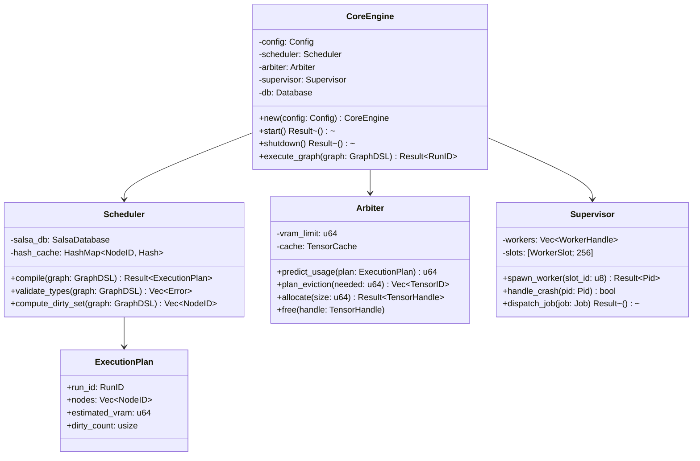
```mermaid
classDiagram
    class CoreEngine {
        -config: Config
        -scheduler: Scheduler
        -arbiter: Arbiter
        -supervisor: Supervisor
        -db: Database
        +new(config: Config) CoreEngine
        +start() Result~()~
        +shutdown() Result~()~
        +execute_graph(graph: GraphDSL) Result~RunID~
    }
    
    class Scheduler {
        -salsa_db: SalsaDatabase
        -hash_cache: HashMap~NodeID, Hash~
        +compile(graph: GraphDSL) Result~ExecutionPlan~
        +validate_types(graph: GraphDSL) Vec~Error~
        +compute_dirty_set(graph: GraphDSL) Vec~NodeID~
    }
    
    class Arbiter {
        -vram_limit: u64
        -cache: TensorCache
        +predict_usage(plan: ExecutionPlan) u64
        +plan_eviction(needed: u64) Vec~TensorID~
        +allocate(size: u64) Result~TensorHandle~
        +free(handle: TensorHandle)
    }
    
    class Supervisor {
        -workers: Vec~WorkerHandle~
        -slots: [WorkerSlot; 256]
        +spawn_worker(slot_id: u8) Result~Pid~
        +handle_crash(pid: Pid) bool
        +dispatch_job(job: Job) Result~()~
    }
    
    class ExecutionPlan {
        +run_id: RunID
        +nodes: Vec~NodeID~
        +estimated_vram: u64
        +dirty_count: usize
    }
    
    CoreEngine --> Scheduler
    CoreEngine --> Arbiter
    CoreEngine --> Supervisor
    Scheduler --> ExecutionPlan
```

### G.2 Job Processing Pipeline

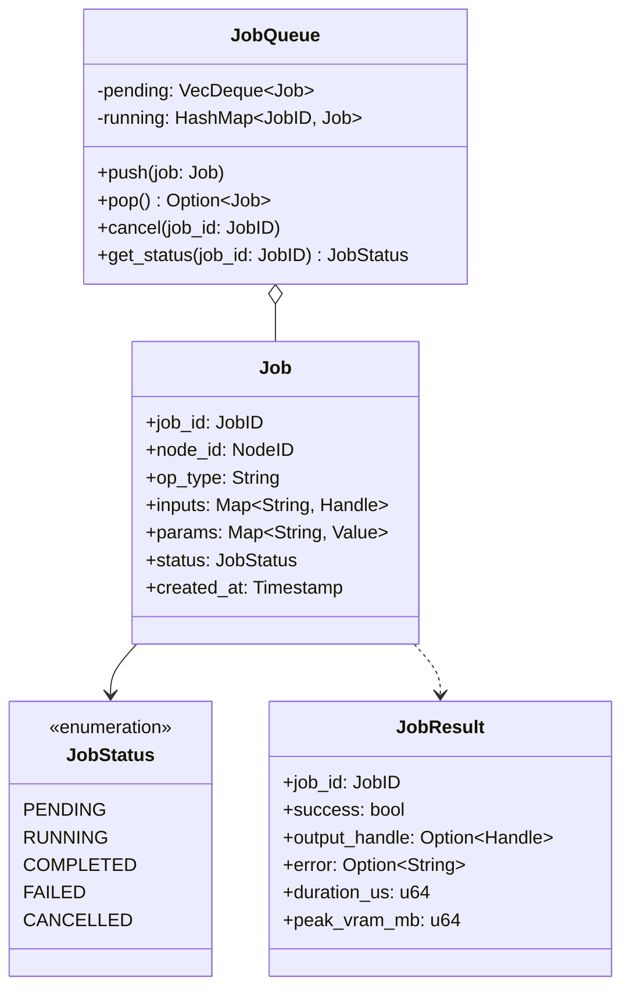
```mermaid
classDiagram
    class Job {
        +job_id: JobID
        +node_id: NodeID
        +op_type: String
        +inputs: Map~String, Handle~
        +params: Map~String, Value~
        +status: JobStatus
        +created_at: Timestamp
    }
    
    class JobStatus {
        <<enumeration>>
        PENDING
        RUNNING
        COMPLETED
        FAILED
        CANCELLED
    }
    
    class JobResult {
        +job_id: JobID
        +success: bool
        +output_handle: Option~Handle~
        +error: Option~String~
        +duration_us: u64
        +peak_vram_mb: u64
    }
    
    class JobQueue {
        -pending: VecDeque~Job~
        -running: HashMap~JobID, Job~
        +push(job: Job)
        +pop() Option~Job~
        +cancel(job_id: JobID)
        +get_status(job_id: JobID) JobStatus
    }
    
    Job --> JobStatus
    Job ..> JobResult
    JobQueue o-- Job
```

### G.3 Cache Subsystem

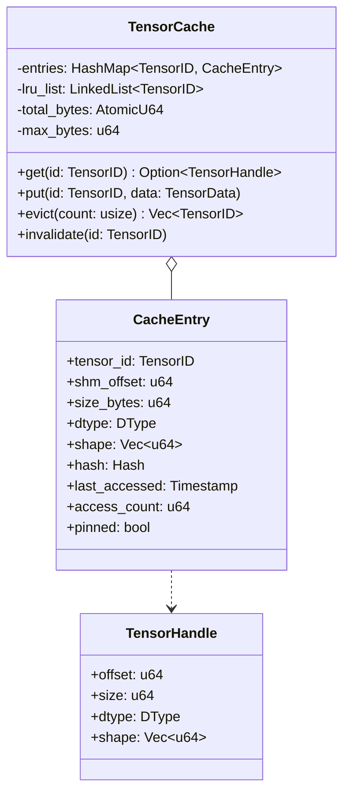
```mermaid
classDiagram
    class TensorCache {
        -entries: HashMap~TensorID, CacheEntry~
        -lru_list: LinkedList~TensorID~
        -total_bytes: AtomicU64
        -max_bytes: u64
        +get(id: TensorID) Option~TensorHandle~
        +put(id: TensorID, data: TensorData)
        +evict(count: usize) Vec~TensorID~
        +invalidate(id: TensorID)
    }
    
    class CacheEntry {
        +tensor_id: TensorID
        +shm_offset: u64
        +size_bytes: u64
        +dtype: DType
        +shape: Vec~u64~
        +hash: Hash
        +last_accessed: Timestamp
        +access_count: u64
        +pinned: bool
    }
    
    class TensorHandle {
        +offset: u64
        +size: u64
        +dtype: DType
        +shape: Vec~u64~
    }
    
    TensorCache o-- CacheEntry
    CacheEntry ..> TensorHandle
```

---

## Appendix H: Component Diagrams

### H.1 Core Engine Components

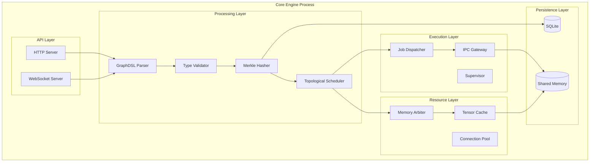
```mermaid
graph TB
    subgraph "Core Engine Process"
        subgraph "API Layer"
            HTTP[HTTP Server]
            WS[WebSocket Server]
        end
        
        subgraph "Processing Layer"
            PARSER[GraphDSL Parser]
            VALIDATOR[Type Validator]
            HASHER[Merkle Hasher]
            SCHED[Topological Scheduler]
        end
        
        subgraph "Resource Layer"
            ARB[Memory Arbiter]
            CACHE[Tensor Cache]
            POOL[Connection Pool]
        end
        
        subgraph "Execution Layer"
            SUP[Supervisor]
            DISPATCH[Job Dispatcher]
            IPC[IPC Gateway]
        end
        
        subgraph "Persistence Layer"
            DB[(SQLite)]
            SHM[(Shared Memory)]
        end
    end
    
    HTTP --> PARSER
    WS --> PARSER
    PARSER --> VALIDATOR
    VALIDATOR --> HASHER
    HASHER --> SCHED
    SCHED --> ARB
    ARB --> CACHE
    SCHED --> DISPATCH
    DISPATCH --> IPC
    IPC --> SHM
    HASHER --> DB
    CACHE --> SHM
```

### H.2 Request Flow Component Diagram

```mermaid
flowchart LR
    subgraph "External"
        CLIENT[Client]
    end
    
    subgraph "API Gateway"
        AUTH[Auth Middleware]
        RATE[Rate Limiter]
        PARSE[JSON Parser]
    end
    
    subgraph "Core Logic"
        VALIDATE[Validator]
        COMPILE[Compiler]
        SCHEDULE[Scheduler]
    end
    
    subgraph "Execution"
        ARBITER[Arbiter]
        DISPATCH[Dispatcher]
        WORKER[Workers]
    end
    
    CLIENT -->|HTTP| AUTH
    AUTH -->|JWT| RATE
    RATE -->|Pass| PARSE
    PARSE -->|GraphDSL| VALIDATE
    VALIDATE -->|Valid| COMPILE
    COMPILE -->|Plan| SCHEDULE
    SCHEDULE -->|Jobs| ARBITER
    ARBITER -->|Memory OK| DISPATCH
    DISPATCH -->|IPC| WORKER
```

---

## Appendix I: Sequence Diagrams Collection

### I.1 Full Execution Sequence

```mermaid
sequenceDiagram
    participant C as Client
    participant A as API
    participant V as Validator
    participant H as Hasher
    participant S as Scheduler
    participant R as Arbiter
    participant D as Dispatcher
    participant W as Worker
    participant M as SHM

    C->>A: POST /graph/execution
    A->>A: Authenticate JWT
    A->>V: Parse GraphDSL
    V->>V: Check Cycles (Kahn)
    V->>V: Check Types
    V-->>A: Validation OK
    A->>H: Compute Hashes
    H->>H: Query Cache
    H->>H: Calculate Dirty Set
    H-->>A: DirtySet[A,B,C]
    A->>S: Schedule(DirtySet)
    S->>S: Topological Sort
    S-->>A: ExecutionPlan
    A->>R: Check VRAM
    R->>R: Predict Usage
    alt Over Budget
        R->>R: Plan Eviction (LFU)
        R->>M: Free Tensors
    end
    R-->>A: Memory Ready
    A->>D: Submit Jobs
    loop For Each Job
        D->>W: Send Job
        W->>M: Map Inputs
        W->>W: Execute Op
        W->>M: Write Output
        W-->>D: Result
        D->>A: Update Progress
        A->>C: WebSocket Progress
    end
    D-->>A: All Complete
    A->>C: Final Result
```

### I.2 Error Recovery Sequence

```mermaid
sequenceDiagram
    participant S as Supervisor
    participant W as Worker
    participant K as Kernel
    participant D as Dispatcher
    participant C as Client

    Note over W: Processing Job
    W->>W: Segfault!
    W->>K: SIGSEGV
    K->>S: SIGCHLD
    S->>K: waitpid()
    K-->>S: Exit Status = 139
    S->>S: Find Worker Slot
    S->>S: Mark Slot DEAD
    S->>D: Job Failed
    D->>D: Check Retry Count
    alt Retries < 3
        S->>K: fork()
        K-->>S: New PID
        S->>S: Register New Worker
        D->>D: Requeue Job
        D->>S: Retry Job
    else Retries >= 3
        D->>C: Error: VE-004
    end
```

### I.3 Cache Invalidation Sequence

```mermaid
sequenceDiagram
    participant U as User
    participant A as API
    participant H as Hasher
    participant C as Cache
    participant S as Scheduler

    U->>A: Update Node Parameter
    A->>H: Recompute Hash(Node)
    H->>H: New Hash != Old Hash
    H->>C: Invalidate(Node)
    C->>C: Remove Entry
    H->>H: Propagate to Children
    loop For Each Child
        H->>H: Recompute Hash
        H->>C: Invalidate(Child)
    end
    H-->>A: DirtySet Updated
    A->>S: Schedule(DirtySet)
```

---

## Appendix J: Activity Diagrams

### J.1 Graph Compilation Activity

```mermaid
flowchart TD
    START((Start)) --> PARSE[Parse GraphDSL JSON]
    PARSE --> VALIDATE_SCHEMA{Schema Valid?}
    VALIDATE_SCHEMA -->|No| ERROR1[Return VE-007]
    VALIDATE_SCHEMA -->|Yes| BUILD_GRAPH[Build Internal Graph]
    BUILD_GRAPH --> INIT_INDEGREE[Initialize InDegree Map]
    INIT_INDEGREE --> FIND_ROOTS[Find Root Nodes]
    FIND_ROOTS --> KAHN_START[Start Kahn's Algorithm]
    KAHN_START --> QUEUE_EMPTY{Queue Empty?}
    QUEUE_EMPTY -->|No| POP[Pop Node from Queue]
    POP --> ADD_RESULT[Add to Result List]
    ADD_RESULT --> DECREMENT[Decrement Children InDegree]
    DECREMENT --> CHECK_CHILD{Any Child InDegree=0?}
    CHECK_CHILD -->|Yes| PUSH[Push to Queue]
    CHECK_CHILD -->|No| QUEUE_EMPTY
    PUSH --> QUEUE_EMPTY
    QUEUE_EMPTY -->|Yes| CHECK_COMPLETE{All Nodes Processed?}
    CHECK_COMPLETE -->|No| ERROR2[Return VE-001 Cycle]
    CHECK_COMPLETE -->|Yes| TYPE_CHECK[Validate Port Types]
    TYPE_CHECK --> TYPES_OK{Types Match?}
    TYPES_OK -->|No| ERROR3[Return VE-002 Mismatch]
    TYPES_OK -->|Yes| COMPUTE_HASHES[Compute Merkle Hashes]
    COMPUTE_HASHES --> FIND_DIRTY[Find Dirty Set]
    FIND_DIRTY --> CREATE_PLAN[Create Execution Plan]
    CREATE_PLAN --> END((End))
```

### J.2 Memory Eviction Activity

```mermaid
flowchart TD
    START((Eviction Triggered)) --> SCAN[Scan Tensor Cache]
    SCAN --> SCORE[Score Each Tensor]
    SCORE --> CALCULATE{Calculate Future Use Distance}
    CALCULATE --> NEVER_USED{Used Again?}
    NEVER_USED -->|No| INFINITY[Score = INFINITY]
    NEVER_USED -->|Yes| DISTANCE[Score = Steps to Next Use]
    INFINITY --> COLLECT[Collect Scored Tensors]
    DISTANCE --> COLLECT
    COLLECT --> SORT[Sort by Score DESC]
    SORT --> INIT_FREED[freed = 0]
    INIT_FREED --> ENOUGH{freed >= needed?}
    ENOUGH -->|Yes| DONE[Return Eviction List]
    ENOUGH -->|No| SELECT[Select Top Tensor]
    SELECT --> PINNED{Is Pinned?}
    PINNED -->|Yes| SKIP[Skip Tensor]
    SKIP --> ENOUGH
    PINNED -->|No| ADD[Add to Eviction List]
    ADD --> UPDATE[freed += tensor.size]
    UPDATE --> ENOUGH
    DONE --> END((End))
```

---

## Appendix K: State Machine Specifications

### K.1 Run State Machine

```mermaid
stateDiagram-v2
    [*] --> CREATED: Submit Graph
    CREATED --> VALIDATING: Start Processing
    VALIDATING --> REJECTED: Validation Failed
    REJECTED --> [*]
    VALIDATING --> COMPILING: Validation OK
    COMPILING --> SCHEDULING: Compilation OK
    COMPILING --> REJECTED: Cycle Detected
    SCHEDULING --> ALLOCATING: Schedule OK
    ALLOCATING --> RUNNING: Memory OK
    ALLOCATING --> EVICTING: Over Budget
    EVICTING --> ALLOCATING: Eviction Complete
    EVICTING --> FAILED: Cannot Free Enough
    RUNNING --> RUNNING: Node Complete
    RUNNING --> FAILED: Node Failed (No Retry)
    RUNNING --> RETRYING: Node Failed (Retry Available)
    RETRYING --> RUNNING: Retry Dispatched
    RUNNING --> CANCELLED: User Cancel
    RUNNING --> COMPLETED: All Nodes Done
    FAILED --> [*]
    CANCELLED --> [*]
    COMPLETED --> [*]
```

### K.2 Node Execution State Machine

```mermaid
stateDiagram-v2
    [*] --> PENDING: Added to Plan
    PENDING --> WAITING: Dependencies Not Ready
    WAITING --> READY: Dependencies Complete
    PENDING --> READY: No Dependencies
    READY --> DISPATCHED: Worker Available
    DISPATCHED --> RUNNING: Worker ACK
    RUNNING --> COMPLETED: Success
    RUNNING --> FAILED: Error
    RUNNING --> TIMEOUT: No Response
    TIMEOUT --> RETRY: Retry < 3
    RETRY --> DISPATCHED: Resubmit
    TIMEOUT --> FAILED: Retry >= 3
    COMPLETED --> [*]
    FAILED --> [*]
```

---

## Document History

| Version | Date | Author | Changes |
| :--- | :--- | :--- | :--- |
| 1.0.0 | 2026-01-01 | System | Initial draft |
| 3.0.0 | 2026-01-02 | System | Added GraphDSL specification |
| 5.0.0 | 2026-01-03 | System | Added Mechanism of Action |
| 7.0.0 | 2026-01-04 | System | Added Atomic Micro-Operations |
| 9.0.0 | 2026-01-05 | System | ISO 29148 alignment |
| 11.0.0 | 2026-01-06 | System | 10x Detail expansion |
| 13.0.0 | 2026-01-06 | System | Nuclear Detail (FMEA, ICD) |
| 14.0.0 | 2026-01-06 | System | Visual Flow diagrams |
| 15.0.0 | 2026-01-06 | System | Use Cases, Security, Reliability |
| 16.0.0 | 2026-01-06 | System | UML Class, Component, Sequence, Activity, State Diagrams |


