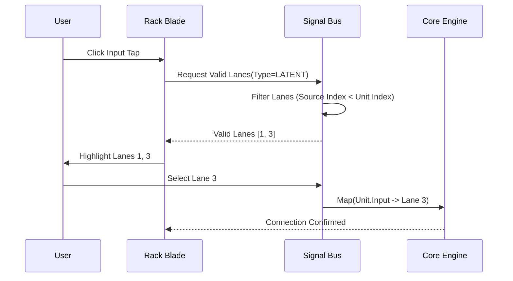

# Software Requirements Specification (SRS): Frontend UI
**Project**: VORTEX-GEN 3.0 "Centaur"
**Module**: Frontend UI (`vortex-ui`)
**Version**: 9.0.0 (ISO Standard)
**Date**: 2026-01-06
**Standard**: ISO/IEC 29148:2018

---

## 1. Introduction

### 1.1 Purpose
This SRS specifies the software requirements for the **Frontend User Interface**, implementing the "Vortex Flow Stream" (Vertical Rack) paradigm. It details the Rack State Machine, the Signal Bus Routing logic, and the Hybrid Rendering strategy (DOM for Blades, WebGL for Cinematic Background).

### 1.2 Scope
The Frontend UI is the primary interaction layer for the VORTEX system.
**The software facilitates**:
*   **Rack Orchestration**: Managing a vertical stack of processing units.
*   **Signal Routing**: Connecting units to specific lanes on the Signal Bus.
*   **Cinematic Rendering**: 60fps WebGL background visualization.
*   **Collaboration**: Real-time sync of Rack state via Yjs.

### 1.3 Definitions
| Term | Definition |
| :--- | :--- |
| **Rack** | An ordered list of Processing Units (Nodes). |
| **Blade** | The UI component representing a Unit. |
| **Bus Lane** | A virtual channel on the Signal Bus (0-7). |
| **Tap** | A connection mapping `(UnitID, InputPort) -> BusLaneID`. |
| **Rune** | Svelte 5's reactivity primitive (`$state`). |
| **CRDT** | Conflict-free Replicated Data Type (Yjs). |

---

## 2. Overall Description

### 2.1 Product Perspective
The Frontend UI is a Single Page Application (SPA) served by the Rust Host. Unlike traditional node editors, it does *not* use an infinite canvas. It uses a **Linear Vertical Layout** engine.

### 2.2 Product Functions
*   **F-01: Rack State Management**: Handling `MoveUp`, `MoveDown`, `Insert` operations.
*   **F-02: Signal Bus Logic**: Validating data types on Bus Lanes.
*   **F-03: Cinematic Renderer**: Generating the dynamic background bloom.
*   **F-04: Collaborative Sync**: Syncing the Rack Order and Bus Taps.

### 2.3 User Classes
*   **Creator**: Focused on the Flow and Output.
*   **Tuner**: Focused on specific parameters in the Inspector.

### 2.4 Operating Environment
*   **Browser**: Chromium 120+, Firefox 120+, Safari 17+.
*   **Tech Stack**: Svelte 5, TypeScript 5.3, Vite, PixiJS (WebGL).

---

## 3. Specific Requirements

### 3.1 Functional Requirements

#### 3.2.1 [F-01] Rack State Management
*   **Description**: Maintaining the ordered list of units.
*   **Inputs**: User Drag Event (Reorder).
*   **Processing**:
    1.  Receive `MoveUnit(id, new_index)`.
    2.  Update `Y.Array` (CRDT) to reflect new order.
    3.  Trigger Svelte `each` block update with FLIP animation.
    4.  Send "Topology Change" event to Core Engine.
*   **Outputs**: Re-rendered Rack with smooth animation.

#### 3.2.2 [F-02] Signal Bus Routing
*   **Description**: Managing "Wireless" connections via Bus Lanes.
*   **Inputs**: User Click on "Bus Tap".
*   **Processing**:
    1.  User clicks Tap on Unit X (Input: Latent).
    2.  System identifies available Bus Lanes carrying `LATENT` signals from *above* Unit X.
    3.  System highlights valid Lanes (Mint).
    4.  User selects Lane 1.
    5.  System updates Map: `UnitX.inputs.latent = Lane1`.
*   **Outputs**: Visual connection (Dot) on the Bus.

#### 3.2.3 [F-03] Cinematic Background
*   **Description**: Dynamic WebGL visualization.
*   **Inputs**: `Unit.status` (Running/Idle), `Unit.preview` (Image).
*   **Processing**:
    1.  Capture active generating image.
    2.  Apply heavy Gaussian Blur shader.
    3.  Modulate brightness based on `GlobalProgress`.
    4.  Render to full-screen `<canvas>` at `z-index: -1`.
*   **Outputs**: A "breathing" background that reflects the generation.

### 3.2 Non-Functional Requirements

#### 3.3.1 Performance
*   **PERF-01**: Rack Reorder animation shall run at 60fps.
*   **PERF-02**: Background Shader shall consume < 10% GPU.

#### 3.3.2 Accessibility
*   **ACC-01**: Rack Units shall be navigable via Up/Down Arrow keys.
*   **ACC-02**: Bus Lanes shall be selectable via Number keys (1-8).

---

### 3.4 Data Models

#### 3.4.1 Rack Unit (TypeScript)
```typescript
interface RackUnit {
  id: string;              // UUID
  type: string;            // "com.vortex.loader"
  index: number;           // Vertical Position
  
  // Connectivity
  input_taps: Record<string, number>;  // PortName -> LaneID
  output_lanes: Record<string, number>; // PortName -> LaneID
  
  // Configuration
  params: Record<string, any>;
  
  // Runtime
  $status: "IDLE" | "RUNNING" | "ERROR";
  $progress: number;
}
```

#### 3.4.2 Signal Bus State
```typescript
interface BusLane {
  id: number;              // 0-7
  label: string;           // "Juggernaut XL Latent"
  type: DataType;          // IMAGE, LATENT, MODEL
  source_unit: string;     // UnitID writing to this lane
}
```

---

### 3.5 Logic Traces

#### 3.5.1 Trace: Tapping the Bus


---

## 4. Verification & Validation

### 4.1 Test Cases
1.  **TC-01 (Reorder)**: Move Unit A below Unit B. Verify Bus connections update (Unit A can now see Unit B's outputs).
2.  **TC-02 (Type Safety)**: Attempt to tap an `IMAGE` lane for a `LATENT` input. Verify UI blocks action (Red flash).
3.  **TC-03 (Isolation)**: Verify Kernel AI "Chat" does not block the Main Thread (Web Worker).

---
