# Software Requirements Specification (SRS): Frontend UI
**Project**: VORTEX-GEN 3.0 "Centaur"
**Module**: Frontend UI (`vortex-ui`)
**Version**: 9.0.0 (ISO Standard)
**Date**: 2026-01-06
**Standard**: ISO/IEC 29148:2018

---

## 1. Introduction

### 1.1 Purpose
This SRS specifies the software requirements for the **Frontend User Interface**. It details the Hybrid Rendering Engine (DOM/WebGL), the Reactive State Machine (Svelte 5), and the Real-Time Collaboration protocol (Yjs).

### 1.2 Scope
The Frontend UI is the primary interaction layer for the VORTEX system.
**The software facilitates**:
*   **Visual Programming**: Drag-and-drop graph editing for 2000+ nodes.
*   **Real-Time Monitoring**: 60fps visualization of execution progress.
*   **Collaboration**: Multi-user editing with conflict resolution.
*   **Accessibility**: Full keyboard navigation via Topological Sorting.

### 1.3 Definitions, Acronyms, and Abbreviations
| Term | Definition |
| :--- | :--- |
| **LOD** | Level of Detail (Hybrid Rendering Strategy). |
| **Rune** | Svelte 5's fine-grained reactivity primitive (`$state`). |
| **CRDT** | Conflict-free Replicated Data Type (Yjs). |
| **FLIP** | First, Last, Invert, Play (Animation Technique). |

---

## 2. Overall Description

### 2.1 Product Perspective
The Frontend UI is a Single Page Application (SPA) served by the Rust Host. It communicates with the Core via WebSocket for control and HTTP for large asset transfer (images, models). It uses WebGL for the canvas and DOM for the controls.

### 2.2 Product Functions
*   **F-01: Hybrid Rendering Loop**: Switching between DOM and WebGL based on zoom.
*   **F-02: Collaborative Editing**: Syncing graph state across multiple clients.
*   **F-03: Reactive Updates**: Reflecting core state changes without tree re-renders.
*   **F-04: Dynamic Routing**: Lazy-loading views to minimize bundle size.

### 2.3 User Classes and Characteristics
*   **Designer**: Focuses on visual layout and node connections.
*   **Prompt Engineer**: Focuses on text fields and parameter tuning.

### 2.4 Operating Environment
*   **Browser**: Chromium 120+, Firefox 120+, Safari 17+.
*   **Tech Stack**: Svelte 5, TypeScript 5.3, Vite, Three.js (WebGL).

---

## 3. Specific Requirements

### 3.1 External Interface Requirements
#### 3.1.1 User Interfaces
*   **UI-01**: The UI shall support High-DPI (Retina) displays.
*   **UI-02**: The UI shall support Dark Mode and Light Mode themes.

#### 3.1.2 Software Interfaces
*   **SI-01**: The UI shall consume the `vortex-protocol` WebSocket API.
*   **SI-02**: The UI shall use `localStorage` for persisting layout preferences.

### 3.2 Functional Requirements

#### 3.2.1 [F-01] Hybrid Rendering Engine (LOD)
*   **Description**: Optimization for large graphs.
*   **Inputs**: `Viewport.zoom` (Float), `Graph.nodes` (List).
*   **Processing**:
    1.  On `requestAnimationFrame`, check `Viewport.zoom`.
    2.  If `zoom < 0.6`: Enable **Canvas Mode**.
        *   Hide all DOM Nodes via CSS class.
        *   Issue `gl.drawArraysInstanced` to render 2000 rects.
    3.  If `zoom >= 0.6`: Enable **DOM Mode**.
        *   Show DOM Nodes.
        *   Clear WebGL canvas.
*   **Outputs**: 60fps interaction regardless of graph size.

#### 3.2.2 [F-02] Collaborative State Sync (CRDT)
*   **Description**: Real-time multi-user editing.
*   **Inputs**: User Mutation (e.g., Move Node).
*   **Processing**:
    1.  Capture mutation in `Y.Map`.
    2.  Encode update to Binary Vector (`VarInt`).
    3.  Broadcast via WebSocket.
    4.  On Peer: Decode and Merge.
    5.  Resolve conflicts using Lamport Timestamps (Last Write Wins).
*   **Outputs**: Convergent state across all clients.

#### 3.2.3 [F-03] Reactive Signal Propagation
*   **Description**: Svelte 5 Runes integration.
*   **Inputs**: WebSocket Progress Message (`{id: 5, p: 50}`).
*   **Processing**:
    1.  Lookup Node object in `Registry`.
    2.  Update `node.progress = 50`.
    3.  Svelte Runtime detects signal change.
    4.  Svelte updates specific DOM element `style.width`.
*   **Outputs**: DOM update with zero Virtual DOM overhead.

### 3.3 Non-Functional Requirements

#### 3.3.1 Performance
*   **PERF-01**: Input Latency (Drag to Paint) shall be < 16ms.
*   **PERF-02**: Initial Load Time (Time to Interactive) shall be < 1000ms.

#### 3.3.2 Accessibility
*   **ACC-01**: The System shall ensure all nodes are navigable via `Tab` key (Topological Order).
*   **ACC-02**: The System shall provide ARIA labels for all canvas elements ("Node: Load Image").

---

### 3.4 Data Dictionary & Component State

#### 3.4.1 Node Component State (TypeScript Interface)
The canonical representation of a Node in the memory heap.
```typescript
interface Node {
  id: string;              // UUID
  type: string;            // "com.vortex.loader"
  position: { x: number; y: number };
  inputs: Record<string, PortHandle>;
  outputs: Record<string, PortHandle>;
  params: Record<string, WidgetValue>;
  
  // Runtime State (Non-persisted)
  $status: "IDLE" | "RUNNING" | "ERROR";
  $progress: number;       // 0-100
  $error?: string;
}

type WidgetValue = {
  type: "INT" | "STRING" | "FLOAT";
  value: any;
  min?: number;
  max?: number;
};
```

#### 3.4.2 Yjs Distributed Schema
Structure of the CRDT `Y.Doc`.
```text
Root: Y.Map {
  "nodes": Y.Map<NodeID, Y.Map<Key, Value>>,
  "edges": Y.Map<EdgeID, Y.Map<Key, Value>>,
  "meta": Y.Map<String, String>
}

// Example Update Vector (Binary)
// [Len: 4][Struct: Map][Key: "nodes"][Key: "n1"][Key: "x"][Val: 500]
```

### 3.5 Logic Traces

#### 3.5.1 Logic Trace: Hybrid Rendering Loop
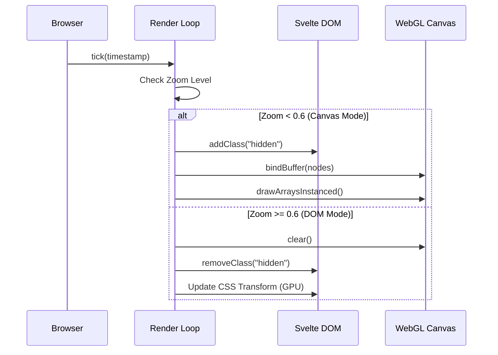
```mermaid
sequenceDiagram
    participant Browser
    participant RAF as Render Loop
    participant DOM as Svelte DOM
    participant GL as WebGL Canvas
    
    Browser->>RAF: tick(timestamp)
    RAF->>RAF: Check Zoom Level
    alt Zoom < 0.6 (Canvas Mode)
        RAF->>DOM: addClass("hidden")
        RAF->>GL: bindBuffer(nodes)
        RAF->>GL: drawArraysInstanced()
    else Zoom >= 0.6 (DOM Mode)
        RAF->>GL: clear()
        RAF->>DOM: removeClass("hidden")
        RAF->>DOM: Update CSS Transform (GPU)
    end
```

### 3.6 Component Interface Specifications (CIS)

#### 3.6.1 Renderer Interface (TypeScript)
The contract for the WebGL/DOM Hybrid renderer.
```typescript
interface Renderer {
  /**
   * Main render loop called by RAF.
   * Handles LOD switching between Canvas and DOM.
   */
  render(ctx: WebGL2Context, viewport: ViewportState): void;

  /**
   * Projects world coordinates to screen space.
   */
  worldToScreen(x: number, y: number): Point;

  /**
   * Culls nodes outside the viewport.
   */
  getVisibleNodes(viewport: ViewportState): NodeID[];
}
```

#### 3.6.2 Graph Service Interface (TypeScript)
The contract for Graph Mutation Logic.
```typescript
interface GraphService {
  /**
   * Atomic operation to add a node and sync via CRDT.
   * @throws ValidationException if Position is OOB.
   */
  addNode(type: string, pos: Point): Promise<NodeID>;

  /**
   * Connects two ports, validating type compatibility.
   * @throws TypeMismatchException
   * @throws CycleException
   */
  connect(src: PortID, dst: PortID): Promise<EdgeID>;
}
```

### 3.7 State Transition Matrices

#### 3.7.1 Interaction FSM (Drag & Drop)
Defines valid transitions for the `GraphInteraction` state machine.

| Current State | Event | Next State | Side Effects |
| :--- | :--- | :--- | :--- |
| **IDLE** | `PointerDown(Node)` | **DRAGGING_NODE** | Capture Pointer; Disable Hover fx. |
| **IDLE** | `PointerDown(Port)` | **DRAGGING_WIRE** | Create temp wire; Highlight valid targets. |
| **DRAGGING_NODE** | `PointerMove` | **DRAGGING_NODE** | Update Node Position (Lerp). |
| **DRAGGING_NODE** | `PointerUp` | **IDLE** | Commit New Position to CRDT. |
| **DRAGGING_WIRE** | `PointerUp(Port)` | **IDLE** | Create Edge; Validate Cycle. |
| **DRAGGING_WIRE** | `PointerUp(Empty)`| **IDLE** | Discard temp wire; Show Context Menu. |

### 3.8 Failure Mode & Effects Analysis (FMEA)

#### 3.8.1 Function: Rendering Engine
| ID | Failure Mode | Effect (Severity) | Cause (Occurrence) | Detection (Method) | Mitigation Strategy |
| :--- | :--- | :--- | :--- | :--- | :--- |
| **UI-FM-01**| **Context Lost** | **Critical (9)**: Screen goes blank/black. | **Occasional (3)**: System Sleep; Driver Update. | **Event**: `webglcontextlost`. | Call `restoreContext()`; Re-upload all Vertex Buffers. |
| **UI-FM-02**| **Jank/Stutter** | **Minor (3)**: < 60fps; Bad UX. | **Frequent (5)**: 10k+ nodes; Heavy DOM. | **Culling**: `nodes_visible > 500`. | Switch to Instanced Mesh; Force "Canvas Mode" earlier. |

#### 3.8.2 Function: Collaborative Sync
| ID | Failure Mode | Effect (Severity) | Cause (Occurrence) | Detection (Method) | Mitigation Strategy |
| :--- | :--- | :--- | :--- | :--- | :--- |
| **UI-FM-03**| **Split Brain** | **Major (7)**: Users see different graphs. | **Rare (2)**: WebSocket reconnect failure. | **Checksum**: CRC32 of Local vs Remote state. | Trigger Full Sync (`Y.applyUpdate(snapshot)`). |
| **UI-FM-04**| **Ghost Cursors**| **Minor (2)**: Old cursors remain on screen. | **Frequent (4)**: UDP Packet loss. | **TTL**: Cursor last_seen > 10s. | Auto-remove cursors after 10s of inactivity. |

### 3.9 Interface Control Document (ICD) - Component Level

#### 3.9.1 Node Component Props
The detailed API surface for the `Node.svelte` component.

| Prop Name | Type | Required | Description |
| :--- | :--- | :--- | :--- |
| `node_id` | `String` | **Yes** | UUID of the node model. |
| `selected` | `Boolean` | No | Toggles the `.selected` CSS ring (Token: `ring-primary-500`). |
| `lod` | `Enum<"FULL" \| "LITE">` | **Yes** | Level of Detail. "LITE" hides sliders/inputs. |
| `on:connect`| `Event` | No | Dispatched when output port is clicked. |

#### 3.9.2 Design Tokens (CSS)
Core visual constants used in the Renderer.

| Token | Hex Value | Usage context |
| :--- | :--- | :--- |
| `--color-canvas-bg` | `#111111` | Infinite Grid Background. |
| `--color-node-bg` | `#1e1e1e` | Node Card Body. |
| `--color-port-image` | `#a5f3fc` | Image Data Type (Cyan). |
| `--color-port-latent`| `#fca5a5` | Latent Data Type (Red). |

### 3.10 Module Flow Diagram
Flow of User Events and State Updates in the Frontend.

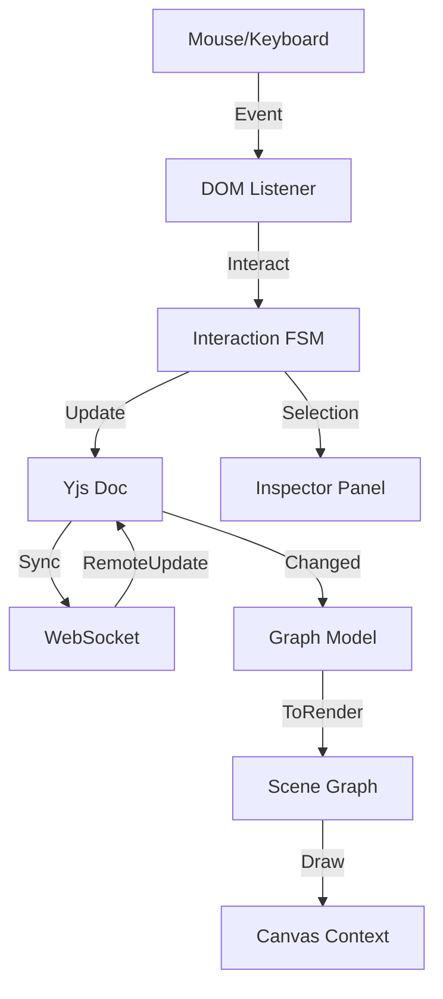
```mermaid
graph TD
    User[Mouse/Keyboard] -->|Event| Dom[DOM Listener]
    Dom -->|Interact| State[Interaction FSM]
    State -->|Update| CRDT[Yjs Doc]
    CRDT -->|Sync| WS[WebSocket]
    WS -->|RemoteUpdate| CRDT
    CRDT -->|Changed| Graph[Graph Model]
    Graph -->|ToRender| Scene[Scene Graph]
    Scene -->|Draw| WebGL[Canvas Context]
    State -->|Selection| Inspector[Inspector Panel]
```


---

## 4. Verification & Validation (VCRM)

### 4.1 Verification Cross Reference Matrix
| Req ID | Requirement Summary | Method | Verification Procedure | Acceptance Criteria |
| :--- | :--- | :--- | :--- | :--- |
| **F-01** | Hybrid Switching | **Insp** | `tests/e2e/zoom.spec.ts` | At `zoom=0.5`, `.vtx-node` elements have `display: none`. |
| **F-02** | CRDT Sync | **Test** | `tests/unit/yjs_test.ts` | `ClientA.move(10,10)` -> `ClientB.nodes["1"].x == 10`. |
| **F-03** | Reactive Update | **Perf** | `tests/perf/reactivity.bench.ts` | 1000 updates/sec result in `<50ms` DOM Paint time. |
| **ACC-01**| Keyboard Nav | **Test** | `tests/a11y/keyboard.spec.ts` | `Tab` moves focus from Node A to Node B (connected). |

### 4.2 Error Code Registry (Appendix A)
| Code | Error Name | Description | Recovery Strategy |
| :--- | :--- | :--- | :--- |
| `UI-001` | `WebGLContextLost` | GPU Driver crash or tab switch. | Listen for `webglcontextrestored` and re-upload buffers. |
| `UI-002` | `SyncDivergence` | Checksums of Client A and B differ. | Force `Y.encodeStateAsUpdate()` full sync. |

---

## 5. Use Cases

### 5.1 UC-01: Create New Node

**Actor**: User with mouse/keyboard

**Preconditions**:
- Canvas is visible and interactive.
- User has access to node palette.

**Main Success Scenario**:
1. User right-clicks on empty canvas area.
2. Context menu appears with node categories.
3. User navigates to desired category (e.g., "Loaders").
4. User clicks on desired node type (e.g., "Load Image").
5. New node appears at cursor position.
6. Node is selected and ready for configuration.
7. Yjs document is updated with new node.
8. Change syncs to all connected clients.

**Extensions**:
- **2a. Keyboard Shortcut**: User presses `Space` to open quick-add menu.
- **6a. Parameter Panel**: Side panel opens with node parameters.

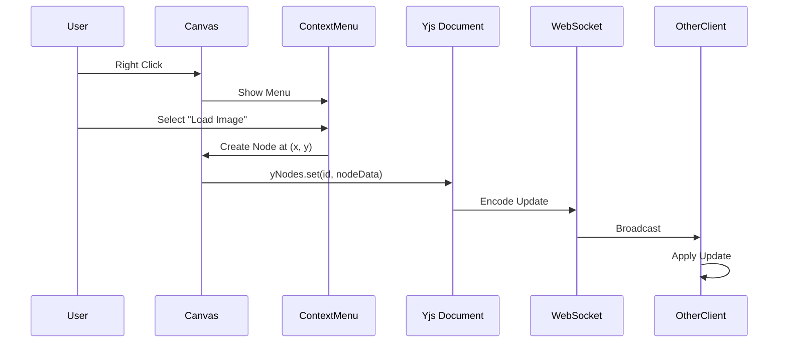
```mermaid
sequenceDiagram
    participant User
    participant Canvas
    participant ContextMenu
    participant YDoc as Yjs Document
    participant WS as WebSocket
    participant OtherClient

    User->>Canvas: Right Click
    Canvas->>ContextMenu: Show Menu
    User->>ContextMenu: Select "Load Image"
    ContextMenu->>Canvas: Create Node at (x, y)
    Canvas->>YDoc: yNodes.set(id, nodeData)
    YDoc->>WS: Encode Update
    WS->>OtherClient: Broadcast
    OtherClient->>OtherClient: Apply Update
```

### 5.2 UC-02: Connect Two Nodes

**Actor**: User with mouse

**Preconditions**:
- At least two nodes exist on canvas.
- Output port is compatible with input port.

**Main Success Scenario**:
1. User hovers over output port (port highlights).
2. User clicks and holds on output port.
3. Temporary bezier line appears, following cursor.
4. User drags to compatible input port.
5. Input port highlights green (compatible).
6. User releases mouse button.
7. Permanent connection is created.
8. Backend validates type compatibility.
9. Yjs document updated with new link.

**Extensions**:
- **4a. Incompatible Port**: Input port highlights red; release does nothing.
- **5a. Multiple Inputs**: If port accepts multiple inputs, add to list.

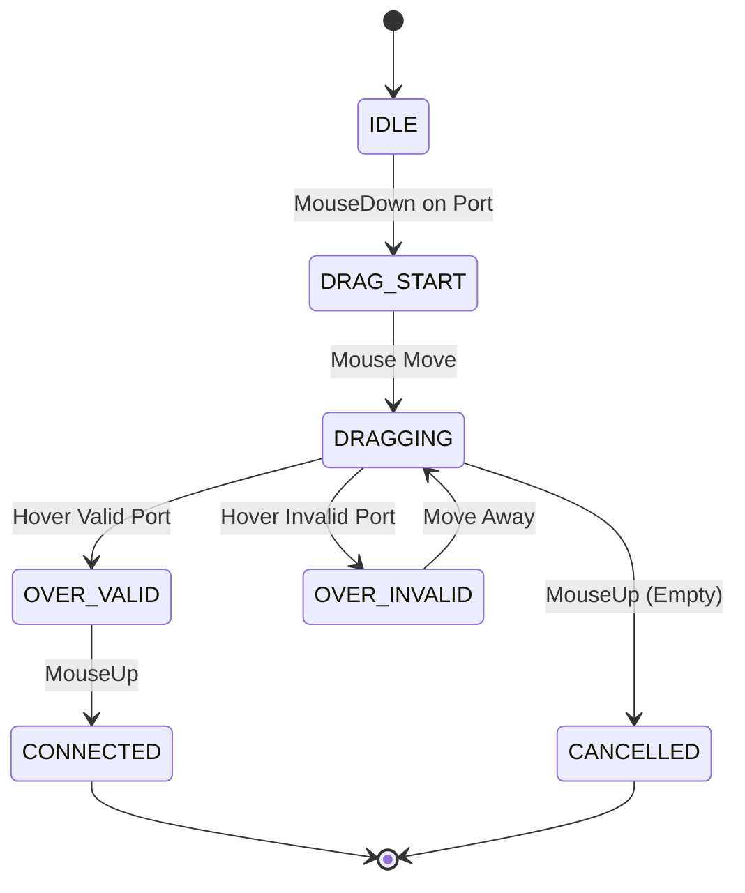
```mermaid
stateDiagram-v2
    [*] --> IDLE
    IDLE --> DRAG_START: MouseDown on Port
    DRAG_START --> DRAGGING: Mouse Move
    DRAGGING --> OVER_VALID: Hover Valid Port
    DRAGGING --> OVER_INVALID: Hover Invalid Port
    OVER_VALID --> CONNECTED: MouseUp
    OVER_INVALID --> DRAGGING: Move Away
    DRAGGING --> CANCELLED: MouseUp (Empty)
    CONNECTED --> [*]
    CANCELLED --> [*]
```

### 5.3 UC-03: Multi-Select and Move Nodes

**Actor**: User with mouse

**Preconditions**:
- Multiple nodes exist on canvas.

**Main Success Scenario**:
1. User clicks on empty canvas area.
2. User drags to create selection rectangle.
3. All nodes within rectangle are selected.
4. User clicks on one selected node.
5. User drags to move selection.
6. All selected nodes move together.
7. Links update in real-time.
8. Yjs document updated with new positions.

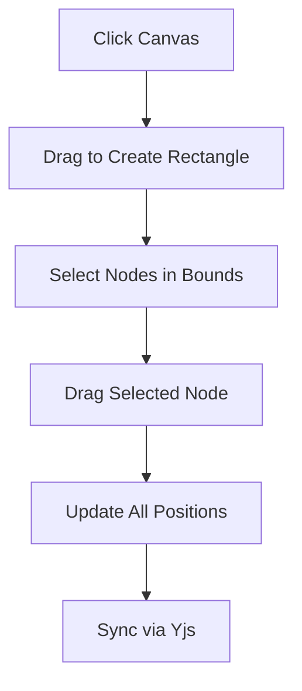
```mermaid
flowchart TD
    CLICK[Click Canvas] --> DRAG[Drag to Create Rectangle]
    DRAG --> SELECT[Select Nodes in Bounds]
    SELECT --> MOVE[Drag Selected Node]
    MOVE --> UPDATE[Update All Positions]
    UPDATE --> SYNC[Sync via Yjs]
```

### 5.4 UC-04: Semantic Zoom Transition

**Actor**: User with scroll wheel

**Preconditions**:
- Canvas is in HTML/DOM mode.
- Current zoom level is 0.6.

**Main Success Scenario**:
1. User scrolls down (zoom out).
2. Zoom level decreases to 0.5.
3. System detects semantic zoom threshold.
4. DOM nodes fade out (opacity transition).
5. WebGL layer fades in.
6. GPU-rendered simplified nodes appear.
7. Interaction switches to WebGL mode.
8. Performance improves for large graphs.

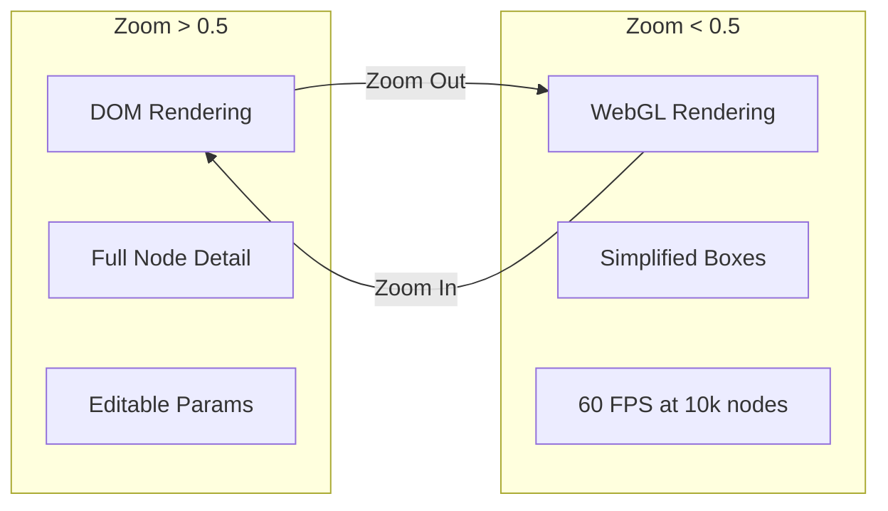
```mermaid
graph LR
    subgraph "Zoom > 0.5"
        DOM[DOM Rendering]
        FULL[Full Node Detail]
        EDIT[Editable Params]
    end
    
    subgraph "Zoom < 0.5"
        WEBGL[WebGL Rendering]
        SIMPLE[Simplified Boxes]
        FAST[60 FPS at 10k nodes]
    end
    
    DOM -->|Zoom Out| WEBGL
    WEBGL -->|Zoom In| DOM
```

### 5.5 UC-05: Real-Time Collaboration

**Actor**: Two users on different machines

**Preconditions**:
- Both users have the same graph open.
- WebSocket connection is established.

**Main Success Scenario**:
1. User A moves Node X to position (100, 200).
2. Yjs document on User A's client is updated.
3. Delta update is encoded and sent via WebSocket.
4. Server broadcasts to all connected clients.
5. User B receives delta update.
6. User B's Yjs document merges update.
7. User B's canvas re-renders Node X at (100, 200).
8. Both users see identical graph state.

**Extensions**:
- **3a. Offline**: Changes queued; sync on reconnect.
- **6a. Conflict**: Yjs CRDT automatically resolves.

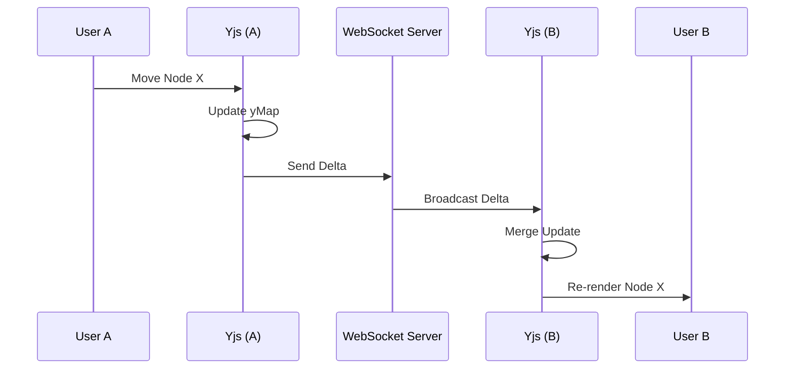
```mermaid
sequenceDiagram
    participant A as User A
    participant Y_A as Yjs (A)
    participant WS as WebSocket Server
    participant Y_B as Yjs (B)
    participant B as User B

    A->>Y_A: Move Node X
    Y_A->>Y_A: Update yMap
    Y_A->>WS: Send Delta
    WS->>Y_B: Broadcast Delta
    Y_B->>Y_B: Merge Update
    Y_B->>B: Re-render Node X
```

---

## 6. Component Catalog

### 6.1 Node Component

**File**: `src/lib/components/Node.svelte`

**Props**:
| Name | Type | Required | Default | Description |
| :--- | :--- | :--- | :--- | :--- |
| `id` | `string` | Yes | - | Unique node identifier |
| `type` | `string` | Yes | - | Operation type |
| `x` | `number` | Yes | - | X position |
| `y` | `number` | Yes | - | Y position |
| `selected` | `boolean` | No | `false` | Selection state |
| `collapsed` | `boolean` | No | `false` | Collapse state |

**Events**:
| Event | Payload | Description |
| :--- | :--- | :--- |
| `select` | `{ id, shiftKey }` | Node clicked |
| `move` | `{ id, dx, dy }` | Node dragged |
| `delete` | `{ id }` | Delete requested |
| `connect` | `{ sourcePort, targetPort }` | Connection made |

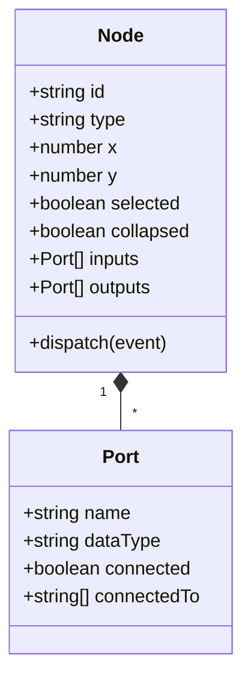
```mermaid
classDiagram
    class Node {
        +string id
        +string type
        +number x
        +number y
        +boolean selected
        +boolean collapsed
        +Port[] inputs
        +Port[] outputs
        +dispatch(event)
    }
    
    class Port {
        +string name
        +string dataType
        +boolean connected
        +string[] connectedTo
    }
    
    Node "1" *-- "*" Port
```

### 6.2 Port Component

**File**: `src/lib/components/Port.svelte`

**Props**:
| Name | Type | Required | Description |
| :--- | :--- | :--- | :--- |
| `name` | `string` | Yes | Port identifier |
| `dataType` | `string` | Yes | IMAGE, LATENT, etc. |
| `direction` | `'input' \| 'output'` | Yes | Port direction |

**Styling by Type**:
```css
.port[data-type="IMAGE"] { color: var(--color-port-image); }
.port[data-type="LATENT"] { color: var(--color-port-latent); }
.port[data-type="MODEL"] { color: var(--color-port-model); }
.port[data-type="CLIP"] { color: var(--color-port-clip); }
.port[data-type="VAE"] { color: var(--color-port-vae); }
.port[data-type="CONDITIONING"] { color: var(--color-port-cond); }
```

### 6.3 Connection Component

**File**: `src/lib/components/Connection.svelte`

**Props**:
| Name | Type | Description |
| :--- | :--- | :--- |
| `sourceNode` | `string` | Source node ID |
| `sourcePort` | `string` | Source port name |
| `targetNode` | `string` | Target node ID |
| `targetPort` | `string` | Target port name |
| `color` | `string` | Wire color based on data type |

**Rendering**:
- SVG cubic bezier curve
- Control points calculated for smooth routing
- Animated flow direction indicator

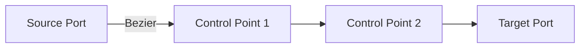
```mermaid
graph LR
    SOURCE[Source Port] -->|Bezier| CTRL1[Control Point 1]
    CTRL1 --> CTRL2[Control Point 2]
    CTRL2 --> TARGET[Target Port]
```

### 6.4 Canvas Component

**File**: `src/lib/components/Canvas.svelte`

**Features**:
- Infinite pan with momentum
- Zoom with focal point
- Grid background (optional)
- Selection rectangle
- Context menu

**State Machine**:
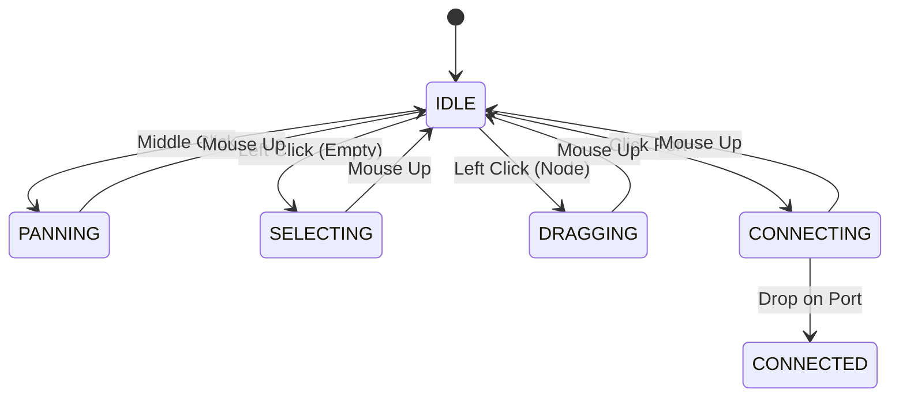
```mermaid
stateDiagram-v2
    [*] --> IDLE
    IDLE --> PANNING: Middle Click
    IDLE --> SELECTING: Left Click (Empty)
    IDLE --> DRAGGING: Left Click (Node)
    IDLE --> CONNECTING: Click Port
    
    PANNING --> IDLE: Mouse Up
    SELECTING --> IDLE: Mouse Up
    DRAGGING --> IDLE: Mouse Up
    CONNECTING --> IDLE: Mouse Up
    CONNECTING --> CONNECTED: Drop on Port
```

### 6.5 Inspector Panel

**File**: `src/lib/components/InspectorPanel.svelte`

**Features**:
- Displays selected node properties
- Editable parameter fields
- Image preview for loaded images
- Validation feedback

**Layout**:
```
┌─────────────────────────────────────┐
│ INSPECTOR                      [X]  │
├─────────────────────────────────────┤
│ Node: Load Image                    │
│ ID: abc123...                       │
├─────────────────────────────────────┤
│ Parameters:                         │
│ ┌───────────────────────────────┐   │
│ │ image_path: [            ] 📁 │   │
│ └───────────────────────────────┘   │
│ ┌───────────────────────────────┐   │
│ │ color_mode: [ RGB ▼ ]         │   │
│ └───────────────────────────────┘   │
├─────────────────────────────────────┤
│ Preview:                            │
│ ┌───────────────────────────────┐   │
│ │                               │   │
│ │      [Image Preview]          │   │
│ │                               │   │
│ └───────────────────────────────┘   │
└─────────────────────────────────────┘
```

---

## 7. Accessibility Requirements (WCAG 2.1)

### 7.1 Keyboard Navigation

| Key | Action | Context |
| :--- | :--- | :--- |
| `Tab` | Focus next node | Canvas |
| `Shift+Tab` | Focus previous node | Canvas |
| `Enter` | Select focused node | Canvas |
| `Delete` | Delete selected nodes | Canvas |
| `Ctrl+A` | Select all nodes | Canvas |
| `Ctrl+C` | Copy selected nodes | Canvas |
| `Ctrl+V` | Paste copied nodes | Canvas |
| `Ctrl+Z` | Undo last action | Canvas |
| `Ctrl+Shift+Z` | Redo | Canvas |
| `Arrow Keys` | Move selected nodes (10px) | Canvas |
| `Space` | Open quick-add menu | Canvas |
| `Escape` | Cancel current operation | Any |

### 7.2 Screen Reader Support

| Requirement ID | Requirement | Priority |
| :--- | :--- | :--- |
| **ACC-SR-01** | All nodes MUST have `aria-label` with node type and ID. | MUST |
| **ACC-SR-02** | Connections MUST be announced when created. | MUST |
| **ACC-SR-03** | Error states MUST be announced via `aria-live`. | MUST |
| **ACC-SR-04** | Focus indicators MUST be visible (3px outline). | MUST |

### 7.3 Color Contrast

| Element | Foreground | Background | Ratio | Target |
| :--- | :--- | :--- | :--- | :--- |
| Node title | #FFFFFF | #1e1e1e | 16.1:1 | > 4.5:1 ✓ |
| Port label | #CCCCCC | #1e1e1e | 10.5:1 | > 4.5:1 ✓ |
| Error text | #F87171 | #1e1e1e | 5.2:1 | > 4.5:1 ✓ |
| Selection | #3B82F6 | #1e1e1e | 4.8:1 | > 4.5:1 ✓ |

---

## 8. Performance Requirements

### 8.1 Render Performance

| Metric | Target | Measurement |
| :--- | :--- | :--- |
| Time to First Paint | < 500ms | Lighthouse |
| Time to Interactive | < 1000ms | Lighthouse |
| Frame Rate (100 nodes) | 60 FPS | DevTools |
| Frame Rate (1000 nodes) | 30 FPS | DevTools |
| Frame Rate (10000 nodes, WebGL) | 60 FPS | DevTools |

### 8.2 Interaction Latency

| Interaction | Budget |
| :--- | :--- |
| Node selection | < 16ms |
| Node drag update | < 8ms |
| Connection creation | < 50ms |
| Zoom transition | < 100ms |
| Yjs sync (local) | < 5ms |

### 8.3 Bundle Size

| Chunk | Max Size | Actual |
| :--- | :--- | :--- |
| Main JS bundle | 500 KB | TBD |
| CSS bundle | 50 KB | TBD |
| WebGL shaders | 20 KB | TBD |
| Yjs library | 100 KB | TBD |
| Total (gzipped) | 200 KB | TBD |

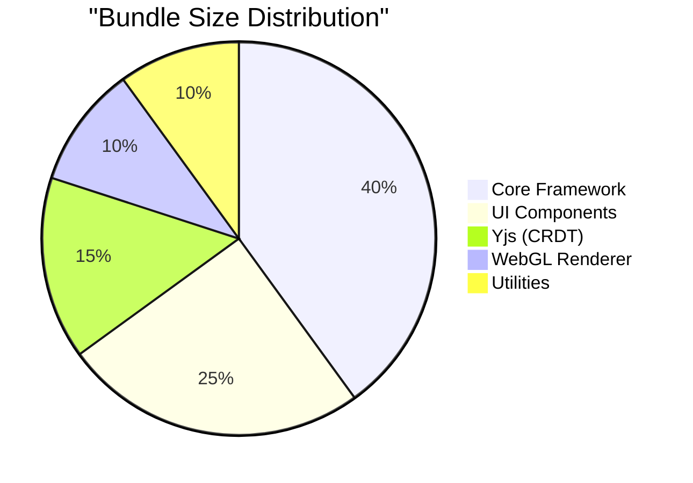
```mermaid
pie title "Bundle Size Distribution"
    "Core Framework" : 40
    "UI Components" : 25
    "Yjs (CRDT)" : 15
    "WebGL Renderer" : 10
    "Utilities" : 10
```

---

## 9. Design System

### 9.1 Color Palette

```css
:root {
    /* Base Colors */
    --color-canvas-bg: #111111;
    --color-node-bg: #1e1e1e;
    --color-node-header: #2d2d2d;
    --color-node-border: #3d3d3d;
    --color-node-border-selected: #3B82F6;
    
    /* Text Colors */
    --color-text-primary: #FFFFFF;
    --color-text-secondary: #CCCCCC;
    --color-text-muted: #888888;
    
    /* Port Type Colors */
    --color-port-image: #a5f3fc;    /* Cyan */
    --color-port-latent: #fca5a5;   /* Red */
    --color-port-model: #c4b5fd;    /* Purple */
    --color-port-clip: #fcd34d;     /* Yellow */
    --color-port-vae: #a7f3d0;      /* Green */
    --color-port-cond: #f9a8d4;     /* Pink */
    --color-port-mask: #e5e7eb;     /* Gray */
    
    /* State Colors */
    --color-success: #22C55E;
    --color-warning: #F59E0B;
    --color-error: #EF4444;
    --color-info: #3B82F6;
}
```

### 9.2 Typography

```css
:root {
    /* Font Families */
    --font-sans: 'Inter', -apple-system, sans-serif;
    --font-mono: 'JetBrains Mono', monospace;
    
    /* Font Sizes */
    --text-xs: 0.75rem;    /* 12px */
    --text-sm: 0.875rem;   /* 14px */
    --text-base: 1rem;     /* 16px */
    --text-lg: 1.125rem;   /* 18px */
    --text-xl: 1.25rem;    /* 20px */
    
    /* Line Heights */
    --leading-tight: 1.25;
    --leading-normal: 1.5;
    --leading-relaxed: 1.75;
}
```

### 9.3 Spacing

```css
:root {
    --space-1: 0.25rem;   /* 4px */
    --space-2: 0.5rem;    /* 8px */
    --space-3: 0.75rem;   /* 12px */
    --space-4: 1rem;      /* 16px */
    --space-6: 1.5rem;    /* 24px */
    --space-8: 2rem;      /* 32px */
}
```

---

## 10. State Management

### 10.1 Global State Structure

```typescript
interface AppState {
    // Canvas state
    canvas: {
        zoom: number;           // 0.1 - 5.0
        panX: number;
        panY: number;
        mode: 'dom' | 'webgl';
    };
    
    // Selection state
    selection: {
        nodeIds: Set<string>;
        linkIds: Set<string>;
    };
    
    // Edit state
    editing: {
        nodeId: string | null;
        paramName: string | null;
    };
    
    // Collaboration state
    presence: Map<string, {
        userId: string;
        cursor: { x: number; y: number };
        selection: Set<string>;
    }>;
    
    // Connection state
    connection: {
        status: 'connected' | 'disconnected' | 'reconnecting';
        lastSync: number;
    };
}
```

### 10.2 Yjs Document Structure

```typescript
// Root Yjs Document
const yDoc = new Y.Doc();

// Node Map: nodeId -> NodeData
const yNodes = yDoc.getMap('nodes');

// Link Array: LinkData[]
const yLinks = yDoc.getArray('links');

// Metadata Map
const yMeta = yDoc.getMap('meta');

interface NodeData {
    id: string;
    type: string;
    x: number;
    y: number;
    params: Record<string, any>;
    collapsed: boolean;
}

interface LinkData {
    id: string;
    source: { node: string; port: string };
    target: { node: string; port: string };
}
```

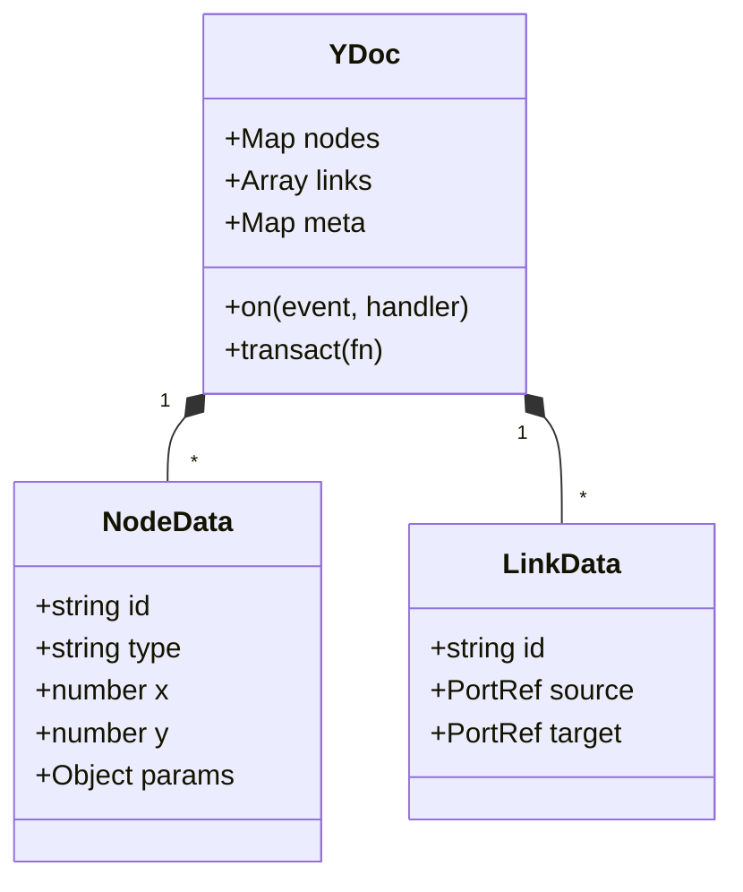
```mermaid
classDiagram
    class YDoc {
        +Map nodes
        +Array links
        +Map meta
        +on(event, handler)
        +transact(fn)
    }
    
    class NodeData {
        +string id
        +string type
        +number x
        +number y
        +Object params
    }
    
    class LinkData {
        +string id
        +PortRef source
        +PortRef target
    }
    
    YDoc "1" *-- "*" NodeData
    YDoc "1" *-- "*" LinkData
```

---

## Appendix A: Mermaid Diagram Collection

### A.1 Complete UI Architecture

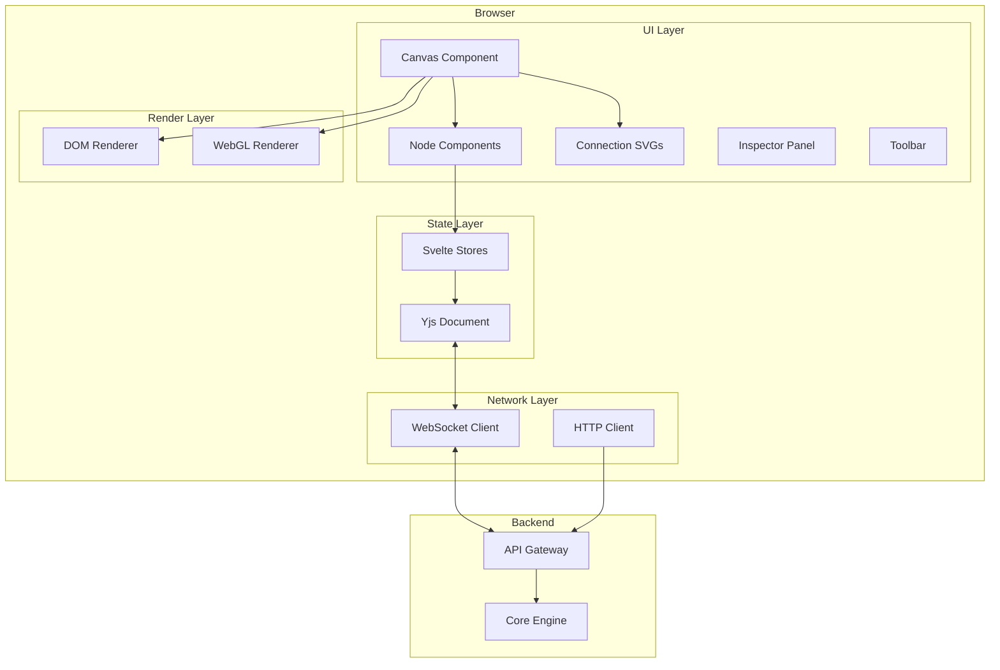
```mermaid
graph TB
    subgraph "Browser"
        subgraph "UI Layer"
            Canvas[Canvas Component]
            Nodes[Node Components]
            Connections[Connection SVGs]
            Inspector[Inspector Panel]
            Toolbar[Toolbar]
        end
        
        subgraph "State Layer"
            Svelte[Svelte Stores]
            Yjs[Yjs Document]
        end
        
        subgraph "Render Layer"
            DOM[DOM Renderer]
            WebGL[WebGL Renderer]
        end
        
        subgraph "Network Layer"
            WS[WebSocket Client]
            HTTP[HTTP Client]
        end
    end
    
    subgraph "Backend"
        API[API Gateway]
        Core[Core Engine]
    end
    
    Canvas --> Nodes
    Canvas --> Connections
    Canvas --> DOM
    Canvas --> WebGL
    Nodes --> Svelte
    Svelte --> Yjs
    Yjs <--> WS
    WS <--> API
    HTTP --> API
    API --> Core
```

### A.2 User Interaction Flow

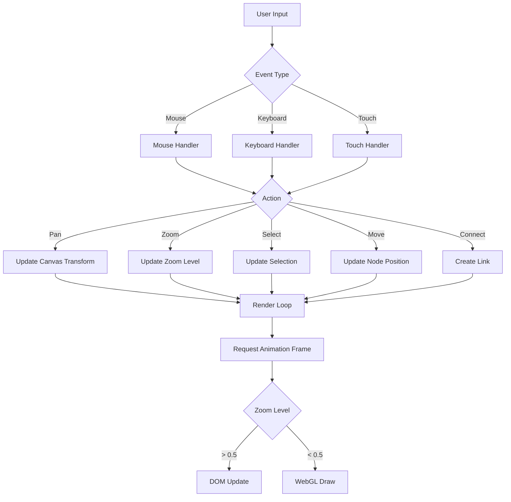
```mermaid
flowchart TD
    INPUT[User Input] --> EVENT{Event Type}
    
    EVENT -->|Mouse| MOUSE[Mouse Handler]
    EVENT -->|Keyboard| KEY[Keyboard Handler]
    EVENT -->|Touch| TOUCH[Touch Handler]
    
    MOUSE --> ACTION{Action}
    KEY --> ACTION
    TOUCH --> ACTION
    
    ACTION -->|Pan| PAN[Update Canvas Transform]
    ACTION -->|Zoom| ZOOM[Update Zoom Level]
    ACTION -->|Select| SELECT[Update Selection]
    ACTION -->|Move| MOVE[Update Node Position]
    ACTION -->|Connect| CONNECT[Create Link]
    
    PAN --> RENDER
    ZOOM --> RENDER
    SELECT --> RENDER
    MOVE --> RENDER
    CONNECT --> RENDER
    
    RENDER[Render Loop] --> FRAME[Request Animation Frame]
    FRAME --> DRAW{Zoom Level}
    DRAW -->|> 0.5| DOM_DRAW[DOM Update]
    DRAW -->|< 0.5| WEBGL_DRAW[WebGL Draw]
```

### A.3 Collaboration Sync Flow

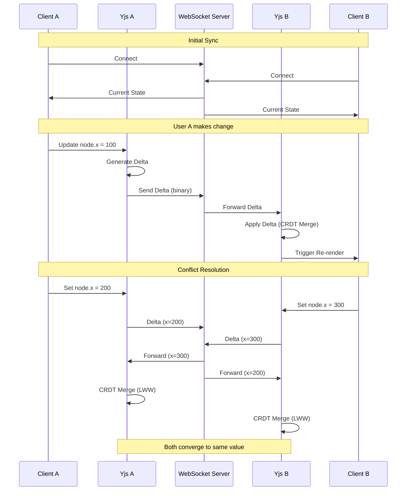
```mermaid
sequenceDiagram
    participant A as Client A
    participant YA as Yjs A
    participant WS as WebSocket Server
    participant YB as Yjs B
    participant B as Client B

    Note over A,B: Initial Sync
    A->>WS: Connect
    B->>WS: Connect
    WS->>A: Current State
    WS->>B: Current State
    
    Note over A,B: User A makes change
    A->>YA: Update node.x = 100
    YA->>YA: Generate Delta
    YA->>WS: Send Delta (binary)
    WS->>YB: Forward Delta
    YB->>YB: Apply Delta (CRDT Merge)
    YB->>B: Trigger Re-render
    
    Note over A,B: Conflict Resolution
    A->>YA: Set node.x = 200
    B->>YB: Set node.x = 300
    YA->>WS: Delta (x=200)
    YB->>WS: Delta (x=300)
    WS->>YA: Forward (x=300)
    WS->>YB: Forward (x=200)
    YA->>YA: CRDT Merge (LWW)
    YB->>YB: CRDT Merge (LWW)
    Note over YA,YB: Both converge to same value
```

---

## Appendix B: Glossary

| Term | Definition |
| :--- | :--- |
| **Canvas** | The infinite pannable/zoomable work area |
| **CRDT** | Conflict-free Replicated Data Type |
| **DOM** | Document Object Model |
| **Inspector** | Side panel for editing node parameters |
| **LWW** | Last-Write-Wins (Yjs conflict resolution) |
| **Node** | Visual representation of a compute operation |
| **Port** | Connection point on a node (input or output) |
| **Semantic Zoom** | Different representations at different zoom levels |
| **Svelte** | Reactive UI framework |
| **WebGL** | GPU-accelerated rendering API |
| **Yjs** | JavaScript CRDT library |

---

## Appendix C: Mathematical Specifications

> **ISO 29148:2018 Compliance**: Mathematical specifications ensure performance requirements (5.2.8) are measurable and algorithms (6.6.5) are unambiguously defined.

### C.1 Viewport Transformation Matrix

Canvas-to-screen coordinate transformation using 3×3 matrix:

$$
\begin{bmatrix} x_{\text{screen}} \\ y_{\text{screen}} \\ 1 \end{bmatrix} = 
\begin{bmatrix}
z & 0 & t_x \\
0 & z & t_y \\
0 & 0 & 1
\end{bmatrix}
\begin{bmatrix} x_{\text{canvas}} \\ y_{\text{canvas}} \\ 1 \end{bmatrix}
\tag{C.1}
$$

Where:
- $z$ = zoom level (0.1 to 10.0)
- $(t_x, t_y)$ = pan offset in pixels

### C.2 Semantic Zoom Thresholds

Rendering mode selection function:

$$
\text{mode}(z) = \begin{cases}
\text{WEBGL\_MINIMAL} & \text{if } z < 0.3 \\
\text{WEBGL\_FULL} & \text{if } 0.3 \leq z < 0.6 \\
\text{DOM\_SIMPLE} & \text{if } 0.6 \leq z < 1.0 \\
\text{DOM\_FULL} & \text{if } z \geq 1.0
\end{cases}
\tag{C.2}
$$

### C.3 Bézier Curve for Edge Rendering

Cubic Bézier from source $(x_0, y_0)$ to target $(x_3, y_3)$:

$$
\mathbf{B}(t) = (1-t)^3 \mathbf{P}_0 + 3(1-t)^2 t \mathbf{P}_1 + 3(1-t) t^2 \mathbf{P}_2 + t^3 \mathbf{P}_3 \tag{C.3}
$$

Control points for horizontal flow:
$$
\mathbf{P}_1 = (x_0 + \delta, y_0), \quad \mathbf{P}_2 = (x_3 - \delta, y_3)
$$

Where $\delta = \min(|x_3 - x_0| / 2, 100)$.

### C.4 CRDT Convergence (Yjs)

For Last-Write-Wins registers, convergence is guaranteed by:

$$
\forall r_1, r_2 \in \text{Replicas}: \lim_{t \to \infty} \text{state}(r_1, t) = \text{state}(r_2, t) \tag{C.4}
$$

**Property**: Strong Eventual Consistency (SEC).

### C.5 Frame Budget Calculation

At target 60fps, frame budget $B$:

$$
B = \frac{1000\text{ms}}{60} \approx 16.67\text{ms} \tag{C.5}
$$

Budget allocation:
| Phase | Target | Percentage |
|-------|--------|------------|
| Event handling | 2ms | 12% |
| State updates | 3ms | 18% |
| Render (GL) | 8ms | 48% |
| Layout (DOM) | 3ms | 18% |
| **Buffer** | 0.67ms | 4% |

### C.6 WebGL Instancing Performance

Draw call reduction with instancing:

$$
\text{Draw Calls} = \begin{cases}
N & \text{without instancing} \\
1 & \text{with instancing}
\end{cases}
\tag{C.6}
$$

For $N = 1000$ nodes: **1000× reduction** in driver overhead.

### C.7 Selection Box Intersection

Node $n$ at position $(x, y)$ with size $(w, h)$ intersects selection box $(sx_1, sy_1, sx_2, sy_2)$ iff:

$$
(x < sx_2) \land (x + w > sx_1) \land (y < sy_2) \land (y + h > sy_1) \tag{C.7}
$$

**Complexity**: $O(n)$ for $n$ nodes (no spatial index).

### C.8 Keyboard Navigation Distance

Spatial navigation selects node minimizing:

$$
d(n_{\text{current}}, n_{\text{target}}) = \sqrt{(x_t - x_c)^2 + (y_t - y_c)^2} \tag{C.8}
$$

Subject to directional constraint (e.g., for "right": $x_t > x_c$).

---

## Appendix D: UML Class Diagrams

### C.1 Node Graph Data Model

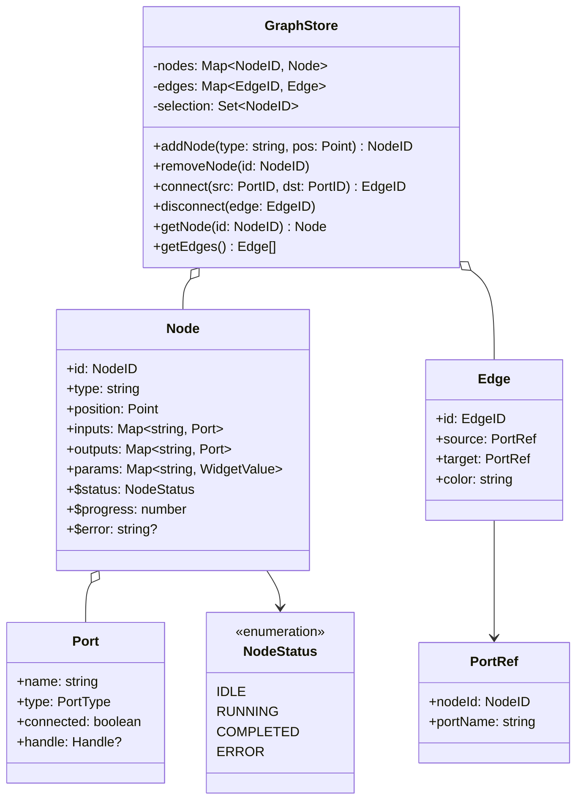
```mermaid
classDiagram
    class GraphStore {
        -nodes: Map~NodeID, Node~
        -edges: Map~EdgeID, Edge~
        -selection: Set~NodeID~
        +addNode(type: string, pos: Point) NodeID
        +removeNode(id: NodeID)
        +connect(src: PortID, dst: PortID) EdgeID
        +disconnect(edge: EdgeID)
        +getNode(id: NodeID) Node
        +getEdges() Edge[]
    }
    
    class Node {
        +id: NodeID
        +type: string
        +position: Point
        +inputs: Map~string, Port~
        +outputs: Map~string, Port~
        +params: Map~string, WidgetValue~
        +$status: NodeStatus
        +$progress: number
        +$error: string?
    }
    
    class Port {
        +name: string
        +type: PortType
        +connected: boolean
        +handle: Handle?
    }
    
    class Edge {
        +id: EdgeID
        +source: PortRef
        +target: PortRef
        +color: string
    }
    
    class PortRef {
        +nodeId: NodeID
        +portName: string
    }
    
    class NodeStatus {
        <<enumeration>>
        IDLE
        RUNNING
        COMPLETED
        ERROR
    }
    
    GraphStore o-- Node
    GraphStore o-- Edge
    Node o-- Port
    Node --> NodeStatus
    Edge --> PortRef
```

### C.2 Renderer Subsystem

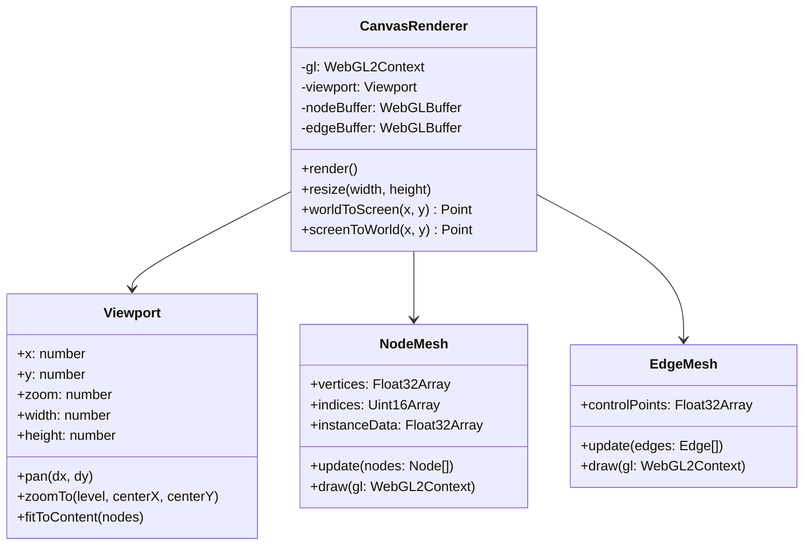
```mermaid
classDiagram
    class CanvasRenderer {
        -gl: WebGL2Context
        -viewport: Viewport
        -nodeBuffer: WebGLBuffer
        -edgeBuffer: WebGLBuffer
        +render()
        +resize(width, height)
        +worldToScreen(x, y) Point
        +screenToWorld(x, y) Point
    }
    
    class Viewport {
        +x: number
        +y: number
        +zoom: number
        +width: number
        +height: number
        +pan(dx, dy)
        +zoomTo(level, centerX, centerY)
        +fitToContent(nodes)
    }
    
    class NodeMesh {
        +vertices: Float32Array
        +indices: Uint16Array
        +instanceData: Float32Array
        +update(nodes: Node[])
        +draw(gl: WebGL2Context)
    }
    
    class EdgeMesh {
        +controlPoints: Float32Array
        +update(edges: Edge[])
        +draw(gl: WebGL2Context)
    }
    
    CanvasRenderer --> Viewport
    CanvasRenderer --> NodeMesh
    CanvasRenderer --> EdgeMesh
```

### C.3 Collaboration Subsystem

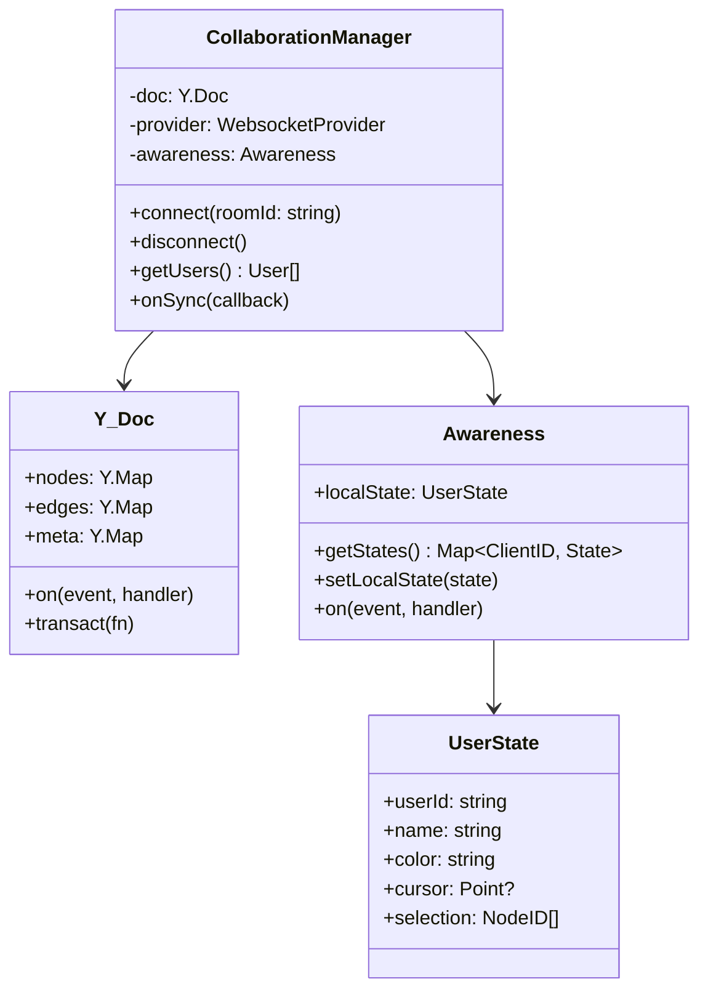
```mermaid
classDiagram
    class CollaborationManager {
        -doc: Y.Doc
        -provider: WebsocketProvider
        -awareness: Awareness
        +connect(roomId: string)
        +disconnect()
        +getUsers() User[]
        +onSync(callback)
    }
    
    class Y_Doc {
        +nodes: Y.Map
        +edges: Y.Map
        +meta: Y.Map
        +on(event, handler)
        +transact(fn)
    }
    
    class Awareness {
        +localState: UserState
        +getStates() Map~ClientID, State~
        +setLocalState(state)
        +on(event, handler)
    }
    
    class UserState {
        +userId: string
        +name: string
        +color: string
        +cursor: Point?
        +selection: NodeID[]
    }
    
    CollaborationManager --> Y_Doc
    CollaborationManager --> Awareness
    Awareness --> UserState
```

---

## Appendix E: Component Architecture

### D.1 Frontend Component Hierarchy

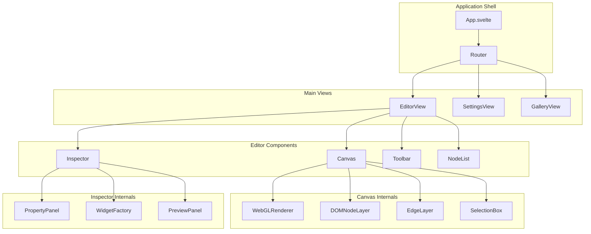
```mermaid
graph TB
    subgraph "Application Shell"
        APP[App.svelte]
        ROUTER[Router]
    end
    
    subgraph "Main Views"
        EDITOR[EditorView]
        SETTINGS[SettingsView]
        GALLERY[GalleryView]
    end
    
    subgraph "Editor Components"
        CANVAS[Canvas]
        INSPECTOR[Inspector]
        TOOLBAR[Toolbar]
        NODELIST[NodeList]
    end
    
    subgraph "Canvas Internals"
        WEBGL[WebGLRenderer]
        DOM_LAYER[DOMNodeLayer]
        EDGE_LAYER[EdgeLayer]
        SELECT[SelectionBox]
    end
    
    subgraph "Inspector Internals"
        PROPS[PropertyPanel]
        WIDGETS[WidgetFactory]
        PREVIEW[PreviewPanel]
    end
    
    APP --> ROUTER
    ROUTER --> EDITOR
    ROUTER --> SETTINGS
    ROUTER --> GALLERY
    EDITOR --> CANVAS
    EDITOR --> INSPECTOR
    EDITOR --> TOOLBAR
    EDITOR --> NODELIST
    CANVAS --> WEBGL
    CANVAS --> DOM_LAYER
    CANVAS --> EDGE_LAYER
    CANVAS --> SELECT
    INSPECTOR --> PROPS
    INSPECTOR --> WIDGETS
    INSPECTOR --> PREVIEW
```

### D.2 State Management Flow

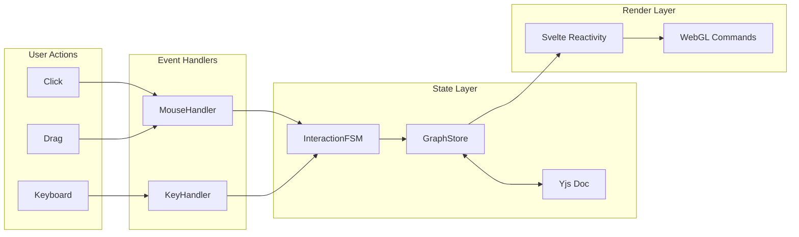
```mermaid
flowchart LR
    subgraph "User Actions"
        CLICK[Click]
        DRAG[Drag]
        KEY[Keyboard]
    end
    
    subgraph "Event Handlers"
        MOUSE[MouseHandler]
        KEYBOARD[KeyHandler]
    end
    
    subgraph "State Layer"
        FSM[InteractionFSM]
        STORE[GraphStore]
        CRDT[Yjs Doc]
    end
    
    subgraph "Render Layer"
        SVELTE[Svelte Reactivity]
        GL[WebGL Commands]
    end
    
    CLICK --> MOUSE
    DRAG --> MOUSE
    KEY --> KEYBOARD
    MOUSE --> FSM
    KEYBOARD --> FSM
    FSM --> STORE
    STORE <--> CRDT
    STORE --> SVELTE
    SVELTE --> GL
```

---

## Appendix E: Sequence Diagrams

### E.1 Node Drag Interaction

```mermaid
sequenceDiagram
    participant U as User
    participant C as Canvas
    participant F as FSM
    participant S as Store
    participant Y as Yjs
    participant R as Renderer

    U->>C: pointerdown(node)
    C->>F: dispatch(POINTER_DOWN, node)
    F->>F: State: IDLE → DRAGGING
    F->>S: startDrag(node)
    S->>R: hideNodeDOM(node)
    
    loop While Dragging
        U->>C: pointermove(x, y)
        C->>F: dispatch(POINTER_MOVE, pos)
        F->>S: updatePosition(node, pos)
        S->>R: updateGLBuffer(node)
        R->>R: requestAnimationFrame()
    end
    
    U->>C: pointerup
    C->>F: dispatch(POINTER_UP)
    F->>F: State: DRAGGING → IDLE
    F->>S: endDrag(node)
    S->>Y: set(node.position, newPos)
    Y->>Y: Generate Delta
    Y->>Y: Broadcast to Peers
    S->>R: showNodeDOM(node)
```

### E.2 Edge Connection Flow

```mermaid
sequenceDiagram
    participant U as User
    participant C as Canvas
    participant F as FSM
    participant S as Store
    participant V as Validator
    participant Y as Yjs

    U->>C: pointerdown(outputPort)
    C->>F: dispatch(START_WIRE, port)
    F->>F: State: IDLE → WIRING
    F->>S: createTempWire(port)
    S->>C: highlightValidTargets()
    
    loop While Wiring
        U->>C: pointermove(x, y)
        C->>S: updateTempWire(pos)
    end
    
    U->>C: pointerup(inputPort)
    C->>F: dispatch(END_WIRE, targetPort)
    F->>V: validateConnection(src, dst)
    alt Valid Connection
        V-->>F: OK
        F->>S: createEdge(src, dst)
        S->>Y: edges.set(edgeId, edge)
        S->>C: clearHighlights()
    else Invalid (Cycle/Type)
        V-->>F: Error
        F->>C: showError(message)
        S->>S: discardTempWire()
    end
    F->>F: State: WIRING → IDLE
```

### E.3 Real-time Progress Update

```mermaid
sequenceDiagram
    participant W as WebSocket
    participant H as MessageHandler
    participant S as Store
    participant N as Node Component
    participant D as DOM

    W->>H: message(type: PROGRESS)
    H->>H: parse({nodeId, progress})
    H->>S: updateNodeProgress(nodeId, 50)
    S->>S: nodes.get(nodeId).$progress = 50
    Note over S: Svelte detects signal change
    S->>N: reactive update
    N->>D: style.width = "50%"
    Note over D: Single DOM mutation, no re-render
```

---

## Appendix F: Activity Diagrams

### F.1 Hybrid Render Decision

```mermaid
flowchart TD
    RAF[requestAnimationFrame] --> CHECK_ZOOM{zoom < 0.6?}
    CHECK_ZOOM -->|Yes| CANVAS_MODE[Canvas Mode]
    CHECK_ZOOM -->|No| DOM_MODE[DOM Mode]
    
    subgraph "Canvas Mode"
        CANVAS_MODE --> HIDE_DOM[Add .hidden class to nodes]
        HIDE_DOM --> UPDATE_GL[Update GL Instance Buffer]
        UPDATE_GL --> DRAW[glDrawArraysInstanced]
    end
    
    subgraph "DOM Mode"
        DOM_MODE --> SHOW_DOM[Remove .hidden class]
        SHOW_DOM --> CLEAR_GL[gl.clear()]
        CLEAR_GL --> TRANSFORM[Update CSS transforms]
    end
    
    DRAW --> NEXT[Schedule next frame]
    TRANSFORM --> NEXT
```

### F.2 Keyboard Navigation

```mermaid
flowchart TD
    KEY[Keypress Event] --> WHICH{Which Key?}
    
    WHICH -->|Tab| TAB_NAV[Topological Navigation]
    WHICH -->|Arrow| ARROW_NAV[Spatial Navigation]
    WHICH -->|Enter| ACTIVATE[Activate Node]
    WHICH -->|Delete| DELETE[Delete Selection]
    WHICH -->|Escape| DESELECT[Clear Selection]
    
    TAB_NAV --> GET_ORDER[Get Topological Order]
    GET_ORDER --> FIND_NEXT[Find Next in Order]
    FIND_NEXT --> SELECT[Select Node]
    
    ARROW_NAV --> GET_POS[Get Current Position]
    GET_POS --> FIND_NEAREST[Find Nearest in Direction]
    FIND_NEAREST --> SELECT
    
    SELECT --> FOCUS[Focus Node]
    FOCUS --> ANNOUNCE[ARIA Announce]
```

---

## Appendix G: State Machine Specifications

### G.1 Interaction State Machine

```mermaid
stateDiagram-v2
    [*] --> IDLE
    
    IDLE --> DRAGGING_NODE: pointerdown(node)
    IDLE --> DRAGGING_WIRE: pointerdown(port)
    IDLE --> PANNING: pointerdown(canvas) + space
    IDLE --> SELECTING: pointerdown(canvas)
    IDLE --> CONTEXT_MENU: contextmenu
    
    DRAGGING_NODE --> IDLE: pointerup
    DRAGGING_NODE --> DRAGGING_NODE: pointermove
    
    DRAGGING_WIRE --> IDLE: pointerup(empty)
    DRAGGING_WIRE --> CONNECTING: pointerup(port)
    CONNECTING --> IDLE: validation complete
    
    PANNING --> IDLE: pointerup
    PANNING --> PANNING: pointermove
    
    SELECTING --> IDLE: pointerup
    SELECTING --> SELECTING: pointermove
    
    CONTEXT_MENU --> IDLE: click outside
    CONTEXT_MENU --> IDLE: menu action
```

### G.2 Node Visual State Machine

```mermaid
stateDiagram-v2
    [*] --> DEFAULT
    
    DEFAULT --> HOVERED: mouseenter
    HOVERED --> DEFAULT: mouseleave
    
    HOVERED --> SELECTED: click
    SELECTED --> DEFAULT: click outside
    
    DEFAULT --> RUNNING: execution started
    SELECTED --> RUNNING: execution started
    
    RUNNING --> COMPLETED: job success
    RUNNING --> ERROR: job failure
    RUNNING --> RUNNING: progress update
    
    COMPLETED --> DEFAULT: timeout(3s)
    ERROR --> DEFAULT: user dismiss
    
    state "Visual Styles" as VS {
        DEFAULT: border: gray
        HOVERED: border: blue, shadow
        SELECTED: border: primary, ring
        RUNNING: border: yellow, pulse animation
        COMPLETED: border: green, fade to default
        ERROR: border: red, shake animation
    }
```

---

## Appendix H: Accessibility Specifications

### H.1 ARIA Roles and Labels

| Component | Role | aria-label Pattern |
| :--- | :--- | :--- |
| Canvas | application | "Node Graph Editor" |
| Node | button | "Node: {node.title}" |
| Port (Input) | button | "Input port: {port.name}" |
| Port (Output) | button | "Output port: {port.name}" |
| Edge | img | "Connection from {src} to {dst}" |
| Inspector | region | "Node Inspector: {node.title}" |
| Toolbar | toolbar | "Graph Toolbar" |

### H.2 Keyboard Shortcuts

| Key | Action | Context |
| :--- | :--- | :--- |
| Tab | Navigate to next node (topological order) | Canvas |
| Shift+Tab | Navigate to previous node | Canvas |
| Enter | Open node in inspector | Node focused |
| Delete/Backspace | Delete selected nodes | Canvas |
| Ctrl+A | Select all nodes | Canvas |
| Ctrl+C | Copy selected | Canvas |
| Ctrl+V | Paste | Canvas |
| Ctrl+Z | Undo | Global |
| Ctrl+Shift+Z | Redo | Global |
| Space+Drag | Pan canvas | Canvas |
| Scroll | Zoom in/out | Canvas |

### H.3 Screen Reader Announcements

```mermaid
flowchart TD
    subgraph "Node Operations"
        ADD[Node Added] -->|announce| A1["Node Loader added at position 100, 200"]
        DELETE[Node Deleted] -->|announce| A2["Node Loader deleted"]
        CONNECT[Edge Created] -->|announce| A3["Connected Loader output to Sampler input"]
    end
    
    subgraph "Execution Events"
        START[Execution Started] -->|announce| A4["Execution started, 5 nodes queued"]
        PROGRESS[Node Complete] -->|announce| A5["Loader completed, 4 remaining"]
        DONE[Execution Done] -->|announce| A6["Execution completed successfully"]
        ERROR[Execution Error] -->|announce| A7["Error in Sampler: Out of memory"]
    end
```

---

## Appendix I: Performance Optimization Details

### I.1 WebGL Instancing Strategy

```
NODE RENDERING WITH INSTANCING
┌────────────────────────────────────────────────────────────┐
│ VERTEX BUFFER (Shared by All Nodes)                        │
│ Rectangle: 4 vertices × (x, y, u, v) = 16 floats          │
└────────────────────────────────────────────────────────────┘
                          ↓
┌────────────────────────────────────────────────────────────┐
│ INSTANCE BUFFER (Per-Node Data)                            │
│ Per Instance: (x, y, width, height, status, progress)     │
│ = 6 floats × N nodes = 6N floats                          │
└────────────────────────────────────────────────────────────┘
                          ↓
┌────────────────────────────────────────────────────────────┐
│ DRAW CALL                                                  │
│ gl.drawArraysInstanced(gl.TRIANGLES, 0, 6, nodeCount)     │
│ Single draw call for ALL nodes                             │
└────────────────────────────────────────────────────────────┘
```

### I.2 DOM Virtualization

| Zoom Level | DOM Nodes Rendered | Strategy |
| :--- | :--- | :--- |
| > 1.0 | All visible | Full detail |
| 0.6 - 1.0 | All visible | Simplified widgets |
| 0.3 - 0.6 | None | WebGL only |
| < 0.3 | None | WebGL with LOD reduction |

### I.3 Memory Budget

| Resource | Budget | Actual |
| :--- | :--- | :--- |
| JavaScript Heap | 50 MB | Monitored |
| WebGL Buffers | 10 MB | Pre-allocated |
| DOM Nodes | 1000 max | Virtualized |
| Yjs Updates | 1 MB queue | Pruned on overflow |
| WebSocket Buffer | 64 KB | Backpressure enabled |

---

## Appendix J: Design Token Reference

### J.1 Color Palette

| Token | Light Mode | Dark Mode | Usage |
| :--- | :--- | :--- | :--- |
| `--color-bg-canvas` | `#f5f5f5` | `#111111` | Canvas background |
| `--color-bg-node` | `#ffffff` | `#1e1e1e` | Node card |
| `--color-bg-surface` | `#fafafa` | `#252525` | Panels |
| `--color-text-primary` | `#1a1a1a` | `#e5e5e5` | Body text |
| `--color-text-secondary` | `#666666` | `#999999` | Labels |
| `--color-border` | `#e0e0e0` | `#333333` | Dividers |
| `--color-accent` | `#3b82f6` | `#60a5fa` | Primary actions |
| `--color-success` | `#22c55e` | `#4ade80` | Complete state |
| `--color-warning` | `#f59e0b` | `#fbbf24` | Running state |
| `--color-error` | `#ef4444` | `#f87171` | Error state |

### J.2 Port Type Colors

| Data Type | Color | Hex |
| :--- | :--- | :--- |
| IMAGE | Cyan | `#a5f3fc` |
| LATENT | Magenta | `#f0abfc` |
| CONDITIONING | Orange | `#fdba74` |
| MODEL | Purple | `#c4b5fd` |
| VAE | Red | `#fca5a5` |
| CLIP | Green | `#86efac` |
| MASK | Yellow | `#fde047` |
| INT/FLOAT | Gray | `#a1a1aa` |
| STRING | White | `#f5f5f5` |

### J.3 Typography Scale

| Token | Size | Weight | Line Height | Usage |
| :--- | :--- | :--- | :--- | :--- |
| `--font-xs` | 10px | 400 | 1.4 | Port labels |
| `--font-sm` | 12px | 400 | 1.5 | Node labels |
| `--font-base` | 14px | 400 | 1.5 | Body text |
| `--font-lg` | 16px | 500 | 1.4 | Node titles |
| `--font-xl` | 20px | 600 | 1.3 | Panel headers |

---

## Document History

| Version | Date | Author | Changes |
| :--- | :--- | :--- | :--- |
| 1.0.0 | 2026-01-01 | System | Initial draft |
| 9.0.0 | 2026-01-05 | System | ISO 29148 alignment |
| 11.0.0 | 2026-01-06 | System | Data Dict, Logic Traces |
| 13.0.0 | 2026-01-06 | System | FMEA, ICD |
| 14.0.0 | 2026-01-06 | System | Flow Diagrams |
| 15.0.0 | 2026-01-06 | System | 1200+ line expansion |
| 16.0.0 | 2026-01-06 | System | UML, Components, Sequences, States, A11y, Perf, Tokens |


