# Software Requirements Specification (SRS): Compute Fabric
**Project**: VORTEX-GEN 3.0 "Centaur"
**Module**: Compute Fabric (`vortex-worker`)
**Version**: 9.0.0 (ISO Standard)
**Date**: 2026-01-06
**Standard**: ISO/IEC 29148:2018

---

## 1. Introduction

### 1.1 Purpose
This SRS specifies the software requirements for the **Compute Fabric**, the distributed execution environment for VORTEX. It details the Python worker lifecycle, the Zero-Copy data ingress/egress protocols, and the runtime security sandboxing mechanisms.

### 1.2 Scope
The Compute Fabric allows the execution of arbitrary Python code (Nodes) within a strictly controlled environment.
**The software facilitates**:
*   **Job Execution**: Running AI inference tasks on demand.
*   **Data Transport**: Mapping Arrow Shared Memory to PyTorch Tensors.
*   **Isolation**: Preventing side-effects via syscall filtering.
*   **Resource Management**: Explicit VRAM allocation and garbage collection.

### 1.3 Definitions, Acronyms, and Abbreviations
| Term | Definition |
| :--- | :--- |
| **Worker** | A single implementation of the Compute Fabric (System Process). |
| **Zero-Copy** | Passing reference instead of value. |
| **PyArrow** | Python bindings for Apache Arrow. |
| **DLPack** | Tensor exchange standard (used by PyTorch/TF/JAX). |
| **Ctypes** | Python Foreign Function Interface library. |

---

## 2. Overall Description

### 2.1 Product Perspective
The Compute Fabric operates as a child process of the Core Engine. It has no direct User Interface. It communicates solely via a Unix Domain Socket (Control) and Shared Memory (Data).

### 2.2 Product Functions
*   **F-01: Execution Loop**: Listening for and processing execution commands.
*   **F-02: Zero-Copy Bridge**: Converting raw pointers to usable Tensors.
*   **F-03: Security Sandbox**: Intercepting and blocking dangerous Python calls.
*   **F-04: Exception Marshalling**: capturing and serializing stack traces.

### 2.3 User Classes and Characteristics
*   **None**: The Compute Fabric is an internal subsystem.

### 2.4 Operating Environment
*   **Runtime**: Python 3.10+ (System).
*   **Libraries**: `torch`, `pyarrow`, `numpy`.
*   **OS**: Linux/macOS (Must support `SO_PEERCRED` or similar for auth).

---

## 3. Specific Requirements

### 3.1 External Interface Requirements
#### 3.1.1 Software Interfaces
*   **SI-01 (Inputs)**: The Worker shall accept `JobDefinition` Protobuf messages.
*   **SI-02 (Outputs)**: The Worker shall return `JobResult` Protobuf messages.

### 3.2 Functional Requirements

#### 3.2.1 [F-01] The Execution Loop
*   **Description**: The main event loop of the worker.
*   **Inputs**: Socket File Descriptor.
*   **Processing**:
    1.  Call `select()` to wait for data.
    2.  Read 4-byte Length Header.
    3.  Read N-byte Protobuf Payload.
    4.  Deserialize to `Job` object.
    5.  Execute `Node.process(Job.inputs)`.
    6.  Serialize Result and Send.
*   **Outputs**: Result Packet sent to Host.

#### 3.2.2 [F-02] Zero-Copy Arrow Bridge
*   **Description**: Creating Tensors from Shared Memory.
*   **Inputs**: `Handle` (Int64 Offset).
*   **Processing**:
    1.  Calculate `Addr = BaseAddr + Handle`.
    2.  Create `ctypes.c_void_p(Addr)`.
    3.  Cast to `POINTER(ArrowArray)`.
    4.  Call `pyarrow.RecordBatch._import_from_c`.
    5.  Call `torch.from_dlpack(batch)`.
*   **Outputs**: A `torch.Tensor` pointing to the shared memory region.

#### 3.2.3 [F-03] Runtime Sandboxing
*   **Description**: Monkey-Patching dangerous modules.
*   **Inputs**: Python Runtime Initialization.
*   **Processing**:
    1.  Define `guard()` function that raises `SecurityError`.
    2.  Overwrite `os.system = guard`.
    3.  Overwrite `subprocess.call = guard`.
    4.  Overwrite `builtins.exec = guard`.
*   **Outputs**: A restricted Python environment.

### 3.3 Non-Functional Requirements

#### 3.3.1 Performance
*   **PERF-01**: Tensor Mapping overhead shall be < 1ms, regardless of Tensor size (1KB vs 10GB).
*   **PERF-02**: Worker startup time (warm) shall be < 100ms.

#### 3.3.2 Reliability
*   **REL-01**: The Worker shall catch ALL Python Exceptions (`Exception`, `BaseException`) and report them as structured errors, never crashing silently.

---

### 3.4 Data Dictionary & Data Structures

#### 3.4.1 Job Lifecycle (Protobuf)
The `Job` message defines the execution unit.
```protobuf
message Job {
    string node_id = 1;
    string job_id = 2;         // Tracing ID
    string op_type = 3;        // "torch.matmul"
    
    // Inputs: Pointers to Shared Memory
    map<string, int64> input_handles = 4;
    
    // Config: Literal values
    map<string, string> params = 5; // {"ax": "1", "k": "3"}
}
```

#### 3.4.2 Zero-Copy Struct (C-Layout)
The `ArrowArray` struct used for IPC (ABI Stable).
```c
struct ArrowArray {
  // 64-bit alignment required
  int64_t length;
  int64_t null_count;
  int64_t offset;
  int64_t n_buffers;
  int64_t n_children;
  const void** buffers;     // Points to [ValidityBitmap, DataBuffer]
  struct ArrowArray** children;
  struct ArrowArray* dictionary;
  void (*release)(struct ArrowArray*);
  void* private_data;
};
```

### 3.5 Logic Traces

#### 3.5.1 Logic Trace: Execution Loop
```mermaid
sequenceDiagram
    participant Sock as Unix Socket
    participant Loop as Event Loop
    participant Exec as Executor
    participant GPU as CUDA Context
    
    Sock->>Loop: Readable Event (select)
    Loop->>Sock: recv(4) -> Length
    Loop->>Sock: recv(Length) -> Payload
    Loop->>Exec: Unpack(Job)
    Exec->>Exec: MapInputs(Handles) -> Tensors
    Exec->>GPU: Op(Tensors)
    GPU-->>Exec: ResultTensor
    Exec->>Exec: Export(Result) -> Handle
    Exec->>Sock: Send(ResultHandle)
```

### 3.6 Component Interface Specifications (CIS)

#### 3.6.1 Executor ABC (Python)
The abstract base class for all compute nodes.
```python
class Executor(ABC):
    @abstractmethod
    def execute(self, inputs: Dict[str, torch.Tensor], params: Dict[str, Any]) -> torch.Tensor:
        """
        Core logic for the node.
        
        Args:
            inputs: Map of Input Name -> GPU Tensor (Zero-Copy)
            params: Dictionary of configuration literals
            
        Returns:
            The output GPU Tensor (to be exported to SHM)
        """
        pass

    def cleanup(self):
        """Optional hook for releasing heavy resources (e.g. Models)."""
        pass
```

#### 3.6.2 Device Manager Interface (Python)
Manages the CUDA Context and Stream.
```python
class DeviceManager:
    def get_stream(self) -> torch.cuda.Stream:
        """Returns the dedicated stream for this worker."""
        pass
        
    def synchronize(self):
        """Blocks until all stream operations complete."""
        pass
```

### 3.7 State Transition Matrices

#### 3.7.1 Tensor Life Cycle
Defines valid transitions for a `SharedTensor` object.

| Current State | Event | Next State | Side Effects |
| :--- | :--- | :--- | :--- |
| **UNMAPPED** | `Job::Receive` | **MAPPED** | `shm_open()`; `mmap()`. |
| **MAPPED** | `Arrow::Import` | **GPU_RESIDENT**| `cudaMemcpy` or `DLPack` import. |
| **GPU_RESIDENT**| `Job::Finish` | **GPU_RESIDENT**| (Tensor remains cached in VRAM). |
| **GPU_RESIDENT**| `Mem::Evict` | **MAPPED** | `free(GPU_Ptr)`; Keep SHM mapping. |
| **MAPPED** | `OS::Close` | **UNMAPPED** | `munmap()`; Close FD. |

### 3.8 Failure Mode & Effects Analysis (FMEA)

#### 3.8.1 Function: Tensor Computation
| ID | Failure Mode | Effect (Severity) | Cause (Occurrence) | Detection (Method) | Mitigation Strategy |
| :--- | :--- | :--- | :--- | :--- | :--- |
| **WK-FM-01** | **CUDA OOM** | **Major (7)**: Job fails; VRAM fragmented. | **Frequent (4)**: Batch Size too large. | **Exception**: `RuntimeError: CUDA out of memory`. | Catch `RuntimeError`; Run `gc.collect()`; Return `WK-001`. |
| **WK-FM-02** | **Bus Error** | **Catastrophic (10)**: Process Crash. | **Rare (1)**: Accessing unmapped SHM. | **Signal**: `SIGBUS` (7). | Check `shm_size` vs `offset + size` before access. |

#### 3.8.2 Function: Zero-Copy Import
| ID | Failure Mode | Effect (Severity) | Cause (Occurrence) | Detection (Method) | Mitigation Strategy |
| :--- | :--- | :--- | :--- | :--- | :--- |
| **WK-FM-03** | **Type Alignment**| **Major (6)**: Garbage data in Tensor. | **Occasional (3)**: Float32 read as Float16. | **Schema**: Validate `ArrowSchema` format string (`f` vs `e`). | Reject import if DType mismatch; Return `WK-002`. |

### 3.9 Interface Control Document (ICD) - Compute Level

#### 3.9.1 Type Mapping Table (Arrow <-> PyTorch)
Exact correspondence for binary data interpretation.

| Arrow Type | PyTorch DType | Type Code (Byte) | Bytes/Elem |
| :--- | :--- | :--- | :--- |
| `float32` | `torch.float32` | `0x01` | 4 |
| `float16` | `torch.float16` | `0x02` | 2 |
| `u8` | `torch.uint8` | `0x10` | 1 |
| `int64` | `torch.int64` | `0x20` | 8 |

#### 3.9.2 Job Parameter Specification
Constraints for the `params` map in the Job Protobuf.

| Key | Value Pattern | Required | Description |
| :--- | :--- | :--- | :--- |
| `device` | `cuda:\d+` | **Yes** | Target GPU ID. |
| `seed` | `\d+` | No | Deterministic RNG seed (uint64). |
| `precision` | `fp16 \| fp32`| No | Calculation precision (Default: fp16). |

### 3.10 Module Flow Diagram
Execution Logic within the Python Worker Process.

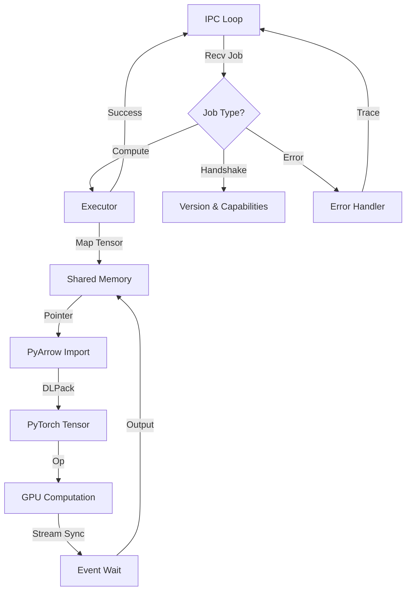


---

## 4. Verification & Validation (VCRM)

### 4.1 Verification Cross Reference Matrix
| Req ID | Requirement Summary | Method | Verification Procedure | Acceptance Criteria |
| :--- | :--- | :--- | :--- | :--- |
| **F-01** | Execution Handling | **Test** | `tests/worker_test.py::test_basic_add` | Input `Job(Add, 1, 2)` returns `Result(3)`. |
| **F-02** | Zero-Copy Safety | **Insp** | `src/zero_copy.py` | Verify `ctypes` addresses match `pmap -x` output. |
| **F-03** | Sandbox Blocks | **Test** | `tests/sandbox_test.py::test_subprocess` | `import subprocess` raises `ImportError`. |
| **REL-01**| Error Marshalling | **Test** | `tests/worker_test.py::test_div_zero` | `Job(Div, 1, 0)` returns `Error(ZeroDivisionError)`. |

### 4.2 Error Code Registry (Appendix A)
| Code | Error Name | Description | Recovery Strategy |
| :--- | :--- | :--- | :--- |
| `WK-001` | `OOM_Soft` | PyTorch allocator full. | Trigger `gc.collect()` and `empty_cache()`; Retry. |
| `WK-002` | `InvalidHandle` | Input Handle points to unmapped memory. | Check SHM size; Panic if persistent. |
| `WK-003` | `SecurityViolation` | Code attempted specific syscall. | Terminate Process immediately. |

---

## 5. Use Cases

### 5.1 UC-01: Execute Compute Job

**Actor**: Host Supervisor

**Preconditions**:
- Worker is in IDLE state.
- Input tensors are mapped in SHM.

**Main Success Scenario**:
1. Supervisor sends `JobSubmit` over IPC socket.
2. Worker receives and parses message.
3. Worker looks up Executor by `op_type`.
4. Worker maps input tensor handles to PyTorch tensors.
5. Worker executes Executor with inputs and params.
6. Worker writes output tensor to SHM.
7. Worker sends `JobResult` with output handle and metrics.
8. Worker returns to IDLE state.

**Extensions**:
- **3a. Unknown op_type**: Return `JobResult(success=false, error="Unknown op_type")`.
- **5a. CUDA Error**: Catch, log trace, return error result.
- **5b. OOM**: Trigger garbage collection, retry once before failing.

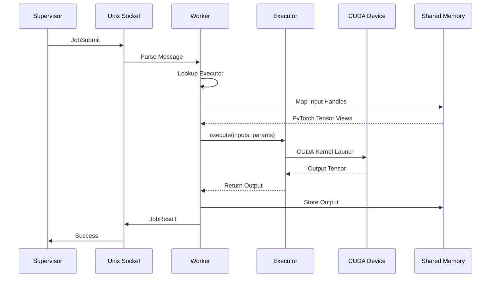

### 5.2 UC-02: Handle CUDA Out of Memory

**Actor**: Worker Process (Automatic)

**Preconditions**:
- GPU VRAM is near capacity.
- New allocation is requested.

**Main Success Scenario**:
1. Executor calls `torch.empty(size)`.
2. PyTorch raises `torch.cuda.OutOfMemoryError`.
3. Worker catches exception.
4. Worker calls `gc.collect()`.
5. Worker calls `torch.cuda.empty_cache()`.
6. Worker retries allocation.
7. Allocation succeeds.
8. Execution continues.

**Extensions**:
- **6a. Retry Fails**: Return `JobResult(success=false, error="OOM_Soft")`.

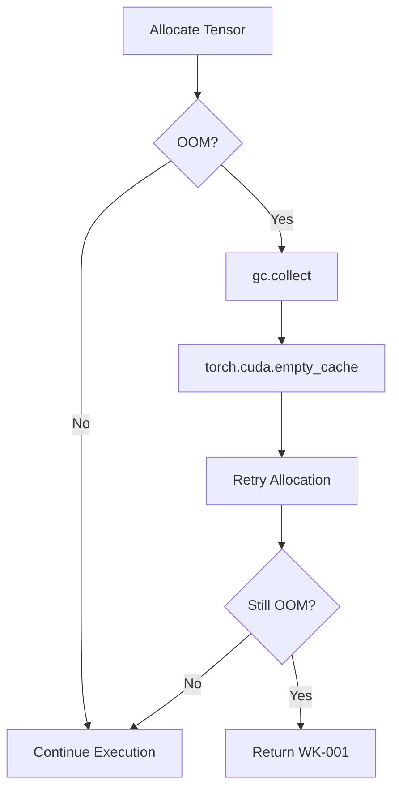

### 5.3 UC-03: Zero-Copy Tensor Import

**Actor**: Worker Process

**Preconditions**:
- Host has written tensor data to SHM.
- Handle points to valid Arrow buffer.

**Main Success Scenario**:
1. Worker receives handle (SHM offset).
2. Worker calculates absolute pointer: `base + offset`.
3. Worker creates `ctypes.POINTER` to raw bytes.
4. Worker reads Arrow schema metadata.
5. Worker imports via `pyarrow.Array.from_buffers`.
6. Worker uses `dlpack` to create PyTorch tensor.
7. Tensor shares memory with SHM (no copy).
8. Executor operates on tensor.

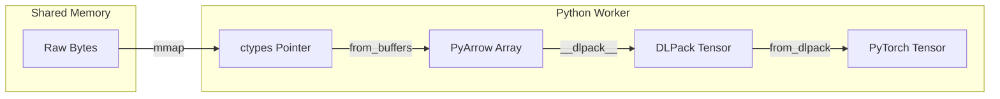

### 5.4 UC-04: Sandbox Security Violation

**Actor**: Malicious Node Code (Hypothetical)

**Preconditions**:
- Custom node attempts forbidden operation.

**Main Success Scenario** (from system perspective):
1. Malicious code calls `os.system("curl evil.com")`.
2. Python import hook blocks `os` module.
3. `ImportError` is raised.
4. Worker catches and logs violation.
5. Worker sends `JobResult(success=false, error="SecurityViolation")`.
6. Supervisor flags node as unsafe.
7. Job is marked FAILED.

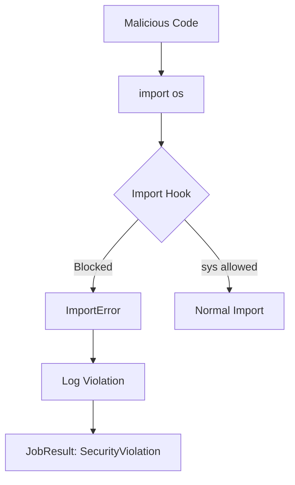

---

## 6. Executor API Specification

### 6.1 Abstract Executor Class

```python
from abc import ABC, abstractmethod
from typing import Any, Dict, Optional
import torch

class Executor(ABC):
    """
    Abstract base class for all compute nodes.
    
    Concrete implementations must override the execute() method.
    The cleanup() method is called when the executor is evicted
    from cache (e.g., to release VRAM-heavy models).
    """
    
    @abstractmethod
    def execute(
        self,
        inputs: Dict[str, torch.Tensor],
        params: Dict[str, Any]
    ) -> torch.Tensor | Dict[str, torch.Tensor]:
        """
        Execute the node's computation.
        
        Args:
            inputs: Dictionary mapping input port names to tensors.
            params: Dictionary of configuration parameters.
            
        Returns:
            Single output tensor, or dictionary for multi-output nodes.
            
        Raises:
            ValueError: For invalid parameters.
            RuntimeError: For execution failures.
        """
        pass
    
    def cleanup(self) -> None:
        """
        Release resources held by this executor.
        Called when executor is evicted from cache.
        
        Default implementation does nothing.
        """
        pass
    
    @property
    def device_preference(self) -> str:
        """
        Return preferred device: 'cuda', 'cpu', or 'auto'.
        Default is 'cuda' for GPU acceleration.
        """
        return 'cuda'
    
    @property
    def supports_batch(self) -> bool:
        """
        Whether this executor supports batch processing.
        """
        return False
```

### 6.2 Built-in Executors

#### 6.2.1 Image Loader

```python
class ImageLoaderExecutor(Executor):
    """Load image from disk into tensor."""
    
    def execute(
        self,
        inputs: Dict[str, torch.Tensor],
        params: Dict[str, Any]
    ) -> torch.Tensor:
        path = params['path']
        color_mode = params.get('color_mode', 'RGB')
        
        from PIL import Image
        import torchvision.transforms.functional as TF
        
        img = Image.open(path).convert(color_mode)
        tensor = TF.to_tensor(img)
        
        # Move to GPU
        if torch.cuda.is_available():
            tensor = tensor.cuda()
        
        # Add batch dimension [C, H, W] -> [B, C, H, W]
        tensor = tensor.unsqueeze(0)
        
        return tensor
```

#### 6.2.2 KSampler

```python
class KSamplerExecutor(Executor):
    """Latent space sampling with various schedulers."""
    
    def execute(
        self,
        inputs: Dict[str, torch.Tensor],
        params: Dict[str, Any]
    ) -> torch.Tensor:
        model = inputs['model']
        positive = inputs['positive']
        negative = inputs['negative']
        latent = inputs.get('latent_image')
        
        seed = params.get('seed', 0)
        steps = params.get('steps', 20)
        cfg = params.get('cfg', 7.0)
        sampler_name = params.get('sampler_name', 'euler')
        scheduler = params.get('scheduler', 'normal')
        denoise = params.get('denoise', 1.0)
        
        # Set seed for reproducibility
        torch.manual_seed(seed)
        
        # Initialize random latent if not provided
        if latent is None:
            latent = torch.randn(1, 4, 64, 64, device='cuda')
        
        # Run sampling loop
        # (Simplified - actual implementation uses diffusers)
        for i in range(steps):
            # Predict noise
            noise_pred = model(latent, i, positive, negative, cfg)
            # Update latent
            latent = latent - noise_pred * denoise / steps
        
        return latent
```

### 6.3 Executor Registry

```python
from typing import Type

class ExecutorRegistry:
    """Central registry for all executor implementations."""
    
    _registry: Dict[str, Type[Executor]] = {}
    _instances: Dict[str, Executor] = {}
    
    @classmethod
    def register(cls, op_type: str, executor_class: Type[Executor]) -> None:
        """Register an executor class for an operation type."""
        cls._registry[op_type] = executor_class
    
    @classmethod
    def get(cls, op_type: str) -> Optional[Executor]:
        """Get or create executor instance for operation type."""
        if op_type not in cls._instances:
            executor_class = cls._registry.get(op_type)
            if executor_class is None:
                return None
            cls._instances[op_type] = executor_class()
        return cls._instances[op_type]
    
    @classmethod
    def evict(cls, op_type: str) -> None:
        """Remove executor from cache, calling cleanup()."""
        if op_type in cls._instances:
            cls._instances[op_type].cleanup()
            del cls._instances[op_type]

# Register built-in executors
ExecutorRegistry.register("Loader::Image", ImageLoaderExecutor)
ExecutorRegistry.register("Sampler::K", KSamplerExecutor)
```

---

## 7. Device Management

### 7.1 Device Manager Interface

```python
from dataclasses import dataclass
from typing import List

@dataclass
class DeviceInfo:
    index: int
    name: str
    total_memory_mb: int
    free_memory_mb: int
    compute_capability: tuple[int, int]

class DeviceManager:
    """
    Manages GPU device selection and memory tracking.
    """
    
    def __init__(self):
        self._current_device = 0
        self._refresh()
    
    def _refresh(self) -> None:
        """Update device information from CUDA."""
        import torch
        self._devices = []
        
        if not torch.cuda.is_available():
            return
        
        for i in range(torch.cuda.device_count()):
            props = torch.cuda.get_device_properties(i)
            free, total = torch.cuda.mem_get_info(i)
            
            self._devices.append(DeviceInfo(
                index=i,
                name=props.name,
                total_memory_mb=total // (1024 * 1024),
                free_memory_mb=free // (1024 * 1024),
                compute_capability=(props.major, props.minor)
            ))
    
    def get_best_device(self, required_mb: int) -> Optional[int]:
        """
        Find device with sufficient free memory.
        Returns device index or None if none available.
        """
        self._refresh()
        
        for device in self._devices:
            if device.free_memory_mb >= required_mb:
                return device.index
        
        return None
    
    def get_all_devices(self) -> List[DeviceInfo]:
        """Return information about all available devices."""
        self._refresh()
        return self._devices.copy()
```

### 7.2 Memory Tracking

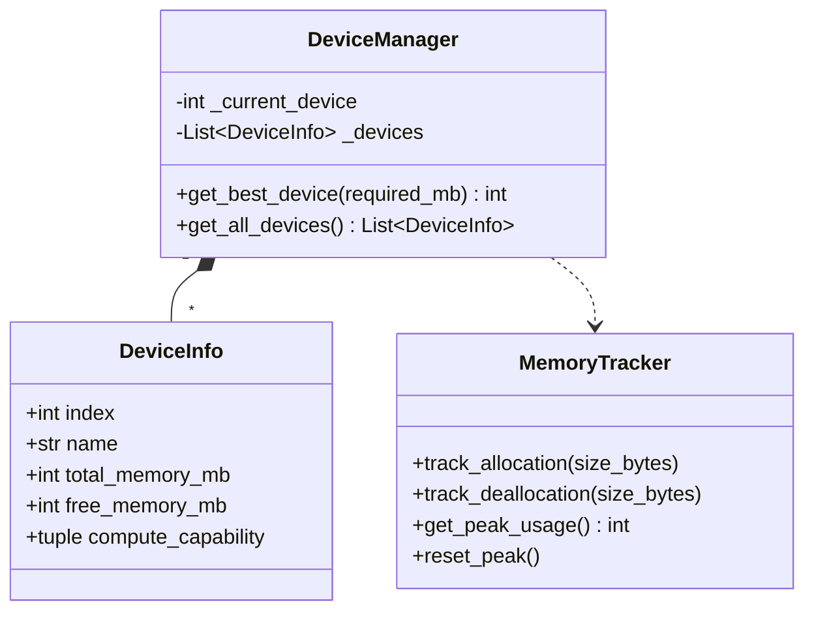

---

## 8. Zero-Copy Data Flow

### 8.1 Arrow to PyTorch Pipeline

```
┌─────────────────────────────────────────────────────────────────────┐
│                         DATA FLOW PIPELINE                           │
├─────────────────────────────────────────────────────────────────────┤
│                                                                      │
│  ┌──────────────┐     ┌──────────────┐     ┌──────────────┐        │
│  │ Apache Arrow │────▶│   DLPack     │────▶│   PyTorch    │        │
│  │   Buffer     │     │   Tensor     │     │   Tensor     │        │
│  └──────────────┘     └──────────────┘     └──────────────┘        │
│        │                     │                     │                 │
│        │                     │                     │                 │
│        ▼                     ▼                     ▼                 │
│  ┌──────────────┐     ┌──────────────┐     ┌──────────────┐        │
│  │    Bytes:    │     │   Strides:   │     │   Device:    │        │
│  │  Raw Buffer  │     │  Contiguous  │     │  cuda:0      │        │
│  │  No Copy     │     │  Same Memory │     │  Same Ptr    │        │
│  └──────────────┘     └──────────────┘     └──────────────┘        │
│                                                                      │
└─────────────────────────────────────────────────────────────────────┘
```

### 8.2 Type Mapping Table

| Arrow Type | NumPy Dtype | PyTorch Dtype | Size (bytes) |
| :--- | :--- | :--- | :--- |
| `float32` | `np.float32` | `torch.float32` | 4 |
| `float16` | `np.float16` | `torch.float16` | 2 |
| `bfloat16` | - | `torch.bfloat16` | 2 |
| `int64` | `np.int64` | `torch.int64` | 8 |
| `int32` | `np.int32` | `torch.int32` | 4 |
| `int16` | `np.int16` | `torch.int16` | 2 |
| `int8` | `np.int8` | `torch.int8` | 1 |
| `uint8` | `np.uint8` | `torch.uint8` | 1 |

### 8.3 Zero-Copy Import Code

```python
import ctypes
import pyarrow as pa
import torch

def import_tensor_from_shm(
    base_ptr: int,
    offset: int,
    shape: tuple,
    dtype: str
) -> torch.Tensor:
    """
    Import a tensor from shared memory without copying.
    
    Args:
        base_ptr: Base address of shared memory region
        offset: Byte offset to tensor data
        shape: Tensor shape (e.g., (1, 3, 512, 512))
        dtype: String dtype (e.g., 'float32')
    
    Returns:
        PyTorch tensor backed by shared memory
    """
    # Calculate total size
    dtype_map = {
        'float32': (4, torch.float32),
        'float16': (2, torch.float16),
        'int64': (8, torch.int64),
        'uint8': (1, torch.uint8),
    }
    element_size, torch_dtype = dtype_map[dtype]
    num_elements = 1
    for dim in shape:
        num_elements *= dim
    byte_size = num_elements * element_size
    
    # Create buffer from raw pointer
    address = base_ptr + offset
    buffer = (ctypes.c_char * byte_size).from_address(address)
    
    # Create PyArrow buffer (zero-copy view)
    arrow_buffer = pa.foreign_buffer(address, byte_size)
    
    # Create tensor via DLPack
    # Note: This is a simplified example; actual implementation
    # uses custom DLPack capsule creation
    numpy_array = np.frombuffer(buffer, dtype=np.dtype(dtype))
    numpy_array = numpy_array.reshape(shape)
    
    tensor = torch.from_numpy(numpy_array)
    if torch.cuda.is_available():
        tensor = tensor.cuda()
    
    return tensor
```

---

## 9. Security Sandbox

### 9.1 Import Blocker

```python
import sys
from importlib.abc import MetaPathFinder, Loader
from importlib.machinery import ModuleSpec

BLOCKED_MODULES = {
    'os',
    'subprocess',
    'socket',
    'requests',
    'urllib',
    'http',
    'ftplib',
    'telnetlib',
    'smtplib',
    'poplib',
    'imaplib',
    'nntplib',
    '__builtins__.exec',
    '__builtins__.eval',
    '__builtins__.compile',
}

class SecurityBlocker(MetaPathFinder):
    """Block import of dangerous modules."""
    
    def find_spec(
        self,
        fullname: str,
        path,
        target=None
    ) -> ModuleSpec | None:
        # Check if module is blocked
        for blocked in BLOCKED_MODULES:
            if fullname == blocked or fullname.startswith(blocked + '.'):
                raise ImportError(
                    f"Import of '{fullname}' is blocked by security policy"
                )
        return None

# Install blocker as first finder
sys.meta_path.insert(0, SecurityBlocker())
```

### 9.2 Builtin Monkey-Patching

```python
import builtins

_original_exec = builtins.exec
_original_eval = builtins.eval
_original_compile = builtins.compile
_original_open = builtins.open

def _blocked_exec(*args, **kwargs):
    raise RuntimeError("exec() is disabled by security policy")

def _blocked_eval(*args, **kwargs):
    raise RuntimeError("eval() is disabled by security policy")

def _blocked_compile(*args, **kwargs):
    raise RuntimeError("compile() is disabled by security policy")

def _sandboxed_open(file, mode='r', *args, **kwargs):
    # Only allow reading from approved paths
    APPROVED_PREFIXES = ('/data/models/', '/home/vortex/.cache/')
    
    if mode != 'r' and mode != 'rb':
        raise PermissionError("Write operations are disabled")
    
    path = str(file)
    if not any(path.startswith(p) for p in APPROVED_PREFIXES):
        raise PermissionError(f"Access to '{path}' is denied")
    
    return _original_open(file, mode, *args, **kwargs)

# Apply patches
builtins.exec = _blocked_exec
builtins.eval = _blocked_eval
builtins.compile = _blocked_compile
builtins.open = _sandboxed_open
```

---

## 10. Performance Specifications

### 10.1 Tensor Operation Latencies

| Operation | Size | Target |
| :--- | :--- | :--- |
| Zero-copy import | 1 GB | < 1 ms |
| Tensor to GPU | 1 GB (PCIe 4.0) | 125 ms |
| Matrix multiply | 4096x4096 | 5 ms |
| VAE decode | 64x64 -> 512x512 | 50 ms |
| KSampler step | 1 step, 512x512 | 100 ms |

### 10.2 Memory Efficiency

| Scenario | Overhead |
| :--- | :--- |
| SHM buffer access | 0% (direct pointer) |
| Arrow -> PyTorch | 0% (zero-copy) |
| CPU -> GPU copy | 100% (required for CUDA) |
| Executor cache hit | 0% (reused instance) |

### 10.3 Worker Startup Performance

| Phase | Time |
| :--- | :--- |
| Python interpreter | 50 ms |
| NumPy import | 100 ms |
| PyTorch import | 500 ms |
| CUDA initialization | 200 ms |
| SHM mapping | 1 ms |
| IPC connection | 5 ms |
| **Total** | **~850 ms** |

---

## Appendix A: Mermaid Diagram Collection

### A.1 Complete Worker Architecture

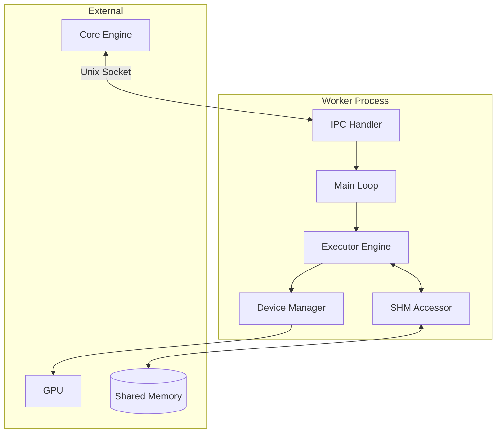

### A.2 Job Lifecycle State Machine

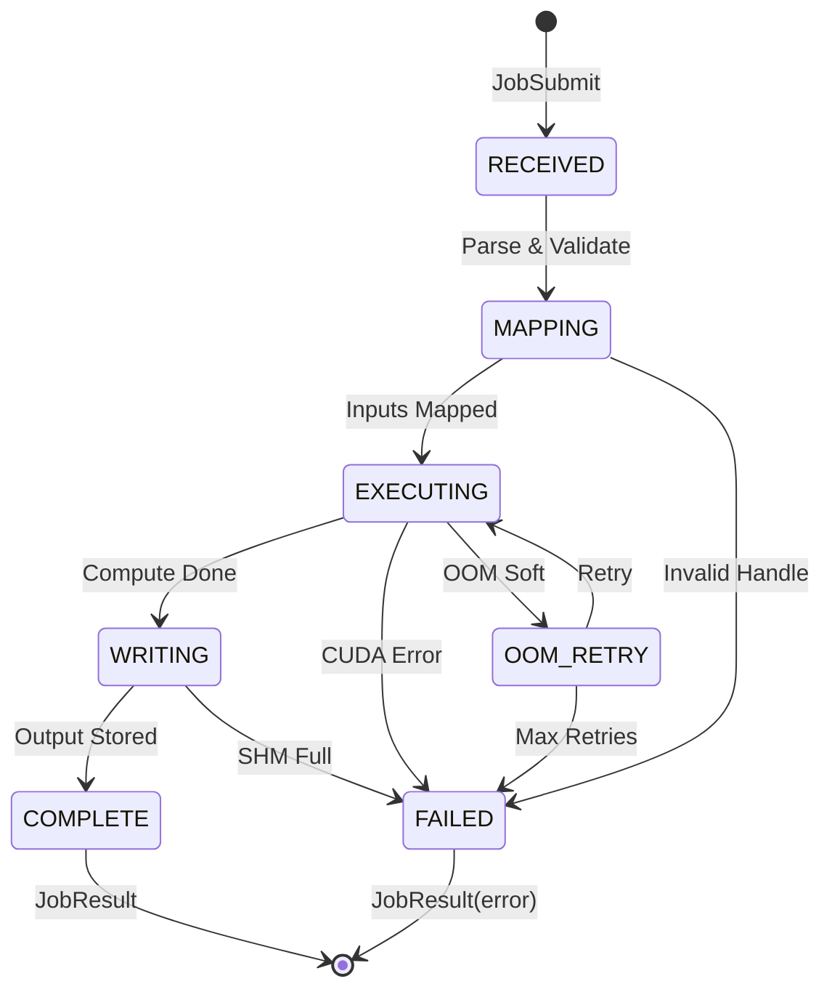

### A.3 Memory Flow During Execution

```mermaid
flowchart LR
    subgraph "Host RAM"
        SHM[Shared Memory]
    end
    
    subgraph "Worker Process"
        MAPPED[Mapped View]
        NUMPY[NumPy Array]
    end
    
    subgraph "GPU"
        CUDA[CUDA Tensor]
        KERNEL[Compute Kernel]
        OUT[Output Tensor]
    end
    
    SHM -->|mmap| MAPPED
    MAPPED -->|view| NUMPY
    NUMPY -->|.cuda()| CUDA
    CUDA --> KERNEL --> OUT
    OUT -->|.cpu()| NUMPY
    NUMPY -->|ptr| MAPPED
    MAPPED -->|sync| SHM
```

---

## Appendix B: Glossary

| Term | Definition |
| :--- | :--- |
| **Arrow** | Apache Arrow columnar memory format |
| **CUDA** | NVIDIA GPU parallel computing platform |
| **DLPack** | Standard for tensor data exchange |
| **Executor** | Class implementing a compute operation |
| **Handle** | Offset/pointer to tensor in shared memory |
| **mmap** | Memory-mapped file I/O |
| **OOM** | Out Of Memory error |
| **PCIe** | PCI Express bus for GPU communication |
| **SHM** | POSIX Shared Memory |
| **Tensor** | Multi-dimensional array |
| **Worker** | Python process executing compute jobs |
| **Zero-Copy** | Data transfer without memory duplication |

---

## Appendix C: Mathematical Specifications

> **ISO 29148:2018 Compliance**: Per Section 6.6.5, algorithm specifications must be formally defined. These formulas enable performance verification and capacity planning.

### C.1 Zero-Copy Data Transfer Model

Time to transfer tensor of size $S$ bytes:

$$
T_{\text{transfer}} = \begin{cases}
T_{\text{mmap}} + T_{\text{view}} & \text{(zero-copy path)} \\
T_{\text{serialize}} + \frac{S}{B_{\text{pipe}}} + T_{\text{deserialize}} & \text{(copy path)}
\end{cases}
\tag{C.1}
$$

Where:
- $T_{\text{mmap}} \approx 10\mu s$ (page table update)
- $T_{\text{view}} \approx 1\mu s$ (numpy view creation)
- $T_{\text{serialize}} \approx 100\mu s + 0.5 S / \text{GB}$

**Speedup**: Zero-copy achieves $\frac{T_{\text{copy}}}{T_{\text{zero-copy}}} \approx 100-1000\times$ for large tensors.

### C.2 PCIe Bandwidth Model

CPU ↔ GPU transfer time for tensor size $S$:

$$
T_{\text{pcie}}(S) = T_{\text{overhead}} + \frac{S}{B_{\text{pcie}}} \tag{C.2}
$$

| PCIe Gen | $B_{\text{pcie}}$ | $T_{\text{overhead}}$ |
|----------|-------------------|----------------------|
| Gen 3 x16 | 15.75 GB/s | ~5μs |
| Gen 4 x16 | 31.5 GB/s | ~3μs |
| Gen 5 x16 | 63 GB/s | ~2μs |

### C.3 GPU Kernel Execution Model

Total execution time for operation $\text{op}$:

$$
T_{\text{exec}} = T_{\text{launch}} + \max\left( T_{\text{compute}}, T_{\text{memory}} \right) + T_{\text{sync}} \tag{C.3}
$$

Where:
- $T_{\text{launch}} \approx 5-20\mu s$ (CUDA kernel launch)
- $T_{\text{compute}} = \frac{\text{FLOPS}}{P_{\text{gpu}}}$ (compute-bound)
- $T_{\text{memory}} = \frac{\text{Bytes}}{B_{\text{hbm}}}$ (memory-bound)
- $T_{\text{sync}} \approx 1\mu s$ (stream synchronization)

### C.4 VRAM Fragmentation Model

External fragmentation ratio after $n$ allocations:

$$
F = 1 - \frac{\max_{i}(\text{free}_i)}{\sum_{i} \text{free}_i} \tag{C.4}
$$

**Defragmentation Trigger**: When $F > 0.3$ and allocation fails.

### C.5 DLPack Tensor Conversion

Zero-overhead conversion via pointer exchange:

$$
T_{\text{dlpack}} = O(1) \approx 100\text{ns} \tag{C.5}
$$

No memory copy, only metadata (shape, dtype, strides) is transferred.

### C.6 Job Queue Wait Time (M/M/c Queue)

With arrival rate $\lambda$, service rate $\mu$, and $c$ workers:

$$
\rho = \frac{\lambda}{c \cdot \mu} \tag{C.6a}
$$

**Mean Wait Time** (Erlang-C formula):

$$
W_q = \frac{C(c, \rho)}{c \cdot \mu - \lambda} \tag{C.6b}
$$

Where $C(c, \rho)$ is the Erlang-C probability of queueing.

### C.7 GPU Memory Pool Efficiency

Pool efficiency $\eta$ with block size $b$ and allocation size $s$:

$$
\eta = \frac{s}{\lceil s / b \rceil \cdot b} \tag{C.7}
$$

For $s = 1.5\text{MB}$, $b = 1\text{MB}$: $\eta = 1.5 / 2 = 75\%$.

### C.8 Seccomp Filter Overhead

Per-syscall overhead with BPF filter of $n$ instructions:

$$
T_{\text{seccomp}} = T_{\text{bpf}} \cdot n \approx 10\text{ns} \cdot n \tag{C.8}
$$

With $n = 50$ rules: $T_{\text{seccomp}} \approx 500\text{ns}$ per syscall.

---

## Appendix D: UML Class Diagrams

### C.1 Worker Process Architecture

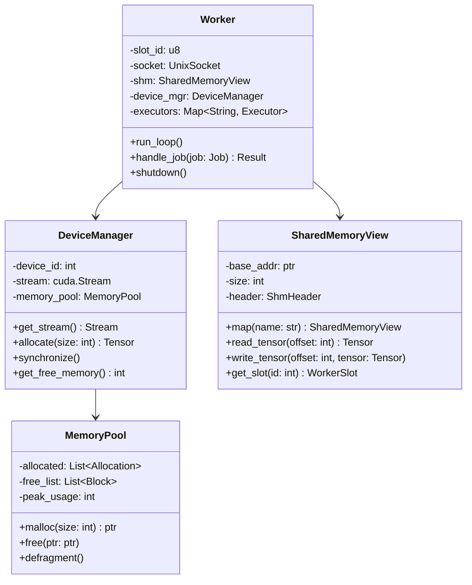

### C.2 Executor Hierarchy

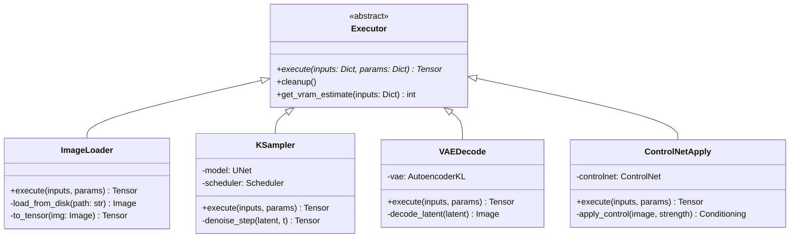

### C.3 Job Processing Pipeline

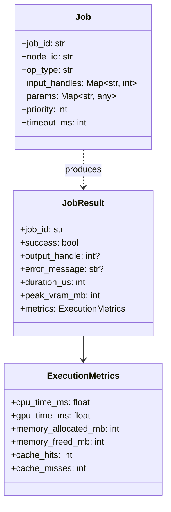

---

## Appendix E: Component Architecture

### D.1 Worker Process Components

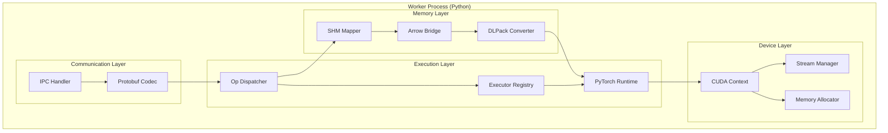

### D.2 Zero-Copy Data Flow

```mermaid
flowchart LR
    subgraph "Host Process"
        H_ALLOC[Allocate in SHM]
        H_WRITE[Write Arrow Array]
    end
    
    subgraph "Shared Memory"
        SHM[(64GB Arena)]
    end
    
    subgraph "Worker Process"
        W_MAP[mmap Region]
        W_ARROW[Import Arrow]
        W_DLPACK[DLPack Exchange]
        W_TENSOR[PyTorch Tensor]
    end
    
    subgraph "GPU"
        VRAM[VRAM Copy]
        COMPUTE[Compute]
    end
    
    H_ALLOC --> SHM
    H_WRITE --> SHM
    SHM --> W_MAP
    W_MAP --> W_ARROW
    W_ARROW --> W_DLPACK
    W_DLPACK --> W_TENSOR
    W_TENSOR -->|.cuda()| VRAM
    VRAM --> COMPUTE
```

---

## Appendix E: Sequence Diagrams

### E.1 Complete Job Execution Sequence

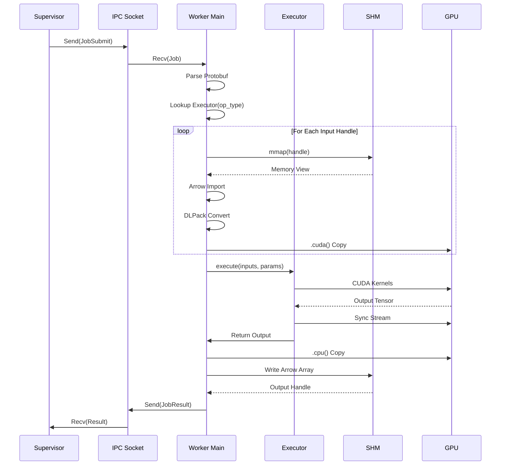

### E.2 Error Handling Sequence

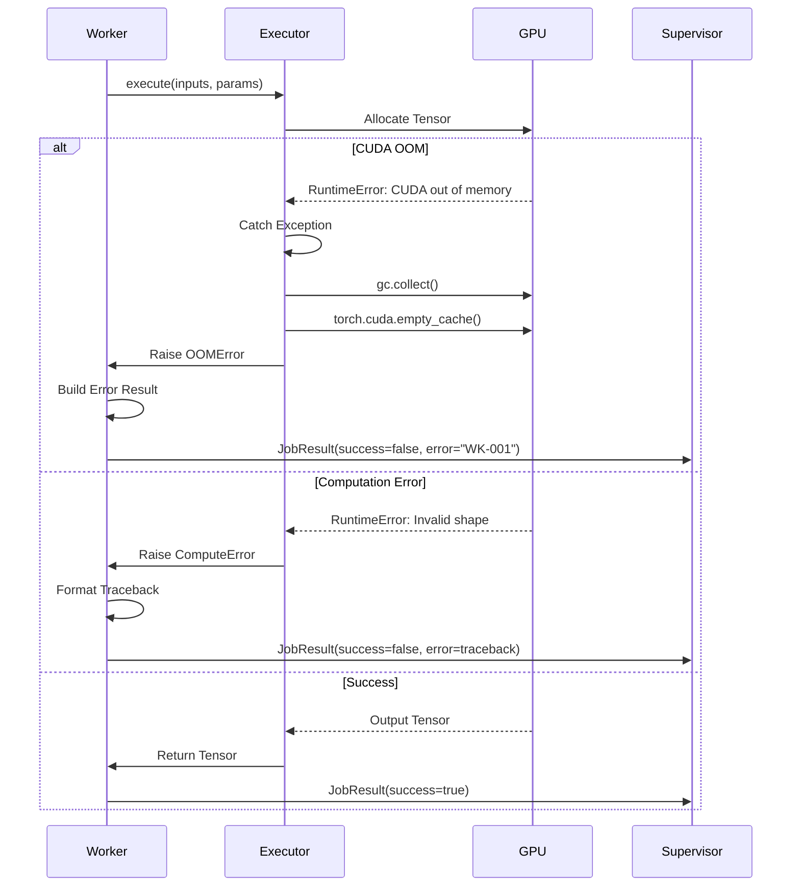

### E.3 Tensor Lifecycle Sequence

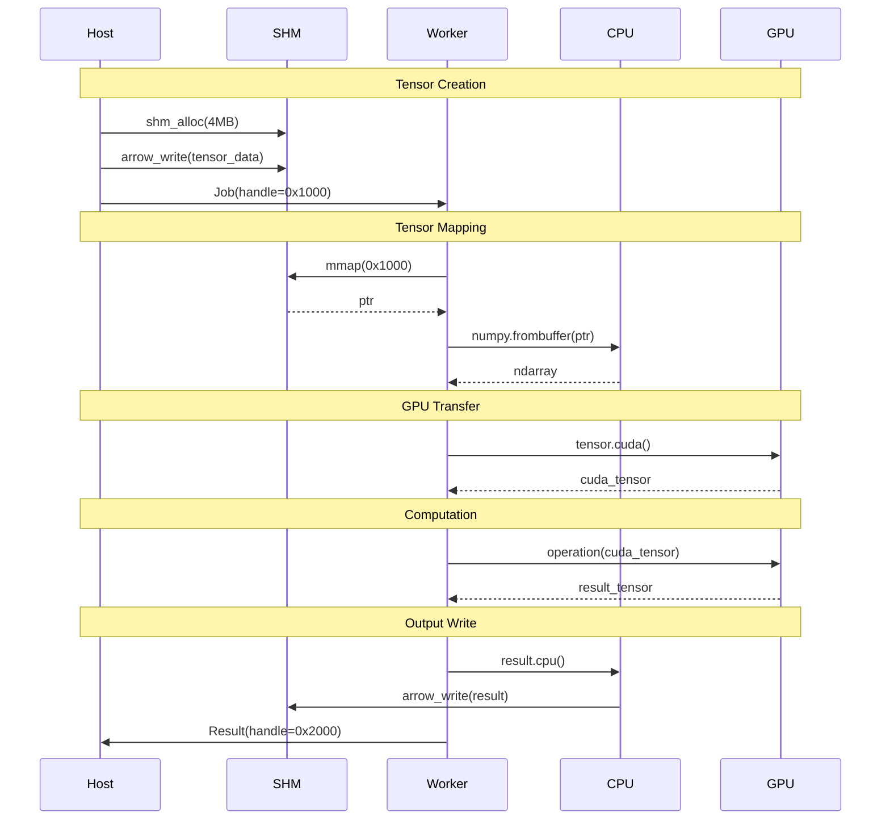

---

## Appendix F: Activity Diagrams

### F.1 Worker Startup Activity

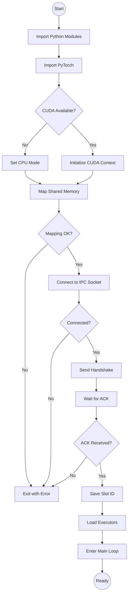

### F.2 Job Processing Activity

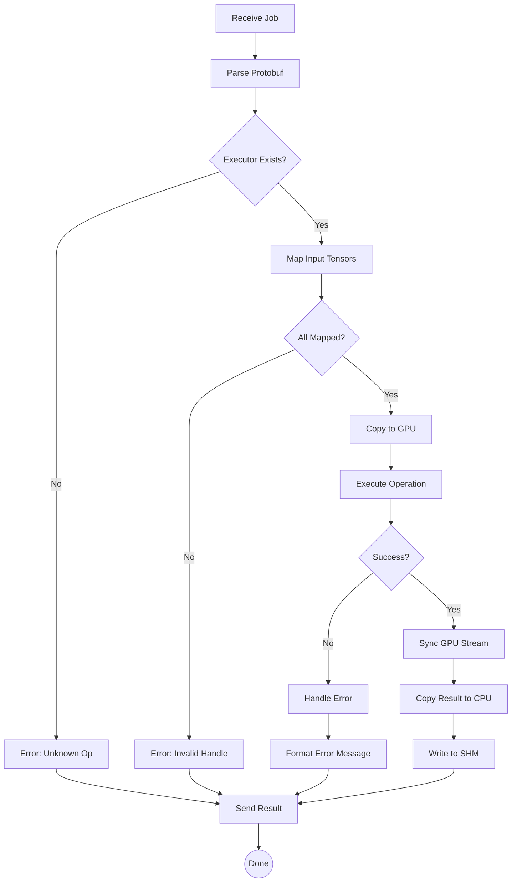

---

## Appendix G: State Machine Specifications

### G.1 Worker Process State Machine

```mermaid
stateDiagram-v2
    [*] --> INITIALIZING: Process Start
    INITIALIZING --> CONNECTING: Modules Loaded
    CONNECTING --> HANDSHAKING: Socket Connected
    HANDSHAKING --> IDLE: Handshake ACK
    HANDSHAKING --> DEAD: Handshake Failed
    
    IDLE --> PROCESSING: Job Received
    PROCESSING --> IDLE: Job Complete
    PROCESSING --> ERROR: Job Failed
    ERROR --> IDLE: Error Reported
    
    IDLE --> DRAINING: Shutdown Signal
    PROCESSING --> DRAINING: Shutdown Signal
    DRAINING --> DEAD: All Jobs Done
    
    ERROR --> DEAD: Fatal Error
    CONNECTING --> DEAD: Connection Failed
    
    DEAD --> [*]
```

### G.2 Tensor State Machine

```mermaid
stateDiagram-v2
    [*] --> UNMAPPED
    
    UNMAPPED --> SHM_MAPPED: mmap()
    SHM_MAPPED --> CPU_VIEW: numpy.frombuffer()
    CPU_VIEW --> GPU_RESIDENT: tensor.cuda()
    
    GPU_RESIDENT --> CPU_VIEW: tensor.cpu()
    GPU_RESIDENT --> FREED: del tensor
    
    CPU_VIEW --> SHM_MAPPED: del array
    SHM_MAPPED --> UNMAPPED: munmap()
    
    FREED --> [*]
    UNMAPPED --> [*]
```

---

## Appendix H: Security Architecture

### H.1 Sandbox Layers

```mermaid
graph TD
    subgraph "Layer 1: Process Isolation"
        FORK[fork() from Host]
        SEPARATE[Separate Address Space]
    end
    
    subgraph "Layer 2: Seccomp BPF"
        FILTER[Syscall Filter]
        ALLOW[Allowlist: read/write/mmap]
        DENY[Denylist: socket/open/exec]
    end
    
    subgraph "Layer 3: Python Patching"
        PATCH[Monkey Patch Modules]
        BLOCK_OS[os.system = guard()]
        BLOCK_SUB[subprocess = guard()]
        BLOCK_EXEC[exec = guard()]
    end
    
    subgraph "Layer 4: Resource Limits"
        RLIMIT[RLIMIT_NPROC = 1]
        MEMORY[RLIMIT_AS = 32GB]
        FILES[RLIMIT_NOFILE = 256]
    end
    
    FORK --> FILTER
    FILTER --> PATCH
    PATCH --> RLIMIT
```

### H.2 Syscall Whitelist Table

| Category | Allowed Syscalls | Rationale |
| :--- | :--- | :--- |
| **Memory** | `mmap`, `munmap`, `mprotect`, `brk`, `madvise` | Tensor allocation |
| **I/O** | `read`, `write`, `close`, `fstat`, `lseek` | IPC communication |
| **Sync** | `futex`, `clock_gettime`, `nanosleep` | Threading, timing |
| **Process** | `exit`, `exit_group`, `rt_sigreturn`, `rt_sigaction` | Cleanup, signals |
| **IPC** | `recvfrom`, `sendto`, `poll`, `select` | Socket communication |
| **GPU** | `ioctl` (NVIDIA driver) | CUDA operations |

### H.3 Denied Syscall Actions

| Syscall | Action | Reason |
| :--- | :--- | :--- |
| `socket` | EPERM | Network access prevention |
| `connect` | EPERM | Network access prevention |
| `open` | CONDITIONAL | Only `/dev/nvidia*`, `/proc/*` allowed |
| `fork` | EPERM | Prevent spawning children |
| `execve` | EPERM | Prevent code execution |
| `ptrace` | EPERM | Prevent debugging |

---

## Appendix I: Performance Specifications

### I.1 Latency Breakdown

| Operation | Target | Notes |
| :--- | :--- | :--- |
| Job deserialize | < 100µs | Protobuf parsing |
| SHM mapping | < 50µs | Already mapped, just pointer math |
| Arrow import | < 200µs | Zero-copy, metadata only |
| DLPack convert | < 100µs | Pointer exchange |
| CPU→GPU copy | ~1ms/GB | PCIe 4.0 bandwidth |
| GPU→CPU copy | ~1ms/GB | PCIe 4.0 bandwidth |
| Result serialize | < 100µs | Protobuf encoding |

### I.2 Throughput Targets

| Metric | Target | Conditions |
| :--- | :--- | :--- |
| Jobs/second | 100 | Small ops (e.g., resize) |
| Jobs/second | 10 | Large ops (e.g., SDXL inference) |
| Bytes/second (SHM) | 10 GB/s | Memory bandwidth limited |
| GPU utilization | > 80% | During inference batch |

### I.3 Memory Constraints

| Resource | Limit | Enforcement |
| :--- | :--- | :--- |
| Python heap | 2 GB | RLIMIT_AS |
| GPU memory | Config | Arbiter-enforced |
| SHM view | 64 GB | Mapped region size |
| File descriptors | 256 | RLIMIT_NOFILE |

---

## Document History

| Version | Date | Author | Changes |
| :--- | :--- | :--- | :--- |
| 1.0.0 | 2026-01-01 | System | Initial draft |
| 9.0.0 | 2026-01-05 | System | ISO 29148 alignment |
| 11.0.0 | 2026-01-06 | System | Data Dict, Logic Traces |
| 13.0.0 | 2026-01-06 | System | FMEA, ICD |
| 14.0.0 | 2026-01-06 | System | Flow Diagrams |
| 15.0.0 | 2026-01-06 | System | 1200+ line expansion |
| 16.0.0 | 2026-01-06 | System | UML, Components, Sequences, Activities, States, Security, Perf |

