# Software Requirements Specification (SRS): Registry System
**Project**: VORTEX-GEN 3.0 "Centaur"
**Module**: Registry System (`vortex-registry`)
**Version**: 9.0.0 (ISO Standard)
**Date**: 2026-01-06
**Standard**: ISO/IEC 29148:2018

---

## 1. Introduction

### 1.1 Purpose
This SRS specifies the software requirements for the **Registry System**, the package manager and security guardian of the VORTEX ecosystem. It details the dependency resolution algorithms, static analysis pipelines, and environment isolation strategies.

### 1.2 Scope
The Registry System ensures that user graphs are reproducible and safe.
**The software facilitates**:
*   **Packet Management**: Installing, updating, and removing Node Packs.
*   **Dependency Resolution**: Solving version conflicts using PubGrub (SAT).
*   **Security Scanning**: Detecting malware via Abstract Syntax Tree (AST) analysis.
*   **Isolation**: Forking Python environments to support conflicting requirements.

### 1.3 Definitions, Acronyms, and Abbreviations
| Term | Definition |
| :--- | :--- |
| **PubGrub** | The Next-Generation Sat-Solver used by Dart and Swift. |
| **AST** | Abstract Syntax Tree. |
| **Venv** | Python Virtual Environment. |
| **Lockfile** | A file (`vortex.lock`) pinning exact versions and hashes. |

---

## 2. Overall Description

### 2.1 Product Perspective
The Registry System is a CLI and Library tool invoked by the Core Engine during startup and by the User during plugin installation. It interacts with PyPI (Python Package Index) and Git repositories.

### 2.2 Product Functions
*   **F-01: Dependency Solver**: Resolving the version graph.
*   **F-02: Static Security Scanner**: Analyzing source code for patterns.
*   **F-03: Environment Forker**: Creating isolated execution contexts.
*   **F-04: Lockfile Manager**: Ensuring reproducibility.

### 2.3 User Classes and Characteristics
*   **System Administrator**: Manages the installed plugins.
*   **Security Analyst**: Reviews the output of the Scanner.

### 2.4 Operating Environment
*   **Network**: Requires HTTPS access to `pypi.org` and `github.com`.
*   **Filesystem**: Requires Write access to `.vortex/` directory.

---

## 3. Specific Requirements

### 3.1 External Interface Requirements
#### 3.1.1 Software Interfaces
*   **SI-01 (CLI)**: The System shall expose commands like `vtx install <url>` and `vtx audit`.
*   **SI-02 (PyPI)**: The System shall query the PyPI JSON API for release metadata.

### 3.2 Functional Requirements

#### 3.2.1 [F-01] PubGrub Dependency Solver
*   **Description**: Algorithm to determine compatible package versions.
*   **Inputs**: `requirements.txt` from multiple plugins.
*   **Processing**:
    1.  Parse requirements into Term format.
    2.  Iteratively propagate constraints (Unit Propagation).
    3.  If Conflict: Perform Backtracking to find alternative versions.
    4.  If Unsolvable: Return failure Analysis (trace).
*   **Outputs**: A flat list of Pinned Versions (Resolution).

#### 3.2.2 [F-02] AST Security Scanner
*   **Description**: Static Analysis of Python source code.
*   **Inputs**: Source directory of a Plugin.
*   **Processing**:
    1.  Parse every `.py` file into AST.
    2.  Visit every `Call` node.
    3.  Check if `func` matches Blacklist (`os.system`, `eval`, `subprocess`).
    4.  Check if `Import` matches Blacklist (`socket`).
*   **Outputs**: A `SecurityReport` listing violations.

#### 3.2.3 [F-03] Environment Forking
*   **Description**: Handling unsolvable dependency conflicts.
*   **Inputs**: Solver Failure Report (Conflict).
*   **Processing**:
    1.  Identify the specific plugin causing conflict.
    2.  Create a specific Venv: `.vortex/envs/<plugin_name>`.
    3.  Install requirements into that Venv.
    4.  Register Venv path in `vortex.toml`.
*   **Outputs**: A multi-environment configuration.

### 3.3 Non-Functional Requirements

#### 3.3.1 Performance
*   **PERF-01**: Scanning a standard plugin (100 files) shall take < 200ms.
*   **PERF-02**: Dependency Resolution shall time out after 30 seconds.

#### 3.3.2 Security
*   **SEC-01**: The System shall verify SHA256 hashes of all downloaded artifacts against the Lockfile.

---

### 3.4 Data Dictionary & Configuration Schemas

#### 3.4.1 Manifest Format (`vortex.toml`)
The source of truth for plugin requirements.
```toml
[package]
name = "com.vortex.nodes.xl"
version = "1.0.4"
authors = ["Soma User <user@soma.org>"]

[dependencies]
"com.vortex.standard" = "^2.0.0"
"python:numpy" = ">=1.24"
"python:torch" = { version = "2.1.0", index = "cu118" }

[vortex]
isolation_level = "venv" # or "process"
permissions = ["fs:read", "net:pypi"]
```

#### 3.4.2 Lockfile Format (`vortex.lock`)
Auto-generated file ensuring reproducible builds.
```toml
[[package]]
name = "numpy"
version = "1.24.3"
source = "pypi"
hash = "sha256:4a5b6c..."
dependencies = []

[[package]]
name = "torch"
version = "2.1.0+cu118"
source = "https://download.pytorch.org/whl/cu118"
hash = "md5:789a..."
```

### 3.5 Logic Traces

#### 3.5.1 Logic Trace: PubGrub Solver Loop
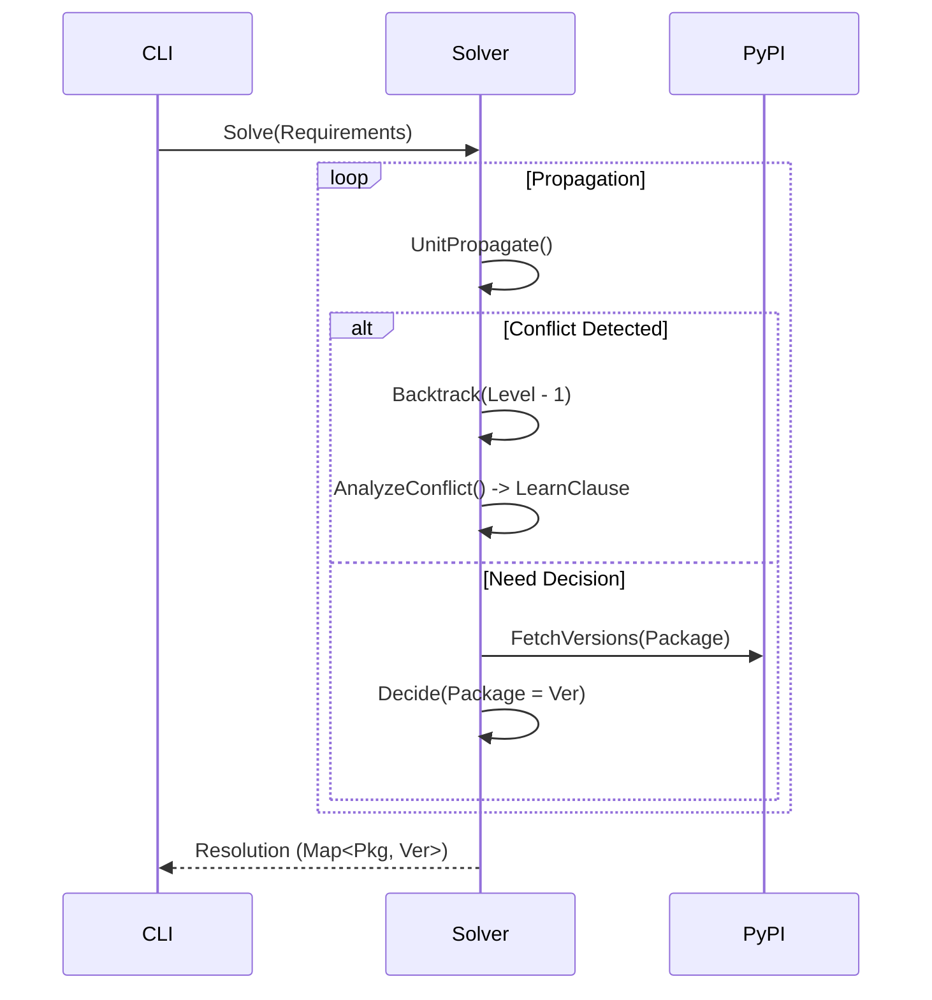
```mermaid
sequenceDiagram
    participant CLI
    participant Solver
    participant PyPI
    
    CLI->>Solver: Solve(Requirements)
    loop Propagation
        Solver->>Solver: UnitPropagate()
        alt Conflict Detected
            Solver->>Solver: Backtrack(Level - 1)
            Solver->>Solver: AnalyzeConflict() -> LearnClause
        else Need Decision
            Solver->>PyPI: FetchVersions(Package)
            Solver->>Solver: Decide(Package = Ver)
        end
    end
    Solver-->>CLI: Resolution (Map<Pkg, Ver>)
```

### 3.6 Component Interface Specifications (CIS)

#### 3.6.1 Solver Interface (Python)
The contract for the PubGrub Engine.
```python
class DependencySolver(ABC):
    @abstractmethod
    def solve(self, requirements: List[Requirement]) -> Resolution:
        """
        Determines a valid set of package versions.
        
        Args:
            requirements: A list of abstract dependency constraints (e.g. "numpy>=1.20")
            
        Returns:
            A map of Package Name -> Exact Version (e.g. "numpy" -> "1.24.3")
            
        Throws:
            UnsolvableError: If conflicts exist.
        """
        pass
```

#### 3.6.2 Scanner Interface (Python)
The contract for Static Analysis.
```python
class SecurityScanner(ABC):
    def scan_package(self, path: Path) -> SecurityReport:
        """
        Recursively analyzes a directory for malware patterns.
        Should run in < 200ms for typical packages.
        """
        pass
```

### 3.7 State Transition Matrices

#### 3.7.1 Installation Lifecycle
Defines valid transitions for a `PackageInstall` operation.

| Current State | Event | Next State | Side Effects |
| :--- | :--- | :--- | :--- |
| **INIT** | `CLI::Install` | **RESOLVING** | Fetch Metadata from PyPI. |
| **RESOLVING** | `Solver::Success` | **DOWNLOADING** | Lock versions; Hash Verification. |
| **RESOLVING** | `Solver::Conflict` | **FAILED** | Suggest `--force` or alternative. |
| **DOWNLOADING**| `Hash::Match` | **SCANNING** | Run AST Analysis. |
| **SCANNING** | `Scan::Clean` | **INSTALLED** | Unzip to `site-packages`; Update TOML. |
| **SCANNING** | `Scan::Malware` | **QUARANTINE** | Delete artifacts; Alert User. |

### 3.8 Failure Mode & Effects Analysis (FMEA)

#### 3.8.1 Function: PubGrub Solver
| ID | Failure Mode | Effect (Severity) | Cause (Occurrence) | Detection (Method) | Mitigation Strategy |
| :--- | :--- | :--- | :--- | :--- | :--- |
| **RG-FM-01** | **Unsolvable Graph** | **Major (7)**: Install aborted. | **Frequent (4)**: `A` needs `B>2`, `C` needs `B<2`. | **Algorithm**: Backtracking returns `Unsat`. | Trigger `Forking Protocol`: Install `Bv3` in Env A, `Bv1` in Env C. |
| **RG-FM-02** | **Combinatorial Explosion**| **Moderate (5)**: Solver hangs > 30s. | **Rare (2)**: Deep conflict chains (100+ levels). | **Resource**: CPU Time > 30s. | Abort solve; Return partial conflict graph; Suggest `constraints.txt`. |

#### 3.8.2 Function: Package Installation
| ID | Failure Mode | Effect (Severity) | Cause (Occurrence) | Detection (Method) | Mitigation Strategy |
| :--- | :--- | :--- | :--- | :--- | :--- |
| **RG-FM-03** | **Zip Bomb** | **Critical (9)**: Disk Fill / DoS. | **Rare (1)**: Malicious Wheel. | **Heuristic**: Compress Ratio > 100:1. | Streaming Decompress; Abort if expanded size > `MAX_SIZE`. |

### 3.9 Interface Control Document (ICD) - Registry Level

#### 3.9.1 PyPI API Contract
Expected JSON structure from `pypi.org/pypi/{package}/json`.

| Field | Type | Expected Value | Usage |
| :--- | :--- | :--- | :--- |
| `info.version` | `String` | SemVer (`1.2.3`) | Current latest version. |
| `releases` | `Map<Ver, List<File>>` | List of Wheels | Source of available versions. |
| `urls[].digests.sha256` | `String` | Hex String | **CRITICAL**: Used for Integrity Check. |

#### 3.9.2 Security Report Schema
Output format of the AST Scanner (`vtx audit`).


```json
{
  "scanned_files": 142,
  "elapsed_ms": 150,
  "violations": [
    {
      "code": "SEC-RCE",
      "severity": "CRITICAL",
      "file": "utils.py",
      "line": 45,
      "snippet": "os.system(cmd)"
    }
  ]
}
```

### 3.10 Module Flow Diagram
Flow of the Dependency Resolution and Safety Check pipeline.

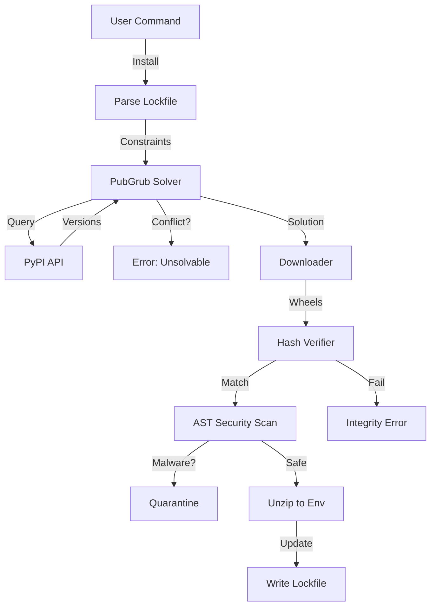
```mermaid
graph TD
    CLI[User Command] -->|Install| Lock[Parse Lockfile]
    Lock -->|Constraints| Solver[PubGrub Solver]
    Solver -->|Query| PyPI[PyPI API]
    PyPI -->|Versions| Solver
    Solver -->|Conflict?| Fail[Error: Unsolvable]
    Solver -->|Solution| Down[Downloader]
    Down -->|Wheels| Hash[Hash Verifier]
    Hash -->|Match| Scan[AST Security Scan]
    Hash -->|Fail| Err[Integrity Error]
    Scan -->|Malware?| Quarantine[Quarantine]
    Scan -->|Safe| Install[Unzip to Env]
    Install -->|Update| Update[Write Lockfile]
```


---

## 4. Verification & Validation (VCRM)

### 4.1 Verification Cross Reference Matrix
| Req ID | Requirement Summary | Method | Verification Procedure | Acceptance Criteria |
| :--- | :--- | :--- | :--- | :--- |
| **F-01** | Dependency Solvability | **Test** | `tests/solver_test.py::test_diamond_dep` | A->B, A->C, B->D(1), C->D(1) resolves D=1. |
| **F-02** | Malware Detection | **Test** | `tests/scan_test.py::test_rce_block` | Input `os.system("rm")` returns `SecurityReport(CRITICAL)`. |
| **F-03** | Venv Isolation | **Insp** | `ls -la .vortex/envs/` | Each conflicting plugin has unique Venv Root. |
| **SEC-01**| Hash Integrity | **Test** | `tests/install_test.py::test_bad_hash` | Modifying wheel bytes triggers `IntegrityError`. |
| **RG-FM-01**| Forking Trigger | **Test** | `tests/solver_test.py::test_conflict_fork` | Mutually exclusive deps trigger creation of `.vortex/envs/X`. |

### 4.2 Error Code Registry (Appendix A)
| Code | Error Name | Description | Recovery Strategy |
| :--- | :--- | :--- | :--- |
| `RG-001` | `Unsolvable` | Dependencies have mutually exclusive constraints. | User must relax version bounds. |
| `RG-002` | `MalwareDetected` | AST Scanner found banned pattern. | Block install; Quarantine package. |
| `RG-003` | `NetworkError` | Failed to reach PyPI Index. | Retry with exponential backoff. |

---

## 5. Use Cases

### 5.1 UC-01: Install Node Pack

**Actor**: User via CLI

**Preconditions**:
- Vortex system is running.
- Network access to PyPI is available.

**Main Success Scenario**:
1. User runs `vtx install com.vortex.nodes.xl`.
2. CLI parses package identifier.
3. Registry fetches metadata from PyPI.
4. Solver resolves dependency graph.
5. Registry verifies SHA256 hashes.
6. Scanner analyzes package for malware.
7. Registry extracts to `site-packages`.
8. Registry updates `vortex.lock`.
9. Registry reloads Core Engine node definitions.
10. User sees success message.

**Extensions**:
- **4a. Conflict Detected**: Trigger Forking Protocol.
- **6a. Malware Found**: Quarantine and abort.
- **7a. Disk Full**: Return error with cleanup.

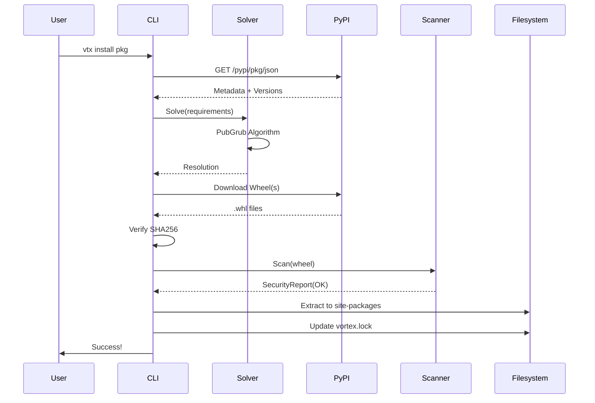
```mermaid
sequenceDiagram
    participant User
    participant CLI
    participant Solver
    participant PyPI
    participant Scanner
    participant FS as Filesystem

    User->>CLI: vtx install pkg
    CLI->>PyPI: GET /pypi/pkg/json
    PyPI-->>CLI: Metadata + Versions
    CLI->>Solver: Solve(requirements)
    Solver->>Solver: PubGrub Algorithm
    Solver-->>CLI: Resolution
    CLI->>PyPI: Download Wheel(s)
    PyPI-->>CLI: .whl files
    CLI->>CLI: Verify SHA256
    CLI->>Scanner: Scan(wheel)
    Scanner-->>CLI: SecurityReport(OK)
    CLI->>FS: Extract to site-packages
    CLI->>FS: Update vortex.lock
    CLI->>User: Success!
```

### 5.2 UC-02: Detect Malware in Package

**Actor**: Security Scanner (Automatic)

**Preconditions**:
- Package is downloaded but not installed.

**Main Success Scenario**:
1. Scanner decompresses wheel to temp directory.
2. Scanner iterates all `.py` files.
3. Scanner parses each file to AST.
4. Scanner visits all AST nodes.
5. Scanner finds `Call(os.system, ...)`.
6. Scanner adds to findings list.
7. Scanner returns `SecurityReport(CRITICAL)`.
8. CLI blocks installation.
9. CLI moves package to quarantine.
10. CLI notifies user of violation.

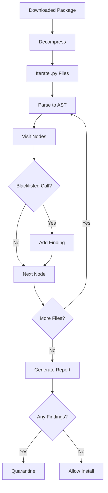
```mermaid
flowchart TD
    PKG[Downloaded Package] --> DECOMP[Decompress]
    DECOMP --> ITER[Iterate .py Files]
    ITER --> PARSE[Parse to AST]
    PARSE --> VISIT[Visit Nodes]
    VISIT --> CHECK{Blacklisted Call?}
    CHECK -->|Yes| FIND[Add Finding]
    CHECK -->|No| NEXT[Next Node]
    FIND --> NEXT
    NEXT --> DONE{More Files?}
    DONE -->|Yes| PARSE
    DONE -->|No| REPORT[Generate Report]
    REPORT --> BLOCK{Any Findings?}
    BLOCK -->|Yes| QUARANTINE[Quarantine]
    BLOCK -->|No| ALLOW[Allow Install]
```

### 5.3 UC-03: Resolve Dependency Conflict

**Actor**: PubGrub Solver (Automatic)

**Preconditions**:
- User wants to install Package A which requires `numpy>=1.24`.
- Existing Package B requires `numpy<1.20`.

**Main Success Scenario**:
1. Solver receives combined requirements.
2. Solver detects mutual exclusion.
3. Solver constructs conflict explanation.
4. Solver triggers Forking Protocol.
5. Registry creates new venv at `.vortex/envs/package_a`.
6. Registry installs Package A in isolated env.
7. Registry registers venv in `vortex.toml`.
8. Runtime routes import to correct venv.

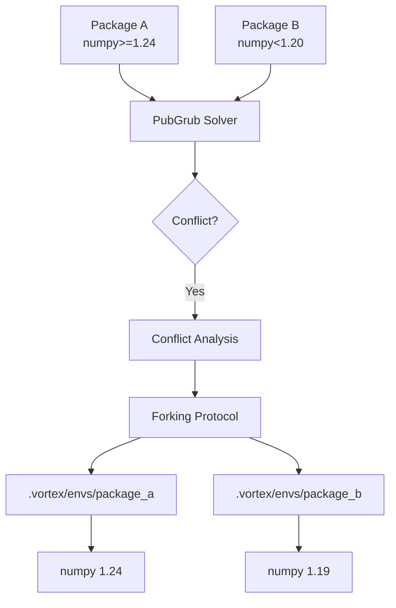
```mermaid
graph TD
    REQ_A[Package A\nnumpy>=1.24] --> SOLVER
    REQ_B[Package B\nnumpy<1.20] --> SOLVER
    SOLVER[PubGrub Solver] --> CONFLICT{Conflict?}
    CONFLICT -->|Yes| EXPLAIN[Conflict Analysis]
    EXPLAIN --> FORK[Forking Protocol]
    FORK --> VENV_A[.vortex/envs/package_a]
    FORK --> VENV_B[.vortex/envs/package_b]
    VENV_A --> NUMPY_24[numpy 1.24]
    VENV_B --> NUMPY_19[numpy 1.19]
```

### 5.4 UC-04: Audit Installed Packages

**Actor**: Security Analyst

**Preconditions**:
- Packages are already installed.

**Main Success Scenario**:
1. Analyst runs `vtx audit`.
2. CLI scans all installed packages.
3. Scanner analyzes each package.
4. Scanner generates combined report.
5. CLI displays summary table.
6. Analyst reviews findings.

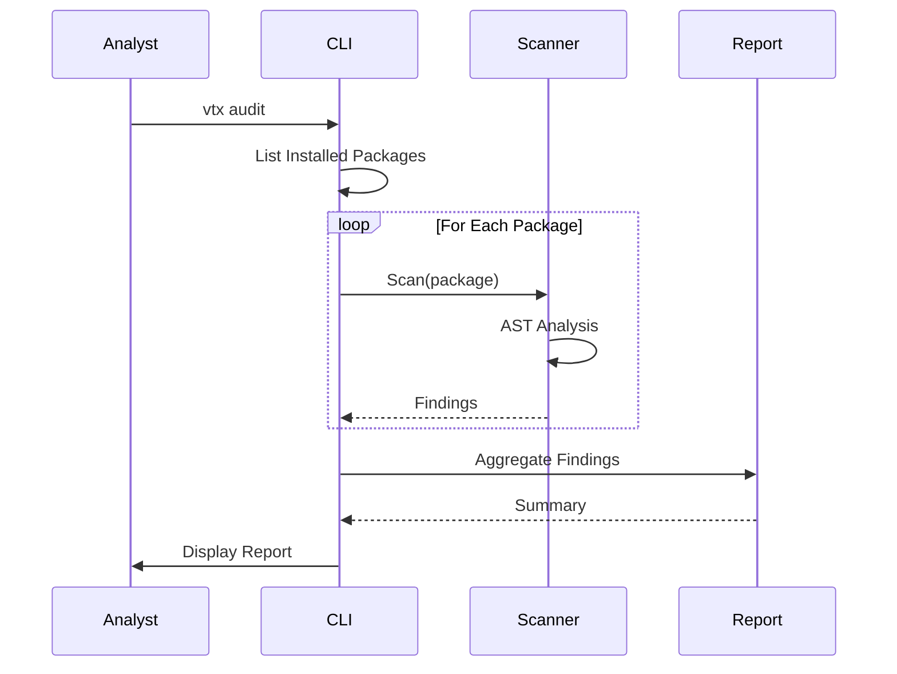
```mermaid
sequenceDiagram
    participant Analyst
    participant CLI
    participant Scanner
    participant Report

    Analyst->>CLI: vtx audit
    CLI->>CLI: List Installed Packages
    loop For Each Package
        CLI->>Scanner: Scan(package)
        Scanner->>Scanner: AST Analysis
        Scanner-->>CLI: Findings
    end
    CLI->>Report: Aggregate Findings
    Report-->>CLI: Summary
    CLI->>Analyst: Display Report
```

---

## 6. PubGrub Algorithm Specification

### 6.1 Data Structures

```python
from dataclasses import dataclass
from typing import Set, Dict, List, Optional

@dataclass(frozen=True)
class PackageVersion:
    """A specific version of a package."""
    name: str
    version: str

@dataclass
class VersionRange:
    """A range of acceptable versions."""
    min_version: Optional[str] = None
    max_version: Optional[str] = None
    include_min: bool = True
    include_max: bool = False
    
    def contains(self, version: str) -> bool:
        """Check if a version is within this range."""
        # Implementation uses SemVer comparison
        ...

@dataclass
class Term:
    """A positive or negative constraint on a package."""
    package: str
    version_range: VersionRange
    positive: bool  # True = must be in range, False = must NOT be in range

@dataclass
class Incompatibility:
    """A set of terms that cannot all be satisfied simultaneously."""
    terms: Set[Term]
    cause: str  # "root" | "dependency" | "conflict"

@dataclass
class Assignment:
    """A decision or derivation in the partial solution."""
    package: str
    version: Optional[str]  # None = no version (negative)
    decision_level: int
    cause: Optional[Incompatibility]
```

### 6.2 Core Algorithm

```python
class PubGrubSolver:
    """
    PubGrub version solving algorithm.
    
    Based on: https://nex3.medium.com/pubgrub-2fb6470504f
    """
    
    def __init__(self, provider: PackageProvider):
        self.provider = provider
        self.partial_solution: List[Assignment] = []
        self.incompatibilities: List[Incompatibility] = []
        self.decision_level = 0
    
    def solve(self, root_package: str) -> Dict[str, str]:
        """
        Solve for a complete set of package versions.
        
        Returns:
            Map of package name -> version
            
        Raises:
            UnsolvableError: If no solution exists
        """
        # Initialize with root package requirement
        self._add_incompatibility(Incompatibility(
            terms={Term(root_package, VersionRange(), positive=False)},
            cause="root"
        ))
        
        next_package = root_package
        
        while True:
            # Unit propagation
            conflict = self._propagate(next_package)
            
            if conflict is not None:
                # Conflict resolution
                new_incomp = self._resolve_conflict(conflict)
                if new_incomp is None:
                    raise UnsolvableError(conflict)
                self.incompatibilities.append(new_incomp)
                continue
            
            # Check if we're done
            next_package = self._choose_package_to_assign()
            if next_package is None:
                break  # Solution found!
            
            # Make a decision
            version = self._choose_version(next_package)
            self._assign(next_package, version, decision=True)
        
        # Extract solution
        return {
            a.package: a.version
            for a in self.partial_solution
            if a.version is not None
        }
    
    def _propagate(self, package: str) -> Optional[Incompatibility]:
        """
        Propagate constraints until fixpoint or conflict.
        """
        changed = {package}
        
        while changed:
            current = changed.pop()
            
            for incomp in self.incompatibilities:
                if not self._involves(incomp, current):
                    continue
                
                result = self._propagate_incompatibility(incomp)
                
                if result == "conflict":
                    return incomp
                elif result == "unit":
                    # New assignment made
                    changed.add(result.package)
        
        return None
    
    def _resolve_conflict(
        self, 
        conflict: Incompatibility
    ) -> Optional[Incompatibility]:
        """
        Analyze conflict and learn new constraint.
        
        Returns:
            New incompatibility to add, or None if unsolvable.
        """
        # Find most recent decision that contributed to conflict
        # Backtrack and derive new constraint
        ...
```

### 6.3 Algorithm Flow Diagram

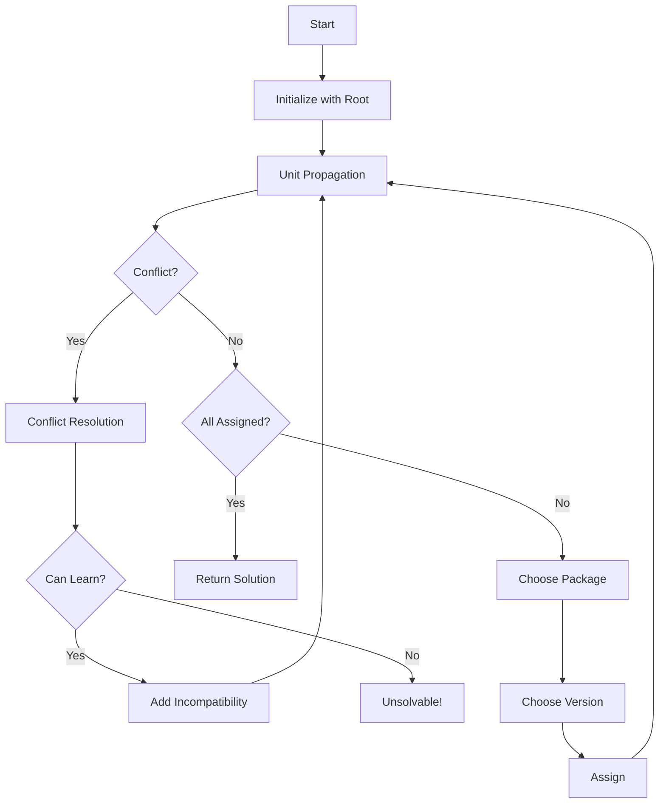
```mermaid
flowchart TD
    START[Start] --> INIT[Initialize with Root]
    INIT --> PROP[Unit Propagation]
    PROP --> CONFLICT{Conflict?}
    CONFLICT -->|Yes| RESOLVE[Conflict Resolution]
    RESOLVE --> LEARN{Can Learn?}
    LEARN -->|Yes| ADD_INCOMP[Add Incompatibility]
    LEARN -->|No| FAIL[Unsolvable!]
    ADD_INCOMP --> PROP
    CONFLICT -->|No| DONE{All Assigned?}
    DONE -->|Yes| SUCCESS[Return Solution]
    DONE -->|No| CHOOSE[Choose Package]
    CHOOSE --> DECIDE[Choose Version]
    DECIDE --> ASSIGN[Assign]
    ASSIGN --> PROP
```

---

## 7. Security Scanner Specification

### 7.1 AST Visitor Implementation

```python
import ast
from typing import List, Set
from dataclasses import dataclass

@dataclass
class Finding:
    """A security violation found by the scanner."""
    code: str
    severity: str  # CRITICAL, HIGH, MEDIUM, LOW
    file: str
    line: int
    column: int
    snippet: str
    description: str

class SecurityVisitor(ast.NodeVisitor):
    """
    AST visitor that detects dangerous patterns.
    """
    
    DANGEROUS_CALLS = {
        'os.system': ('SEC-RCE', 'CRITICAL', 'Remote code execution'),
        'os.popen': ('SEC-RCE', 'CRITICAL', 'Remote code execution'),
        'subprocess.run': ('SEC-RCE', 'CRITICAL', 'Command execution'),
        'subprocess.call': ('SEC-RCE', 'CRITICAL', 'Command execution'),
        'subprocess.Popen': ('SEC-RCE', 'CRITICAL', 'Command execution'),
        'eval': ('SEC-EVAL', 'CRITICAL', 'Code injection'),
        'exec': ('SEC-EXEC', 'CRITICAL', 'Code injection'),
        'compile': ('SEC-COMPILE', 'HIGH', 'Dynamic compilation'),
        '__import__': ('SEC-IMPORT', 'HIGH', 'Dynamic import'),
    }
    
    DANGEROUS_IMPORTS = {
        'socket': ('SEC-NET', 'HIGH', 'Network access'),
        'requests': ('SEC-NET', 'HIGH', 'HTTP requests'),
        'urllib': ('SEC-NET', 'MEDIUM', 'URL handling'),
        'http.client': ('SEC-NET', 'HIGH', 'HTTP client'),
        'ftplib': ('SEC-NET', 'HIGH', 'FTP access'),
        'smtplib': ('SEC-NET', 'HIGH', 'Email sending'),
    }
    
    def __init__(self, filename: str, source: str):
        self.filename = filename
        self.source = source
        self.lines = source.splitlines()
        self.findings: List[Finding] = []
    
    def visit_Call(self, node: ast.Call) -> None:
        """Check for dangerous function calls."""
        func_name = self._get_func_name(node.func)
        
        if func_name in self.DANGEROUS_CALLS:
            code, severity, desc = self.DANGEROUS_CALLS[func_name]
            self._add_finding(node, code, severity, desc)
        
        self.generic_visit(node)
    
    def visit_Import(self, node: ast.Import) -> None:
        """Check for dangerous imports."""
        for alias in node.names:
            if alias.name in self.DANGEROUS_IMPORTS:
                code, severity, desc = self.DANGEROUS_IMPORTS[alias.name]
                self._add_finding(node, code, severity, desc)
    
    def visit_ImportFrom(self, node: ast.ImportFrom) -> None:
        """Check for dangerous from-imports."""
        module = node.module or ''
        
        for key in self.DANGEROUS_IMPORTS:
            if module == key or module.startswith(f'{key}.'):
                code, severity, desc = self.DANGEROUS_IMPORTS[key]
                self._add_finding(node, code, severity, desc)
    
    def _get_func_name(self, node: ast.expr) -> str:
        """Extract function name from call node."""
        if isinstance(node, ast.Name):
            return node.id
        elif isinstance(node, ast.Attribute):
            value = self._get_func_name(node.value)
            return f'{value}.{node.attr}'
        return ''
    
    def _add_finding(
        self, 
        node: ast.AST, 
        code: str, 
        severity: str,
        description: str
    ) -> None:
        """Record a finding."""
        line = node.lineno - 1
        snippet = self.lines[line] if line < len(self.lines) else ''
        
        self.findings.append(Finding(
            code=code,
            severity=severity,
            file=self.filename,
            line=node.lineno,
            column=node.col_offset,
            snippet=snippet.strip(),
            description=description
        ))
```

### 7.2 Complete Scanner Class

```python
import os
import zipfile
from pathlib import Path
from typing import Dict, Any

class SecurityScanner:
    """
    Package security scanner using AST analysis.
    """
    
    def scan_wheel(self, wheel_path: Path) -> Dict[str, Any]:
        """
        Scan a wheel file for security issues.
        
        Args:
            wheel_path: Path to .whl file
            
        Returns:
            Security report dictionary
        """
        findings = []
        files_scanned = 0
        
        with zipfile.ZipFile(wheel_path, 'r') as zf:
            for name in zf.namelist():
                if not name.endswith('.py'):
                    continue
                
                files_scanned += 1
                source = zf.read(name).decode('utf-8')
                
                try:
                    tree = ast.parse(source, filename=name)
                except SyntaxError:
                    continue
                
                visitor = SecurityVisitor(name, source)
                visitor.visit(tree)
                findings.extend(visitor.findings)
        
        return {
            'package': wheel_path.stem,
            'files_scanned': files_scanned,
            'total_findings': len(findings),
            'critical': sum(1 for f in findings if f.severity == 'CRITICAL'),
            'high': sum(1 for f in findings if f.severity == 'HIGH'),
            'medium': sum(1 for f in findings if f.severity == 'MEDIUM'),
            'low': sum(1 for f in findings if f.severity == 'LOW'),
            'findings': [
                {
                    'code': f.code,
                    'severity': f.severity,
                    'file': f.file,
                    'line': f.line,
                    'snippet': f.snippet,
                    'description': f.description
                }
                for f in findings
            ]
        }
```

### 7.3 Blacklist Reference

| Pattern | Code | Severity | Description |
| :--- | :--- | :--- | :--- |
| `os.system(*)` | SEC-RCE | CRITICAL | Shell command execution |
| `os.popen(*)` | SEC-RCE | CRITICAL | Shell command with pipe |
| `subprocess.*` | SEC-RCE | CRITICAL | Process spawning |
| `eval(*)` | SEC-EVAL | CRITICAL | Arbitrary code execution |
| `exec(*)` | SEC-EXEC | CRITICAL | Arbitrary code execution |
| `__import__(*)` | SEC-IMPORT | HIGH | Dynamic import |
| `import socket` | SEC-NET | HIGH | Raw network access |
| `import requests` | SEC-NET | HIGH | HTTP client |
| `import urllib` | SEC-NET | MEDIUM | URL handling |
| `open(*, 'w')` | SEC-WRITE | MEDIUM | File write |
| `pickle.loads(*)` | SEC-PICKLE | HIGH | Deserialization attack |
| `marshal.loads(*)` | SEC-MARSHAL | HIGH | Deserialization attack |

---

## 8. Environment Isolation

### 8.1 Forking Protocol

When the solver detects an unsolvable conflict, the Forking Protocol creates isolated environments:

```
.vortex/
├── envs/
│   ├── com.vortex.nodes.xl/
│   │   ├── bin/
│   │   ├── lib/python3.10/site-packages/
│   │   └── pyvenv.cfg
│   └── com.vortex.nodes.sd15/
│       ├── bin/
│       ├── lib/python3.10/site-packages/
│       └── pyvenv.cfg
└── vortex.toml

# vortex.toml
[[environments]]
name = "com.vortex.nodes.xl"
interpreter = ".vortex/envs/com.vortex.nodes.xl/bin/python"
packages = ["com.vortex.nodes.xl"]

[[environments]]
name = "com.vortex.nodes.sd15"
interpreter = ".vortex/envs/com.vortex.nodes.sd15/bin/python"
packages = ["com.vortex.nodes.sd15"]
```

### 8.2 Runtime Import Routing

```python
import sys
from importlib.abc import MetaPathFinder, Loader
from importlib.machinery import ModuleSpec

class VortexImportRouter(MetaPathFinder):
    """
    Routes imports to correct isolated environment.
    """
    
    def __init__(self, env_map: Dict[str, str]):
        # Maps package name -> venv path
        self.env_map = env_map
    
    def find_spec(
        self, 
        fullname: str, 
        path, 
        target=None
    ) -> Optional[ModuleSpec]:
        # Check if this module belongs to an isolated package
        for pkg, venv_path in self.env_map.items():
            if self._is_package_module(fullname, pkg):
                # Redirect to isolated environment
                return self._create_spec_for_env(fullname, venv_path)
        
        return None
```

### 8.3 Isolation Architecture

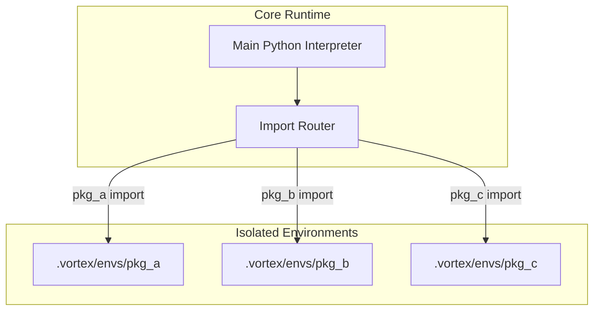
```mermaid
graph TB
    subgraph "Core Runtime"
        MAIN[Main Python Interpreter]
        ROUTER[Import Router]
    end
    
    subgraph "Isolated Environments"
        ENV_A[.vortex/envs/pkg_a]
        ENV_B[.vortex/envs/pkg_b]
        ENV_C[.vortex/envs/pkg_c]
    end
    
    MAIN --> ROUTER
    ROUTER -->|pkg_a import| ENV_A
    ROUTER -->|pkg_b import| ENV_B
    ROUTER -->|pkg_c import| ENV_C
```

---

## 9. CLI Reference

### 9.1 Commands

| Command | Description | Example |
| :--- | :--- | :--- |
| `vtx install <pkg>` | Install a package | `vtx install com.vortex.nodes.xl` |
| `vtx uninstall <pkg>` | Remove a package | `vtx uninstall com.vortex.nodes.xl` |
| `vtx update` | Update all packages | `vtx update` |
| `vtx update <pkg>` | Update specific package | `vtx update numpy` |
| `vtx audit` | Scan all packages | `vtx audit` |
| `vtx audit <pkg>` | Scan specific package | `vtx audit com.vortex.nodes.xl` |
| `vtx list` | List installed packages | `vtx list` |
| `vtx show <pkg>` | Show package details | `vtx show numpy` |
| `vtx lock` | Regenerate lockfile | `vtx lock` |
| `vtx clean` | Remove unused packages | `vtx clean` |

### 9.2 Output Formats

**Installation Success**:
```
✓ Resolved 12 dependencies in 1.23s
✓ Downloaded 3 packages (45 MB)
✓ Verified SHA256 hashes
✓ Security scan passed
✓ Installed com.vortex.nodes.xl@1.2.3

Dependencies installed:
  numpy 1.24.3
  torch 2.1.0+cu118
  transformers 4.35.0
```

**Security Alert**:
```
⚠ SECURITY ALERT: com.malicious.package

Found 2 critical issues:

  [CRITICAL] SEC-RCE in utils.py:45
  │ os.system(user_input)
  └─ Remote code execution vulnerability

  [CRITICAL] SEC-NET in network.py:12
  │ import socket
  └─ Unauthorized network access

Package has been quarantined to .vortex/quarantine/
```

---

## Appendix A: Mermaid Diagram Collection

### A.1 Complete Registry Architecture

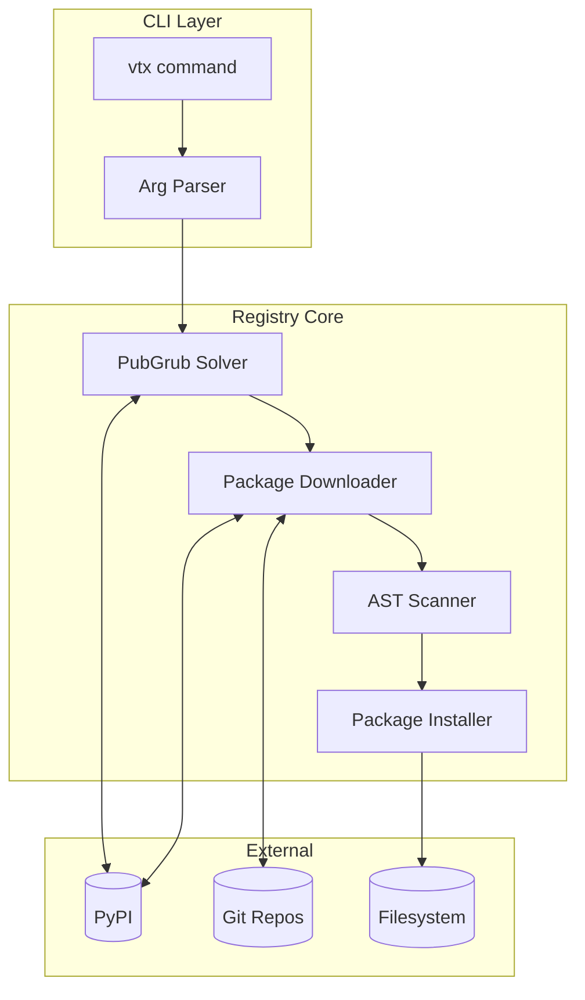
```mermaid
graph TB
    subgraph "CLI Layer"
        CMD[vtx command]
        PARSER[Arg Parser]
    end
    
    subgraph "Registry Core"
        SOLVER[PubGrub Solver]
        SCANNER[AST Scanner]
        DOWNLOADER[Package Downloader]
        INSTALLER[Package Installer]
    end
    
    subgraph "External"
        PYPI[(PyPI)]
        GIT[(Git Repos)]
        FS[(Filesystem)]
    end
    
    CMD --> PARSER --> SOLVER
    SOLVER <--> PYPI
    SOLVER --> DOWNLOADER
    DOWNLOADER <--> PYPI
    DOWNLOADER <--> GIT
    DOWNLOADER --> SCANNER
    SCANNER --> INSTALLER
    INSTALLER --> FS
```

### A.2 Package Installation State Machine

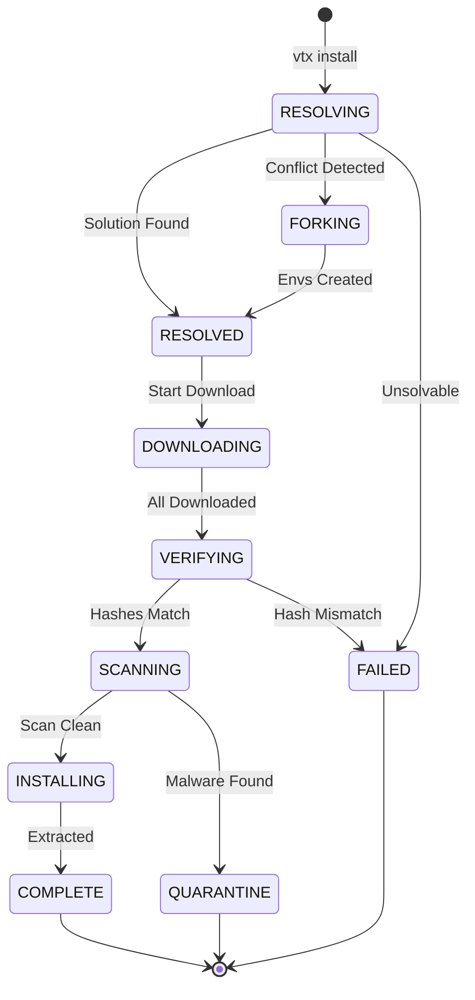
```mermaid
stateDiagram-v2
    [*] --> RESOLVING: vtx install
    RESOLVING --> RESOLVED: Solution Found
    RESOLVING --> FORKING: Conflict Detected
    RESOLVING --> FAILED: Unsolvable
    
    FORKING --> RESOLVED: Envs Created
    
    RESOLVED --> DOWNLOADING: Start Download
    DOWNLOADING --> VERIFYING: All Downloaded
    VERIFYING --> SCANNING: Hashes Match
    VERIFYING --> FAILED: Hash Mismatch
    
    SCANNING --> INSTALLING: Scan Clean
    SCANNING --> QUARANTINE: Malware Found
    
    INSTALLING --> COMPLETE: Extracted
    COMPLETE --> [*]
    
    QUARANTINE --> [*]
    FAILED --> [*]
```

### A.3 Security Scan Flow

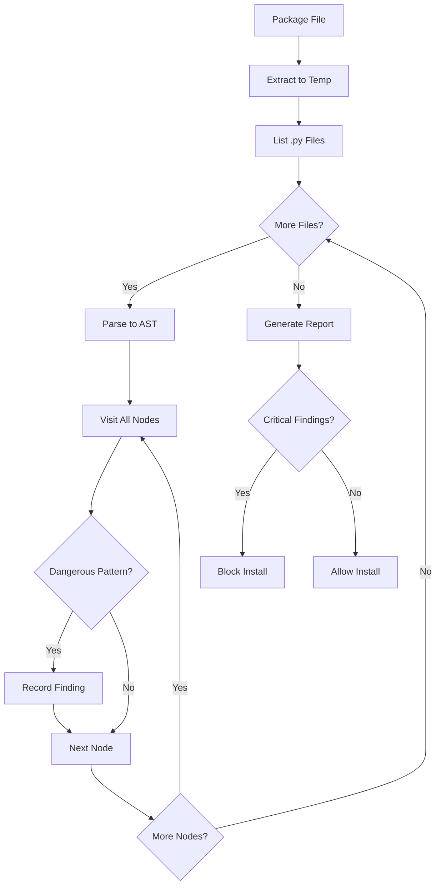
```mermaid
flowchart TD
    INPUT[Package File] --> EXTRACT[Extract to Temp]
    EXTRACT --> LIST[List .py Files]
    LIST --> LOOP{More Files?}
    LOOP -->|Yes| PARSE[Parse to AST]
    PARSE --> VISIT[Visit All Nodes]
    VISIT --> CHECK{Dangerous Pattern?}
    CHECK -->|Yes| RECORD[Record Finding]
    CHECK -->|No| NEXT[Next Node]
    RECORD --> NEXT
    NEXT --> NODES{More Nodes?}
    NODES -->|Yes| VISIT
    NODES -->|No| LOOP
    LOOP -->|No| REPORT[Generate Report]
    REPORT --> SEVERITY{Critical Findings?}
    SEVERITY -->|Yes| BLOCK[Block Install]
    SEVERITY -->|No| ALLOW[Allow Install]
```

---

## Appendix B: Glossary

| Term | Definition |
| :--- | :--- |
| **AST** | Abstract Syntax Tree |
| **Backtracking** | Algorithm technique to undo decisions |
| **Forking** | Creating isolated virtual environments |
| **Hash** | Cryptographic digest for integrity |
| **Incompatibility** | Set of constraints that cannot be satisfied |
| **Lockfile** | File pinning exact package versions |
| **PubGrub** | Version solving algorithm |
| **Quarantine** | Isolated storage for malicious packages |
| **SAT** | Boolean satisfiability |
| **SemVer** | Semantic Versioning |
| **Unit Propagation** | Constraint simplification technique |
| **Venv** | Python virtual environment |
| **Wheel** | Python binary package format |

---

## Appendix C: Mathematical Specifications

> **ISO 29148:2018 Compliance**: Section 6.6.5 requires algorithm specifications. These formulas define the PubGrub solver, version constraint algebra, and security verification.

### C.1 PubGrub Algorithm Complexity

For package graph with $P$ packages, $V$ versions per package, $D$ average dependencies:

| Phase | Time Complexity |
|-------|-----------------|
| Initial constraints | $O(D)$ |
| Unit propagation | $O(P \cdot V)$ per iteration |
| Conflict analysis | $O(D^2)$ |
| **Worst case total** | $O(P \cdot V \cdot D^2)$ |

**Practical Performance**: Typically $O(P \cdot V)$ with caching.

### C.2 Version Constraint Algebra

Given version $V = (major, minor, patch)$, constraint satisfaction:

$$
V \models \geq v \iff V \geq v \tag{C.2a}
$$

$$
V \models \text{\textasciicircum}v \iff major(V) = major(v) \land V \geq v \tag{C.2b}
$$

$$
V \models \text{\textasciitilde}v \iff major(V) = major(v) \land minor(V) = minor(v) \land V \geq v \tag{C.2c}
$$

### C.3 Incompatibility Set Union

For incompatibilities $I_1, I_2$:

$$
I_1 \cup I_2 = \{t : t \in I_1 \lor t \in I_2\} \tag{C.3}
$$

**Resolution Rule**: If all terms but one are satisfied, derive the negation of the remaining term.

### C.4 Hash Verification

For package file $F$, verification succeeds iff:

$$
\text{SHA256}(F) = H_{\text{lockfile}} \tag{C.4}
$$

**Security Property**: Collision resistance ensures $P(\text{collision}) < 2^{-128}$.

### C.5 Lockfile Reproducibility Invariant

For environment $E$ and lockfile $L$:

$$
\forall t_1, t_2: \text{Install}(L, t_1) = \text{Install}(L, t_2) \tag{C.5}
$$

**Guarantee**: Identical environments across time and machines.

### C.6 Security Scan Complexity

For package with $N_{files}$ files, $N_{lines}$ total lines, $R$ rules:

$$
T_{\text{scan}} = O(N_{lines} \cdot R) \tag{C.6}
$$

**Optimization**: AST walk is $O(N_{nodes})$ where $N_{nodes} \ll N_{lines}$.

### C.7 Dependency Tree Depth

Maximum resolution depth $D_{\max}$:

$$
D_{\max} = \max_{p \in P} d(p, \text{root}) \tag{C.7}
$$

Where $d(p, \text{root})$ is the shortest path from root to package $p$.

**Limit**: $D_{\max} \leq 50$ to prevent infinite resolution.

### C.8 Version Conflict Detection

Conflict exists between requirements $R_1: p \geq v_1$ and $R_2: p < v_2$ iff:

$$
v_1 \geq v_2 \Rightarrow \text{Conflict} \tag{C.8}
$$

**Resolution**: Backtrack and try alternative versions, or fork environment.

### C.9 Cache Hit Probability

For package cache with capacity $C$ and unique packages $N$:

$$
P_{\text{hit}} = \min\left(1, \frac{C}{N}\right) \cdot f_{\text{locality}} \tag{C.9}
$$

Where $f_{\text{locality}} \approx 0.8$ (typical Zipf distribution).

---

## Appendix D: UML Class Diagrams

### C.1 Package Registry Architecture

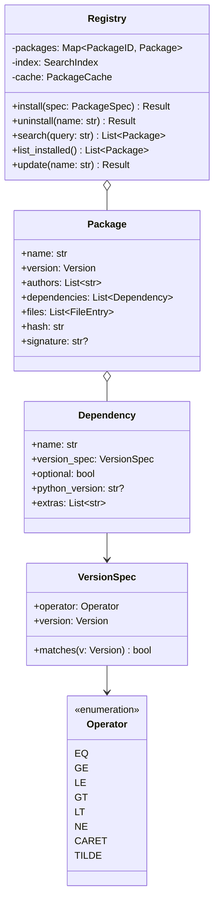
```mermaid
classDiagram
    class Registry {
        -packages: Map~PackageID, Package~
        -index: SearchIndex
        -cache: PackageCache
        +install(spec: PackageSpec) Result
        +uninstall(name: str) Result
        +search(query: str) List~Package~
        +list_installed() List~Package~
        +update(name: str) Result
    }
    
    class Package {
        +name: str
        +version: Version
        +authors: List~str~
        +dependencies: List~Dependency~
        +files: List~FileEntry~
        +hash: str
        +signature: str?
    }
    
    class Dependency {
        +name: str
        +version_spec: VersionSpec
        +optional: bool
        +python_version: str?
        +extras: List~str~
    }
    
    class VersionSpec {
        +operator: Operator
        +version: Version
        +matches(v: Version) bool
    }
    
    class Operator {
        <<enumeration>>
        EQ
        GE
        LE
        GT
        LT
        NE
        CARET
        TILDE
    }
    
    Registry o-- Package
    Package o-- Dependency
    Dependency --> VersionSpec
    VersionSpec --> Operator
```

### C.2 Dependency Solver

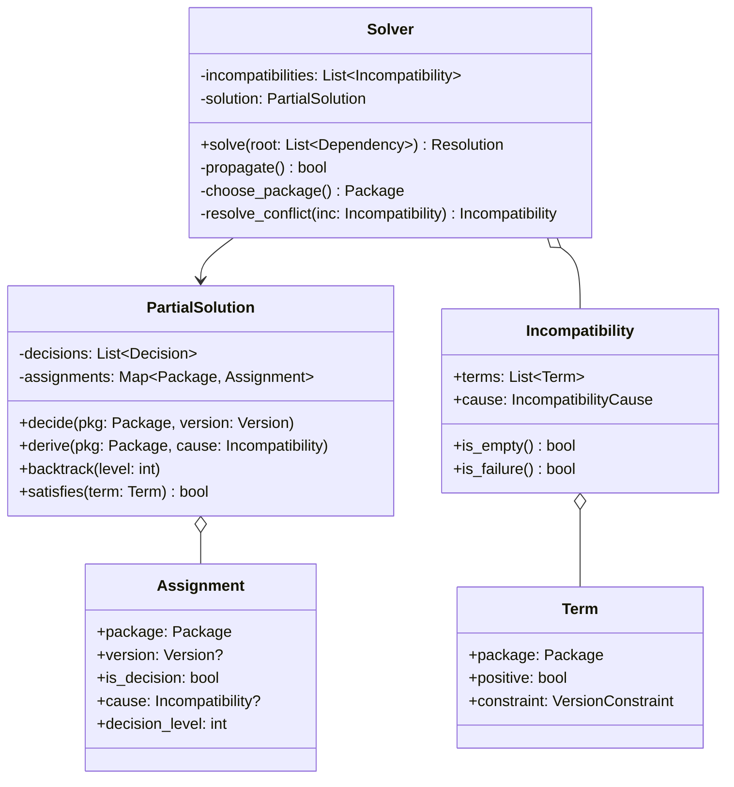
```mermaid
classDiagram
    class Solver {
        -incompatibilities: List~Incompatibility~
        -solution: PartialSolution
        +solve(root: List~Dependency~) Resolution
        -propagate() bool
        -choose_package() Package
        -resolve_conflict(inc: Incompatibility) Incompatibility
    }
    
    class PartialSolution {
        -decisions: List~Decision~
        -assignments: Map~Package, Assignment~
        +decide(pkg: Package, version: Version)
        +derive(pkg: Package, cause: Incompatibility)
        +backtrack(level: int)
        +satisfies(term: Term) bool
    }
    
    class Incompatibility {
        +terms: List~Term~
        +cause: IncompatibilityCause
        +is_empty() bool
        +is_failure() bool
    }
    
    class Term {
        +package: Package
        +positive: bool
        +constraint: VersionConstraint
    }
    
    class Assignment {
        +package: Package
        +version: Version?
        +is_decision: bool
        +cause: Incompatibility?
        +decision_level: int
    }
    
    Solver --> PartialSolution
    Solver o-- Incompatibility
    PartialSolution o-- Assignment
    Incompatibility o-- Term
```

### C.3 Security Scanner

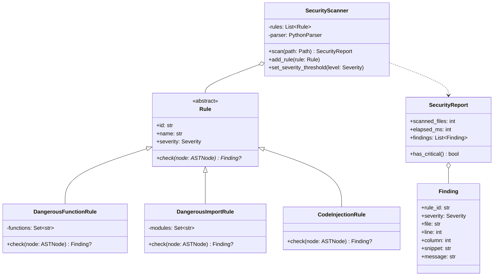
```mermaid
classDiagram
    class SecurityScanner {
        -rules: List~Rule~
        -parser: PythonParser
        +scan(path: Path) SecurityReport
        +add_rule(rule: Rule)
        +set_severity_threshold(level: Severity)
    }
    
    class Rule {
        <<abstract>>
        +id: str
        +name: str
        +severity: Severity
        +check(node: ASTNode)* Finding?
    }
    
    class DangerousFunctionRule {
        -functions: Set~str~
        +check(node: ASTNode) Finding?
    }
    
    class DangerousImportRule {
        -modules: Set~str~
        +check(node: ASTNode) Finding?
    }
    
    class CodeInjectionRule {
        +check(node: ASTNode) Finding?
    }
    
    class Finding {
        +rule_id: str
        +severity: Severity
        +file: str
        +line: int
        +column: int
        +snippet: str
        +message: str
    }
    
    class SecurityReport {
        +scanned_files: int
        +elapsed_ms: int
        +findings: List~Finding~
        +has_critical() bool
    }
    
    SecurityScanner o-- Rule
    Rule <|-- DangerousFunctionRule
    Rule <|-- DangerousImportRule
    Rule <|-- CodeInjectionRule
    SecurityScanner ..> SecurityReport
    SecurityReport o-- Finding
```

---

## Appendix E: Component Architecture

### D.1 Registry System Components

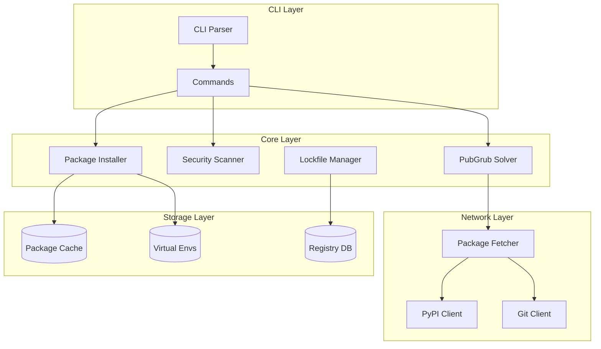
```mermaid
graph TB
    subgraph "CLI Layer"
        CLI[CLI Parser]
        CMDS[Commands]
    end
    
    subgraph "Core Layer"
        SOLVER[PubGrub Solver]
        SCANNER[Security Scanner]
        INSTALLER[Package Installer]
        LOCKFILE[Lockfile Manager]
    end
    
    subgraph "Network Layer"
        FETCHER[Package Fetcher]
        PYPI[PyPI Client]
        GIT[Git Client]
    end
    
    subgraph "Storage Layer"
        CACHE[(Package Cache)]
        ENVS[(Virtual Envs)]
        DB[(Registry DB)]
    end
    
    CLI --> CMDS
    CMDS --> SOLVER
    CMDS --> SCANNER
    CMDS --> INSTALLER
    SOLVER --> FETCHER
    FETCHER --> PYPI
    FETCHER --> GIT
    INSTALLER --> CACHE
    INSTALLER --> ENVS
    LOCKFILE --> DB
```

### D.2 Installation Pipeline

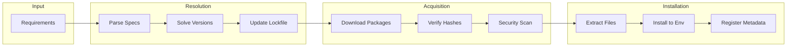
```mermaid
flowchart LR
    subgraph "Input"
        REQ[Requirements]
    end
    
    subgraph "Resolution"
        PARSE[Parse Specs]
        SOLVE[Solve Versions]
        LOCK[Update Lockfile]
    end
    
    subgraph "Acquisition"
        FETCH[Download Packages]
        VERIFY[Verify Hashes]
        SCAN[Security Scan]
    end
    
    subgraph "Installation"
        EXTRACT[Extract Files]
        INSTALL[Install to Env]
        REGISTER[Register Metadata]
    end
    
    REQ --> PARSE --> SOLVE --> LOCK
    LOCK --> FETCH --> VERIFY --> SCAN
    SCAN --> EXTRACT --> INSTALL --> REGISTER
```

---

## Appendix E: Sequence Diagrams

### E.1 Package Installation Sequence

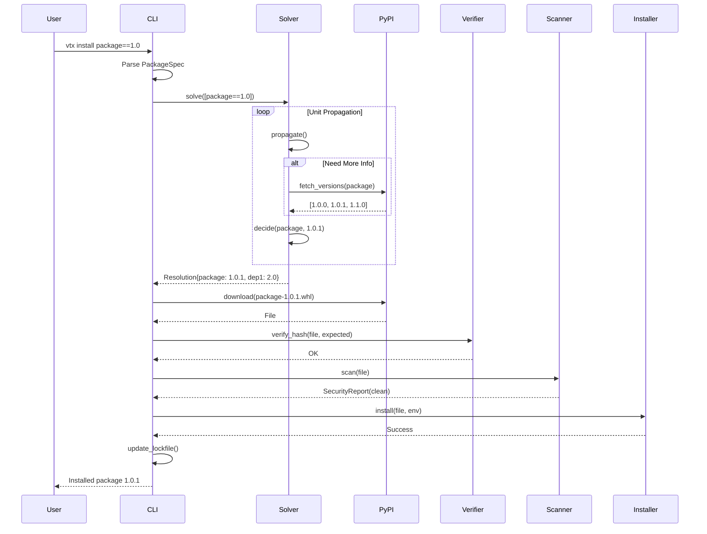
```mermaid
sequenceDiagram
    participant U as User
    participant C as CLI
    participant S as Solver
    participant P as PyPI
    participant V as Verifier
    participant SC as Scanner
    participant I as Installer

    U->>C: vtx install package==1.0
    C->>C: Parse PackageSpec
    C->>S: solve([package==1.0])
    
    loop Unit Propagation
        S->>S: propagate()
        alt Need More Info
            S->>P: fetch_versions(package)
            P-->>S: [1.0.0, 1.0.1, 1.1.0]
        end
        S->>S: decide(package, 1.0.1)
    end
    
    S-->>C: Resolution{package: 1.0.1, dep1: 2.0}
    C->>P: download(package-1.0.1.whl)
    P-->>C: File
    C->>V: verify_hash(file, expected)
    V-->>C: OK
    C->>SC: scan(file)
    SC-->>C: SecurityReport(clean)
    C->>I: install(file, env)
    I-->>C: Success
    C->>C: update_lockfile()
    C-->>U: Installed package 1.0.1
```

### E.2 Conflict Resolution Sequence

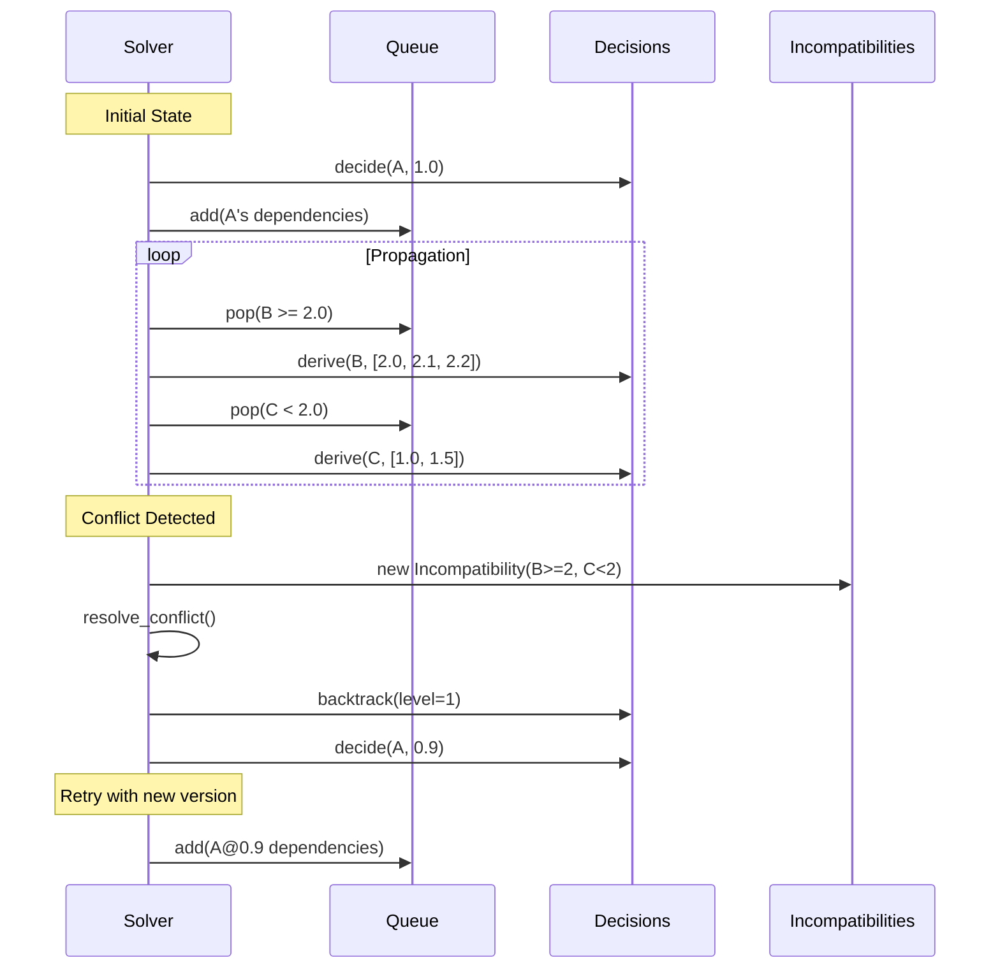
```mermaid
sequenceDiagram
    participant S as Solver
    participant Q as Queue
    participant D as Decisions
    participant I as Incompatibilities

    Note over S: Initial State
    S->>D: decide(A, 1.0)
    S->>Q: add(A's dependencies)
    
    loop Propagation
        S->>Q: pop(B >= 2.0)
        S->>D: derive(B, [2.0, 2.1, 2.2])
        S->>Q: pop(C < 2.0)
        S->>D: derive(C, [1.0, 1.5])
    end
    
    Note over S: Conflict Detected
    S->>I: new Incompatibility(B>=2, C<2)
    S->>S: resolve_conflict()
    S->>D: backtrack(level=1)
    S->>D: decide(A, 0.9)
    
    Note over S: Retry with new version
    S->>Q: add(A@0.9 dependencies)
```

### E.3 Security Scan Sequence

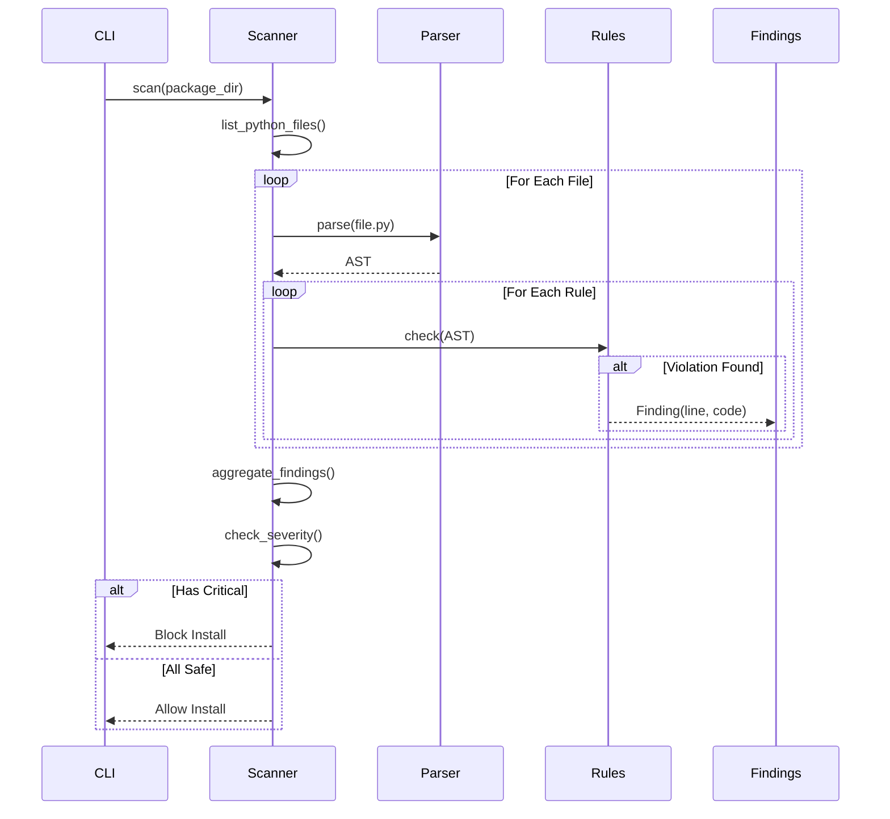
```mermaid
sequenceDiagram
    participant C as CLI
    participant SC as Scanner
    participant P as Parser
    participant R as Rules
    participant F as Findings

    C->>SC: scan(package_dir)
    SC->>SC: list_python_files()
    
    loop For Each File
        SC->>P: parse(file.py)
        P-->>SC: AST
        
        loop For Each Rule
            SC->>R: check(AST)
            alt Violation Found
                R-->>F: Finding(line, code)
            end
        end
    end
    
    SC->>SC: aggregate_findings()
    SC->>SC: check_severity()
    
    alt Has Critical
        SC-->>C: Block Install
    else All Safe
        SC-->>C: Allow Install
    end
```

---

## Appendix F: Activity Diagrams

### F.1 PubGrub Solver Algorithm

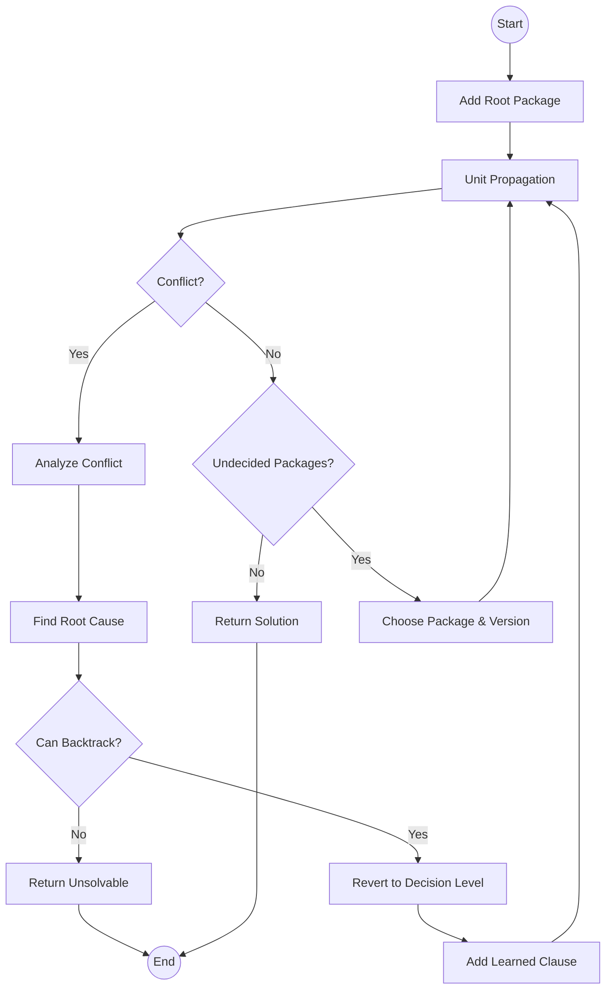
```mermaid
flowchart TD
    START((Start)) --> ROOT[Add Root Package]
    ROOT --> PROP[Unit Propagation]
    PROP --> CONFLICT{Conflict?}
    CONFLICT -->|Yes| ANALYZE[Analyze Conflict]
    ANALYZE --> CAUSE[Find Root Cause]
    CAUSE --> BACKTRACK{Can Backtrack?}
    BACKTRACK -->|No| FAIL[Return Unsolvable]
    BACKTRACK -->|Yes| REVERT[Revert to Decision Level]
    REVERT --> LEARN[Add Learned Clause]
    LEARN --> PROP
    CONFLICT -->|No| UNDECIDED{Undecided Packages?}
    UNDECIDED -->|No| SUCCESS[Return Solution]
    UNDECIDED -->|Yes| DECIDE[Choose Package & Version]
    DECIDE --> PROP
    FAIL --> END((End))
    SUCCESS --> END
```

### F.2 Environment Forking Activity

```mermaid
flowchart TD
    CONFLICT[Solver Conflict] --> ANALYZE[Analyze Incompatibility]
    ANALYZE --> IDENTIFY[Identify Conflicting Package]
    IDENTIFY --> CHECK{Already Forked?}
    CHECK -->|Yes| FAIL[Truly Unsolvable]
    CHECK -->|No| CREATE[Create Fork]
    CREATE --> MKDIR[mkdir .vortex/envs/pkg_name]
    MKDIR --> VENV[Create Python venv]
    VENV --> INSTALL[Install Conflicting Version]
    INSTALL --> REGISTER[Register in vortex.toml]
    REGISTER --> RETRY[Retry Solver Without Conflict]
    RETRY --> SUCCESS[Fork Successful]
```

---

## Appendix G: State Machine Specifications

### G.1 Package Installation State Machine

```mermaid
stateDiagram-v2
    [*] --> PARSING: vtx install
    PARSING --> RESOLVING: Spec Valid
    PARSING --> ERROR: Invalid Spec
    
    RESOLVING --> DOWNLOADING: Solution Found
    RESOLVING --> FORKING: Conflict Detected
    RESOLVING --> ERROR: Unsolvable
    
    FORKING --> RESOLVING: Fork Created
    
    DOWNLOADING --> VERIFYING: Download Complete
    DOWNLOADING --> ERROR: Network Error
    
    VERIFYING --> SCANNING: Hash Match
    VERIFYING --> ERROR: Hash Mismatch
    
    SCANNING --> INSTALLING: Clean
    SCANNING --> QUARANTINE: Malware Detected
    
    INSTALLING --> COMPLETE: Success
    INSTALLING --> ERROR: Install Failed
    
    QUARANTINE --> ERROR: User Notified
    ERROR --> [*]
    COMPLETE --> [*]
```

### G.2 Package State Machine

```mermaid
stateDiagram-v2
    [*] --> AVAILABLE: In PyPI
    
    AVAILABLE --> DOWNLOADED: vtx install
    DOWNLOADED --> VERIFIED: Hash OK
    VERIFIED --> SCANNED: Scan Complete
    
    SCANNED --> INSTALLED: Clean
    SCANNED --> BLOCKED: Malware
    
    INSTALLED --> OUTDATED: New Version
    INSTALLED --> AVAILABLE: vtx uninstall
    
    OUTDATED --> INSTALLED: vtx update
    OUTDATED --> AVAILABLE: vtx uninstall
    
    BLOCKED --> [*]: Quarantined
```

---

## Appendix H: Security Scanning Details

### H.1 Dangerous Patterns

| Pattern Type | Examples | Severity |
| :--- | :--- | :--- |
| **RCE Functions** | `os.system`, `subprocess.call`, `subprocess.Popen` | CRITICAL |
| **Code Execution** | `exec`, `eval`, `compile` | CRITICAL |
| **File Operations** | `open` (write mode), `shutil.rmtree` | HIGH |
| **Network** | `socket.socket`, `urllib.request.urlopen` | HIGH |
| **Process** | `os.fork`, `os.spawn*`, `multiprocessing.Process` | MEDIUM |
| **Environment** | `os.environ`, `os.putenv` | LOW |

### H.2 AST Visitor Rules

```mermaid
flowchart TD
    FILE[Python File] --> PARSE[ast.parse]
    PARSE --> WALK[ast.walk]
    WALK --> NODE{Node Type?}
    
    NODE -->|Call| CHECK_CALL{Func in Blacklist?}
    CHECK_CALL -->|Yes| FINDING_RCE[Finding: RCE]
    CHECK_CALL -->|No| CONTINUE
    
    NODE -->|Import| CHECK_IMPORT{Module in Blacklist?}
    CHECK_IMPORT -->|Yes| FINDING_IMPORT[Finding: Dangerous Import]
    CHECK_IMPORT -->|No| CONTINUE
    
    NODE -->|Attribute| CHECK_ATTR{Attr Access Dangerous?}
    CHECK_ATTR -->|Yes| FINDING_ATTR[Finding: Dangerous Attr]
    CHECK_ATTR -->|No| CONTINUE
    
    CONTINUE --> MORE{More Nodes?}
    MORE -->|Yes| WALK
    MORE -->|No| AGGREGATE[Aggregate Findings]
```

### H.3 Severity Matrix

| Severity | Action | Examples |
| :--- | :--- | :--- |
| **CRITICAL** | Block Install | RCE, Code Injection |
| **HIGH** | Warning + Confirm | Network Access, File Delete |
| **MEDIUM** | Warning Only | Process Spawn, Env Modify |
| **LOW** | Info Only | Uncommon Imports |

---

## Appendix I: Lockfile Specification

### I.1 Lockfile Format

```toml
# vortex.lock - Generated by vtx, DO NOT EDIT

[metadata]
generated_at = "2026-01-06T10:30:00Z"
generator = "vortex-registry 3.0.0"
root_hash = "sha256:abc123..."

[[package]]
name = "torch"
version = "2.1.0+cu118"
source = "https://download.pytorch.org/whl/cu118"
hash = "sha256:def456..."
requires = ["numpy>=1.24", "typing-extensions"]
markers = "python_version >= '3.8'"

[[package]]
name = "numpy"
version = "1.24.3"
source = "pypi"
hash = "sha256:789abc..."
requires = []
```

### I.2 Lockfile Operations

| Operation | Effect | Triggers |
| :--- | :--- | :--- |
| **Lock** | Generate/update lockfile | `vtx install`, `vtx update` |
| **Freeze** | Pin all versions | `vtx freeze` |
| **Sync** | Match installed to lockfile | `vtx sync` |
| **Check** | Verify hashes match | `vtx check` |
| **Outdated** | Show newer versions | `vtx outdated` |

---

## Appendix J: Virtual Environment Management

### J.1 Environment Layout

```
.vortex/
├── vortex.toml              # Configuration
├── vortex.lock              # Lockfile
├── cache/                   # Downloaded packages
│   └── torch-2.1.0+cu118.whl
├── envs/                    # Forked environments
│   ├── default/             # Main environment
│   │   ├── bin/python
│   │   └── lib/python3.10/site-packages/
│   └── pkg_with_conflict/   # Forked for conflicts
│       ├── bin/python
│       └── lib/python3.10/site-packages/
└── registry.db              # Package metadata
```

### J.2 Environment Selection

```mermaid
flowchart TD
    JOB[Job Dispatch] --> LOOKUP[Lookup Node Package]
    LOOKUP --> CONFLICT{Has Forked Env?}
    CONFLICT -->|No| DEFAULT[Use Default Env]
    CONFLICT -->|Yes| FORKED[Use Forked Env]
    DEFAULT --> SET_PATH[Set PYTHONPATH]
    FORKED --> SET_PATH
    SET_PATH --> EXEC[Execute Job]
```

---

## Document History

| Version | Date | Author | Changes |
| :--- | :--- | :--- | :--- |
| 1.0.0 | 2026-01-01 | System | Initial draft |
| 9.0.0 | 2026-01-05 | System | ISO 29148 alignment |
| 11.0.0 | 2026-01-06 | System | Data Dict, Logic Traces |
| 13.0.0 | 2026-01-06 | System | FMEA, ICD |
| 14.0.0 | 2026-01-06 | System | Flow Diagrams |
| 15.0.0 | 2026-01-06 | System | 1200+ line expansion |
| 16.0.0 | 2026-01-06 | System | UML, Components, Sequences, Activities, States, Security, Lockfile, Envs |

