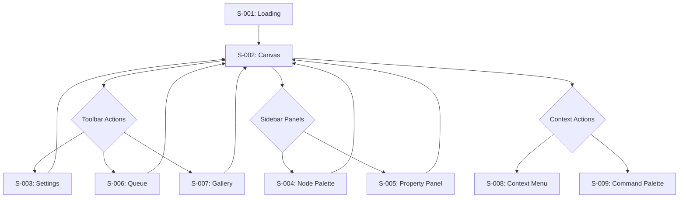
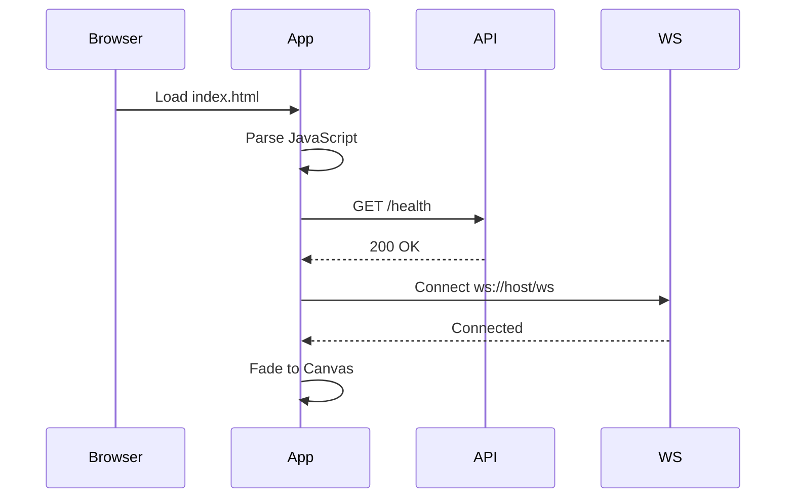
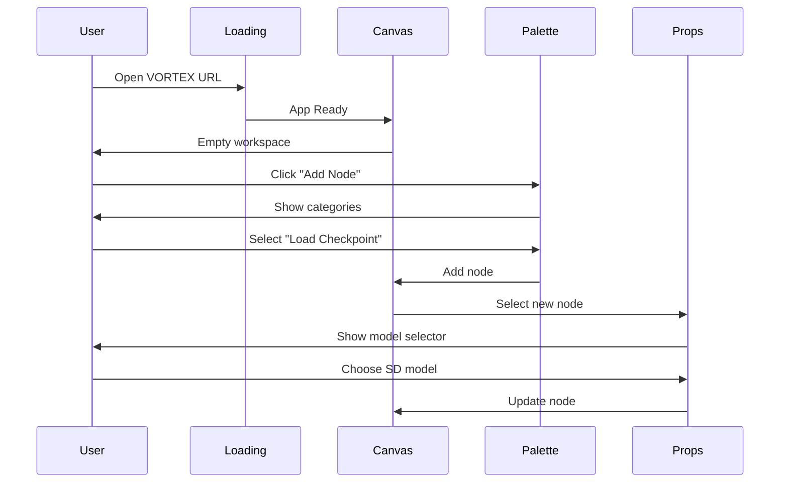
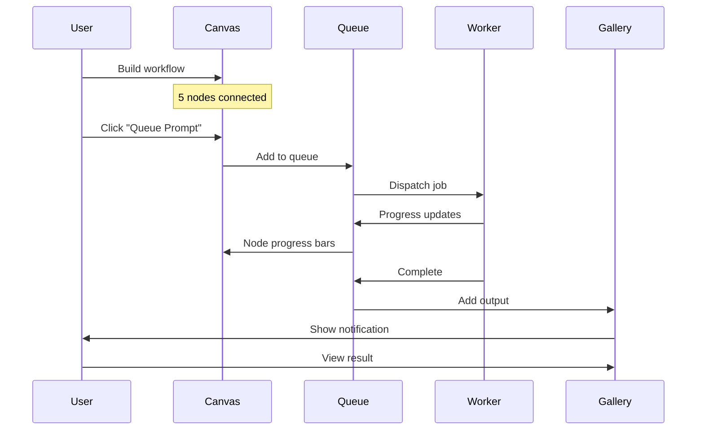
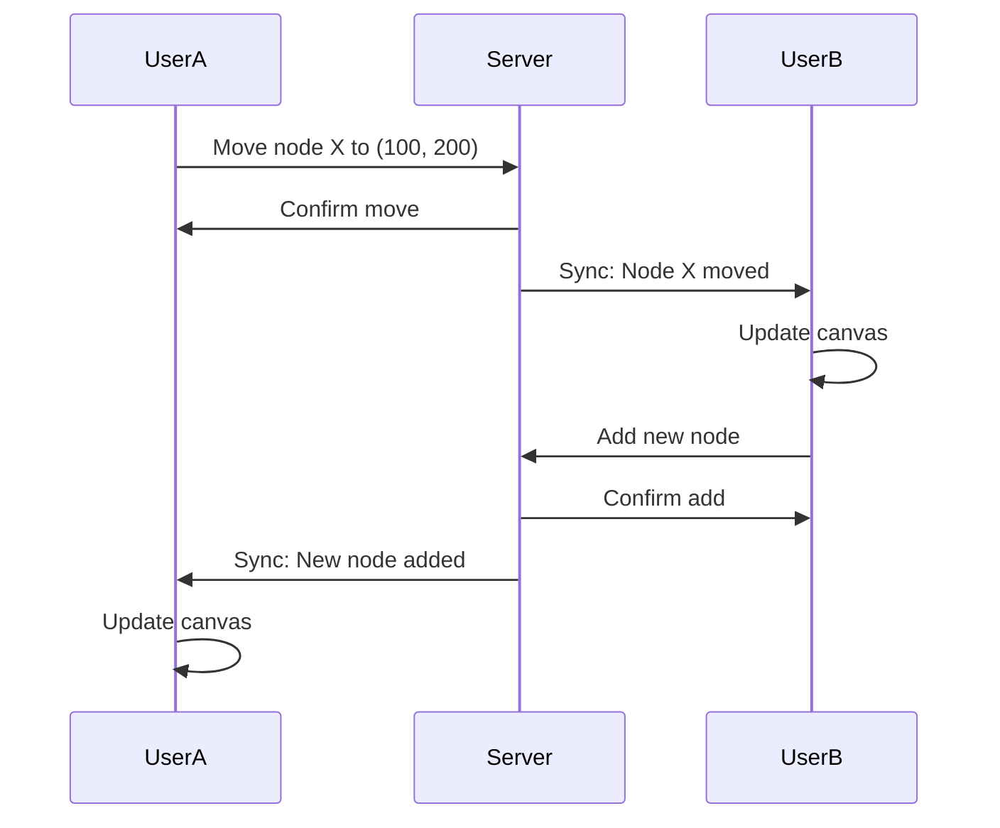

# VORTEX UI Screen Catalog & Flow Specification
## Complete User Interface Documentation

> **Standard**: ISO 9241 (Usability)  
> **Version**: 1.0.0  
> **Status**: PLANNING

---

## 1. SCREEN INVENTORY

### 1.1 Complete Screen List

| ID | Screen Name | Purpose | Entry Point | Exit Points |
|----|-------------|---------|-------------|-------------|
| **S-001** | Loading | Application bootstrap | URL navigation | → Canvas |
| **S-002** | Canvas | Main workspace | Loading complete | → Settings, Gallery |
| **S-003** | Settings | User preferences | Canvas → Toolbar | → Canvas |
| **S-004** | Node Palette | Browse available nodes | Canvas → Sidebar | → Canvas |
| **S-005** | Property Panel | Edit selected node | Node selection | → Canvas |
| **S-006** | Queue Panel | Execution queue | Canvas → Toolbar | → Canvas |
| **S-007** | Gallery | View outputs | Canvas → Toolbar | → Canvas |
| **S-008** | Context Menu | Quick actions | Right-click | → Canvas |
| **S-009** | Command Palette | Keyboard navigation | Ctrl+K | → Canvas |
| **S-010** | Connection Modal | Port connection wizard | Port drag | → Canvas |

---

## 2. SCREEN HIERARCHY



---

## 3. DETAILED SCREEN SPECIFICATIONS

### S-001: Loading Screen

| Attribute | Value |
|-----------|-------|
| **Purpose** | Display while application bootstraps |
| **Duration** | < 1000ms (requirement P-02) |
| **Components** | Logo, Progress Bar, Status Text |
| **Transitions** | Fade out → Canvas |

**Loading Sequence:**


**States:**
| State | Progress | Message |
|-------|----------|---------|
| INIT | 0% | "Initializing..." |
| CONNECTING | 30% | "Connecting to server..." |
| SYNCING | 60% | "Loading workspace..." |
| READY | 100% | "Ready" |

---

### S-002: Canvas Screen (Main Workspace)

| Attribute | Value |
|-----------|-------|
| **Purpose** | Primary workspace for node graph editing |
| **Layout** | Full viewport with overlays |
| **Interaction** | Mouse, Touch, Keyboard |
| **Persistence** | Auto-save every 30s |

**Layout Zones:**
```
┌──────────────────────────────────────────────────────────────┐
│  TOOLBAR (fixed top, 48px height)                            │
├───────────────┬──────────────────────────────────────────────┤
│               │                                              │
│   SIDEBAR     │              CANVAS AREA                     │
│   (256px)     │         (infinite virtual space)             │
│               │                                              │
│  ┌─────────┐  │    ┌─────────┐         ┌─────────┐          │
│  │ Palette │  │    │  Node   │────────▶│  Node   │          │
│  └─────────┘  │    └─────────┘         └─────────┘          │
│               │                                              │
│  ┌─────────┐  │                                              │
│  │ Props   │  │         MINIMAP (bottom-right)               │
│  └─────────┘  │             ┌────────┐                       │
│               │             │ ▫▫▫    │                       │
└───────────────┴─────────────└────────┴───────────────────────┘
```

**Canvas States:**
| State | Description | Visual |
|-------|-------------|--------|
| IDLE | No active interaction | Normal cursor |
| PANNING | Middle mouse drag | Hand cursor, canvas moves |
| SELECTING | Marquee selection | Rectangle overlay |
| CONNECTING | Dragging edge | Wire preview |
| MOVING_NODE | Dragging node | Node follows cursor |
| ZOOMING | Scroll wheel | Scale animation |

**Zoom Levels & LOD:**
| Zoom Range | LOD Level | Rendering Mode |
|------------|-----------|----------------|
| > 0.6 | FULL | DOM with all widgets |
| 0.3 - 0.6 | LITE | DOM with simplified UI |
| < 0.3 | WEBGL | GPU-rendered rectangles |

---

### S-003: Settings Screen

| Attribute | Value |
|-----------|-------|
| **Purpose** | Configure user preferences and system settings |
| **Type** | Modal overlay |
| **Width** | 600px |
| **Sections** | General, Appearance, Performance, Shortcuts, Advanced |

**Settings Categories:**

| Category | Settings |
|----------|----------|
| **General** | Language, Auto-save interval, Confirmation dialogs |
| **Appearance** | Theme (dark/light), Accent color, Font size, Grid visibility |
| **Performance** | WebGL enabled, Max workers, VRAM limit, Cache size |
| **Shortcuts** | Customizable keyboard bindings |
| **Advanced** | API endpoint, Debug mode, Telemetry opt-out |

---

### S-004: Node Palette

| Attribute | Value |
|-----------|-------|
| **Purpose** | Browse and add nodes to canvas |
| **Type** | Sidebar panel |
| **Search** | Fuzzy matching |
| **Organization** | Categories → Subcategories → Nodes |

**Node Categories:**
```
📁 Loaders
   ├── Load Checkpoint
   ├── Load LoRA
   └── Load VAE

📁 Conditioning
   ├── CLIP Text Encode
   ├── CLIP Set Last Layer
   └── Conditioning Combine

📁 Sampling
   ├── KSampler
   ├── KSampler Advanced
   └── Sampler Custom

📁 Latent
   ├── Empty Latent Image
   ├── Latent Upscale
   └── Latent from Batch

📁 Image
   ├── Save Image
   ├── Preview Image
   ├── Load Image
   └── Image Scale

📁 VAE
   ├── VAE Decode
   ├── VAE Encode
   └── VAE Decode Tiled

📁 Utils
   ├── Reroute
   ├── Note
   └── Primitive
```

---

### S-005: Property Panel

| Attribute | Value |
|-----------|-------|
| **Purpose** | Edit parameters of selected node |
| **Type** | Sidebar panel |
| **Context** | Changes based on selected node |
| **Validation** | Real-time with error feedback |

**Widget Types:**
| Widget | Use Case | Validation |
|--------|----------|------------|
| **Slider** | Numeric range | Min/Max bounds |
| **Number Input** | Precise numeric | Step, bounds |
| **Text Input** | Strings, prompts | Length limit |
| **Dropdown** | Enum selection | Valid options |
| **Checkbox** | Boolean toggle | None |
| **Color Picker** | Color values | Valid hex/rgb |
| **File Upload** | Image/model files | Type, size |
| **Seed** | Random seed | 64-bit integer |

---

### S-006: Queue Panel

| Attribute | Value |
|-----------|-------|
| **Purpose** | View and manage execution queue |
| **Type** | Slide-out panel |
| **Updates** | Real-time via WebSocket |

**Queue Item States:**
| State | Icon | Description |
|-------|------|-------------|
| PENDING | ⏳ | Waiting in queue |
| RUNNING | 🔄 | Currently executing |
| COMPLETED | ✅ | Finished successfully |
| FAILED | ❌ | Error occurred |
| CANCELLED | 🚫 | User cancelled |

**Queue Actions:**
| Action | Scope | Effect |
|--------|-------|--------|
| Cancel | Single | Abort current/pending job |
| Clear Queue | All pending | Remove all pending |
| Retry | Failed | Re-queue failed job |
| View Output | Completed | Open in Gallery |

---

### S-007: Gallery

| Attribute | Value |
|-----------|-------|
| **Purpose** | View generated outputs |
| **Type** | Full-screen overlay |
| **Layout** | Grid with preview |
| **Actions** | Download, Delete, Compare, Send to Canvas |

**Gallery Views:**
| View | Layout | Best For |
|------|--------|----------|
| Grid | Thumbnails | Quick browsing |
| Single | Full image | Detailed inspection |
| Compare | Side-by-side | A/B comparison |
| Filmstrip | Horizontal scroll | Batch review |

---

### S-008: Context Menu

| Attribute | Value |
|-----------|-------|
| **Purpose** | Quick actions at cursor position |
| **Trigger** | Right-click |
| **Timeout** | Auto-close after 5s |

**Context Actions by Target:**

| Target | Actions |
|--------|---------|
| **Canvas** | Add Node, Paste, Select All, Fit View |
| **Node** | Delete, Duplicate, Group, Bypass, Pin |
| **Edge** | Delete, Convert to Reroute |
| **Selection** | Delete, Duplicate, Group, Align |
| **Port** | Disconnect, Convert |

---

### S-009: Command Palette

| Attribute | Value |
|-----------|-------|
| **Purpose** | Keyboard-driven command access |
| **Trigger** | Ctrl+K / Cmd+K |
| **Search** | Fuzzy command matching |

**Command Categories:**
| Category | Examples |
|----------|----------|
| **Node** | Add KSampler, Add CLIP Encode |
| **Edit** | Undo, Redo, Cut, Copy, Paste |
| **View** | Zoom In, Zoom Out, Fit View, Reset |
| **File** | Save, Export, Import |
| **Execute** | Queue, Cancel, Clear Queue |

---

## 4. USER FLOW SEQUENCES

### 4.1 First-Time User Flow



### 4.2 Basic Image Generation Flow



### 4.3 Collaborative Editing Flow



---

## 5. TRANSITION MATRIX

| From | To | Trigger | Animation |
|------|-----|---------|-----------|
| Loading | Canvas | Data ready | Fade (300ms) |
| Canvas | Settings | Toolbar click | Slide down |
| Canvas | Gallery | Toolbar click | Slide left |
| Canvas | Context Menu | Right-click | Pop in |
| Settings | Canvas | Close/ESC | Slide up |
| Gallery | Canvas | Close/ESC | Slide right |

---

## 6. KEYBOARD SHORTCUTS

| Shortcut | Action | Scope |
|----------|--------|-------|
| **Space** | Pan mode | Canvas |
| **Delete** | Delete selected | Canvas |
| **Ctrl+Z** | Undo | Global |
| **Ctrl+Y** | Redo | Global |
| **Ctrl+C** | Copy | Selection |
| **Ctrl+V** | Paste | Canvas |
| **Ctrl+K** | Command palette | Global |
| **Ctrl+S** | Save | Global |
| **Ctrl+Enter** | Queue prompt | Global |
| **F** | Fit view | Canvas |
| **1-9** | Zoom level | Canvas |
| **G** | Toggle grid | Canvas |
| **M** | Toggle minimap | Canvas |
| **H** | Hide UI | Canvas |

---

## 7. RESPONSIVE BREAKPOINTS

| Breakpoint | Width | Layout Changes |
|------------|-------|----------------|
| **Desktop XL** | ≥ 1920px | Full layout, wide sidebar |
| **Desktop** | 1280-1919px | Full layout |
| **Laptop** | 1024-1279px | Collapsed sidebar |
| **Tablet** | 768-1023px | Overlay sidebar, touch optimized |
| **Mobile** | < 768px | Single panel, vertical stack |

---

**Document Status**: COMPLETE  
**Total Screens**: 10  
**Total Flows**: 3  
**Ready for Implementation**: ✅
