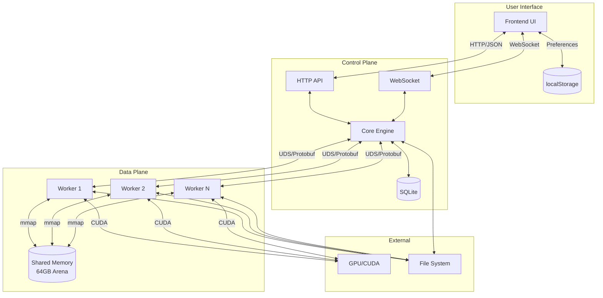
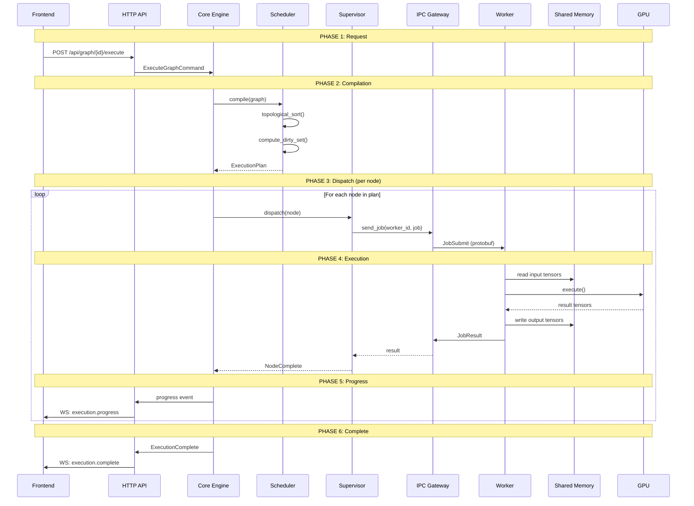
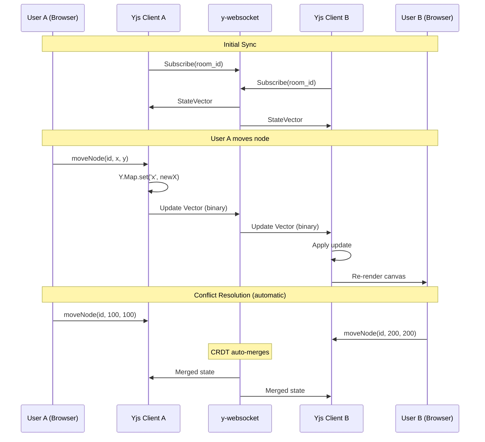
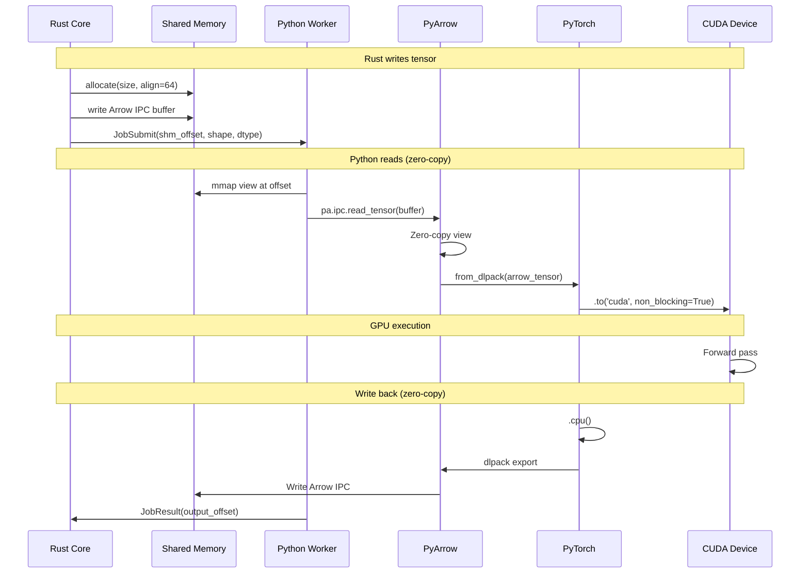
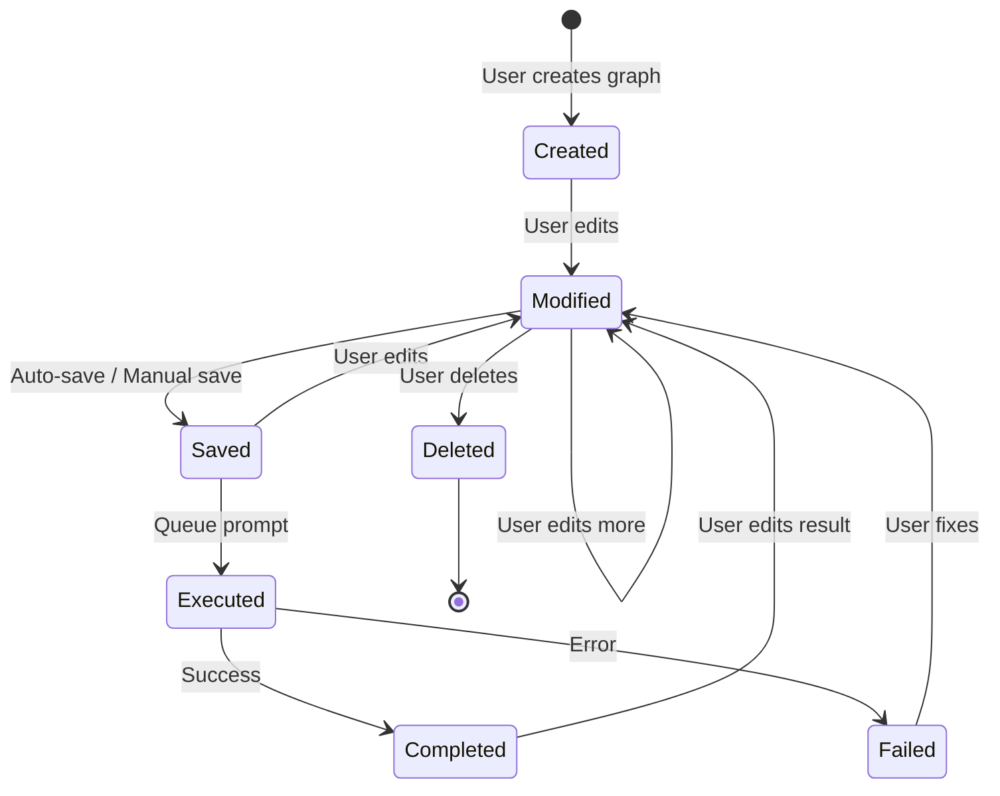
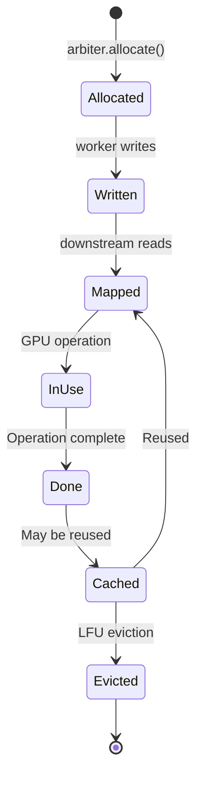

# VORTEX Data Flow Specification
## Complete Data & Message Flow Documentation

> **Standard**: ISO/IEC 25024 (Data Quality)  
> **Version**: 1.0.0  
> **Status**: PLANNING

---

## 1. DATA FLOW OVERVIEW

### 1.1 System Data Flow Diagram



---

## 2. MESSAGE FLOW BY OPERATION

### 2.1 Graph Execution Flow



### 2.2 Real-time Collaboration Flow



### 2.3 Zero-Copy Tensor Flow



---

## 3. DATA SCHEMAS

### 3.1 API Request/Response

**POST /api/graph/execute**

| Direction | Format | Content |
|-----------|--------|---------|
| Request | JSON | `{ graph_id: string, options?: ExecutionOptions }` |
| Response | JSON | `{ execution_id: string, status: "queued" }` |

**WebSocket Messages**

| Direction | Type | Payload |
|-----------|------|---------|
| Server→Client | `execution.progress` | `{ node_id, progress: 0-100 }` |
| Server→Client | `execution.complete` | `{ execution_id, outputs }` |
| Server→Client | `execution.error` | `{ node_id, error }` |
| Client→Server | `graph.update` | `{ mutations: Mutation[] }` |
| Server→Client | `graph.sync` | `{ graph: GraphDSL }` |

### 3.2 IPC Protocol (Protobuf)

**Control Packet Structure:**
```
┌─────────────────────────────────────────────────────┐
│ Length (4 bytes, little-endian)                     │
├─────────────────────────────────────────────────────┤
│ ControlPacket (protobuf)                            │
│  ├── request_id: string (UUID)                      │
│  ├── timestamp: int64 (unix millis)                 │
│  ├── trace_context:                                 │
│  │    ├── trace_id: bytes[16]                       │
│  │    ├── span_id: bytes[8]                         │
│  │    └── parent_span_id: bytes[8]                  │
│  └── payload: oneof {                               │
│       JobSubmit, JobResult, Handshake, Heartbeat    │
│      }                                              │
└─────────────────────────────────────────────────────┘
```

### 3.3 Shared Memory Layout

```
┌────────────────────────────────────────────────────────────────┐
│ Offset 0x0000: ShmHeader (4KB)                                 │
│  ├── magic: u64 = 0x5654_5833_0000_0001                        │
│  ├── version: u32                                              │
│  ├── flags: AtomicU32                                          │
│  ├── clock_tick: AtomicU64                                     │
│  ├── reserved: [u8; 40]                                        │
│  └── slots: [WorkerSlot; 256]                                  │
├────────────────────────────────────────────────────────────────┤
│ Offset 0x1000: Tensor Arena (64GB - 4KB)                       │
│  ├── Block 0: [Tensor A - 512MB]                               │
│  ├── Block 1: [Tensor B - 2GB]                                 │
│  ├── Block 2: [FREE - 1GB]                                     │
│  ├── Block 3: [Tensor C - 256MB]                               │
│  └── ...                                                       │
└────────────────────────────────────────────────────────────────┘
```

---

## 4. DATA LIFECYCLE

### 4.1 Graph Data Lifecycle



### 4.2 Tensor Data Lifecycle



### 4.3 Execution Data Lifecycle

| Stage | Data Created | Storage | Retention |
|-------|--------------|---------|-----------|
| Request | ExecutionRequest | Memory | Until complete |
| Queued | QueueEntry | Database | 24h |
| Running | Progress updates | WebSocket | Real-time |
| Complete | Output metadata | Database | 90 days |
| Output | Generated images | Filesystem | User-defined |

---

## 5. DATA VALIDATION

### 5.1 Input Validation Points

| Component | Validation | Action on Failure |
|-----------|------------|-------------------|
| **API** | JSON schema | 400 Bad Request |
| **Graph** | Cycle detection | VE-002 error |
| **Graph** | Port type matching | VE-006 error |
| **Worker** | Input handle valid | WK-002 error |
| **Worker** | Parameter bounds | VE-010 error |

### 5.2 Data Integrity Checks

| Check | Trigger | Verification |
|-------|---------|--------------|
| Graph hash | Before execution | SHA256 match |
| Tensor checksum | After transfer | CRC32 |
| Lockfile hash | On install | SHA256 |
| Model hash | On load | SHA256 |

---

## 6. EVENT SOURCING DATA

### 6.1 Event Store Schema

| Field | Type | Description |
|-------|------|-------------|
| `event_id` | UUID | Unique event identifier |
| `sequence_number` | BIGINT | Global ordering |
| `trace_id` | UUID | Distributed trace correlation |
| `span_id` | UUID | Current span |
| `event_type` | STRING | e.g., "NodeCreated" |
| `aggregate_type` | STRING | e.g., "Graph" |
| `aggregate_id` | UUID | Target entity |
| `payload` | JSON | Event data |
| `metadata` | JSON | Context (user, IP, etc.) |
| `created_at` | TIMESTAMP | When event occurred |

### 6.2 Event Types

| Category | Events |
|----------|--------|
| **Graph** | GraphCreated, GraphDeleted, GraphCloned |
| **Node** | NodeCreated, NodeDeleted, NodeMoved, NodeParamUpdated |
| **Edge** | EdgeCreated, EdgeDeleted |
| **Execution** | ExecutionQueued, ExecutionStarted, ExecutionCompleted, ExecutionFailed |
| **Worker** | WorkerSpawned, WorkerCrashed, WorkerRecovered |
| **Memory** | TensorAllocated, TensorEvicted |

---

## 7. DATA FLOW METRICS

### 7.1 Key Flow Metrics

| Metric | Target | Measurement |
|--------|--------|-------------|
| API latency (p99) | < 50ms | Histogram |
| IPC round-trip | < 50μs | Histogram |
| Tensor mapping | < 1ms | Histogram |
| WS message delivery | < 10ms | Histogram |
| Event store write | < 5ms | Histogram |

### 7.2 Throughput Metrics

| Metric | Target | Measurement |
|--------|--------|-------------|
| Graph compiles/s | > 100 | Counter |
| Jobs dispatched/s | > 50 | Counter |
| WS messages/s | > 1000 | Counter |
| Events stored/s | > 500 | Counter |

---

**Document Status**: COMPLETE  
**Total Flow Diagrams**: 8  
**Total Data Schemas**: 5  
**Ready for Implementation**: ✅
